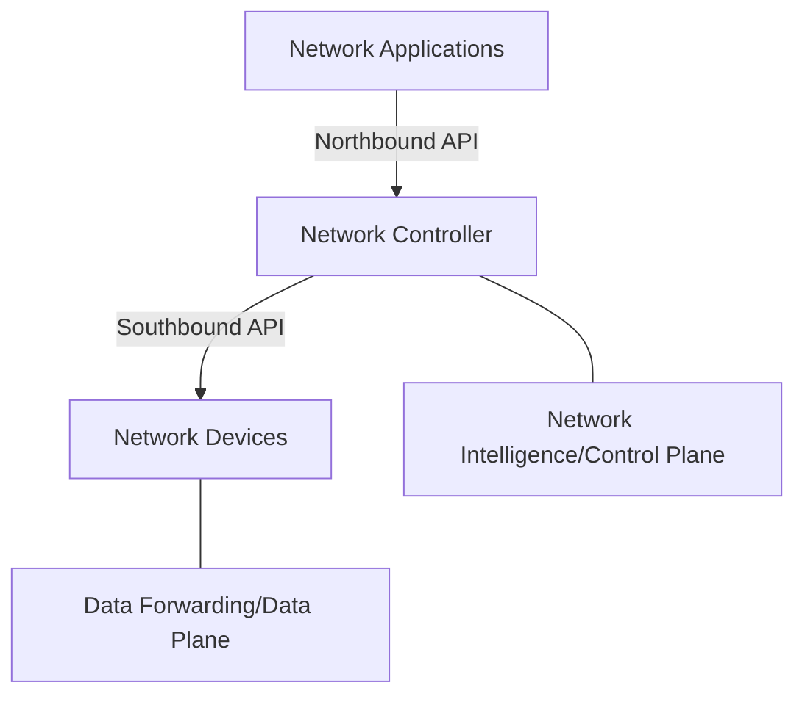
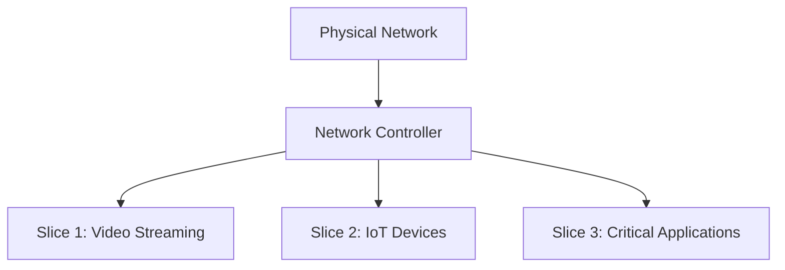

# Network Controllers

## Introduction

Network controllers are the beating heart of Software Defined Networking (SDN). They represent the central intelligence that manages and controls the entire network infrastructure. In traditional networking, each device (like routers and switches) makes independent decisions based on its own configuration. SDN completely transforms this approach by centralizing decision-making in a controller, separating the network intelligence (control plane) from the data-forwarding function (data plane).

In this guide, we'll explore what network controllers are, how they function within SDN architectures, and why they're revolutionizing modern network design and management.

## What is a Network Controller?

A network controller is a software application that acts as the strategic control point in an SDN environment. It maintains a comprehensive view of the entire network and serves as the interface between network applications and physical network devices.



The network controller:
- Maintains a global view of network topology and state
- Translates high-level policies into specific device configurations
- Makes centralized decisions about traffic routing and forwarding
- Provides northbound APIs for applications
- Uses southbound APIs to communicate with networking hardware

## Controller Architecture

Most SDN controllers share a common three-layer architecture:

### 1. Application Layer
This layer houses network applications that communicate with the controller to request services or manipulate network behavior.

### 2. Control Layer
This is where the controller itself resides, implementing the network intelligence and policy enforcement.

### 3. Infrastructure Layer
This consists of the physical or virtual network devices that handle the actual data forwarding.

## Key Components of a Network Controller

### Northbound APIs

Northbound APIs face toward network applications and services. They expose the controller's capabilities to applications that need to:
- Retrieve network information
- Request changes to network behavior
- Implement business logic across the network

These APIs often use REST (Representational State Transfer) interfaces that are easy to integrate with applications. For example:

```javascript
// Example of using a controller's REST API to retrieve switch information
const fetchNetworkDevices = async () => {
  try {
    const response = await fetch('https://controller-ip:port/api/v1/devices', {
      method: 'GET',
      headers: {
        'Content-Type': 'application/json',
        'Authorization': 'Bearer token123'
      }
    });
    
    const devices = await response.json();
    console.log('Network devices:', devices);
    return devices;
  } catch (error) {
    console.error('Error fetching network devices:', error);
  }
};

// Output might look like:
// Network devices: [
//   { id: "sw1", type: "switch", status: "active", ports: 24 },
//   { id: "sw2", type: "switch", status: "active", ports: 48 },
//   { id: "rt1", type: "router", status: "active", interfaces: 12 }
// ]
```

### Southbound APIs

Southbound APIs communicate downward to network devices, instructing them on how to handle network traffic. Common southbound protocols include:

#### OpenFlow
The most widely used southbound protocol, OpenFlow allows the controller to access and modify the forwarding tables in network switches and routers.

```python
# Pseudocode example of creating a flow rule using OpenFlow
def create_flow_rule(controller, switch_id, priority, match_fields, actions):
    """
    Create a flow rule on a specific switch using OpenFlow
    
    Args:
        controller: Connection to the SDN controller
        switch_id: ID of the target switch
        priority: Priority of the flow rule
        match_fields: Dictionary of fields to match
        actions: List of actions to take on matching packets
    """
    flow_rule = {
        "switch": switch_id,
        "priority": priority,
        "match": match_fields,
        "actions": actions
    }
    
    controller.send_flow_mod(flow_rule)
    
# Example usage
create_flow_rule(
    controller,
    "00:00:00:00:00:01",
    100,
    {"in_port": 1, "eth_type": 0x0800, "ipv4_src": "10.0.0.1"},
    [{"type": "output", "port": 2}]
)

# This creates a rule that: When packets from IP 10.0.0.1 arrive on port 1, forward them to port 2
```

#### NETCONF and YANG
These protocols work together to install, manipulate, and delete configurations on network devices.

```xml
<!-- Example NETCONF message to configure an interface -->
<rpc message-id="101" xmlns="urn:ietf:params:xml:ns:netconf:base:1.0">
  <edit-config>
    <target>
      <running/>
    </target>
    <config>
      <interfaces xmlns="urn:ietf:params:xml:ns:yang:ietf-interfaces">
        <interface>
          <name>GigabitEthernet0/0/0</name>
          <description>Connection to Distribution Switch</description>
          <type>ethernetCsmacd</type>
          <enabled>true</enabled>
          <ipv4 xmlns="urn:ietf:params:xml:ns:yang:ietf-ip">
            <address>
              <ip>192.168.1.1</ip>
              <prefix-length>24</prefix-length>
            </address>
          </ipv4>
        </interface>
      </interfaces>
    </config>
  </edit-config>
</rpc>
```

### Network State Database

Controllers maintain a real-time database of the network topology, device status, and traffic statistics. This allows them to make informed decisions and respond to network events.

## Popular Network Controller Platforms

### 1. OpenDaylight (ODL)

OpenDaylight is an open-source controller platform supported by the Linux Foundation. It's highly modular and extensible.

```java
// Example of a simple OpenDaylight application module
package org.opendaylight.example;

import org.opendaylight.controller.sal.core.Node;
import org.opendaylight.controller.sal.packet.PacketService;
import org.opendaylight.controller.sal.flowprogrammer.Flow;
import org.opendaylight.controller.sal.flowprogrammer.IFlowProgrammerService;

public class SimpleForwardingApp {
    private IFlowProgrammerService flowProgrammer;
    private PacketService packetService;
    
    // Methods to handle packets and program flows
    public void handlePacketIn(Node node, byte[] payload) {
        // Logic to determine how to forward the packet
        // Then program a flow rule
        Flow flow = createFlowRule(/* parameters based on packet */);
        flowProgrammer.addFlow(node, flow);
    }
    
    private Flow createFlowRule(/* parameters */) {
        // Create and return a Flow object
    }
}
```

### 2. ONOS (Open Network Operating System)

ONOS is designed for service provider networks with a focus on high availability and scalability.

### 3. Ryu

Ryu is a component-based SDN framework written in Python, popular for its simplicity and educational use.

```python
# Example Ryu controller application
from ryu.base import app_manager
from ryu.controller import ofp_event
from ryu.controller.handler import CONFIG_DISPATCHER, MAIN_DISPATCHER
from ryu.controller.handler import set_ev_cls
from ryu.ofproto import ofproto_v1_3

class SimpleSwitch13(app_manager.RyuApp):
    OFP_VERSIONS = [ofproto_v1_3.OFP_VERSION]

    def __init__(self, *args, **kwargs):
        super(SimpleSwitch13, self).__init__(*args, **kwargs)
        self.mac_to_port = {}

    @set_ev_cls(ofp_event.EventOFPSwitchFeatures, CONFIG_DISPATCHER)
    def switch_features_handler(self, ev):
        datapath = ev.msg.datapath
        ofproto = datapath.ofproto
        parser = datapath.ofproto_parser

        # Install table-miss flow entry
        match = parser.OFPMatch()
        actions = [parser.OFPActionOutput(ofproto.OFPP_CONTROLLER,
                                           ofproto.OFPCML_NO_BUFFER)]
        self.add_flow(datapath, 0, match, actions)

    def add_flow(self, datapath, priority, match, actions, buffer_id=None):
        ofproto = datapath.ofproto
        parser = datapath.ofproto_parser

        inst = [parser.OFPInstructionActions(ofproto.OFPIT_APPLY_ACTIONS,
                                             actions)]
        if buffer_id:
            mod = parser.OFPFlowMod(datapath=datapath, buffer_id=buffer_id,
                                    priority=priority, match=match,
                                    instructions=inst)
        else:
            mod = parser.OFPFlowMod(datapath=datapath, priority=priority,
                                    match=match, instructions=inst)
        datapath.send_msg(mod)
```

## Real-World Applications

### Network Slicing

Network controllers enable the creation of "slices" - virtual networks that operate on the same physical infrastructure but are isolated from each other.



### Traffic Engineering

Controllers can dynamically adjust traffic paths to optimize network performance:

```python
# Pseudocode for traffic engineering application
def calculate_optimal_path(source, destination, traffic_type):
    """Calculate the optimal path based on current network conditions"""
    network_state = controller.get_network_state()
    
    if traffic_type == "video":
        # Prioritize paths with low jitter and packet loss
        return find_path_with_lowest_jitter(network_state, source, destination)
    elif traffic_type == "voip":
        # Prioritize paths with low latency
        return find_path_with_lowest_latency(network_state, source, destination)
    else:
        # Default to shortest path
        return find_shortest_path(network_state, source, destination)
        
# The controller then installs appropriate flow rules on the network devices
```

### Security Policy Enforcement

Network controllers can implement security policies uniformly across the entire network:

```python
# Pseudocode for security policy implementation
def apply_security_policy(security_policy):
    """Apply a security policy to all relevant devices in the network"""
    devices = controller.get_all_devices()
    
    for device in devices:
        if device.type == "firewall":
            # Configure firewall rules
            configure_firewall(device, security_policy.firewall_rules)
        elif device.type == "switch":
            # Configure access control lists
            configure_acls(device, security_policy.access_lists)
            
# Example policy might include:
# - Block all traffic to suspicious IP addresses
# - Redirect IoT traffic through dedicated security appliances
# - Implement rate limiting for specific services
```

## Implementing Your First Controller

Let's walk through a simple implementation using a Python-based controller:

### 1. Install Mininet and Ryu

Mininet is a network emulator that allows you to create a realistic virtual network on a single machine, while Ryu is a straightforward Python-based controller.

```bash
# Install Mininet (for network emulation)
sudo apt-get install mininet

# Install Ryu controller
pip install ryu
```

### 2. Create a Simple Learning Switch Controller

```python
# learning_switch.py
from ryu.base import app_manager
from ryu.controller import ofp_event
from ryu.controller.handler import MAIN_DISPATCHER, CONFIG_DISPATCHER
from ryu.controller.handler import set_ev_cls
from ryu.ofproto import ofproto_v1_3
from ryu.lib.packet import packet
from ryu.lib.packet import ethernet

class LearningSwitch(app_manager.RyuApp):
    OFP_VERSIONS = [ofproto_v1_3.OFP_VERSION]

    def __init__(self, *args, **kwargs):
        super(LearningSwitch, self).__init__(*args, **kwargs)
        # Table mapping MAC addresses to ports
        self.mac_to_port = {}
        self.logger.info("Learning Switch Controller Initialized")

    @set_ev_cls(ofp_event.EventOFPSwitchFeatures, CONFIG_DISPATCHER)
    def switch_features_handler(self, ev):
        datapath = ev.msg.datapath
        ofproto = datapath.ofproto
        parser = datapath.ofproto_parser

        # Install the table-miss flow entry (forward to controller)
        match = parser.OFPMatch()
        actions = [parser.OFPActionOutput(ofproto.OFPP_CONTROLLER,
                                          ofproto.OFPCML_NO_BUFFER)]
        self.add_flow(datapath, 0, match, actions)

    def add_flow(self, datapath, priority, match, actions, buffer_id=None):
        ofproto = datapath.ofproto
        parser = datapath.ofproto_parser

        inst = [parser.OFPInstructionActions(ofproto.OFPIT_APPLY_ACTIONS,
                                             actions)]
        if buffer_id:
            mod = parser.OFPFlowMod(datapath=datapath, buffer_id=buffer_id,
                                    priority=priority, match=match,
                                    instructions=inst)
        else:
            mod = parser.OFPFlowMod(datapath=datapath, priority=priority,
                                    match=match, instructions=inst)
        datapath.send_msg(mod)

    @set_ev_cls(ofp_event.EventOFPPacketIn, MAIN_DISPATCHER)
    def _packet_in_handler(self, ev):
        # Extract information from the packet
        msg = ev.msg
        datapath = msg.datapath
        ofproto = datapath.ofproto
        parser = datapath.ofproto_parser
        in_port = msg.match['in_port']

        pkt = packet.Packet(msg.data)
        eth = pkt.get_protocols(ethernet.ethernet)[0]

        # Get source and destination MAC addresses
        dst = eth.dst
        src = eth.src

        # Get the datapath ID to identify OpenFlow switches
        dpid = datapath.id
        self.mac_to_port.setdefault(dpid, {})

        # Learn the source MAC address to avoid flooding next time
        self.mac_to_port[dpid][src] = in_port

        # If the destination MAC is already learned, use the stored port
        # Otherwise, flood the packet
        if dst in self.mac_to_port[dpid]:
            out_port = self.mac_to_port[dpid][dst]
        else:
            out_port = ofproto.OFPP_FLOOD

        actions = [parser.OFPActionOutput(out_port)]

        # Install a flow to avoid packet_in next time
        if out_port != ofproto.OFPP_FLOOD:
            match = parser.OFPMatch(in_port=in_port, eth_dst=dst, eth_src=src)
            # Verify if we have a buffer_id, if yes avoid sending both
            if msg.buffer_id != ofproto.OFP_NO_BUFFER:
                self.add_flow(datapath, 1, match, actions, msg.buffer_id)
                return
            else:
                self.add_flow(datapath, 1, match, actions)

        # Send packet out message
        data = None
        if msg.buffer_id == ofproto.OFP_NO_BUFFER:
            data = msg.data

        out = parser.OFPPacketOut(datapath=datapath, buffer_id=msg.buffer_id,
                                  in_port=in_port, actions=actions, data=data)
        datapath.send_msg(out)
```

### 3. Run the Controller with a Simple Network

```bash
# Start the Ryu controller with our learning switch application
ryu-manager learning_switch.py

# In another terminal, create a simple network with Mininet
sudo mn --topo single,3 --mac --switch ovsk --controller remote
```

The above commands create:
1. A Ryu controller running our learning switch application
2. A Mininet network with one switch and three hosts, using OpenVSwitch with OpenFlow support

### 4. Test the Network

In the Mininet console, you can test connectivity:

```bash
mininet> pingall
```

You should see successful pings between all hosts. Behind the scenes:
1. The first ping causes a packet_in event to the controller
2. The controller learns MAC addresses and installs flow rules
3. Subsequent packets follow the installed flows without controller intervention

## Benefits of Network Controllers

1. **Centralized Management**: Administrators can manage the entire network from a single point.
2. **Programmability**: Networks can be programmed to adapt to application needs.
3. **Reduced Complexity**: Device configurations are managed centrally.
4. **Vendor Independence**: OpenFlow and other standards allow mixing of hardware from different vendors.
5. **Automation**: Many networking tasks can be automated, reducing manual configuration.
6. **Agility**: Network changes can be made rapidly to respond to business needs.

## Challenges and Considerations

1. **Single Point of Failure**: Controller redundancy is critical for production networks.
2. **Scalability**: Controllers must efficiently handle large networks.
3. **Security**: The controller is a high-value target for attackers.
4. **Performance**: Controller-to-switch latency can impact network performance.

## Summary

Network controllers are the foundational component of Software Defined Networking, providing the intelligence and centralized control that enables programmable networks. They separate the control plane from the data plane, allowing network administrators to manage networks through high-level policies rather than device-by-device configuration.

Key takeaways:
- Network controllers centralize network intelligence and decision-making
- They use northbound APIs to communicate with applications and southbound APIs to control network devices
- Popular controller platforms include OpenDaylight, ONOS, and Ryu
- Controllers enable advanced features like network slicing, traffic engineering, and centralized security

As networks continue to grow in complexity and scale, SDN controllers offer a path toward more manageable, adaptable, and efficient network infrastructures.

## Exercises

1. Install Mininet and Ryu controller on a virtual machine and create a simple network topology.
2. Modify the learning switch controller to add traffic monitoring capabilities.
3. Implement a simple firewall application that blocks specific types of traffic.
4. Design a network slicing solution for separating traffic from different departments in an organization.
5. Compare the features and performance of different controller platforms (OpenDaylight, ONOS, Ryu).

## Further Reading

- Open Networking Foundation (ONF) documentation on SDN architecture
- OpenFlow specification documents
- Documentation for specific controllers (OpenDaylight, ONOS, Ryu)
- Academic papers on SDN controller performance and scaling
- Books on network programmability and Python networking