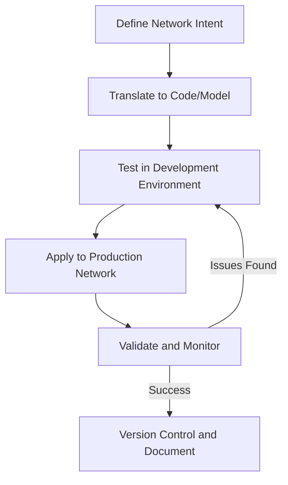

# Network Programmability

## Introduction

Network programmability represents a fundamental shift in how networks are built, managed, and operated. It's the ability to control and manipulate network infrastructure through code rather than manual configuration. This approach brings software development principles to networking, allowing for more agile, flexible, and scalable network management.

In traditional networking, engineers configure devices manually through command-line interfaces (CLIs), which is time-consuming and error-prone. Network programmability changes this paradigm by enabling engineers to use software to automate and control networks, making them more responsive to application needs and business requirements.

## Why Network Programmability Matters

Network programmability has become essential for several reasons:

1. **Scale**: Modern networks are growing larger and more complex, making manual configuration impractical.
2. **Agility**: Businesses need networks that can adapt quickly to changing requirements.
3. **Consistency**: Programmatic approaches reduce human error and ensure consistent configurations.
4. **Innovation**: Programmability enables rapid deployment of new network services and features.
5. **Cost Efficiency**: Automation reduces operational expenses and improves resource utilization.

## Core Components of Network Programmability

### APIs (Application Programming Interfaces)

APIs are the foundation of network programmability, providing structured ways for applications to interact with network devices. 

#### Types of Network APIs:

1. **RESTful APIs**: HTTP-based interfaces that use standard methods (GET, POST, PUT, DELETE) to interact with network resources.
2. **NETCONF**: A protocol that provides mechanisms to install, manipulate, and delete network device configurations.
3. **gRPC**: A high-performance, open-source RPC framework that can run in any environment.

Let's look at a simple example of using a RESTful API to retrieve information from a network device:

```python
import requests
import json

# Device information
device_ip = "192.168.1.1"
username = "admin"
password = "password"
base_url = f"https://{device_ip}/api/"

# Create a session
session = requests.Session()
session.auth = (username, password)
session.headers.update({'Content-Type': 'application/json'})
session.verify = False  # For self-signed certificates (not recommended in production)

# Get interface information
response = session.get(f"{base_url}interfaces")

# Check if request was successful
if response.status_code == 200:
    interfaces = response.json()
    print(json.dumps(interfaces, indent=2))
else:
    print(f"Failed to retrieve interfaces: {response.status_code}")
```

Output:
```
{
  "interfaces": [
    {
      "name": "GigabitEthernet0/0",
      "status": "up",
      "ip_address": "192.168.1.1",
      "mac_address": "00:11:22:33:44:55"
    },
    {
      "name": "GigabitEthernet0/1",
      "status": "down",
      "ip_address": null,
      "mac_address": "00:11:22:33:44:56"
    }
  ]
}
```

### Configuration Management Tools

These tools help manage configurations across multiple network devices programmatically:

1. **Ansible**: An open-source automation platform that can manage network configurations.
2. **Puppet**: A configuration management tool that can be extended to network devices.
3. **Chef**: Another configuration management tool with network device support.

Here's a simple example of an Ansible playbook for configuring multiple network devices:

```yaml
---
- name: Configure network devices
  hosts: network_devices
  gather_facts: no
  
  tasks:
    - name: Configure SNMP
      cisco.ios.ios_config:
        lines:
          - snmp-server community public RO
          - snmp-server community private RW
          - snmp-server location "Data Center A"
          - snmp-server contact "admin@example.com"
```

### Data Modeling Languages

These languages provide a structured way to represent network configurations:

1. **YANG**: A data modeling language used to model configuration and state data.
2. **JSON/XML**: Common data formats used for network device configuration.

Here's a simplified YANG model example for interface configuration:

```
module example-interface {
  namespace "http://example.com/interface";
  prefix "if";
  
  container interfaces {
    list interface {
      key "name";
      leaf name {
        type string;
      }
      leaf description {
        type string;
      }
      leaf enabled {
        type boolean;
        default "true";
      }
      leaf mtu {
        type uint16;
        default 1500;
      }
    }
  }
}
```

## Network Programmability Frameworks and Libraries

Several frameworks and libraries simplify network programmability:

### Python Libraries for Network Automation

1. **Netmiko**: Simplifies SSH connections to network devices.
2. **NAPALM (Network Automation and Programmability Abstraction Layer with Multivendor support)**: Provides a unified API to interact with different network device vendors.
3. **Nornir**: A Python automation framework built for high reliability and concurrency.

Let's see how to use Netmiko to configure a Cisco device:

```python
from netmiko import ConnectHandler

# Define the device
cisco_device = {
    'device_type': 'cisco_ios',
    'host': '192.168.1.1',
    'username': 'admin',
    'password': 'password',
}

# Connect to the device
with ConnectHandler(**cisco_device) as connection:
    # Send configuration commands
    config_commands = [
        'interface GigabitEthernet0/1',
        'description Connection to Server',
        'ip address 192.168.2.1 255.255.255.0',
        'no shutdown'
    ]
    
    output = connection.send_config_set(config_commands)
    print(output)
    
    # Save the configuration
    connection.save_config()
```

Output:
```
configure terminal
Enter configuration commands, one per line.  End with CNTL/Z.
Router(config)#interface GigabitEthernet0/1
Router(config-if)#description Connection to Server
Router(config-if)#ip address 192.168.2.1 255.255.255.0
Router(config-if)#no shutdown
Router(config-if)#end
Router#
```

### Controller-Based Solutions

1. **OpenDaylight**: An open-source SDN controller platform.
2. **ONOS**: Open Network Operating System, designed for service provider networks.
3. **Cisco DNA Center**: A commercial network controller for enterprise networks.

## Network Programmability Workflow

The typical workflow for network programmability involves these steps:



Let's break down this workflow:

1. **Define Network Intent**: Clearly specify what you want the network to do.
2. **Translate to Code/Model**: Convert your intent into programmatic instructions.
3. **Test in Development Environment**: Verify your code works as expected.
4. **Apply to Production Network**: Implement your changes in the live environment.
5. **Validate and Monitor**: Ensure the changes work correctly and monitor for issues.
6. **Version Control and Document**: Store your code in a version control system and document your work.

## Practical Examples

### Example 1: Automating Network Inventory

This example shows how to collect an inventory of all devices in your network:

```python
import napalm
import json
from concurrent.futures import ThreadPoolExecutor

# List of devices
devices = [
    {"hostname": "router1.example.com", "device_type": "ios"},
    {"hostname": "router2.example.com", "device_type": "ios"},
    {"hostname": "switch1.example.com", "device_type": "eos"}
]

def get_device_facts(device):
    """Retrieve facts from a network device."""
    driver = napalm.get_network_driver(device["device_type"])
    try:
        with driver(device["hostname"], "admin", "password") as device_conn:
            facts = device_conn.get_facts()
            interfaces = device_conn.get_interfaces()
            return {
                "hostname": device["hostname"],
                "facts": facts,
                "interfaces": interfaces
            }
    except Exception as e:
        return {
            "hostname": device["hostname"],
            "error": str(e)
        }

# Collect data in parallel
with ThreadPoolExecutor(max_workers=10) as executor:
    results = list(executor.map(get_device_facts, devices))

# Save results to a file
with open("network_inventory.json", "w") as f:
    json.dump(results, f, indent=2)

print(f"Collected inventory from {len(results)} devices")
```

### Example 2: Configuring VLANs Across Multiple Switches

This example shows how to configure the same VLANs across multiple switches:

```python
from nornir import InitNornir
from nornir.plugins.tasks.networking import netmiko_send_config
from nornir.plugins.functions.text import print_result

# Initialize Nornir with a configuration file
nr = InitNornir(config_file="config.yaml")

# Filter to only target switches
switches = nr.filter(role="switch")

# VLAN configuration
vlan_config = [
    "vlan 100",
    "name Engineering",
    "vlan 200",
    "name Sales",
    "vlan 300",
    "name Management"
]

# Apply configuration to all switches
result = switches.run(
    task=netmiko_send_config,
    config_commands=vlan_config
)

# Print results
print_result(result)
```

### Example 3: Building a Simple Network Monitoring System

This example demonstrates how to build a basic monitoring system using network programmability:

```python
import time
import matplotlib.pyplot as plt
from netmiko import ConnectHandler
import threading
import queue

# List of devices to monitor
devices = [
    {
        'device_type': 'cisco_ios',
        'host': '192.168.1.1',
        'username': 'admin',
        'password': 'password',
    },
    {
        'device_type': 'cisco_ios',
        'host': '192.168.1.2',
        'username': 'admin',
        'password': 'password',
    }
]

# Queue for storing results
results_queue = queue.Queue()

def monitor_interface(device, interface, duration=60, interval=5):
    """Monitor an interface's utilization for a specified duration."""
    data_points = []
    start_time = time.time()
    end_time = start_time + duration
    
    try:
        with ConnectHandler(**device) as conn:
            while time.time() < end_time:
                # Get interface statistics
                output = conn.send_command(f"show interface {interface} | include rate")
                
                # Parse output to extract bandwidth utilization
                for line in output.splitlines():
                    if "input rate" in line:
                        # Extract bits per second value
                        parts = line.split()
                        bps_index = parts.index("bits/sec,")
                        bps = int(parts[bps_index - 1])
                        
                        # Store timestamp and value
                        data_points.append((time.time() - start_time, bps))
                
                # Wait for next interval
                time.sleep(interval)
                
        # Put results in queue
        results_queue.put({
            "device": device["host"],
            "interface": interface,
            "data": data_points
        })
        
    except Exception as e:
        results_queue.put({
            "device": device["host"],
            "interface": interface,
            "error": str(e)
        })

# Start monitoring threads
threads = []
for device in devices:
    t = threading.Thread(
        target=monitor_interface,
        args=(device, "GigabitEthernet0/1", 60, 5)
    )
    t.start()
    threads.append(t)

# Wait for all threads to complete
for t in threads:
    t.join()

# Process results
results = []
while not results_queue.empty():
    results.append(results_queue.get())

# Plot results
plt.figure(figsize=(10, 6))
for result in results:
    if "error" not in result:
        times, values = zip(*result["data"])
        plt.plot(times, values, label=f"{result['device']} - {result['interface']}")

plt.xlabel("Time (seconds)")
plt.ylabel("Bits per second")
plt.title("Interface Utilization")
plt.legend()
plt.grid(True)
plt.savefig("interface_utilization.png")
```

## Benefits and Challenges

### Benefits of Network Programmability

1. **Automation**: Reduces manual tasks and human error.
2. **Agility**: Enables rapid network changes to support business needs.
3. **Consistency**: Ensures configurations are applied uniformly.
4. **Visibility**: Provides better insights into network operations.
5. **Innovation**: Enables new network services and capabilities.

### Challenges and Considerations

1. **Skill Development**: Network engineers need to develop programming skills.
2. **Cultural Change**: Organizations need to adapt to a DevOps-like approach.
3. **Security**: Programmatic access introduces new security considerations.
4. **Multi-vendor Environments**: Different vendors may support different APIs.
5. **Migration Strategy**: Moving from traditional to programmable networks requires planning.

## Getting Started with Network Programmability

To start your journey with network programmability:

1. **Learn a programming language**: Python is the most popular choice for network automation.
2. **Understand APIs**: Learn how RESTful APIs, NETCONF, and other protocols work.
3. **Explore libraries**: Get familiar with libraries like Netmiko, NAPALM, and Nornir.
4. **Set up a lab**: Create a virtual lab using tools like GNS3 or EVE-NG.
5. **Start small**: Begin with simple automation tasks before tackling complex projects.

## Summary

Network programmability transforms how networks are managed by bringing software development principles to networking. By leveraging APIs, configuration management tools, and data modeling languages, engineers can automate network tasks, improve consistency, and respond more quickly to changing requirements.

As networks continue to grow in complexity, programmability becomes not just an advantage but a necessity. The skills and approaches you learn in network programmability will be valuable regardless of how networking evolves in the future.

## Exercises

1. Write a script that retrieves the configuration from a network device and saves it to a file.
2. Create an Ansible playbook to configure SNMP on multiple devices.
3. Develop a program that monitors interface errors and sends an alert when thresholds are exceeded.
4. Build a simple web application that displays the status of network devices.
5. Write a script that compares the running configuration with a template and identifies discrepancies.

## Additional Resources

- **Books**:
  - "Network Programmability and Automation" by Jason Edelman, Scott S. Lowe, and Matt Oswalt
  - "Python Network Programming" by Eric Chou

- **Online Learning**:
  - Cisco DevNet (developer.cisco.com)
  - Kirk Byers' Python for Network Engineers course

- **Open-Source Projects**:
  - Netmiko (github.com/ktbyers/netmiko)
  - NAPALM (github.com/napalm-automation/napalm)
  - Nornir (github.com/nornir-automation/nornir)