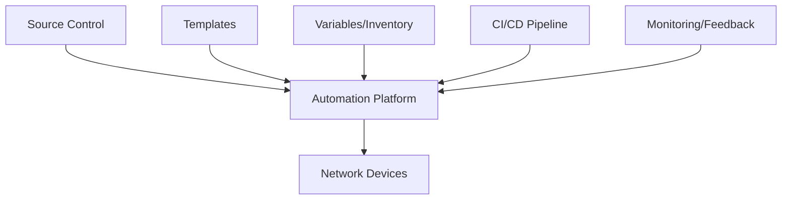

# Network Automation

Network automation is the process of automating the configuration, management, testing, deployment, and operation of physical and virtual network devices. By automating routine networking tasks, network engineers can reduce manual effort, minimize human error, and increase network reliability and agility.

## Introduction to Network Automation

In traditional network management, engineers configure network devices one by one through command-line interfaces (CLIs). This manual approach presents several challenges:

- Time-consuming configuration processes
- Inconsistent configurations due to human error
- Difficulty scaling network operations
- Delayed response to network changes and issues

Network automation addresses these challenges by using programming, scripts, and specialized tools to automate repetitive tasks, enforce consistency, and enable faster network changes.

## Key Benefits of Network Automation

- **Efficiency**: Reduces time spent on repetitive tasks
- **Consistency**: Ensures uniform configuration across devices
- **Scalability**: Manages large networks more effectively
- **Error reduction**: Minimizes human configuration errors
- **Agility**: Enables faster response to business needs
- **Documentation**: Automatically generates network documentation

## Network Automation Technologies and Tools

### 1. Configuration Management Tools

Configuration management tools allow you to define network configurations in code, making them repeatable and version-controlled.

#### Ansible for Network Automation

Ansible is one of the most popular tools for network automation due to its agentless architecture and simple YAML-based syntax.

Here's a basic example of an Ansible playbook for configuring Cisco IOS devices:

```yaml
---
- name: Configure Cisco routers
  hosts: cisco_routers
  gather_facts: no
  
  tasks:
    - name: Configure hostname
      cisco.ios.ios_config:
        lines:
          - hostname {{ inventory_hostname }}
    
    - name: Configure interface
      cisco.ios.ios_config:
        lines:
          - description WAN Connection
          - ip address 192.168.1.1 255.255.255.0
          - no shutdown
        parents: interface GigabitEthernet0/1
```

Running this playbook would configure the hostname and interface settings on all devices in the `cisco_routers` group.

### 2. Python for Network Automation

Python has become the de facto language for network automation due to its simplicity and the availability of networking libraries.

#### Using Netmiko

Netmiko is a Python library that simplifies connecting to network devices via SSH.

```python
from netmiko import ConnectHandler

# Define the device parameters
cisco_device = {
    'device_type': 'cisco_ios',
    'host': '192.168.1.1',
    'username': 'admin',
    'password': 'password',
    'secret': 'enable_password',  # Enable password
}

# Establish connection
connection = ConnectHandler(**cisco_device)
connection.enable()  # Enter enable mode

# Send configuration commands
config_commands = [
    'interface GigabitEthernet0/1',
    'description WAN Connection',
    'ip address 192.168.1.1 255.255.255.0',
    'no shutdown'
]

output = connection.send_config_set(config_commands)
print(output)

# Close connection
connection.disconnect()
```

Output:
```
config term
Enter configuration commands, one per line.  End with CNTL/Z.
Router(config)#interface GigabitEthernet0/1
Router(config-if)#description WAN Connection
Router(config-if)#ip address 192.168.1.1 255.255.255.0
Router(config-if)#no shutdown
Router(config-if)#end
Router#
```

### 3. APIs and Programmable Interfaces

Modern network devices offer APIs that allow for programmatic configuration and monitoring:

- **NETCONF (Network Configuration Protocol)**: XML-based protocol for network device configuration
- **RESTCONF**: HTTP-based protocol that uses REST principles for configuration
- **gNMI (gRPC Network Management Interface)**: Uses gRPC for network management operations

#### Example: Using RESTCONF with Python

```python
import requests
import json

# Define the device and authentication parameters
device_ip = "192.168.1.1"
username = "admin"
password = "password"
url = f"https://{device_ip}/restconf/data/Cisco-IOS-XE-native:native/interface"

# Set headers and authentication
headers = {
    "Content-Type": "application/yang-data+json",
    "Accept": "application/yang-data+json"
}

# Send GET request to retrieve interface information
response = requests.get(
    url, 
    headers=headers, 
    auth=(username, password),
    verify=False  # Disable SSL verification (not recommended for production)
)

# Print the response
print(json.dumps(response.json(), indent=2))
```

Output (simplified):
```json
{
  "Cisco-IOS-XE-native:interface": {
    "GigabitEthernet": [
      {
        "name": "0/1",
        "description": "WAN Connection",
        "ip": {
          "address": {
            "primary": {
              "address": "192.168.1.1",
              "mask": "255.255.255.0"
            }
          }
        },
        "shutdown": false
      }
    ]
  }
}
```

## Network Automation Architecture

Network automation typically involves several components working together:



## Infrastructure as Code (IaC) for Networks

Infrastructure as Code is a key concept in network automation where network configurations are defined as code, typically in text files that:

- Can be version-controlled
- Are human-readable
- Can be tested before deployment
- Provide a single source of truth

### Example: Network Configuration with YAML

```yaml
---
device_name: core-router-01
location: data-center-east
interfaces:
  - name: GigabitEthernet0/0
    description: Internet Connection
    ip_address: 203.0.113.1
    subnet_mask: 255.255.255.252
    enabled: true
  
  - name: GigabitEthernet0/1
    description: Internal LAN
    ip_address: 10.0.0.1
    subnet_mask: 255.255.255.0
    enabled: true

routing:
  ospf:
    process_id: 1
    networks:
      - network: 10.0.0.0
        wildcard: 0.0.0.255
        area: 0
```

This YAML file can be processed by automation tools to generate and apply device configurations.

## Practical Example: Automating VLAN Configuration

Let's build a Python script that automates the creation of VLANs across multiple switches:

```python
import yaml
from netmiko import ConnectHandler
import logging

# Set up logging
logging.basicConfig(filename='vlan_deployment.log', level=logging.INFO,
                    format='%(asctime)s - %(message)s')

# Load configuration from YAML file
with open('vlan_config.yaml', 'r') as file:
    config = yaml.safe_load(file)

# Load device inventory
with open('devices.yaml', 'r') as file:
    devices = yaml.safe_load(file)

def configure_vlans(device_params, vlans):
    try:
        # Connect to the device
        logging.info(f"Connecting to {device_params['host']}")
        connection = ConnectHandler(**device_params)
        connection.enable()
        
        # Configure each VLAN
        for vlan in vlans:
            logging.info(f"Configuring VLAN {vlan['id']} on {device_params['host']}")
            
            # Prepare configuration commands
            vlan_commands = [
                f"vlan {vlan['id']}",
                f"name {vlan['name']}"
            ]
            
            # Send configuration
            output = connection.send_config_set(vlan_commands)
            logging.info(f"VLAN {vlan['id']} configured successfully")
            
        # Save configuration
        connection.save_config()
        logging.info(f"Configuration saved on {device_params['host']}")
        
        # Disconnect
        connection.disconnect()
        return True
        
    except Exception as e:
        logging.error(f"Error configuring {device_params['host']}: {str(e)}")
        return False

# Main execution
success_count = 0
for device in devices:
    if configure_vlans(device, config['vlans']):
        success_count += 1

logging.info(f"VLAN deployment completed. Success: {success_count}/{len(devices)}")
print(f"VLAN deployment completed. Success: {success_count}/{len(devices)}")
```

The VLAN configuration file (`vlan_config.yaml`):

```yaml
---
vlans:
  - id: 10
    name: MANAGEMENT
  - id: 20
    name: USERS
  - id: 30
    name: SERVERS
  - id: 40
    name: GUEST
```

The device inventory file (`devices.yaml`):

```yaml
---
- device_type: cisco_ios
  host: 192.168.1.101
  username: admin
  password: password
  secret: enable_password

- device_type: cisco_ios
  host: 192.168.1.102
  username: admin
  password: password
  secret: enable_password

- device_type: cisco_ios
  host: 192.168.1.103
  username: admin
  password: password
  secret: enable_password
```

## Network Configuration Validation and Testing

An important aspect of network automation is validating and testing configurations before deployment to production.

### Example: Validating Network Configuration with PyTest

```python
import pytest
from netmiko import ConnectHandler

# Test fixture for device connection
@pytest.fixture
def device_connection():
    device = {
        'device_type': 'cisco_ios',
        'host': '192.168.1.101',
        'username': 'admin',
        'password': 'password',
        'secret': 'enable_password',
    }
    
    connection = ConnectHandler(**device)
    connection.enable()
    yield connection
    connection.disconnect()

def test_vlan_exists(device_connection):
    """Test if VLAN 10 exists and has the correct name"""
    output = device_connection.send_command("show vlan id 10")
    assert "MANAGEMENT" in output
    assert "not found in current VLAN database" not in output

def test_interface_status(device_connection):
    """Test if GigabitEthernet0/1 is up"""
    output = device_connection.send_command("show interface GigabitEthernet0/1")
    assert "line protocol is up" in output
```

## Network Automation Best Practices

1. **Start Small**: Begin with simple automation tasks and gradually expand
2. **Use Version Control**: Keep all automation code in a version control system like Git
3. **Implement CI/CD Pipelines**: Automate testing and deployment of network changes
4. **Create Templates**: Use Jinja2 or similar templating for configuration generation
5. **Implement Error Handling**: Add proper error handling and logging
6. **Document Everything**: Keep documentation updated alongside your automation code
7. **Use Secure Credential Management**: Never hardcode passwords in scripts
8. **Test in Lab Environment**: Always test changes in a lab environment first
9. **Apply the Principle of Idempotence**: Scripts should be safe to run multiple times
10. **Monitor and Verify**: Implement verification steps after changes

## Advanced Topics in Network Automation

### Intent-Based Networking (IBN)

Intent-Based Networking takes automation a step further by allowing network administrators to define what they want the network to do, rather than how to do it. The system then:

1. Translates business intent to network configuration
2. Implements the configuration
3. Continuously validates that the network is fulfilling the intent
4. Takes corrective action when necessary

### Event-Driven Automation

Event-driven automation responds to network events in real-time:

```python
from nornir import InitNornir
from nornir_utils.plugins.functions import print_result
from nornir_netmiko import netmiko_send_command

def monitor_interface_status(task):
    # Monitor interface status
    result = task.run(
        task=netmiko_send_command,
        command_string="show interface GigabitEthernet0/1 | include line protocol"
    )
    
    # Check if interface is down
    if "line protocol is down" in result.result:
        print(f"Interface on {task.host} is DOWN! Attempting recovery...")
        
        # Attempt recovery
        recovery = task.run(
            task=netmiko_send_config,
            config_commands=[
                "interface GigabitEthernet0/1",
                "shutdown",
                "no shutdown"
            ]
        )
        
        print(f"Recovery attempt completed on {task.host}")

# Initialize Nornir
nr = InitNornir(config_file="nornir_config.yaml")

# Run the monitoring function
results = nr.run(task=monitor_interface_status)
print_result(results)
```

## Summary

Network automation has transformed how networks are designed, deployed, and managed. By leveraging programming, APIs, and specialized tools, network engineers can:

- Automate repetitive tasks
- Ensure configuration consistency
- Respond quickly to changing requirements
- Scale network operations efficiently
- Reduce human errors

As networks continue to grow in complexity, automation becomes not just beneficial but essential for effective network management.

## Exercises

1. Create a simple Python script using Netmiko to back up configurations from multiple network devices.
2. Write an Ansible playbook to deploy a standard SNMP configuration across all network devices.
3. Develop a Python script that uses a REST API to retrieve and display interface statistics from a network device.
4. Create a network diagram using a YAML description and a visualization tool of your choice.
5. Build a CI/CD pipeline for testing and deploying network configurations.

## Additional Resources

- **Books**:
  - "Network Programmability and Automation" by Jason Edelman, Scott S. Lowe, and Matt Oswalt
  - "Python Network Programming" by Eric Chou

- **Online Courses and Training**:
  - Cisco DevNet
  - Network to Code
  - INE Network Automation courses

- **Open Source Projects**:
  - Nornir: Multi-threaded automation framework
  - NAPALM: Network Automation and Programmability Abstraction Layer with Multivendor support
  - Netbox: IP address management (IPAM) and data center infrastructure management (DCIM) tool