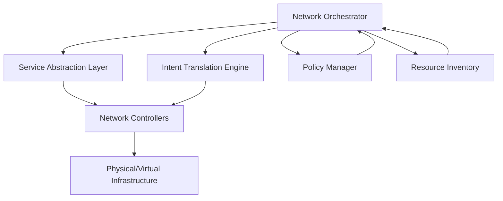
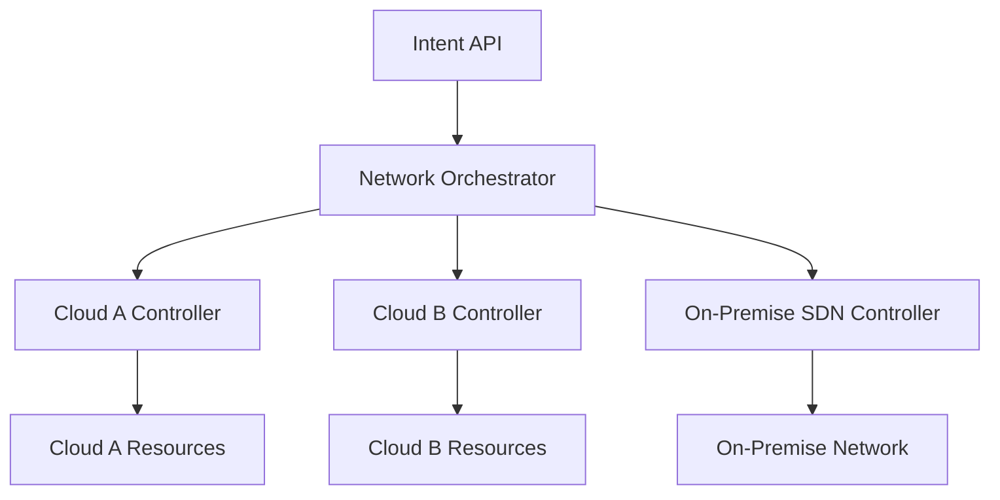

# Networks Orchestration

## Introduction

Network orchestration represents the automated arrangement, coordination, and management of complex computer networks and their associated services. In the world of Software-Defined Networking (SDN), orchestration serves as the conductor of the digital symphony, bringing together disparate network components to operate harmoniously.

Think of traditional network management as manually tuning each instrument in an orchestra, while network orchestration is like having an intelligent conductor that ensures all instruments play in perfect harmony, adapting to changes in real-time. This paradigm shift moves us away from device-by-device configuration toward holistic, intent-based network management.

## What is Networks Orchestration?

Network orchestration refers to the automated arrangement, coordination, and management of complex networking systems, middleware, and services. It goes beyond simple automation by providing:

1. **End-to-end service management** across multiple domains
2. **Policy-driven configurations** that align with business objectives
3. **Lifecycle management** of network services and applications
4. **Integration with other IT systems** like cloud platforms and container orchestrators

### Key Components of Network Orchestration



## Orchestration vs. Automation: Understanding the Difference

While often used interchangeably, orchestration and automation serve different purposes:

| Feature | Automation | Orchestration |
|---------|------------|---------------|
| Purpose | Execute specific tasks | Coordinate multiple automated tasks |
| Scope | Task-focused | End-to-end service focused |
| Intelligence | Follows predefined steps | Makes decisions based on policies |
| Example | Automatically configuring a switch | Deploying a multi-tier application across network segments |

## Implementing Network Orchestration

Let's explore how to implement a basic network orchestration system using Python. We'll use a simplified example to demonstrate the core concepts.

### Creating a Simple Network Orchestrator

First, let's define our orchestrator class:

```python
import requests
import json
import time

class NetworkOrchestrator:
    def __init__(self, controllers):
        self.controllers = controllers
        self.service_catalog = {}
        self.policies = {}
        
    def register_service(self, service_name, service_definition):
        """Register a service template in the catalog"""
        self.service_catalog[service_name] = service_definition
        print(f"Service '{service_name}' registered in catalog")
        
    def define_policy(self, policy_name, policy_rules):
        """Define a policy for service deployment"""
        self.policies[policy_name] = policy_rules
        print(f"Policy '{policy_name}' defined")
        
    def deploy_service(self, service_name, parameters, policy_name=None):
        """Deploy a service from the catalog with specific parameters"""
        if service_name not in self.service_catalog:
            return f"Error: Service '{service_name}' not found in catalog"
            
        service_def = self.service_catalog[service_name]
        
        # Apply policies if specified
        if policy_name and policy_name in self.policies:
            parameters = self._apply_policy(parameters, self.policies[policy_name])
            
        # Break down service into component configurations
        configs = self._generate_configs(service_def, parameters)
        
        # Deploy configurations to respective controllers
        results = {}
        for controller, config in configs.items():
            if controller in self.controllers:
                results[controller] = self._deploy_to_controller(controller, config)
            else:
                results[controller] = f"Error: Controller '{controller}' not configured"
                
        return results
    
    def _apply_policy(self, parameters, policy_rules):
        """Apply policy rules to service parameters"""
        modified_params = parameters.copy()
        for rule in policy_rules:
            # Simple example of policy application
            if rule["type"] == "bandwidth_limit" and "bandwidth" in modified_params:
                if modified_params["bandwidth"] > rule["max_value"]:
                    modified_params["bandwidth"] = rule["max_value"]
                    print(f"Policy applied: Bandwidth limited to {rule['max_value']} Mbps")
        return modified_params
    
    def _generate_configs(self, service_def, parameters):
        """Generate device-specific configurations from service definition"""
        configs = {}
        for component in service_def["components"]:
            controller_type = component["controller_type"]
            config_template = component["config_template"]
            
            # Replace parameters in template
            config = config_template
            for key, value in parameters.items():
                placeholder = f"{{{{ {key} }}}}"
                config = config.replace(placeholder, str(value))
                
            configs[controller_type] = config
        return configs
    
    def _deploy_to_controller(self, controller, config):
        """Deploy configuration to a specific controller"""
        # This would normally use REST API calls to the controller
        # Simplified for demonstration
        print(f"Deploying to {controller}:")
        print(config)
        
        # Simulate API call to controller
        try:
            # In a real implementation, this would be an actual API call
            # requests.post(f"https://{self.controllers[controller]}/api/config", json={"config": config})
            time.sleep(1)  # Simulate network delay
            return "Deployment successful"
        except Exception as e:
            return f"Deployment failed: {str(e)}"
```

### Using the Network Orchestrator

Now let's see how we might use this orchestrator to deploy a secure web application service:

```python
# Initialize the orchestrator with controller endpoints
orchestrator = NetworkOrchestrator({
    "sdn_controller": "10.0.0.1:8181",
    "firewall_controller": "10.0.0.2:9000",
    "load_balancer": "10.0.0.3:8080"
})

# Define a web application service
web_service = {
    "name": "secure_web_app",
    "description": "Secure web application with load balancing",
    "components": [
        {
            "controller_type": "sdn_controller",
            "config_template": """
            {
                "flows": [
                    {
                        "priority": 100,
                        "timeout": 0,
                        "isPermanent": true,
                        "deviceId": "of:0000000000000001",
                        "treatment": {
                            "instructions": [
                                { "type": "OUTPUT", "port": "2" }
                            ]
                        },
                        "selector": {
                            "criteria": [
                                { "type": "IN_PORT", "port": "1" },
                                { "type": "ETH_TYPE", "ethType": "0x0800" },
                                { "type": "IPV4_DST", "ip": "{{ app_server_ip }}" },
                                { "type": "IP_PROTO", "protocol": "6" },
                                { "type": "TCP_DST", "tcpPort": "{{ app_port }}" }
                            ]
                        }
                    }
                ]
            }
            """
        },
        {
            "controller_type": "firewall_controller",
            "config_template": """
            {
                "rules": [
                    {
                        "id": "allow-web",
                        "priority": 100,
                        "action": "ALLOW",
                        "protocol": "TCP",
                        "source": "ANY",
                        "destination": "{{ app_server_ip }}",
                        "destinationPort": "{{ app_port }}",
                        "enabled": true
                    }
                ]
            }
            """
        },
        {
            "controller_type": "load_balancer",
            "config_template": """
            {
                "vip": "{{ vip_address }}",
                "protocol": "HTTP",
                "port": {{ app_port }},
                "method": "ROUND_ROBIN",
                "servers": [
                    {"ip": "{{ app_server_ip }}", "port": {{ app_port }}, "weight": 1},
                    {"ip": "{{ backup_server_ip }}", "port": {{ app_port }}, "weight": 1}
                ],
                "healthCheck": {
                    "path": "/health",
                    "interval": 5,
                    "timeout": 2,
                    "unhealthyThreshold": 3,
                    "healthyThreshold": 2
                },
                "persistence": {
                    "method": "SOURCE_IP",
                    "timeout": 3600
                },
                "maxConnections": {{ max_connections }}
            }
            """
        }
    ]
}

# Register the service
orchestrator.register_service("secure_web_app", web_service)

# Define bandwidth policy
bandwidth_policy = [
    {
        "type": "bandwidth_limit",
        "max_value": 1000  # 1000 Mbps
    }
]

# Register the policy
orchestrator.define_policy("standard_bandwidth", bandwidth_policy)

# Deploy the service with specific parameters
deployment_result = orchestrator.deploy_service(
    "secure_web_app",
    {
        "app_server_ip": "192.168.1.100",
        "backup_server_ip": "192.168.1.101",
        "app_port": 8443,
        "vip_address": "10.0.1.50",
        "max_connections": 5000,
        "bandwidth": 1500  # Will be limited by policy
    },
    policy_name="standard_bandwidth"
)

print("
Deployment results:")
for controller, result in deployment_result.items():
    print(f"{controller}: {result}")
```

### Output:

```
Service 'secure_web_app' registered in catalog
Policy 'standard_bandwidth' defined
Policy applied: Bandwidth limited to 1000 Mbps
Deploying to sdn_controller:

            {
                "flows": [
                    {
                        "priority": 100,
                        "timeout": 0,
                        "isPermanent": true,
                        "deviceId": "of:0000000000000001",
                        "treatment": {
                            "instructions": [
                                { "type": "OUTPUT", "port": "2" }
                            ]
                        },
                        "selector": {
                            "criteria": [
                                { "type": "IN_PORT", "port": "1" },
                                { "type": "ETH_TYPE", "ethType": "0x0800" },
                                { "type": "IPV4_DST", "ip": "192.168.1.100" },
                                { "type": "IP_PROTO", "protocol": "6" },
                                { "type": "TCP_DST", "tcpPort": "8443" }
                            ]
                        }
                    }
                ]
            }
            
Deploying to firewall_controller:

            {
                "rules": [
                    {
                        "id": "allow-web",
                        "priority": 100,
                        "action": "ALLOW",
                        "protocol": "TCP",
                        "source": "ANY",
                        "destination": "192.168.1.100",
                        "destinationPort": "8443",
                        "enabled": true
                    }
                ]
            }
            
Deploying to load_balancer:

            {
                "vip": "10.0.1.50",
                "protocol": "HTTP",
                "port": 8443,
                "method": "ROUND_ROBIN",
                "servers": [
                    {"ip": "192.168.1.100", "port": 8443, "weight": 1},
                    {"ip": "192.168.1.101", "port": 8443, "weight": 1}
                ],
                "healthCheck": {
                    "path": "/health",
                    "interval": 5,
                    "timeout": 2,
                    "unhealthyThreshold": 3,
                    "healthyThreshold": 2
                },
                "persistence": {
                    "method": "SOURCE_IP",
                    "timeout": 3600
                },
                "maxConnections": 5000
            }
            

Deployment results:
sdn_controller: Deployment successful
firewall_controller: Deployment successful
load_balancer: Deployment successful
```

## Real-World Applications of Network Orchestration

Network orchestration is transforming how organizations manage their networks. Here are some practical applications:

### 1. Multi-Cloud Network Management



Modern enterprises often operate across multiple cloud platforms. Network orchestration can provide:

- **Unified networking policies** across different cloud providers
- **Consistent security posture** regardless of where workloads run
- **Automated network path optimization** between clouds
- **Centralized visibility** into all network segments

### 2. Intent-Based Networking

Intent-based networking (IBN) is a natural evolution of network orchestration, where:

1. The user declares what they want ("I need a secure connection between Application A and Database B")
2. The orchestration system translates this intent into specific policies
3. The system automatically configures the network to fulfill the intent
4. Continuous verification ensures the intent is being met

```python
# Example of a simple intent API
def create_secure_connection(orchestrator, source_app, destination_db, security_level):
    """Create a secure connection between an application and database"""
    
    # Translate intent to specific parameters
    if security_level == "high":
        encryption = "AES-256"
        allow_ports = [3306]  # MySQL port only
        require_authentication = True
    elif security_level == "medium":
        encryption = "AES-128"
        allow_ports = [3306, 22]  # MySQL and SSH
        require_authentication = True
    else:
        encryption = "None"
        allow_ports = [3306, 22, 80, 443]  # Common ports
        require_authentication = False
    
    # Deploy the intent
    return orchestrator.deploy_service(
        "secure_connection",
        {
            "source_app": source_app,
            "destination_db": destination_db,
            "encryption": encryption,
            "allow_ports": allow_ports,
            "require_authentication": require_authentication
        }
    )

# Usage
result = create_secure_connection(
    orchestrator, 
    "web-server-cluster", 
    "customer-database", 
    "high"
)
```

### 3. Network Service Lifecycle Management

Network orchestration excels at managing the complete lifecycle of network services:

1. **Design**: Define service templates with required components
2. **Deploy**: Provision resources and configure network elements
3. **Operate**: Monitor service health and performance
4. **Optimize**: Make real-time adjustments based on conditions
5. **Decommission**: Safely remove services when no longer needed

## Tools and Frameworks for Network Orchestration

Several open-source and commercial tools can help you implement network orchestration:

| Tool | Type | Focus Area |
|------|------|------------|
| ONAP (Open Network Automation Platform) | Open Source | Comprehensive telco/enterprise orchestration |
| Ansible Networking | Open Source | Configuration management and automation |
| Cisco NSO (Network Services Orchestrator) | Commercial | Multi-vendor service orchestration |
| OpenDaylight | Open Source | SDN controller with orchestration capabilities |
| Terraform | Open Source | Infrastructure as code for network provisioning |

## Advanced Concepts in Network Orchestration

### Service Function Chaining

Service Function Chaining (SFC) allows network traffic to flow through a predefined sequence of network services (like firewalls, load balancers, and intrusion detection systems).

```python
def create_service_chain(orchestrator, service_chain_name, services, traffic_selector):
    """Create a service function chain"""
    return orchestrator.deploy_service(
        "service_chain",
        {
            "name": service_chain_name,
            "services": services,  # List of service functions in order
            "traffic_selector": traffic_selector  # Rules to identify which traffic goes through the chain
        }
    )

# Usage
chain_result = create_service_chain(
    orchestrator,
    "web-traffic-chain",
    [
        {"type": "WAF", "id": "waf-cluster-1"},
        {"type": "DPI", "id": "inspection-1"},
        {"type": "LOAD_BALANCER", "id": "web-lb-1"}
    ],
    {
        "source": "EXTERNAL",
        "destination": "WEB_SERVERS",
        "protocol": "HTTP",
        "ports": [80, 443]
    }
)
```

### Network Slicing

Network slicing creates isolated virtual networks with specific characteristics on shared physical infrastructure. This is especially important in 5G networks.

```python
def create_network_slice(orchestrator, slice_name, slice_type, qos_parameters):
    """Create a network slice for a specific application type"""
    return orchestrator.deploy_service(
        "network_slice",
        {
            "name": slice_name,
            "slice_type": slice_type,  # e.g., "eMBB", "URLLC", "mMTC"
            "qos_parameters": qos_parameters
        }
    )

# Usage - Creating an ultra-reliable low-latency slice for industrial automation
urllc_slice = create_network_slice(
    orchestrator,
    "factory-automation-slice",
    "URLLC",
    {
        "max_latency": 5,  # 5ms
        "reliability": 99.999,  # 99.999% reliability
        "priority": "high",
        "bandwidth": 100  # 100 Mbps guaranteed
    }
)
```

## Security Considerations in Network Orchestration

Network orchestration centralizes control, which increases the importance of security:

1. **Authentication and Authorization**: Implement strong authentication for orchestrator access and role-based access control for different operations
2. **Encryption**: Secure communication between the orchestrator and network elements
3. **Change Validation**: Verify that proposed changes won't create security vulnerabilities 
4. **Audit Logging**: Maintain comprehensive logs of all orchestration actions
5. **Configuration Versioning**: Keep track of all configuration versions for rollback capability

## Best Practices for Network Orchestration

To successfully implement network orchestration:

1. **Start Small**: Begin with a specific use case rather than attempting to orchestrate everything at once
2. **Standardize First**: Define standard service models before automating them
3. **Embrace Infrastructure as Code**: Use version-controlled templates for network configurations
4. **Design for Failure**: Build recovery mechanisms for when things go wrong
5. **Continuously Test**: Regularly test orchestration workflows in a non-production environment
6. **Documentation**: Keep comprehensive documentation of all orchestrated services

## Summary

Network orchestration represents the evolution of network management from manual, device-centric configurations to automated, service-centric operations. By abstracting the complexity of underlying infrastructure, orchestration enables organizations to:

- Deploy network services faster and with fewer errors
- Maintain consistency across hybrid and multi-cloud environments
- Implement sophisticated service chains and network slices
- Align network behavior with business intent
- Reduce operational costs through automation

As networks continue to grow in complexity, orchestration becomes not just beneficial but essential for efficient operations.

## Further Learning

To continue your journey into network orchestration:

1. **Practical Exercises**:
   - Build a simple orchestrator using Python and REST APIs
   - Design service templates for common networking scenarios
   - Implement intent-based networking concepts

2. **Topics to Explore**:
   - Cloud-native network orchestration
   - AI/ML for predictive network orchestration
   - Zero-touch provisioning and orchestration
   - Event-driven orchestration

3. **Open Source Projects**:
   - Contribute to orchestration frameworks like ONAP
   - Explore SDN controllers that support orchestration
   - Build plugins for existing orchestration tools