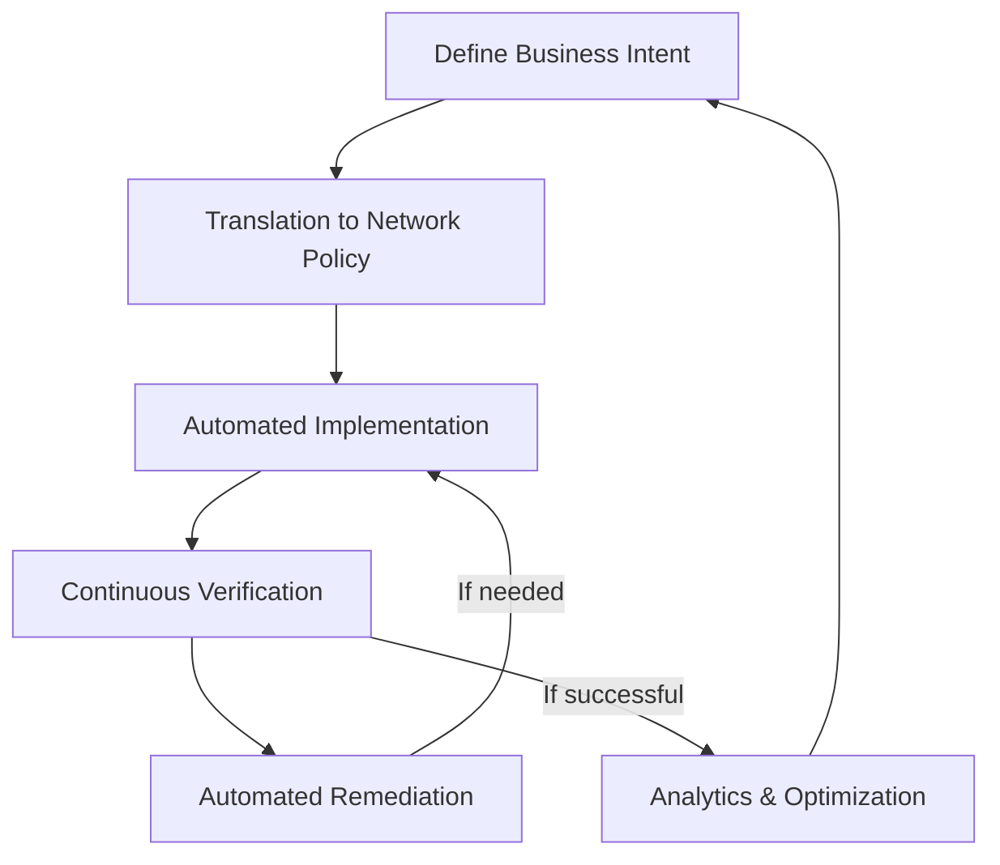

# Intent-Based Networking

## Introduction

Intent-Based Networking (IBN) represents the next evolution in network management and automation, building upon the foundation of Software-Defined Networking (SDN). While SDN separates the control plane from the data plane, IBN takes this concept further by allowing network administrators to define **what** they want the network to accomplish rather than **how** to configure it.

Think of it like this: instead of manually programming each network device with specific commands, you simply tell the network your business intent, and an intelligent system translates that intent into the necessary configurations automatically.

## Understanding the Concept

Intent-Based Networking operates on a simple yet powerful principle: abstract the complexity of network configuration away from the administrator by focusing on business intentions rather than technical details.

### Key Components of IBN

1. **Intent Translation**: Converts high-level business objectives into network policies
2. **Automation & Orchestration**: Implements these policies across the network infrastructure
3. **Network Assurance**: Continuously verifies that the network is meeting the desired intent
4. **Machine Learning & Analytics**: Provides intelligence for optimization and self-correction

### The IBN Lifecycle



## Comparison with Traditional and SDN Approaches

To better understand IBN, let's compare different networking paradigms:

| Aspect | Traditional Networking | SDN | Intent-Based Networking |
|--------|------------------------|-----|------------------------|
| Focus | Device-centric | Flow-centric | Business-intent-centric |
| Configuration | Manual, device-by-device | Programmatic, controller-based | Automated from business intent |
| Intelligence | Limited, reactive | Centralized control | AI/ML driven, predictive |
| Verification | Manual troubleshooting | Basic validation | Continuous automated assurance |
| Adaptability | Low, requires manual changes | Medium, requires programming | High, self-adjusting |

## Implementation Example

Let's look at a simplified example of how IBN works in practice. Imagine you want to implement a security policy that isolates engineering workstations from financial servers.

### Traditional Approach (CLI Commands)

```
# On Router 1
router1# configure terminal
router1(config)# access-list 101 deny ip 10.1.1.0 0.0.0.255 10.2.1.0 0.0.0.255
router1(config)# interface GigabitEthernet0/1
router1(config-if)# ip access-group 101 in
router1(config-if)# exit

# On Router 2
router2# configure terminal
...
# Repeat similar commands on all affected devices
```

### Intent-Based Approach (Pseudo-code)

```python
# Define intent in a high-level language or UI
policy = {
    "name": "Engineering-Finance Isolation",
    "intent": "Isolate Engineering department from Finance servers",
    "source": "Engineering Department",
    "destination": "Finance Servers",
    "action": "block"
}

# Submit to IBN system
ibn_system.apply_policy(policy)

# The IBN system automatically:
# 1. Identifies all Engineering and Finance resources
# 2. Determines the necessary changes across all network devices
# 3. Implements the configurations
# 4. Verifies the policy is working correctly
```

## Real-World Applications

### Network Security Policy Implementation

One of the most powerful applications of IBN is security policy implementation. Instead of manually configuring dozens or hundreds of firewall rules, access control lists, and security policies across multiple devices, an administrator can simply state intentions like:

- "Isolate development environment from production"
- "Apply strict access controls to financial data"
- "Ensure compliance with HIPAA for all medical data traffic"

The IBN system translates these intentions into appropriate security configurations across the entire network.

### Dynamic Quality of Service (QoS)

With IBN, QoS becomes more business-aligned:

```python
# Intent definition for QoS
qos_intent = {
    "application": "Video Conferencing",
    "priority": "High",
    "bandwidth_guarantee": "5Mbps per session",
    "max_latency": "30ms"
}

# The IBN system ensures this intent is maintained
# even as network conditions change
```

The system continuously monitors and adjusts parameters to ensure video conferencing quality remains high, regardless of other network traffic or conditions.

### Simplified Multi-site Management

Managing networks across multiple locations becomes significantly easier with IBN:

```python
# Define a consistent security posture across all branch offices
branch_intent = {
    "policy": "Standard Branch Security",
    "apply_to": "All Branch Offices",
    "requirements": [
        "Guest WiFi isolation",
        "Internal segmentation",
        "Centralized security monitoring",
        "Consistent access controls"
    ]
}
```

This single intent declaration can be automatically translated and implemented across dozens or hundreds of branch locations, ensuring consistency while reducing configuration errors.

## Technologies Behind IBN

Intent-Based Networking relies on several technologies working together:

1. **Network Controller**: Provides centralized management of the network infrastructure
2. **Network Virtualization**: Enables flexible network resource allocation
3. **Automation Platform**: Implements policies without manual intervention
4. **Analytics Engine**: Gathers and analyzes network telemetry data
5. **Machine Learning**: Identifies patterns and makes predictions
6. **Natural Language Processing**: Translates human intent into policies (in some systems)

## Code Example: Basic Intent Definition

Here's how you might define network intents in a Python-based IBN system:

```python
from ibn_system import IntentBasedNetwork, Intent, Segment

# Initialize the IBN system
ibn = IntentBasedNetwork()

# Define network segments
engineering = Segment(name="Engineering", subnet="10.1.1.0/24")
finance = Segment(name="Finance", subnet="10.2.1.0/24")
guest_wifi = Segment(name="Guest WiFi", subnet="192.168.100.0/24")

# Register segments with the system
ibn.add_segments([engineering, finance, guest_wifi])

# Define intents
security_intent = Intent(
    name="Security Segmentation",
    description="Implement security boundaries between departments",
    rules=[
        {"source": engineering, "destination": finance, "action": "allow", "ports": [443]},
        {"source": guest_wifi, "destination": "*", "action": "deny"}
    ]
)

qos_intent = Intent(
    name="Voice Priority",
    description="Prioritize VoIP traffic across the network",
    rules=[
        {"application": "VoIP", "priority": "high", "min_bandwidth": "1Mbps"}
    ]
)

# Apply intents to the network
ibn.apply_intent(security_intent)
ibn.apply_intent(qos_intent)

# Verify intents are enforced
compliance = ibn.verify_intent(security_intent)
print(f"Security intent compliance: {compliance.status}")
if compliance.issues:
    print("Issues found:")
    for issue in compliance.issues:
        print(f" - {issue}")
```

### Example Output:

```
Security intent compliance: PARTIAL
Issues found:
 - Rule 'Engineering to Finance' cannot be enforced on router R5 (incompatible hardware)
 - Guest WiFi isolation requires updated firmware on access points AP3-AP7
```

The system not only attempts to implement the intents but also provides feedback on any issues encountered.

## Major IBN Solutions

Several major vendors offer Intent-Based Networking solutions:

1. **Cisco DNA Center**: Part of Cisco's Digital Network Architecture
2. **Juniper Mist**: Cloud-based wireless and wired network management
3. **Apstra AOS**: Multi-vendor IBN solution
4. **VMware NSX**: Network virtualization and security platform

These solutions vary in capabilities and approach, but all aim to abstract network complexity and align network behavior with business intent.

## Benefits and Challenges

### Benefits

- **Reduced Complexity**: Abstracts away low-level network details
- **Improved Agility**: Network changes can be implemented faster
- **Enhanced Security**: Consistent policy enforcement
- **Error Reduction**: Automation reduces human configuration errors
- **Continuous Validation**: Ensures the network meets business requirements
- **Self-healing**: Automatic remediation of network issues

### Challenges

- **Implementation Complexity**: Initial setup can be challenging
- **Legacy Integration**: Older devices may not support all IBN features
- **Skill Transition**: Network teams need to learn new skills
- **Trust in Automation**: Organizations must develop confidence in automated systems
- **Cost**: IBN solutions often require significant investment

## Getting Started with IBN

For beginners looking to explore Intent-Based Networking, here are some steps to get started:

1. **Learn the fundamentals of SDN first**, as IBN builds upon these concepts
2. **Explore vendor sandboxes** like Cisco DevNet which offer hands-on IBN experience
3. **Start with a small proof-of-concept** rather than a full-scale implementation
4. **Focus on a specific use case** such as security policy implementation
5. **Build skills in network automation** using Python, APIs, and infrastructure as code

## Summary

Intent-Based Networking represents a significant advancement in network management philosophy. By focusing on business intent rather than technical configurations, IBN allows organizations to align their networks more closely with business objectives while reducing complexity and improving agility.

The key takeaways from this topic are:

- IBN abstracts network complexity by focusing on what the network should achieve rather than how to configure it
- The IBN lifecycle includes intent translation, automated implementation, continuous verification, and remediation
- IBN relies on AI/ML, automation, and analytics to maintain the desired network state
- Real-world applications include security policy implementation, QoS management, and multi-site consistency
- While powerful, IBN requires investment in both technology and skills development

## Further Learning

To deepen your understanding of Intent-Based Networking, consider exploring:

1. **Network Automation** with Python and tools like Ansible
2. **APIs** for network device management
3. **Infrastructure as Code** principles and tools
4. **Machine Learning** basics for understanding network analytics
5. **Vendor-specific IBN solutions** through their education programs

## Exercises

1. Define a business intent for an application that requires high availability and security. What specific network behaviors would this translate to?

2. Compare how you would implement a new security policy using traditional networking versus an intent-based approach.

3. Research one vendor's IBN solution and identify its key components and capabilities.

4. Design a simple intent-based system using pseudocode that would manage QoS for different application types.

5. List potential challenges an organization might face when transitioning from traditional networking to IBN, and suggest mitigation strategies.