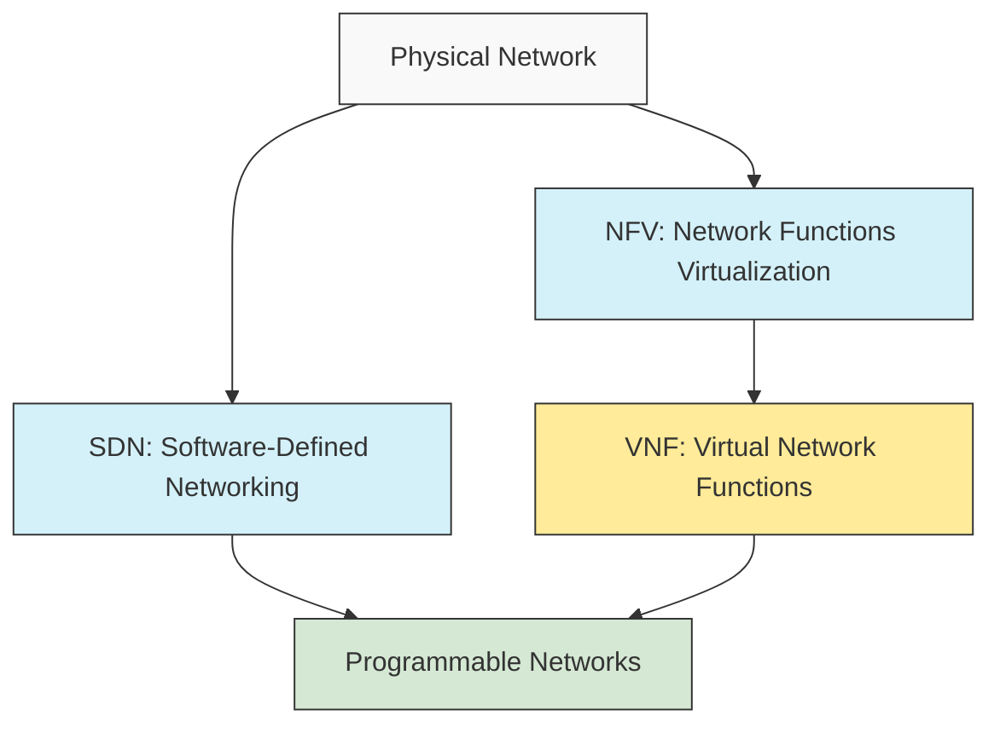
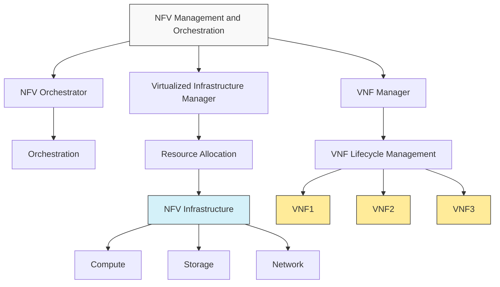

# Networks VNF: Virtual Network Functions

## Introduction

Virtual Network Functions (VNFs) are software implementations of network functions that traditionally ran on dedicated hardware appliances. These network functions include routing, switching, firewalls, load balancers, WAN optimization, and many others. VNFs are a cornerstone of Network Functions Virtualization (NFV), which is closely related to Software-Defined Networking (SDN).

In the traditional networking world, if you needed a new router, firewall, or load balancer, you would purchase physical hardware, install it, and configure it. With VNFs, these functions are implemented as software running on standard servers, often in virtualized environments like virtual machines (VMs) or containers.

## Why VNFs Matter

VNFs offer several significant advantages over traditional hardware-based network functions:

1. **Cost Reduction**: By moving network functions from specialized hardware to software running on commodity servers, VNFs significantly reduce capital expenses.

2. **Agility and Flexibility**: New network services can be deployed quickly through software rather than installing new hardware.

3. **Scalability**: Network resources can be easily scaled up or down based on demand.

4. **Reduced Time-to-Market**: New network services can be developed, tested, and deployed much faster.

5. **Innovation**: Opens the door for rapid innovation in network services and applications.

## The Relationship Between SDN and VNF

While Software-Defined Networking (SDN) and Virtual Network Functions (VNF) are related concepts, they address different aspects of network virtualization:

- **SDN** focuses on separating the control plane from the data plane, centralizing network control, and making networks programmable.
- **VNF** focuses on implementing network functions as software rather than dedicated hardware.

Together, SDN and VNF (as part of NFV) create a more flexible, programmable, and agile network infrastructure.



## VNF Architecture

A typical VNF architecture consists of several key components:

1. **NFV Infrastructure (NFVI)**: The physical and virtual resources on which VNFs run, including servers, storage, and networking.

2. **VNF Manager**: Responsible for lifecycle management of VNF instances (instantiation, scaling, updating, terminating).

3. **NFV Orchestrator**: Coordinates resource allocation and network services across multiple VNFs.

4. **VNFs**: The actual virtual network functions performing specific networking tasks.



## Common Types of VNFs

Various network functions can be implemented as VNFs, including:

1. **Virtual Routers**: Software implementation of routing functions
2. **Virtual Firewalls**: Security control points as software
3. **Virtual Load Balancers**: Traffic distribution across multiple servers
4. **Virtual WAN Optimizers**: Improve WAN performance
5. **Virtual IDS/IPS**: Intrusion detection and prevention systems
6. **Virtual Gateways**: Connect different networks or protocols

## Implementing a Simple VNF

Let's look at a simplified example of implementing a basic VNF using Python. This example will demonstrate a very simple virtual firewall that filters packets based on destination port.

```python
import socket
import struct

def parse_packet_header(packet):
    # Extract IP header (first 20 bytes)
    ip_header = packet[0:20]
    
    # Unpack the header using struct
    iph = struct.unpack('!BBHHHBBH4s4s', ip_header)
    
    version_ihl = iph[0]
    version = version_ihl >> 4
    ihl = version_ihl & 0xF
    
    iph_length = ihl * 4
    protocol = iph[6]
    s_addr = socket.inet_ntoa(iph[8])
    d_addr = socket.inet_ntoa(iph[9])
    
    # For TCP packets, extract port information
    if protocol == 6:  # TCP
        tcp_header = packet[iph_length:iph_length+20]
        tcph = struct.unpack('!HHLLBBHHH', tcp_header)
        source_port = tcph[0]
        dest_port = tcph[1]
        return {
            'source_ip': s_addr,
            'dest_ip': d_addr,
            'protocol': protocol,
            'source_port': source_port,
            'dest_port': dest_port
        }
    
    return {
        'source_ip': s_addr,
        'dest_ip': d_addr,
        'protocol': protocol
    }

def filter_packet(packet_info, rules):
    # Check if the packet matches any rule in the firewall ruleset
    for rule in rules:
        match = True
        
        # Check each field specified in the rule
        for field, value in rule['match'].items():
            if field not in packet_info or packet_info[field] != value:
                match = False
                break
        
        # If all fields match, apply the action
        if match:
            return rule['action'] == 'allow'
    
    # Default policy
    return rules[-1]['action'] == 'allow'

# Example firewall ruleset
firewall_rules = [
    {
        'match': {'dest_port': 22},
        'action': 'allow'
    },
    {
        'match': {'dest_port': 80},
        'action': 'allow'
    },
    {
        'match': {'dest_port': 443},
        'action': 'allow'
    },
    # Default policy
    {
        'match': {},
        'action': 'deny'
    }
]

# Example usage
def process_packet(packet):
    packet_info = parse_packet_header(packet)
    if 'dest_port' in packet_info:
        action = filter_packet(packet_info, firewall_rules)
        if action:
            print(f"ALLOW packet to {packet_info['dest_ip']}:{packet_info['dest_port']}")
            return packet  # Forward the packet
        else:
            print(f"DENY packet to {packet_info['dest_ip']}:{packet_info['dest_port']}")
            return None  # Drop the packet
    return packet  # Forward non-TCP packets

# This is a simplified example and would need a proper network interface
# in a real implementation
```

This simplified example shows how a basic firewall VNF might be implemented. In practice, VNFs are much more complex and would interface with the network stack through proper APIs or frameworks.

## Deploying VNFs with Open Source Tools

Several open-source platforms facilitate the deployment and management of VNFs:

### 1. Open Source MANO (OSM)

OSM is an ETSI-hosted project that provides a reference implementation of NFV Management and Orchestration (MANO).

```bash
# Example of basic OSM commands
osm ns-create --ns_name my_network_service --nsd_name firewall_service
osm ns-list
```

### 2. ONAP (Open Network Automation Platform)

ONAP provides a comprehensive platform for orchestrating and automating physical and virtual network elements.

### 3. OpenStack Tacker

Tacker is an OpenStack project that implements a VNF Manager and NFV Orchestrator.

```bash
# Example Tacker commands
openstack vnf descriptor create --vnfd-file firewall_vnfd.yaml firewall_vnfd
openstack vnf create --vnfd-name firewall_vnfd firewall_instance
```

## VNF Performance Considerations

When implementing VNFs, there are several performance considerations to keep in mind:

1. **CPU Utilization**: VNFs running as software can be CPU-intensive, especially for packet processing.

2. **Memory Usage**: Sufficient memory is needed for packet buffers and state information.

3. **I/O Performance**: Network I/O can become a bottleneck for high-throughput VNFs.

4. **Latency**: Software processing may introduce additional latency compared to dedicated hardware.

5. **DPDK (Data Plane Development Kit)**: Many high-performance VNFs use DPDK to bypass the kernel and achieve better performance.

```c
// Example DPDK snippet for high-performance packet processing
#include <rte_eal.h>
#include <rte_ethdev.h>
#include <rte_mbuf.h>

int main(int argc, char **argv) {
    // Initialize the Environment Abstraction Layer
    int ret = rte_eal_init(argc, argv);
    if (ret < 0)
        rte_exit(EXIT_FAILURE, "Error with EAL initialization
");
        
    // Simplified packet processing loop
    while (1) {
        struct rte_mbuf *bufs[BURST_SIZE];
        unsigned nb_rx = rte_eth_rx_burst(0, 0, bufs, BURST_SIZE);
        
        // Process packets
        for (int i = 0; i < nb_rx; i++) {
            // Apply VNF logic here
            // ...
        }
        
        // Transmit processed packets
        unsigned nb_tx = rte_eth_tx_burst(0, 0, bufs, nb_rx);
    }
    
    return 0;
}
```

## Real-World Use Cases

### 1. Telco Edge Computing

Telecommunications providers are using VNFs to replace traditional hardware at the edge of their networks, allowing for more flexible service deployment and reducing operational costs.

### 2. Enterprise SD-WAN

Many SD-WAN solutions use VNFs to provide routing, security, and WAN optimization functions, deployed on standard x86 servers at branch offices.

### 3. Cloud Service Providers

Public cloud providers offer network services such as load balancers, firewalls, and VPN gateways as VNFs within their infrastructure.

### 4. 5G Networks

5G networks heavily rely on VNFs and NFV to implement core network functions, enabling network slicing and edge computing.

## VNF Challenges and Best Practices

### Challenges

1. **Performance**: Ensuring VNFs match the performance of dedicated hardware.
2. **Integration**: Integrating VNFs into existing networks.
3. **Management**: Efficiently managing the lifecycle of multiple VNFs.
4. **Security**: Securing virtualized network functions.
5. **Standardization**: Working with emerging standards and APIs.

### Best Practices

1. **Use Hardware Acceleration**: Leverage technologies like SR-IOV, DPDK, or SmartNICs where possible.
2. **Proper Sizing**: Ensure adequate resources for VNF performance.
3. **Automation**: Automate deployment and scaling of VNFs.
4. **Monitoring**: Implement comprehensive monitoring of VNF performance.
5. **Security**: Apply the same security policies as physical networks.
6. **Testing**: Thoroughly test VNFs before production deployment.

## Summary

Virtual Network Functions (VNFs) represent a paradigm shift in how network services are delivered, moving from dedicated hardware to software running on standard servers. This shift brings numerous benefits, including reduced costs, increased agility, and faster innovation.

VNFs are a key component of Network Functions Virtualization (NFV) and work alongside Software-Defined Networking (SDN) to create more programmable and flexible networks. They enable a wide range of network functions to be virtualized, from routers and firewalls to more complex services.

As networking continues to evolve, VNFs will play an increasingly important role in building agile, scalable, and cost-effective network infrastructures.

## Additional Resources

- ETSI NFV Standards: [https://www.etsi.org/technologies/nfv](https://www.etsi.org/technologies/nfv)
- Open Source MANO: [https://osm.etsi.org/](https://osm.etsi.org/)
- ONAP: [https://www.onap.org/](https://www.onap.org/)
- OpenStack Tacker: [https://wiki.openstack.org/wiki/Tacker](https://wiki.openstack.org/wiki/Tacker)

## Exercises

1. **Basic VNF Deployment**: Deploy a simple VNF (such as a virtual router) using an open-source platform like OpenStack Tacker.

2. **Performance Testing**: Benchmark the performance of a VNF against its physical counterpart and identify bottlenecks.

3. **Custom VNF Development**: Develop a simple VNF (like a basic packet filter) using Python and test it in a virtualized environment.

4. **Service Chaining**: Configure a service chain with multiple VNFs (e.g., firewall → IDS → load balancer) and test traffic flow.

5. **Scaling Experiment**: Set up auto-scaling for a VNF based on traffic load and observe its behavior under different load conditions.