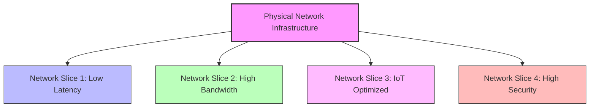
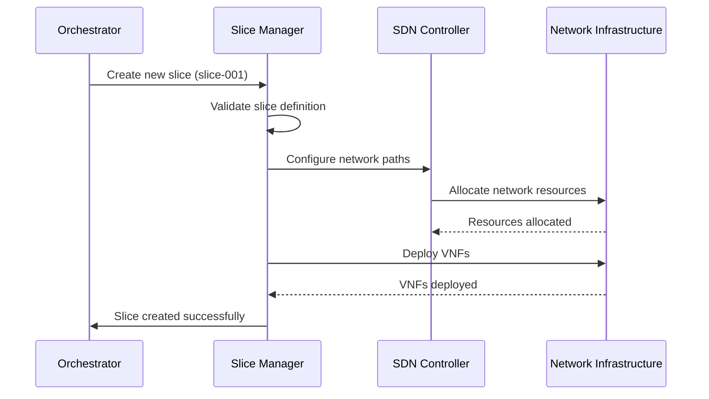
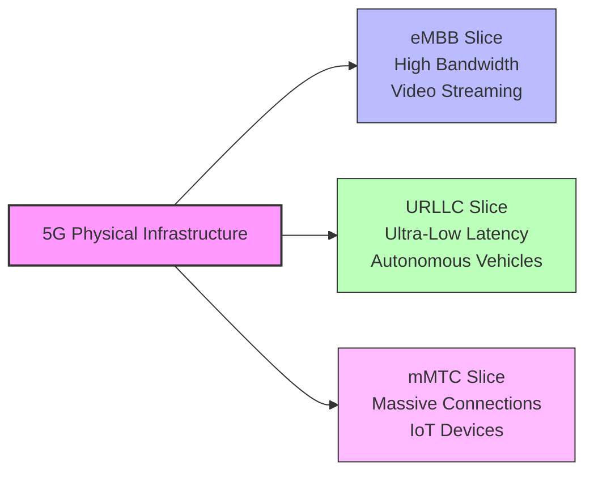
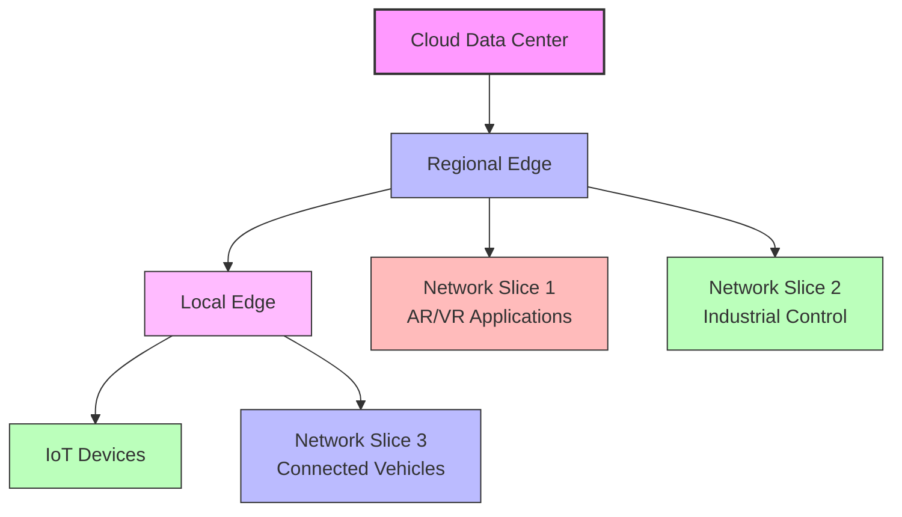

# Network Slicing

## Introduction

Network slicing is a revolutionary concept in modern networking that allows a single physical network infrastructure to be divided into multiple virtual networks, each tailored to serve specific use cases or applications. This technology has become a cornerstone of Software Defined Networking (SDN) and is particularly crucial in 5G and next-generation network architectures.

At its core, network slicing enables network operators to create customized virtual networks (or "slices") with distinct characteristics such as bandwidth, latency, security, and reliability, all running on the same physical hardware. Think of it like dividing a large highway into separate lanes for different types of vehicles—each with its own rules, speed limits, and access controls.

## Understanding Network Slicing

### What is Network Slicing?

Network slicing is the process of creating multiple virtual networks on top of a common physical infrastructure. Each network "slice" functions as an independent, isolated network with its own resources, topology, and security policies. These slices can be dynamically created, modified, and terminated based on specific requirements.

Let's visualize this concept:



### Key Components of Network Slicing

1. **Slice Manager**: Orchestrates the creation, modification, and deletion of network slices.
2. **Virtual Network Functions (VNFs)**: Software implementations of network functions that traditionally ran on proprietary hardware.
3. **SDN Controller**: Provides centralized control over the network and enables programmatic configuration.
4. **Network Function Virtualization (NFV)**: The technology that enables network functions to run as software on standard hardware.
5. **Orchestration and Management**: Systems that automate the deployment and management of network slices.

## How Network Slicing Works

Network slicing operates across different layers of the network architecture. Here's a step-by-step explanation of how it works:

### 1. Slice Definition

First, network operators define the characteristics of each slice based on service requirements:

```javascript
// Example slice definition in JSON format
const lowLatencySlice = {
  sliceId: "slice-001",
  name: "Gaming Slice",
  type: "eMBB", // enhanced Mobile Broadband
  qos: {
    maxLatency: "5ms",
    minBandwidth: "100Mbps",
    reliability: "99.999%"
  },
  security: {
    encryption: "AES-256",
    isolation: "strict"
  },
  resources: {
    computeNodes: 5,
    storageGB: 100
  }
};
```

### 2. Resource Allocation

Once defined, the slice manager allocates appropriate resources to each slice:

```python
# Pseudocode for resource allocation
def allocate_resources(slice_definition):
    # Calculate required CPU, memory, and network resources
    cpu_resources = calculate_cpu_needs(slice_definition)
    memory_resources = calculate_memory_needs(slice_definition)
    network_resources = calculate_network_needs(slice_definition)
    
    # Identify available physical nodes
    available_nodes = get_available_physical_nodes()
    
    # Allocate resources across nodes
    allocation_map = {}
    for resource_type, amount in [("cpu", cpu_resources), 
                                  ("memory", memory_resources), 
                                  ("network", network_resources)]:
        allocation_map[resource_type] = allocate(resource_type, amount, available_nodes)
    
    return allocation_map

# Example output:
# {
#   "cpu": {"node1": 4, "node2": 2},
#   "memory": {"node1": 8, "node3": 4},
#   "network": {"switch1": {"ports": [1, 2], "bandwidth": "10Gbps"}}
# }
```

### 3. Slice Instantiation

The network orchestrator then creates the virtual network elements required for each slice:



### 4. Runtime Management

During operation, each slice is monitored and managed independently:

```python
# Pseudocode for slice monitoring
def monitor_slice(slice_id):
    slice = get_slice_by_id(slice_id)
    metrics = {}
    
    # Collect performance metrics
    metrics["latency"] = measure_latency(slice)
    metrics["bandwidth"] = measure_bandwidth(slice)
    metrics["packet_loss"] = measure_packet_loss(slice)
    
    # Check against SLA requirements
    sla_violations = []
    for metric, value in metrics.items():
        if value > slice.qos[metric]:
            sla_violations.append({
                "metric": metric,
                "current": value,
                "required": slice.qos[metric]
            })
    
    # Take corrective actions if needed
    if sla_violations:
        take_corrective_actions(slice, sla_violations)
    
    return metrics
```

## Network Slicing Technologies and Implementations

Several technologies enable network slicing implementation:

### SDN-Based Slicing

Software-Defined Networking provides the foundation for network slicing by separating the control plane from the data plane:

```python
# Example using a Python SDN controller like Ryu
from ryu.base import app_manager
from ryu.controller import ofp_event
from ryu.controller.handler import CONFIG_DISPATCHER, MAIN_DISPATCHER
from ryu.controller.handler import set_ev_cls
from ryu.ofproto import ofproto_v1_3

class SliceManager(app_manager.RyuApp):
    OFP_VERSIONS = [ofproto_v1_3.OFP_VERSION]

    def __init__(self, *args, **kwargs):
        super(SliceManager, self).__init__(*args, **kwargs)
        self.slices = {}
        
    def create_slice(self, slice_id, ingress_ports, egress_ports, bandwidth):
        """Create a new network slice with specified parameters"""
        self.slices[slice_id] = {
            'ingress_ports': ingress_ports,
            'egress_ports': egress_ports,
            'bandwidth': bandwidth,
            'flows': []
        }
        
        # Configure switches for this slice
        self._configure_slice_paths(slice_id)
        
    def _configure_slice_paths(self, slice_id):
        """Configure network paths for the slice"""
        slice_info = self.slices[slice_id]
        
        # Example: configure flow entries in switches
        # (In a real implementation, this would involve more complex path computation)
        for dp in self.get_all_datapaths():
            ofproto = dp.ofproto
            parser = dp.ofproto_parser
            
            # Create flow entries for ingress ports
            for port in slice_info['ingress_ports']:
                match = parser.OFPMatch(in_port=port)
                actions = [parser.OFPActionOutput(ofproto.OFPP_CONTROLLER)]
                self._add_flow(dp, 1, match, actions)
```

### Network Function Virtualization

NFV enables the implementation of network functions in software:

```bash
# Example: Deploying a virtualized firewall for a specific slice using OpenStack
openstack server create \
  --image nfv-firewall-image \
  --flavor m1.medium \
  --network slice001-mgmt \
  --network slice001-data-in \
  --network slice001-data-out \
  --availability-zone nova:host01 \
  slice001-firewall
```

### Container-Based Network Slicing

Using containers to implement lightweight, isolated network functions:

```yaml
# Example Kubernetes manifest for deploying network functions in a slice
apiVersion: apps/v1
kind: Deployment
metadata:
  name: slice001-router
  namespace: network-slices
spec:
  replicas: 2
  selector:
    matchLabels:
      app: virtual-router
      slice: slice001
  template:
    metadata:
      labels:
        app: virtual-router
        slice: slice001
    spec:
      containers:
      - name: vrouter
        image: network-registry/vrouter:latest
        resources:
          limits:
            cpu: "2"
            memory: "4Gi"
        env:
        - name: SLICE_ID
          value: "slice001"
        - name: ROUTER_ROLE
          value: "edge"
        ports:
        - containerPort: 179  # BGP
        - containerPort: 80   # Management
```

## Real-World Applications of Network Slicing

Network slicing enables a wide range of applications across different industries:

### 5G Networks

In 5G, network slicing is a core feature that enables operators to support diverse use cases:



- **Enhanced Mobile Broadband (eMBB)**: Slices optimized for high bandwidth applications like video streaming.
- **Ultra-Reliable Low-Latency Communication (URLLC)**: Slices designed for applications requiring minimal latency like autonomous vehicles.
- **Massive Machine Type Communications (mMTC)**: Slices supporting thousands of IoT devices with low power requirements.

### Smart City Infrastructure

A smart city might implement network slicing to support various services:

```python
# Example network slice configurations for smart city
smart_city_slices = [
    {
        "name": "emergency_services",
        "priority": "highest",
        "latency": "ultra-low",
        "reliability": "99.9999%",
        "services": ["ambulance", "police", "fire_department"]
    },
    {
        "name": "traffic_management",
        "priority": "high",
        "latency": "low",
        "reliability": "99.99%",
        "services": ["traffic_lights", "congestion_monitoring", "parking"]
    },
    {
        "name": "utility_monitoring",
        "priority": "medium",
        "latency": "medium",
        "reliability": "99.9%",
        "services": ["smart_meters", "waste_management", "street_lighting"]
    }
]
```

### Industrial IoT

Manufacturing facilities use network slicing to separate critical production systems from non-critical operations:

```javascript
// Configuration for factory network slices
const factoryNetworkSlices = {
  productionLine: {
    description: "Critical manufacturing systems",
    latency: "5ms",
    reliability: "99.9999%",
    bandwidth: "10Mbps per device",
    security: "Highest",
    devices: [
      "assembly_robots",
      "cnc_machines",
      "quality_control_systems"
    ]
  },
  monitoring: {
    description: "Non-critical monitoring systems",
    latency: "50ms",
    reliability: "99.9%",
    bandwidth: "1Mbps per device",
    security: "High",
    devices: [
      "temperature_sensors",
      "humidity_sensors",
      "power_meters"
    ]
  },
  enterprise: {
    description: "Office and administration",
    latency: "Best effort",
    reliability: "99.5%",
    bandwidth: "100Mbps shared",
    security: "Standard",
    devices: [
      "office_computers",
      "phones",
      "printers"
    ]
  }
};
```

## Implementing a Basic Network Slice with Open Source Tools

Let's walk through a simple example of creating a network slice using open-source software:

### Setting Up a Test Environment with Mininet

[Mininet](http://mininet.org/) is a network emulator that can be used to simulate SDN networks:

```python
# network_slice_demo.py
from mininet.net import Mininet
from mininet.node import Controller, OVSSwitch
from mininet.cli import CLI
from mininet.log import setLogLevel

def create_network_slices():
    "Create a network with two slices"
    net = Mininet(controller=Controller, switch=OVSSwitch)
    
    # Add controller
    c0 = net.addController('c0')
    
    # Add switches
    s1 = net.addSwitch('s1')
    s2 = net.addSwitch('s2')
    s3 = net.addSwitch('s3')
    
    # Add hosts - Slice 1: h1, h2
    h1 = net.addHost('h1', ip='10.0.1.1/24')
    h2 = net.addHost('h2', ip='10.0.1.2/24')
    
    # Add hosts - Slice 2: h3, h4
    h3 = net.addHost('h3', ip='10.0.2.1/24')
    h4 = net.addHost('h4', ip='10.0.2.2/24')
    
    # Create links
    net.addLink(h1, s1)
    net.addLink(h2, s2)
    net.addLink(h3, s1)
    net.addLink(h4, s3)
    net.addLink(s1, s2)
    net.addLink(s2, s3)
    
    # Start network
    net.build()
    c0.start()
    s1.start([c0])
    s2.start([c0])
    s3.start([c0])
    
    # Configure OpenFlow rules for slice isolation
    # Slice 1: Only h1 and h2 can communicate
    s1.cmd('ovs-ofctl add-flow s1 priority=100,in_port=1,actions=output:4')
    s2.cmd('ovs-ofctl add-flow s2 priority=100,in_port=1,actions=output:2')
    s2.cmd('ovs-ofctl add-flow s2 priority=100,in_port=2,actions=output:1')
    
    # Slice 2: Only h3 and h4 can communicate
    s1.cmd('ovs-ofctl add-flow s1 priority=100,in_port=2,actions=output:3')
    s3.cmd('ovs-ofctl add-flow s3 priority=100,in_port=2,actions=output:1')
    
    # Enter CLI
    CLI(net)
    
    # Cleanup
    net.stop()

if __name__ == '__main__':
    setLogLevel('info')
    create_network_slices()
```

### Testing the Network Slices

After running the above script, you can test the isolation between slices:

```bash
# In Mininet CLI:

# Test connectivity within Slice 1
h1 ping h2  # Should work
h1 ping h3  # Should fail (different slices)

# Test connectivity within Slice 2
h3 ping h4  # Should work
h3 ping h2  # Should fail (different slices)
```

Expected output:

```
mininet> h1 ping h2
PING 10.0.1.2 (10.0.1.2) 56(84) bytes of data.
64 bytes from 10.0.1.2: icmp_seq=1 ttl=64 time=0.123 ms
64 bytes from 10.0.1.2: icmp_seq=2 ttl=64 time=0.045 ms
^C
--- 10.0.1.2 ping statistics ---
2 packets transmitted, 2 received, 0% packet loss, time 1001ms

mininet> h1 ping h3
PING 10.0.2.1 (10.0.2.1) 56(84) bytes of data.
^C
--- 10.0.2.1 ping statistics ---
5 packets transmitted, 0 received, 100% packet loss, time 4075ms
```

## Challenges and Considerations

While network slicing offers tremendous benefits, there are several challenges to consider:

### Resource Allocation

Efficiently allocating resources across different slices is complex:

```python
# Pseudocode for a basic resource allocation algorithm
def allocate_slice_resources(slices, available_resources):
    # Sort slices by priority
    sorted_slices = sorted(slices, key=lambda s: s['priority'], reverse=True)
    
    allocation = {}
    remaining_resources = available_resources.copy()
    
    for slice in sorted_slices:
        slice_id = slice['id']
        required_resources = slice['required_resources']
        
        # Check if we have enough resources
        can_allocate = all(
            remaining_resources[resource] >= amount 
            for resource, amount in required_resources.items()
        )
        
        if can_allocate:
            allocation[slice_id] = required_resources
            
            # Update remaining resources
            for resource, amount in required_resources.items():
                remaining_resources[resource] -= amount
        else:
            # Handle insufficient resources
            # (could implement fallback strategies here)
            allocation[slice_id] = "INSUFFICIENT_RESOURCES"
    
    return allocation, remaining_resources
```

### Security and Isolation

Ensuring complete isolation between slices is critical:

```python
# Example security policies for network slices
security_policies = {
    "slice001": {
        "isolation_level": "strict",
        "encryption": "AES-256",
        "authentication": "certificate-based",
        "firewall_rules": [
            {"protocol": "tcp", "port": 22, "action": "deny"},
            {"protocol": "tcp", "port": 80, "action": "allow"},
            {"protocol": "tcp", "port": 443, "action": "allow"}
        ]
    },
    "slice002": {
        "isolation_level": "medium",
        "encryption": "AES-128",
        "authentication": "password-based",
        "firewall_rules": [
            {"protocol": "all", "action": "allow"}
        ]
    }
}
```

### Dynamic Slice Management

Slices may need to be adjusted in real-time based on changing requirements:

```javascript
// Event-driven slice adjustment
function adjustSliceResources(sliceId, performanceMetrics) {
  const currentSlice = getSliceConfiguration(sliceId);
  const thresholds = currentSlice.performanceThresholds;
  
  // Check if any metric exceeds thresholds
  const adjustments = {};
  
  if (performanceMetrics.latency > thresholds.latency * 0.9) {
    // Latency approaching threshold, allocate more resources
    adjustments.priorityLevel = currentSlice.priorityLevel + 1;
  }
  
  if (performanceMetrics.bandwidth > thresholds.bandwidth * 0.8) {
    // Bandwidth usage high, increase allocation
    adjustments.allocatedBandwidth = currentSlice.allocatedBandwidth * 1.2;
  }
  
  if (Object.keys(adjustments).length > 0) {
    // Apply adjustments
    updateSliceConfiguration(sliceId, adjustments);
    logSliceAdjustment(sliceId, adjustments, performanceMetrics);
    return true;
  }
  
  return false;
}
```

## Future of Network Slicing

Network slicing continues to evolve with several emerging trends:

### AI-Driven Slice Management

Machine learning algorithms are being used to optimize slice creation and management:

```python
# Pseudocode for ML-based slice optimization
from sklearn.ensemble import RandomForestRegressor
import numpy as np

class SliceOptimizer:
    def __init__(self):
        self.model = RandomForestRegressor()
        self.trained = False
        
    def train(self, historical_data):
        """Train the model using historical slice performance data"""
        # Extract features and targets
        X = []  # Features: slice configs, network conditions
        y = []  # Targets: performance metrics
        
        for record in historical_data:
            features = [
                record['slice']['cpu_allocation'],
                record['slice']['memory_allocation'],
                record['slice']['bandwidth_allocation'],
                record['network_load'],
                record['time_of_day'],
                # more features...
            ]
            
            target = [
                record['performance']['latency'],
                record['performance']['throughput'],
                record['performance']['packet_loss']
            ]
            
            X.append(features)
            y.append(target)
        
        # Train model
        self.model.fit(np.array(X), np.array(y))
        self.trained = True
        
    def optimize_slice(self, slice_config, current_conditions):
        """Optimize slice configuration based on current conditions"""
        if not self.trained:
            raise Exception("Model not trained")
            
        # Generate potential configurations
        potential_configs = self._generate_potential_configs(slice_config)
        
        # Predict performance for each configuration
        best_config = None
        best_score = float('inf')
        
        for config in potential_configs:
            features = [
                config['cpu_allocation'],
                config['memory_allocation'],
                config['bandwidth_allocation'],
                current_conditions['network_load'],
                current_conditions['time_of_day'],
                # more features...
            ]
            
            predicted_performance = self.model.predict([features])[0]
            score = self._calculate_score(predicted_performance, slice_config['requirements'])
            
            if score < best_score:
                best_score = score
                best_config = config
                
        return best_config
```

### Integration with Edge Computing

Network slicing will increasingly be combined with edge computing:



### Intent-Based Network Slicing

Future implementations may use intent-based interfaces for slice management:

```javascript
// Example of intent-based slice definition
const sliceIntent = {
  application: "autonomous_vehicles",
  coverage: {
    type: "urban",
    location: "downtown_area",
    radius_km: 5
  },
  requirements: {
    quality: "mission_critical",
    latency_ms: "<10",
    reliability: ">99.999%",
    connection_density: "1000 per km²"
  },
  security: "highest",
  duration: {
    start: "2023-04-01T08:00:00Z",
    end: "2023-04-01T18:00:00Z"
  }
};

// The system would translate this high-level intent into detailed
// technical specifications and resource allocations
```

## Summary

Network slicing is transforming how we design, deploy, and manage networks by enabling multiple virtualized networks to coexist on shared physical infrastructure. Key takeaways include:

1. Network slicing creates isolated virtual networks tailored to specific use cases
2. It relies on SDN, NFV, and virtualization technologies
3. Each slice can have distinct characteristics (bandwidth, latency, security)
4. It enables diverse applications in 5G, IoT, industrial automation, and smart cities
5. Challenges include resource allocation, isolation, and dynamic management
6. Future developments include AI-driven optimization and intent-based interfaces

## Exercises

1. **Basic Exercise**: Using Mininet, create a simple network with two slices and verify their isolation.
2. **Intermediate Exercise**: Implement a basic slice manager that can create slices with different QoS parameters.
3. **Advanced Exercise**: Design a dynamic slice management system that monitors performance and adjusts resources in real-time.

## Additional Resources

- **Books**:
  - "Software-Defined Networks: A Comprehensive Approach" by Paul Goransson and Chuck Black
  - "5G Mobile and Wireless Communications Technology" edited by Afif Osseiran et al.

- **Online Courses**:
  - SDN Specialization on Coursera
  - 5G Networks Specialization on edX

- **Open Source Projects**:
  - ONOS (Open Network Operating System)
  - Open Source MANO (OSM)
  - OpenDaylight

- **Research Papers**:
  - "Network Slicing in 5G: Survey and Challenges" - IEEE Communications Magazine
  - "An End-to-End Network Slicing Framework for 5G Wireless Communication Systems" - IEEE Access