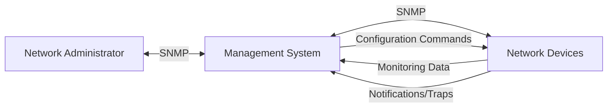
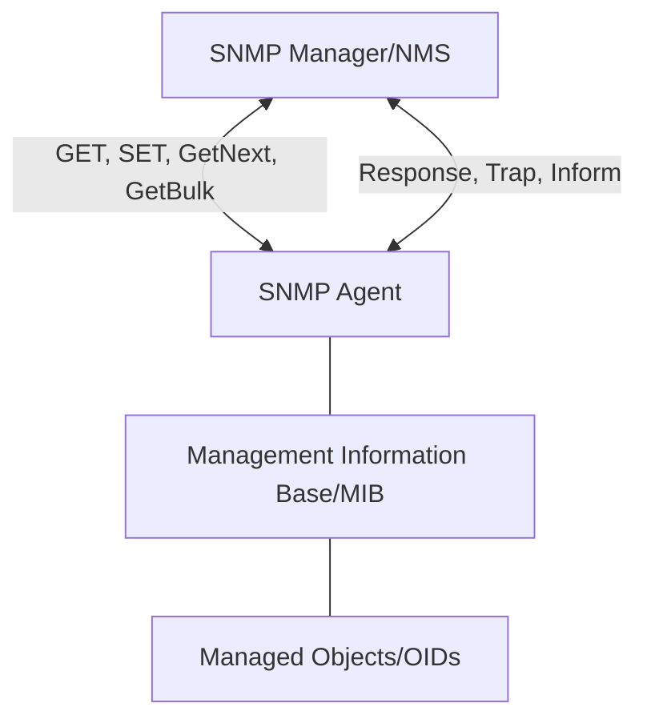
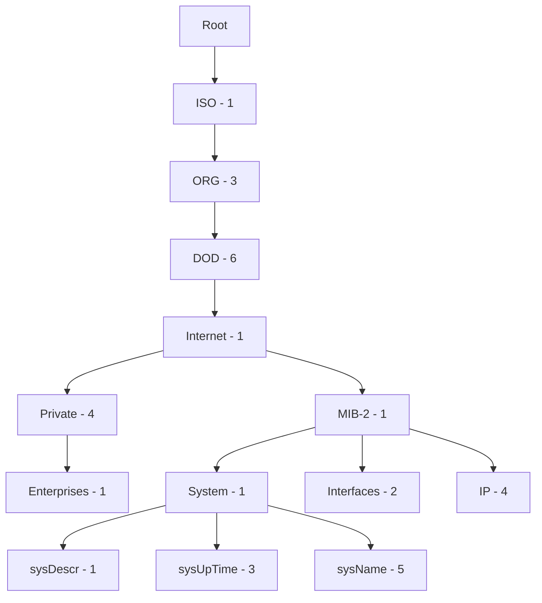

# Understanding the SNMP Protocol

## Introduction

The Simple Network Management Protocol (SNMP) is a cornerstone technology in network administration that allows monitoring and managing network devices across diverse environments. Despite its name containing "Simple," SNMP provides powerful capabilities for collecting information from network devices, configuring them remotely, and receiving notifications about critical events.

In this guide, we'll explore how SNMP works, its architecture, and how you can use it to build effective network management solutions. Whether you're managing a small office network or a large enterprise infrastructure, understanding SNMP is essential for efficient network operations.

## What is SNMP?

SNMP stands for **Simple Network Management Protocol**. It's an application layer protocol defined by the Internet Engineering Task Force (IETF) that facilitates the exchange of management information between network devices. First introduced in 1988, SNMP has evolved through several versions (v1, v2c, and v3) to address security concerns and functional limitations.

At its core, SNMP enables three key capabilities:
- **Monitoring**: Collecting data from network devices
- **Configuration**: Setting parameters on network devices
- **Notification**: Receiving alerts when specific events occur



## SNMP Architecture

SNMP follows a manager-agent architecture consisting of these primary components:

1. **SNMP Manager** (Network Management System - NMS): The software running on the administrator's side that requests information, receives traps, and controls network devices.

2. **SNMP Agent**: Software module residing on managed network devices (routers, switches, servers, printers, etc.) that collects local management information and responds to SNMP manager requests.

3. **Management Information Base (MIB)**: A hierarchical database containing information about the manageable objects on a device. Each object has a unique identifier called an Object Identifier (OID).

4. **SNMP Protocol**: The communication protocol that defines message formats and procedures for exchanging management data.

Let's visualize this architecture:



## SNMP Versions

SNMP has evolved over time with three main versions in use:

1. **SNMPv1** (1988): The original version with basic functionality but limited security (using community strings).

2. **SNMPv2c** (1993): Enhanced performance with new operations like GetBulk, but still using the same simple community-based security model.

3. **SNMPv3** (1998): Significantly improved security with authentication, encryption, and message integrity checking.

For beginners, understanding the differences is important for security considerations:

| Feature | SNMPv1 | SNMPv2c | SNMPv3 |
|---------|--------|---------|--------|
| Authentication | Community strings | Community strings | User-based authentication |
| Encryption | No | No | Yes (DES, AES) |
| Message integrity | No | No | Yes |
| Performance | Basic | Improved | Best |
| Security | Very low | Very low | High |

## SNMP Operations and Message Types

SNMP uses several message types for communication between managers and agents:

### Basic Operations

1. **GET**: Retrieves the value of a specific MIB object
2. **GETNEXT**: Retrieves the next object in the MIB hierarchy
3. **GETBULK** (v2c, v3): Efficiently retrieves large blocks of data
4. **SET**: Modifies the value of a specific MIB object
5. **RESPONSE**: Returns requested data or confirmation of an action
6. **TRAP**: Unsolicited message sent by an agent to notify the manager of a significant event
7. **INFORM** (v2c, v3): Similar to a trap but requires acknowledgment

Let's see a basic example of these operations in a Python script using the PySNMP library:

```python
from pysnmp.hlapi import *

# GET request example
def get_snmp_data(host, community, oid):
    error_indication, error_status, error_index, var_binds = next(
        getCmd(SnmpEngine(),
               CommunityData(community),
               UdpTransportTarget((host, 161)),
               ContextData(),
               ObjectType(ObjectIdentity(oid)))
    )
    
    if error_indication:
        print(f"Error: {error_indication}")
    elif error_status:
        print(f"Error: {error_status.prettyPrint()} at {var_binds[int(error_index) - 1][0] if error_index else '?'}")
    else:
        for var_bind in var_binds:
            print(f"{var_bind[0]} = {var_bind[1]}")

# Example usage
host = "192.168.1.1"  # Router IP address
community = "public"  # SNMP community string
oid = "1.3.6.1.2.1.1.1.0"  # System description OID

print("Retrieving system description...")
get_snmp_data(host, community, oid)
```

Output might look like:
```
Retrieving system description...
1.3.6.1.2.1.1.1.0 = Cisco IOS Software, C2900 Software (C2900-UNIVERSALK9-M), Version 15.1(4)M4
```

## Understanding MIBs and OIDs

The Management Information Base (MIB) is a hierarchical structure that organizes managed objects. Each object is identified by an Object Identifier (OID), which is a sequence of numbers separated by dots.

### MIB Structure

The MIB tree starts with the root (.) and branches out into various categories:



For example, the OID for sysDescr (system description) is 1.3.6.1.2.1.1.1, which represents the path through the MIB tree.

### Common OIDs for Beginners

Here are some commonly used OIDs that are useful for network monitoring:

| OID | Description | Example Value |
|-----|-------------|---------------|
| 1.3.6.1.2.1.1.1.0 | System description | "Cisco IOS Software, Version 15.1" |
| 1.3.6.1.2.1.1.3.0 | System uptime | "6452311" (timeticks, about 74 days) |
| 1.3.6.1.2.1.1.5.0 | System name | "core-router-1" |
| 1.3.6.1.2.1.2.2.1.10 | Interface in octets | Bytes received on interfaces |
| 1.3.6.1.2.1.2.2.1.16 | Interface out octets | Bytes sent on interfaces |
| 1.3.6.1.2.1.4.3.0 | IP datagrams received | Count of incoming IP packets |
| 1.3.6.1.2.1.4.10.0 | IP datagrams forwarded | Count of routed IP packets |

## Practical SNMP Applications

Let's explore some practical applications of SNMP in real-world scenarios:

### 1. Network Monitoring

One of the most common uses of SNMP is monitoring network devices. Here's a Python script that monitors interface traffic on a device:

```python
from pysnmp.hlapi import *
import time

def monitor_interface(host, community, interface_index, interval=5):
    # OIDs for interface counters
    in_octets_oid = f"1.3.6.1.2.1.2.2.1.10.{interface_index}"
    out_octets_oid = f"1.3.6.1.2.1.2.2.1.16.{interface_index}"
    
    # First reading
    prev_in = get_counter_value(host, community, in_octets_oid)
    prev_out = get_counter_value(host, community, out_octets_oid)
    
    print(f"Starting interface monitoring (refresh every {interval} seconds)")
    print("TIMESTAMP             IN (Mbps)    OUT (Mbps)")
    print("---------------------------------------------------")
    
    try:
        while True:
            time.sleep(interval)
            
            # Next reading
            curr_in = get_counter_value(host, community, in_octets_oid)
            curr_out = get_counter_value(host, community, out_octets_oid)
            
            # Calculate bandwidth
            in_mbps = (curr_in - prev_in) * 8 / (interval * 1000000)
            out_mbps = (curr_out - prev_out) * 8 / (interval * 1000000)
            
            # Update previous values
            prev_in = curr_in
            prev_out = curr_out
            
            # Print result
            timestamp = time.strftime("%Y-%m-%d %H:%M:%S", time.localtime())
            print(f"{timestamp}   {in_mbps:.2f}         {out_mbps:.2f}")
            
    except KeyboardInterrupt:
        print("
Monitoring stopped")

def get_counter_value(host, community, oid):
    error_indication, error_status, error_index, var_binds = next(
        getCmd(SnmpEngine(),
               CommunityData(community),
               UdpTransportTarget((host, 161)),
               ContextData(),
               ObjectType(ObjectIdentity(oid)))
    )
    
    if error_indication or error_status:
        return 0
    else:
        return int(var_binds[0][1])

# Example usage
monitor_interface(host="192.168.1.1", community="public", interface_index=2)
```

Example output:
```
Starting interface monitoring (refresh every 5 seconds)
TIMESTAMP             IN (Mbps)    OUT (Mbps)
---------------------------------------------------
2025-03-15 14:22:31   5.67         1.23
2025-03-15 14:22:36   6.12         1.45
2025-03-15 14:22:41   4.88         1.19
```

### 2. Configuring Network Devices

SNMP can also be used to configure devices. Here's an example of changing a device's system contact information:

```python
from pysnmp.hlapi import *

def set_system_contact(host, community, contact_info):
    # OID for sysContact
    sys_contact_oid = "1.3.6.1.2.1.1.4.0"
    
    error_indication, error_status, error_index, var_binds = next(
        setCmd(SnmpEngine(),
               CommunityData(community),
               UdpTransportTarget((host, 161)),
               ContextData(),
               ObjectType(ObjectIdentity(sys_contact_oid), OctetString(contact_info)))
    )
    
    if error_indication:
        print(f"Error: {error_indication}")
        return False
    elif error_status:
        print(f"Error: {error_status.prettyPrint()} at {var_binds[int(error_index) - 1][0] if error_index else '?'}")
        return False
    else:
        print(f"Successfully set system contact to: {contact_info}")
        return True

# Example usage
host = "192.168.1.1"
community = "private"  # Note: Usually "private" is used for write access
contact = "Network Admin <admin@example.com>"

set_system_contact(host, community, contact)
```

Output:
```
Successfully set system contact to: Network Admin <admin@example.com>
```

### 3. Receiving SNMP Traps

To receive SNMP traps from devices, you need to set up a trap receiver. Here's a simple Python trap receiver:

```python
from pysnmp.carrier.asyncore.dgram import udp
from pysnmp.entity import engine, config
from pysnmp.entity.rfc3413 import ntfrcv
from pysnmp.proto.api import v2c

# Create SNMP engine
snmp_engine = engine.SnmpEngine()

# Configure transport
config.addTransport(
    snmp_engine,
    udp.domainName + (1,),
    udp.UdpTransport().openServerMode(('0.0.0.0', 162))
)

# Configure community
config.addV1System(snmp_engine, 'my-area', 'public')

# Define trap handler
def trap_handler(snmp_engine, stateReference, contextEngineId, contextName,
                 varBinds, cbCtx):
    print('Received new trap:')
    for name, val in varBinds:
        print(f'  {name.prettyPrint()} = {val.prettyPrint()}')

# Register trap handler
ntfrcv.NotificationReceiver(snmp_engine, trap_handler)

# Start trap receiver
print('Starting trap receiver on port 162...')
snmp_engine.transportDispatcher.jobStarted(1)
try:
    snmp_engine.transportDispatcher.runDispatcher()
except KeyboardInterrupt:
    snmp_engine.transportDispatcher.jobFinished(1)
    print('Trap receiver stopped')
```

Example output when a trap is received:
```
Starting trap receiver on port 162...
Received new trap:
  1.3.6.1.2.1.1.3.0 = 1234567
  1.3.6.1.6.3.1.1.4.1.0 = 1.3.6.1.4.1.8072.2.3.0.1
  1.3.6.1.4.1.8072.2.3.2.1 = Interface eth0 is down
```

## Setting Up a Basic SNMP Monitoring System

Now that we understand the components, let's put together a minimal SNMP monitoring system using Python. This example demonstrates how to collect data from multiple devices and store it for analysis:

```python
import time
from pysnmp.hlapi import *
import csv
from datetime import datetime

# List of devices to monitor
devices = [
    {"ip": "192.168.1.1", "community": "public", "name": "Core Router"},
    {"ip": "192.168.1.2", "community": "public", "name": "Main Switch"},
    {"ip": "192.168.1.3", "community": "public", "name": "Edge Firewall"}
]

# OIDs to monitor
oids = {
    "sysUpTime": "1.3.6.1.2.1.1.3.0",
    "cpuLoad": "1.3.6.1.4.1.9.2.1.58.0",  # Cisco specific
    "memoryFree": "1.3.6.1.4.1.9.9.48.1.1.1.6.1"  # Cisco specific
}

def get_snmp_value(host, community, oid):
    error_indication, error_status, error_index, var_binds = next(
        getCmd(SnmpEngine(),
               CommunityData(community),
               UdpTransportTarget((host, 161), timeout=2, retries=1),
               ContextData(),
               ObjectType(ObjectIdentity(oid)))
    )
    
    if error_indication or error_status:
        return "ERROR"
    else:
        return str(var_binds[0][1])

def monitor_devices(interval=300, output_file="network_stats.csv"):
    # Initialize CSV file
    with open(output_file, 'w', newline='') as f:
        writer = csv.writer(f)
        header = ["Timestamp", "Device", "IP", "Uptime", "CPU Load", "Memory Free"]
        writer.writerow(header)
    
    try:
        while True:
            for device in devices:
                # Get current data
                timestamp = datetime.now().strftime("%Y-%m-%d %H:%M:%S")
                uptime = get_snmp_value(device["ip"], device["community"], oids["sysUpTime"])
                cpu = get_snmp_value(device["ip"], device["community"], oids["cpuLoad"])
                memory = get_snmp_value(device["ip"], device["community"], oids["memoryFree"])
                
                # Print to console
                print(f"{timestamp} - {device['name']} ({device['ip']}):")
                print(f"  Uptime: {uptime}")
                print(f"  CPU Load: {cpu}")
                print(f"  Memory Free: {memory}")
                print("-" * 50)
                
                # Write to CSV
                with open(output_file, 'a', newline='') as f:
                    writer = csv.writer(f)
                    writer.writerow([timestamp, device["name"], device["ip"], 
                                    uptime, cpu, memory])
            
            # Wait for next interval
            print(f"Waiting {interval} seconds for next check...")
            time.sleep(interval)
            
    except KeyboardInterrupt:
        print("
Monitoring stopped")

# Start monitoring
monitor_devices(interval=60)  # Check every 60 seconds
```

This script:
1. Defines a list of devices to monitor
2. Specifies OIDs for key metrics
3. Periodically polls each device for data
4. Writes results to a CSV file for later analysis

## SNMP Security Best Practices

SNMP can pose security risks if not properly configured. Here are some best practices:

1. **Use SNMPv3 whenever possible**. It provides authentication and encryption, making it much more secure than earlier versions.

2. **Avoid default community strings** like "public" and "private". Use strong, unique strings instead.

3. **Implement access control lists (ACLs)** to restrict which IP addresses can communicate with your SNMP agents.

4. **Disable unused SNMP versions** on network devices.

5. **Monitor SNMP traffic** for unusual patterns that might indicate unauthorized access attempts.

6. **Change community strings regularly** if using SNMPv1 or SNMPv2c.

7. **Configure read-only access** when monitoring is the only requirement.

Example SNMPv3 configuration in Python:

```python
from pysnmp.hlapi import *

# SNMPv3 example - retrieving system information with authentication and privacy
def get_snmp_v3_data(host, user, auth_key, priv_key, oid):
    error_indication, error_status, error_index, var_binds = next(
        getCmd(SnmpEngine(),
               UsmUserData(user, 
                           authKey=auth_key, privKey=priv_key,
                           authProtocol=usmHMACSHAAuthProtocol,
                           privProtocol=usmAesCfb128Protocol),
               UdpTransportTarget((host, 161)),
               ContextData(),
               ObjectType(ObjectIdentity(oid)))
    )
    
    if error_indication:
        print(f"Error: {error_indication}")
    elif error_status:
        print(f"Error: {error_status.prettyPrint()}")
    else:
        for var_bind in var_binds:
            print(f"{var_bind[0]} = {var_bind[1]}")

# Example usage
host = "192.168.1.1"
user = "secureUser"
auth_key = "authPassword123"  # Authentication password
priv_key = "privPassword456"  # Encryption password
oid = "1.3.6.1.2.1.1.1.0"     # System description

get_snmp_v3_data(host, user, auth_key, priv_key, oid)
```

## Troubleshooting SNMP

When working with SNMP, you might encounter various issues. Here are some common problems and their solutions:

### 1. No Response from Agent

If you're not getting responses from an SNMP agent:

- Verify the device's IP address is correct and reachable (ping test)
- Check if the SNMP service is running on the device
- Verify that the community string is correct
- Check firewalls that might be blocking SNMP traffic (UDP port 161/162)
- Verify ACLs to ensure your management station is allowed

### 2. Incorrect or Missing Data

If you're receiving responses but the data seems incorrect:

- Confirm you're using the correct OIDs for the specific device
- Check if the MIB is supported by the device
- Verify the agent's configuration

### 3. Permission Errors

If you receive "noAccess" or similar errors:

- Verify your community string has appropriate permissions
- Check if you're trying to write (SET) with a read-only community
- Verify SNMP version compatibility

### 4. Debugging SNMP Communication

A helpful tool for debugging SNMP is `snmpwalk`, which can be used to retrieve all SNMP information from a device:

```bash
# Basic snmpwalk (SNMPv2c)
snmpwalk -v 2c -c public 192.168.1.1

# Specific OID with SNMPv3
snmpwalk -v 3 -u secureUser -l authPriv -a SHA -A authPassword123 -x AES -X privPassword456 192.168.1.1 1.3.6.1.2.1.1
```

## Summary

The Simple Network Management Protocol (SNMP) is a powerful tool for network administrators. In this guide, we've covered:

- The basic concepts and architecture of SNMP
- Different SNMP versions and their security implications
- SNMP operations and message types
- The structure of MIBs and OIDs
- Practical applications for monitoring and configuring network devices
- Setting up a basic monitoring system
- Security best practices and troubleshooting tips

With SNMP, network administrators can efficiently monitor and manage devices across their network, ensuring optimal performance and quick response to issues.

## Additional Resources

To further your understanding of SNMP:

1. **Books**:
   - "Essential SNMP" by Douglas Mauro and Kevin Schmidt
   - "SNMP: Simple Network Management Protocol" by Marshall T. Rose

2. **Online Resources**:
   - [IETF RFC 3411-3418](https://tools.ietf.org/html/rfc3411): SNMPv3 specification
   - [Net-SNMP Project](http://www.net-snmp.org/): Open-source SNMP tools

3. **Practice Exercises**:
   - Set up an SNMP monitoring system for your home network
   - Create custom MIBs for your specific monitoring needs
   - Configure SNMP traps for critical events on your network devices
   - Develop a dashboard to visualize SNMP data

4. **Python Libraries**:
   - PySNMP: [GitHub Repository](https://github.com/etingof/pysnmp)
   - EasySNMP: A simpler SNMP library for Python

By mastering SNMP, you'll have an essential skill in your network management toolkit that will serve you throughout your career in IT infrastructure and operations.