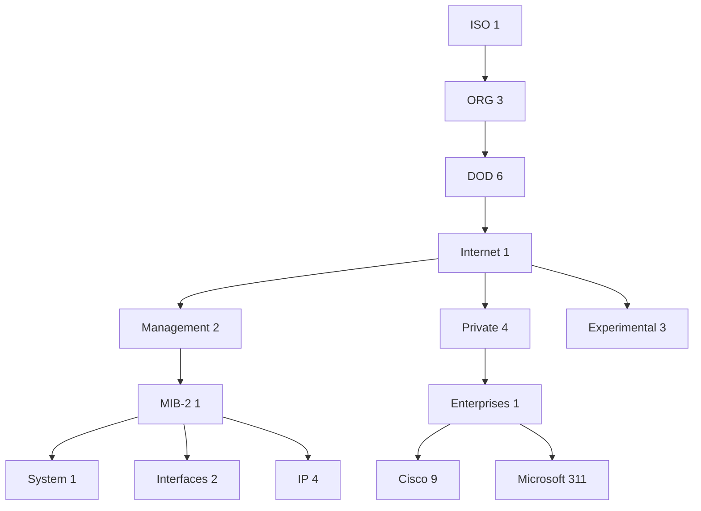
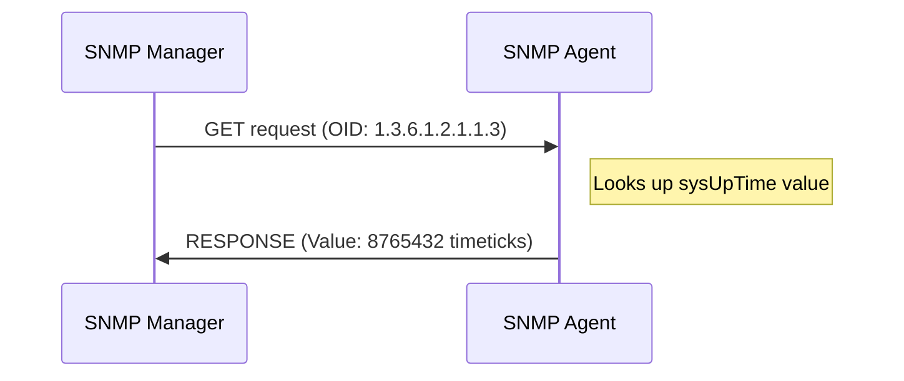

# Understanding Network MIBs

## Introduction

When managing computer networks, administrators need a standardized way to monitor and control network devices. This is where Management Information Bases (MIBs) come into play. MIBs are fundamental components of the Simple Network Management Protocol (SNMP) framework that powers modern network management systems.

In this guide, we'll explore what MIBs are, how they work, and why they're crucial for effective network management. Whether you're maintaining a small office network or learning about enterprise infrastructure, understanding MIBs will help you gain deeper insight into network operations.

## What is a MIB?

A Management Information Base (MIB) is a hierarchical database that contains information about managed objects in a network device. Think of it as a structured catalog that defines what data can be collected from a network device and how it's organized.

### Key Characteristics of MIBs:

- **Hierarchical Structure**: MIBs organize data in a tree-like structure.
- **Standardized Format**: They follow specific formatting rules defined by Structure of Management Information (SMI).
- **Device-Specific**: Different network devices support different MIBs.
- **Object Identifiers (OIDs)**: Each piece of information in a MIB has a unique address called an OID.

## MIB Structure and Object Identifiers (OIDs)

MIBs organize information hierarchically using Object Identifiers (OIDs). An OID is a sequence of numbers separated by dots (e.g., `1.3.6.1.2.1.1.3`), forming a path through the MIB tree.



For example, the OID `1.3.6.1.2.1.1.3` refers to:
- `1`: ISO
- `1.3`: ISO.ORG
- `1.3.6`: ISO.ORG.DOD
- `1.3.6.1`: ISO.ORG.DOD.Internet
- `1.3.6.1.2`: ISO.ORG.DOD.Internet.Management
- `1.3.6.1.2.1`: ISO.ORG.DOD.Internet.Management.MIB-2
- `1.3.6.1.2.1.1`: ISO.ORG.DOD.Internet.Management.MIB-2.System
- `1.3.6.1.2.1.1.3`: ISO.ORG.DOD.Internet.Management.MIB-2.System.sysUpTime (system uptime)

## MIB Files and SMI

MIBs are defined in text files using a language called Structure of Management Information (SMI), which is derived from ASN.1 (Abstract Syntax Notation One). These files describe the structure and data types of managed objects.

Here's a simplified example of a MIB definition:

```
EXAMPLE-MIB DEFINITIONS ::= BEGIN

IMPORTS
    MODULE-IDENTITY, OBJECT-TYPE, Integer32, enterprises
        FROM SNMPv2-SMI;

exampleMIB MODULE-IDENTITY
    LAST-UPDATED "202503150000Z"
    ORGANIZATION "Example Organization"
    CONTACT-INFO "support@example.org"
    DESCRIPTION  "Example MIB for demonstration purposes"
    ::= { enterprises 9999 }

-- System group
systemGroup OBJECT IDENTIFIER ::= { exampleMIB 1 }

-- CPU usage
cpuUsage OBJECT-TYPE
    SYNTAX      Integer32 (0..100)
    MAX-ACCESS  read-only
    STATUS      current
    DESCRIPTION "CPU usage percentage"
    ::= { systemGroup 1 }

END
```

## Types of MIBs

There are several categories of MIBs that network administrators should be familiar with:

### 1. Standard MIBs

These are defined by the Internet Engineering Task Force (IETF) and are supported by most network devices:

- **MIB-II** (RFC 1213): The core MIB that defines essential managed objects for TCP/IP networks.
- **RMON MIB** (RFC 2819): Remote Network Monitoring objects for analyzing network traffic.
- **Host Resources MIB** (RFC 2790): Information about host systems like servers.

### 2. Enterprise MIBs

These are vendor-specific MIBs created by equipment manufacturers to expose unique features of their products:

- Cisco MIBs
- Juniper MIBs
- HP MIBs
- And many others

### 3. Private MIBs

These are custom MIBs created by organizations for their specific monitoring needs.

## How MIBs Work with SNMP

To understand MIBs fully, we need to see how they fit into the SNMP ecosystem:

1. **SNMP Agent**: Software running on network devices that collects and stores management data as defined by MIBs.

2. **SNMP Manager**: Software running on a management station that retrieves data from SNMP agents.

3. **MIB**: Defines what data the agent makes available and how it's structured.

When an SNMP manager wants to retrieve information from a device, it sends an SNMP GET request specifying an OID. The agent responds with the value associated with that OID.



## Working with MIBs in Practice

Let's explore some practical examples of using MIBs with SNMP tools.

### Example 1: Retrieving System Uptime

Using the `snmpget` command to retrieve system uptime:

```bash
snmpget -v2c -c public 192.168.1.1 1.3.6.1.2.1.1.3.0
```

Output:
```
DISMAN-EVENT-MIB::sysUpTimeInstance = Timeticks: (8765432) 24 hours, 20 minutes, 54.32 seconds
```

### Example 2: Walking through the Interface Table

Using the `snmpwalk` command to retrieve all interface information:

```bash
snmpwalk -v2c -c public 192.168.1.1 1.3.6.1.2.1.2.2
```

Output excerpt:
```
IF-MIB::ifIndex.1 = INTEGER: 1
IF-MIB::ifDescr.1 = STRING: GigabitEthernet0/1
IF-MIB::ifType.1 = INTEGER: ethernetCsmacd(6)
IF-MIB::ifMtu.1 = INTEGER: 1500
IF-MIB::ifSpeed.1 = Gauge32: 1000000000
IF-MIB::ifPhysAddress.1 = STRING: 00:11:22:33:44:55
IF-MIB::ifAdminStatus.1 = INTEGER: up(1)
IF-MIB::ifOperStatus.1 = INTEGER: up(1)
```

### Example 3: Programmatic MIB Access with Python

Here's a simple Python script using the `pysnmp` library to retrieve system information:

```python
from pysnmp.hlapi import *

def get_system_info(ip_address, community):
    # Define the OIDs we want to retrieve
    system_name_oid = '1.3.6.1.2.1.1.5.0'  # sysName
    system_descr_oid = '1.3.6.1.2.1.1.1.0'  # sysDescr
    system_uptime_oid = '1.3.6.1.2.1.1.3.0'  # sysUpTime
    
    # Dictionary to store results
    results = {}
    
    # Create SNMP GET requests for each OID
    for oid, label in [(system_name_oid, 'System Name'), 
                      (system_descr_oid, 'System Description'),
                      (system_uptime_oid, 'System Uptime')]:
        
        error_indication, error_status, error_index, var_binds = next(
            getCmd(SnmpEngine(),
                   CommunityData(community),
                   UdpTransportTarget((ip_address, 161)),
                   ContextData(),
                   ObjectType(ObjectIdentity(oid)))
        )
        
        # Check for errors
        if error_indication:
            results[label] = f"Error: {error_indication}"
        elif error_status:
            results[label] = f"Error: {error_status.prettyPrint()}"
        else:
            # Extract and store the value
            for var_bind in var_binds:
                results[label] = var_bind[1].prettyPrint()
    
    return results

# Example usage
if __name__ == "__main__":
    router_info = get_system_info('192.168.1.1', 'public')
    
    # Print results
    for key, value in router_info.items():
        print(f"{key}: {value}")
```

Output:
```
System Name: core-router-1
System Description: Cisco IOS Software, 3800 Software, Version 15.1(4)M10
System Uptime: 8765432
```

## Building a Simple MIB Browser

For more advanced usage, you might want to build a simple MIB browser that loads MIB definitions and lets you browse through the hierarchy. Below is a simplified example using Python with the PySNMP library:

```python
from pysnmp.smi import builder, view, compiler, rfc1902
import os

def create_mib_browser(mib_dirs=None):
    """
    Create a MIB browser that can translate between OIDs and names.
    
    Args:
        mib_dirs: List of directories containing MIB files
        
    Returns:
        MIB view controller object
    """
    # Create MIB builder
    mib_builder = builder.MibBuilder()
    
    # Add MIB sources if provided
    if mib_dirs:
        for directory in mib_dirs:
            if os.path.exists(directory):
                compiler.addMibCompiler(mib_builder, sources=[directory])
    
    # Load common MIBs
    for mib in ['SNMPv2-MIB', 'IF-MIB', 'IP-MIB', 'TCP-MIB', 'UDP-MIB']:
        try:
            mib_builder.loadModules(mib)
        except Exception as e:
            print(f"Error loading {mib}: {e}")
    
    # Create MIB view controller
    mib_view = view.MibViewController(mib_builder)
    
    return mib_view

def oid_to_name(mib_view, oid):
    """
    Convert numeric OID to human-readable name.
    """
    try:
        modules = mib_view.getNodeLocation(oid)
        module_name, mib_name, suffix = mib_view.getNodeLocation(oid)
        name = mib_view.getNodeName(oid)
        return f"{module_name}::{name}"
    except Exception as e:
        return f"Unknown OID: {oid} (Error: {e})"

def name_to_oid(mib_view, name):
    """
    Convert human-readable name to numeric OID.
    """
    try:
        oid = mib_view.getNodeName(name)
        return '.'.join(str(x) for x in oid)
    except Exception as e:
        return f"Unknown name: {name} (Error: {e})"

# Example usage
if __name__ == "__main__":
    # Create MIB browser
    mib_view = create_mib_browser(['/usr/share/snmp/mibs'])
    
    # Convert OID to name
    system_uptime_oid = (1, 3, 6, 1, 2, 1, 1, 3, 0)
    name = oid_to_name(mib_view, system_uptime_oid)
    print(f"OID {'.'.join(str(x) for x in system_uptime_oid)} translates to: {name}")
    
    # Convert name to OID
    system_name = 'SNMPv2-MIB::sysName.0'
    oid = name_to_oid(mib_view, system_name)
    print(f"Name {system_name} translates to OID: {oid}")
```

Expected output:
```
OID 1.3.6.1.2.1.1.3.0 translates to: SNMPv2-MIB::sysUpTime.0
Name SNMPv2-MIB::sysName.0 translates to OID: 1.3.6.1.2.1.1.5.0
```

## Common MIB Issues and Troubleshooting

When working with MIBs, you might encounter some common issues:

### 1. Missing MIB Files

SNMP tools often need MIB files to translate numeric OIDs to human-readable names. If you get outputs with just numeric OIDs, you might be missing the appropriate MIB files.

**Solution**: Download the required MIB files from your device vendor's website and place them in your SNMP tool's MIB directory.

### 2. MIB Dependencies

MIBs often depend on other MIBs. If a MIB file isn't loading, it might be because its dependencies aren't available.

**Solution**: Check the IMPORTS section at the top of the MIB file to identify dependencies, then download those MIB files as well.

### 3. Access Control Issues

Sometimes a device's SNMP agent might be configured to restrict access to certain OIDs.

**Solution**: Verify your SNMP community strings and access control lists on the device.

## Best Practices for Working with MIBs

To effectively work with MIBs in your network management:

1. **Maintain a MIB Library**: Keep an organized repository of MIB files relevant to your network devices.

2. **Use MIB Browsers**: Tools like iReasoning MIB Browser or Paessler MIB Importer can help you navigate and understand MIB structures.

3. **Document Important OIDs**: Keep a reference of commonly used OIDs for your critical network metrics.

4. **Use Descriptive Names**: When writing scripts, use the symbolic names (like `SNMPv2-MIB::sysUpTime.0`) rather than numeric OIDs for better readability.

5. **Validate MIB Files**: Before deploying, validate any custom MIB files with tools like smilint to ensure they're properly formatted.

## Summary

Management Information Bases (MIBs) are the backbone of SNMP-based network management systems. They define the structure and content of information available from network devices, allowing standardized monitoring and control across diverse equipment.

In this guide, we've covered:

- What MIBs are and their hierarchical structure
- How Object Identifiers (OIDs) address specific data points
- Different types of MIBs (standard, enterprise, and private)
- The relationship between MIBs and SNMP
- Practical examples of working with MIBs
- Common issues and best practices

Understanding MIBs is essential for effective network monitoring and management. With this knowledge, you're well-equipped to explore more advanced network management topics.

## Further Learning

To deepen your understanding of MIBs and network management:

- **Practice Exercises**:
  1. Install an SNMP daemon on a test server and explore its MIBs
  2. Write a script to monitor specific OIDs over time
  3. Create a simple custom MIB for a specific monitoring need

- **Suggested Topics**:
  1. SNMP v3 security features
  2. RMON and network traffic analysis
  3. Advanced network monitoring architectures
  4. Creating custom MIBs for application monitoring

By mastering MIBs, you'll have a solid foundation for building comprehensive network management systems and troubleshooting complex network issues.