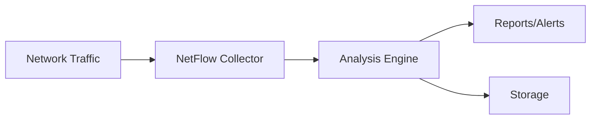
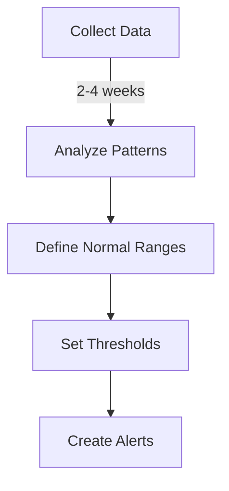
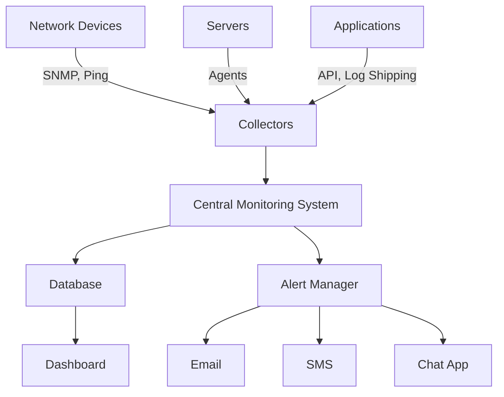

# Networks Monitoring

## Introduction

Network monitoring is a critical aspect of network management that involves observing, analyzing, and maintaining the health and performance of a computer network. As networks grow in complexity and importance, effective monitoring becomes essential for ensuring optimal performance, identifying potential issues before they cause downtime, and maintaining security.

In this guide, you'll learn about the fundamentals of network monitoring, common protocols and techniques, essential tools, and practical approaches to implementing a monitoring strategy for your networks.

## Why Monitor Your Network?

Network monitoring serves several crucial purposes:

- **Performance tracking**: Identify bottlenecks and optimize resources
- **Proactive troubleshooting**: Detect issues before they cause outages
- **Security**: Identify unusual traffic patterns that might indicate breaches
- **Capacity planning**: Make informed decisions about network expansion
- **Regulatory compliance**: Maintain records required by various standards
- **Service level validation**: Ensure you're meeting performance agreements

## Key Network Parameters to Monitor

### 1. Availability and Uptime

The most basic monitoring parameter is whether your network devices and services are operational.

```javascript
// Simple availability check using ping in Node.js
const { exec } = require('child_process');

function checkHostAvailability(host) {
  return new Promise((resolve, reject) => {
    exec(`ping -c 4 ${host}`, (error, stdout, stderr) => {
      if (error) {
        console.log(`${host} is DOWN: ${stderr}`);
        resolve(false);
      } else {
        console.log(`${host} is UP`);
        resolve(true);
      }
    });
  });
}

// Example usage
checkHostAvailability('192.168.1.1')
  .then(isAvailable => {
    console.log(`Router availability: ${isAvailable}`);
  });
```

**Example output:**
```
192.168.1.1 is UP
Router availability: true
```

### 2. Bandwidth Utilization

Monitoring bandwidth consumption helps identify peak usage times and potential bottlenecks.

### 3. Network Latency

Latency (delay) affects real-time applications like VoIP and video conferencing.

### 4. Packet Loss

Excessive packet loss can indicate network congestion or hardware issues.

### 5. Error Rates

Monitoring interface errors helps identify failing hardware or configuration issues.

## Network Monitoring Protocols and Methods

### SNMP (Simple Network Management Protocol)

SNMP is one of the most widely used protocols for network monitoring. It works by collecting information from network devices through agents.

```javascript
// Basic SNMP query using Node.js and snmp-native
const snmp = require('snmp-native');

// Create a session to the device
const session = new snmp.Session({ host: '192.168.1.1', community: 'public' });

// Query system description (OID: 1.3.6.1.2.1.1.1.0)
session.get({ oid: [1, 3, 6, 1, 2, 1, 1, 1, 0] }, function(error, varbinds) {
  if (error) {
    console.error('SNMP error:', error);
  } else {
    console.log('System description:', varbinds[0].value.toString());
  }
  session.close();
});
```

**Example output:**
```
System description: Cisco IOS Software, C2960 Software (C2960-LANBASEK9-M), Version 15.0(2)SE
```

### ICMP (Internet Control Message Protocol)

ICMP is used for basic connectivity tests through tools like ping and traceroute.

### NetFlow/sFlow/IPFIX

These protocols collect and analyze network traffic data to provide visibility into traffic patterns.



### WMI (Windows Management Instrumentation)

WMI is used for monitoring Windows-based systems and applications.

## Setting Up a Basic Monitoring System

Let's implement a simple monitoring solution that checks device availability and response time:

```javascript
// Simple network monitoring script in Node.js
const { exec } = require('child_process');
const fs = require('fs');

// Devices to monitor
const devices = [
  { name: 'Main Router', ip: '192.168.1.1' },
  { name: 'File Server', ip: '192.168.1.10' },
  { name: 'Web Server', ip: '192.168.1.20' }
];

// Monitoring function
async function monitorNetwork() {
  console.log('=== Network Monitoring Report ===');
  console.log(`Time: ${new Date().toISOString()}
`);
  
  const results = [];
  
  for (const device of devices) {
    try {
      const startTime = Date.now();
      const pingResult = await pingDevice(device.ip);
      const responseTime = Date.now() - startTime;
      
      results.push({
        name: device.name,
        ip: device.ip,
        status: pingResult ? 'UP' : 'DOWN',
        responseTime: pingResult ? `${responseTime}ms` : 'N/A'
      });
    } catch (error) {
      results.push({
        name: device.name,
        ip: device.ip,
        status: 'ERROR',
        responseTime: 'N/A'
      });
    }
  }
  
  // Display and log results
  results.forEach(result => {
    console.log(`${result.name} (${result.ip}): ${result.status}, Response time: ${result.responseTime}`);
  });
  
  // Save to log file
  fs.appendFileSync(
    'network_log.txt', 
    `${new Date().toISOString()} - ${JSON.stringify(results)}
`
  );
  
  console.log('
Monitoring data saved to network_log.txt');
}

// Helper function to ping a device
function pingDevice(ip) {
  return new Promise((resolve) => {
    exec(`ping -c 2 -W 1 ${ip}`, (error) => {
      resolve(!error);
    });
  });
}

// Run monitoring
monitorNetwork();

// For continuous monitoring, you would use:
// setInterval(monitorNetwork, 300000); // Run every 5 minutes
```

**Example output:**
```
=== Network Monitoring Report ===
Time: 2024-03-15T18:30:15.123Z

Main Router (192.168.1.1): UP, Response time: 5ms
File Server (192.168.1.10): UP, Response time: 8ms
Web Server (192.168.1.20): DOWN, Response time: N/A

Monitoring data saved to network_log.txt
```

## Essential Network Monitoring Tools

### 1. Open-Source Tools

- **Nagios**: Comprehensive monitoring solution for networks, servers, and services
- **Zabbix**: Enterprise-level monitoring solution with extensive visualization
- **Prometheus**: Modern monitoring system with a powerful query language
- **Grafana**: Visualization platform often used with Prometheus
- **LibreNMS**: Auto-discovering network monitoring system based on PHP, MySQL, and SNMP

### 2. Commercial Solutions

- **SolarWinds Network Performance Monitor**
- **PRTG Network Monitor**
- **ManageEngine OpManager**
- **Datadog Network Performance Monitoring**

### 3. Command-Line Tools

Basic tools every network administrator should know:

```bash
# Check connectivity
ping 192.168.1.1

# Trace route to a destination
traceroute google.com

# Show network statistics
netstat -an

# Capture and analyze packets
tcpdump -i eth0

# Network scanning
nmap 192.168.1.0/24
```

## Best Practices for Network Monitoring

### 1. Establish a Baseline

Before you can identify abnormal behavior, you need to understand what's normal for your network.



### 2. Implement Alerting Wisely

Alert fatigue is real - configure alerts only for actionable issues.

### 3. Use a Layered Approach

Monitor at different layers of the OSI model for complete visibility:

- **Physical/Data Link Layer**: Interface errors, link state
- **Network Layer**: Routing, ICMP
- **Transport Layer**: TCP connections, port availability
- **Application Layer**: Service response times, availability

### 4. Automate Where Possible

Use scripts to automate routine checks and responses:

```javascript
// Example of automated response to a server issue
function checkAndRestartService(host, service) {
  exec(`ssh admin@${host} systemctl status ${service}`, (error) => {
    if (error) {
      console.log(`Service ${service} on ${host} is down. Attempting restart...`);
      exec(`ssh admin@${host} systemctl restart ${service}`, (restartError) => {
        if (restartError) {
          console.error(`Failed to restart ${service}: ${restartError}`);
          // Send alert to administrator
          sendAlert(`Failed to restart ${service} on ${host}`);
        } else {
          console.log(`Successfully restarted ${service} on ${host}`);
          // Log the event
          logEvent(`Automatic restart of ${service} on ${host}`);
        }
      });
    } else {
      console.log(`Service ${service} on ${host} is running normally.`);
    }
  });
}
```

### 5. Document Your Monitoring Infrastructure

Keep thorough documentation of what you're monitoring and why.

## Practical Example: Setting Up a Complete Monitoring Solution

Let's look at a more comprehensive approach combining multiple monitoring techniques:

1. **Device Discovery**: Automatically find devices on your network
2. **SNMP Monitoring**: Collect performance metrics from routers and switches
3. **Service Checks**: Verify that critical services are responding
4. **Log Aggregation**: Collect and analyze logs from all devices
5. **Traffic Analysis**: Monitor bandwidth usage and traffic patterns
6. **Visualization**: Create dashboards for at-a-glance status
7. **Alerting**: Notify administrators of critical issues



## Case Study: Troubleshooting with Network Monitoring

Imagine a scenario where users report slow application performance. With proper monitoring in place:

1. **Detection**: Your monitoring system shows increased latency to the application server
2. **Investigation**: Traffic analysis reveals unusually high bandwidth usage
3. **Root Cause**: NetFlow data identifies a backup process running during business hours
4. **Resolution**: Reschedule the backup for off-peak hours
5. **Verification**: Monitoring confirms normal latency has been restored

## Summary

Network monitoring is an essential aspect of network management that helps ensure optimal performance, security, and reliability. By implementing a comprehensive monitoring strategy, you can:

- Detect and address issues proactively before they impact users
- Optimize resource utilization and plan for future growth
- Maintain security through anomaly detection
- Meet service level agreements and compliance requirements

The key to successful network monitoring is selecting the right combination of tools and techniques for your specific environment, establishing proper baselines, and configuring meaningful alerts that drive action.

## Exercises for Practice

1. Set up a basic ping monitoring script to check the availability of three different services on your network.
2. Install an open-source monitoring tool like Prometheus or Zabbix in a test environment.
3. Create a network map of your home or office network, documenting IP addresses, device types, and connections.
4. Configure SNMP on a network device and write a script to collect and display basic statistics.
5. Design a monitoring dashboard that would be useful for your organization, detailing what metrics would be most important to display.

## Additional Resources

- RFC 1157: Simple Network Management Protocol (SNMP)
- RFC 3954: Cisco Systems NetFlow Services Export Version 9
- Books:
  - "Network Monitoring and Analysis" by Ed Wilson
  - "Practical Network Automation" by Abhishek Ratan
- Online Courses:
  - Networking fundamentals courses on platforms like Coursera, Udemy, or LinkedIn Learning
  - Vendor-specific training for tools like Nagios, Zabbix, or SolarWinds