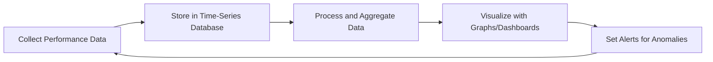
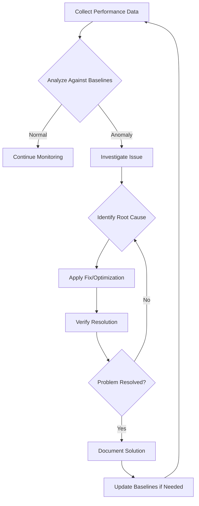

# Networks Performance Management

## Introduction

Network Performance Management refers to the practice of monitoring, measuring, analyzing, and optimizing the performance of computer networks. As applications become more distributed and interconnected, the network's performance directly impacts user experience, application responsiveness, and overall system reliability.

For beginners in programming and system administration, understanding how to monitor and improve network performance is a crucial skill. Poor network performance can bottleneck even the most efficiently coded applications, while optimized networks can enhance the performance of your entire system.

## Key Concepts in Network Performance Management

### Network Performance Metrics

Before we can manage network performance, we need to understand how to measure it. Here are the fundamental metrics:

#### 1. Bandwidth

Bandwidth represents the maximum data transfer rate of a network connection, typically measured in bits per second (bps), with common units being Mbps (megabits per second) or Gbps (gigabits per second).

```javascript
// Example of checking available bandwidth using JavaScript
async function checkBandwidth() {
  const startTime = Date.now();
  const response = await fetch('https://example.com/largefile.jpg');
  const data = await response.blob();
  const endTime = Date.now();
  
  const fileSize = data.size * 8; // Convert bytes to bits
  const durationInSeconds = (endTime - startTime) / 1000;
  const bandwidthInBps = fileSize / durationInSeconds;
  
  console.log(`Estimated bandwidth: ${(bandwidthInBps / 1000000).toFixed(2)} Mbps`);
}

// Output example:
// Estimated bandwidth: 24.56 Mbps
```

#### 2. Latency

Latency is the time delay between sending and receiving data, typically measured in milliseconds (ms).

```python
# Example of measuring latency using Python
import time
import subprocess

def measure_latency(host="google.com", count=4):
    cmd = ["ping", "-c", str(count), host]
    output = subprocess.check_output(cmd).decode("utf-8")
    
    # Parse the average time from the output
    lines = output.split("
")
    for line in lines:
        if "avg" in line:
            # Format depends on OS, but typically contains rtt min/avg/max/mdev
            avg_time = line.split("/")[4]
            return float(avg_time)
    
    return None

latency = measure_latency()
print(f"Average latency: {latency} ms")

# Output example:
# Average latency: 21.5 ms
```

#### 3. Packet Loss

Packet loss represents the percentage of data packets that fail to reach their destination.

```python
# Example of checking packet loss using Python
import re
import subprocess

def check_packet_loss(host="google.com", count=10):
    cmd = ["ping", "-c", str(count), host]
    output = subprocess.check_output(cmd).decode("utf-8")
    
    # Find the packet loss percentage
    match = re.search(r"(\d+)% packet loss", output)
    if match:
        return int(match.group(1))
    
    return None

loss = check_packet_loss()
print(f"Packet loss: {loss}%")

# Output example:
# Packet loss: 0%
```

#### 4. Jitter

Jitter is the variation in latency, indicating the consistency of data delivery.

```python
# Example of measuring jitter using Python
import time
import statistics
import subprocess

def measure_jitter(host="google.com", count=10):
    cmd = ["ping", "-c", str(count), host]
    output = subprocess.check_output(cmd).decode("utf-8")
    
    # Extract all round trip times
    times = []
    for line in output.split("
"):
        if "time=" in line:
            time_ms = float(line.split("time=")[1].split(" ")[0])
            times.append(time_ms)
    
    # Calculate jitter as standard deviation of latencies
    if times:
        return statistics.stdev(times)
    
    return None

jitter = measure_jitter()
print(f"Jitter: {jitter:.2f} ms")

# Output example:
# Jitter: 1.23 ms
```

### Network Monitoring Tools

As a beginner, you should become familiar with these common network monitoring tools:

#### Command-line Tools

- **ping**: Tests connectivity and measures round-trip time
- **traceroute/tracert**: Shows the path packets take to a destination
- **netstat**: Displays network connections and routing tables
- **iperf**: Measures maximum network bandwidth

```bash
# Example ping command
ping google.com

# Example traceroute command
traceroute google.com

# Example netstat command to show active connections
netstat -an

# Example iperf command (requires iperf installed on both client and server)
# On server:
iperf -s
# On client:
iperf -c server_ip_address
```

#### Software Monitoring Tools

- **Wireshark**: Packet analyzer for detailed traffic inspection
- **Nagios**: Network monitoring and alerting system
- **Prometheus**: Metrics collection and alerting system
- **Grafana**: Visualization platform for metrics

## Network Performance Visualization

Visualizing network performance data helps identify patterns and issues quickly. Here's a simple example of how you might visualize network latency data over time:



Here's an example of setting up a simple dashboard for monitoring network metrics:

```javascript
// Example: Setting up a basic monitoring dashboard with Chart.js
async function setupNetworkDashboard() {
  const ctx = document.getElementById('networkChart').getContext('2d');
  
  // Create an array to store time points and latency values
  const timePoints = [];
  const latencyValues = [];
  const bandwidthValues = [];
  
  const chart = new Chart(ctx, {
    type: 'line',
    data: {
      labels: timePoints,
      datasets: [
        {
          label: 'Latency (ms)',
          data: latencyValues,
          borderColor: 'red',
          yAxisID: 'y-latency',
        },
        {
          label: 'Bandwidth (Mbps)',
          data: bandwidthValues,
          borderColor: 'blue',
          yAxisID: 'y-bandwidth',
        }
      ]
    },
    options: {
      scales: {
        'y-latency': {
          type: 'linear',
          position: 'left',
          title: {
            display: true,
            text: 'Latency (ms)'
          }
        },
        'y-bandwidth': {
          type: 'linear',
          position: 'right',
          title: {
            display: true,
            text: 'Bandwidth (Mbps)'
          }
        }
      }
    }
  });
  
  // Function to update chart with new data
  function updateChart(newLatency, newBandwidth) {
    const now = new Date().toLocaleTimeString();
    
    timePoints.push(now);
    latencyValues.push(newLatency);
    bandwidthValues.push(newBandwidth);
    
    // Keep only the last 20 data points
    if (timePoints.length > 20) {
      timePoints.shift();
      latencyValues.shift();
      bandwidthValues.shift();
    }
    
    chart.update();
  }
  
  // Simulate data collection every 5 seconds
  setInterval(async () => {
    // In a real application, these would be actual measurements
    const latency = 20 + Math.random() * 10; // Simulated latency between 20-30ms
    const bandwidth = 50 + Math.random() * 20; // Simulated bandwidth between 50-70 Mbps
    
    updateChart(latency, bandwidth);
  }, 5000);
}

// Call the function to start the dashboard
setupNetworkDashboard();
```

## Network Performance Optimization Techniques

### 1. Quality of Service (QoS)

QoS is a set of technologies that work to ensure critical network traffic gets priority.

```python
# Example: Setting up basic QoS rules with Python and the Linux tc tool
import subprocess

def setup_qos():
    # Clear existing qdisc rules
    subprocess.run(["tc", "qdisc", "del", "dev", "eth0", "root"])
    
    # Create HTB qdisc
    subprocess.run(["tc", "qdisc", "add", "dev", "eth0", "root", "handle", "1:", "htb", "default", "30"])
    
    # Create main class with max bandwidth
    subprocess.run(["tc", "class", "add", "dev", "eth0", "parent", "1:", "classid", "1:1", "htb", "rate", "100mbit", "burst", "15k"])
    
    # Create high-priority class (e.g., for VoIP)
    subprocess.run(["tc", "class", "add", "dev", "eth0", "parent", "1:1", "classid", "1:10", "htb", "rate", "30mbit", "burst", "10k", "prio", "1"])
    
    # Create medium-priority class (e.g., for web traffic)
    subprocess.run(["tc", "class", "add", "dev", "eth0", "parent", "1:1", "classid", "1:20", "htb", "rate", "50mbit", "burst", "10k", "prio", "2"])
    
    # Create low-priority class (e.g., for downloads)
    subprocess.run(["tc", "class", "add", "dev", "eth0", "parent", "1:1", "classid", "1:30", "htb", "rate", "20mbit", "burst", "10k", "prio", "3"])
    
    # Filter traffic to appropriate classes
    # VoIP traffic (example: port 5060 for SIP)
    subprocess.run(["tc", "filter", "add", "dev", "eth0", "parent", "1:", "protocol", "ip", "prio", "1", 
                   "u32", "match", "ip", "dport", "5060", "0xffff", "flowid", "1:10"])
    
    # HTTP/HTTPS traffic
    subprocess.run(["tc", "filter", "add", "dev", "eth0", "parent", "1:", "protocol", "ip", "prio", "2", 
                   "u32", "match", "ip", "dport", "80", "0xffff", "flowid", "1:20"])
    subprocess.run(["tc", "filter", "add", "dev", "eth0", "parent", "1:", "protocol", "ip", "prio", "2", 
                   "u32", "match", "ip", "dport", "443", "0xffff", "flowid", "1:20"])
    
    print("QoS rules applied successfully")

# Note: This function requires root privileges to run
# setup_qos()
```

### 2. Bandwidth Management

Controlling how bandwidth is allocated across different applications and users.

```python
# Example: Setting up a simple bandwidth limiter for specific IP addresses
import subprocess

def limit_bandwidth_for_ip(ip_address, limit_kbps):
    # Ensure we have a clean slate
    subprocess.run(["tc", "qdisc", "del", "dev", "eth0", "root"], stderr=subprocess.DEVNULL)
    
    # Create the root qdisc
    subprocess.run(["tc", "qdisc", "add", "dev", "eth0", "root", "handle", "1:", "htb", "default", "10"])
    
    # Create the main class
    subprocess.run(["tc", "class", "add", "dev", "eth0", "parent", "1:", "classid", "1:1", "htb", "rate", "100mbit"])
    
    # Create the default class for most traffic
    subprocess.run(["tc", "class", "add", "dev", "eth0", "parent", "1:1", "classid", "1:10", "htb", "rate", "95mbit", "ceil", "100mbit"])
    
    # Create the limited class for the specified IP
    subprocess.run(["tc", "class", "add", "dev", "eth0", "parent", "1:1", "classid", "1:20", "htb", "rate", f"{limit_kbps}kbit", "ceil", f"{limit_kbps}kbit"])
    
    # Create a filter to direct traffic for the specified IP to the limited class
    subprocess.run(["tc", "filter", "add", "dev", "eth0", "parent", "1:", "protocol", "ip", "prio", "1", 
                   "u32", "match", "ip", "dst", ip_address, "flowid", "1:20"])
    
    print(f"Bandwidth for {ip_address} limited to {limit_kbps} kbps")

# Example usage:
# limit_bandwidth_for_ip("192.168.1.100", 1024)  # Limit to 1 Mbps
```

### 3. Caching

Implementing caching mechanisms can significantly reduce network load for frequently accessed content.

```javascript
// Example: Setting up a basic HTTP caching proxy with Node.js
const http = require('http');
const https = require('https');
const url = require('url');

// Simple in-memory cache
const cache = new Map();

const server = http.createServer((req, res) => {
  const requestUrl = req.url;
  
  // Check if we have a cached response
  if (cache.has(requestUrl)) {
    console.log(`Cache hit for ${requestUrl}`);
    const cachedResponse = cache.get(requestUrl);
    res.writeHead(200, { 'Content-Type': cachedResponse.contentType });
    res.end(cachedResponse.data);
    return;
  }
  
  console.log(`Cache miss for ${requestUrl}, fetching...`);
  
  // Parse the URL to determine if it's HTTP or HTTPS
  const parsedUrl = url.parse(requestUrl);
  const httpModule = parsedUrl.protocol === 'https:' ? https : http;
  
  // Forward the request
  const proxyReq = httpModule.request(requestUrl, (proxyRes) => {
    let data = Buffer.from([]);
    
    proxyRes.on('data', (chunk) => {
      data = Buffer.concat([data, chunk]);
    });
    
    proxyRes.on('end', () => {
      // Store in cache
      cache.set(requestUrl, {
        data,
        contentType: proxyRes.headers['content-type'] || 'text/plain'
      });
      
      // Send to client
      res.writeHead(proxyRes.statusCode, proxyRes.headers);
      res.end(data);
    });
  });
  
  proxyReq.on('error', (err) => {
    console.error(`Error: ${err.message}`);
    res.writeHead(500);
    res.end('Proxy Error');
  });
  
  proxyReq.end();
});

const PORT = 8080;
server.listen(PORT, () => {
  console.log(`Caching proxy server running on port ${PORT}`);
});
```

### 4. Load Balancing

Distributing network traffic across multiple servers to optimize resource utilization.

```javascript
// Example: Basic load balancer implementation in Node.js
const http = require('http');
const https = require('https');
const url = require('url');

// Define our backend servers
const backends = [
  { host: 'server1.example.com', port: 8080 },
  { host: 'server2.example.com', port: 8080 },
  { host: 'server3.example.com', port: 8080 }
];

let currentBackendIndex = 0;

// Simple round-robin load balancing
function getNextBackend() {
  const backend = backends[currentBackendIndex];
  currentBackendIndex = (currentBackendIndex + 1) % backends.length;
  return backend;
}

const server = http.createServer((clientReq, clientRes) => {
  const backend = getNextBackend();
  console.log(`Routing request to ${backend.host}:${backend.port}`);
  
  const options = {
    hostname: backend.host,
    port: backend.port,
    path: clientReq.url,
    method: clientReq.method,
    headers: clientReq.headers
  };
  
  const proxyReq = http.request(options, (proxyRes) => {
    clientRes.writeHead(proxyRes.statusCode, proxyRes.headers);
    proxyRes.pipe(clientRes, { end: true });
  });
  
  clientReq.pipe(proxyReq, { end: true });
  
  proxyReq.on('error', (err) => {
    console.error(`Error with backend ${backend.host}: ${err.message}`);
    clientRes.writeHead(502);
    clientRes.end('Bad Gateway');
  });
});

const PORT = 80;
server.listen(PORT, () => {
  console.log(`Load balancer running on port ${PORT}`);
});
```

## Real-World Application: Building a Network Performance Dashboard

Let's put everything together by creating a simple but practical network performance dashboard for monitoring multiple hosts. This example showcases how to collect and visualize network metrics.

```javascript
// Example: Network Performance Dashboard
// This would be in a file like network-dashboard.js

class NetworkMonitor {
  constructor() {
    this.hosts = [];
    this.metrics = {};
    this.charts = {};
  }
  
  addHost(hostname) {
    if (!this.hosts.includes(hostname)) {
      this.hosts.push(hostname);
      this.metrics[hostname] = {
        latency: [],
        packetLoss: [],
        bandwidth: [],
        timestamps: []
      };
      
      // Create charts for the new host
      this.createCharts(hostname);
    }
  }
  
  createCharts(hostname) {
    // Create a container for this host's charts
    const container = document.createElement('div');
    container.className = 'host-container';
    container.innerHTML = `
      <h2>${hostname}</h2>
      <div class="metrics-row">
        <div class="chart-container">
          <h3>Latency (ms)</h3>
          <canvas id="latency-${hostname}"></canvas>
        </div>
        <div class="chart-container">
          <h3>Packet Loss (%)</h3>
          <canvas id="packetloss-${hostname}"></canvas>
        </div>
        <div class="chart-container">
          <h3>Bandwidth (Mbps)</h3>
          <canvas id="bandwidth-${hostname}"></canvas>
        </div>
      </div>
    `;
    
    document.getElementById('dashboard').appendChild(container);
    
    // Initialize charts
    this.charts[hostname] = {
      latency: new Chart(document.getElementById(`latency-${hostname}`).getContext('2d'), {
        type: 'line',
        data: {
          labels: [],
          datasets: [{
            label: 'Latency',
            data: [],
            borderColor: 'rgb(75, 192, 192)',
            tension: 0.1
          }]
        },
        options: { scales: { y: { beginAtZero: true } } }
      }),
      packetLoss: new Chart(document.getElementById(`packetloss-${hostname}`).getContext('2d'), {
        type: 'line',
        data: {
          labels: [],
          datasets: [{
            label: 'Packet Loss',
            data: [],
            borderColor: 'rgb(255, 99, 132)',
            tension: 0.1
          }]
        },
        options: { scales: { y: { beginAtZero: true, max: 100 } } }
      }),
      bandwidth: new Chart(document.getElementById(`bandwidth-${hostname}`).getContext('2d'), {
        type: 'line',
        data: {
          labels: [],
          datasets: [{
            label: 'Bandwidth',
            data: [],
            borderColor: 'rgb(54, 162, 235)',
            tension: 0.1
          }]
        },
        options: { scales: { y: { beginAtZero: true } } }
      })
    };
  }
  
  async collectData() {
    for (const hostname of this.hosts) {
      try {
        // In a real application, these would be API calls to a backend service
        // that performs actual network measurements
        const latency = await this.measureLatency(hostname);
        const packetLoss = await this.measurePacketLoss(hostname);
        const bandwidth = await this.measureBandwidth(hostname);
        
        const timestamp = new Date().toLocaleTimeString();
        
        // Store the metrics
        this.metrics[hostname].timestamps.push(timestamp);
        this.metrics[hostname].latency.push(latency);
        this.metrics[hostname].packetLoss.push(packetLoss);
        this.metrics[hostname].bandwidth.push(bandwidth);
        
        // Keep only the last 20 data points
        if (this.metrics[hostname].timestamps.length > 20) {
          this.metrics[hostname].timestamps.shift();
          this.metrics[hostname].latency.shift();
          this.metrics[hostname].packetLoss.shift();
          this.metrics[hostname].bandwidth.shift();
        }
        
        // Update charts
        this.updateCharts(hostname);
      } catch (error) {
        console.error(`Error collecting data for ${hostname}:`, error);
      }
    }
  }
  
  updateCharts(hostname) {
    const data = this.metrics[hostname];
    
    this.charts[hostname].latency.data.labels = data.timestamps;
    this.charts[hostname].latency.data.datasets[0].data = data.latency;
    this.charts[hostname].latency.update();
    
    this.charts[hostname].packetLoss.data.labels = data.timestamps;
    this.charts[hostname].packetLoss.data.datasets[0].data = data.packetLoss;
    this.charts[hostname].packetLoss.update();
    
    this.charts[hostname].bandwidth.data.labels = data.timestamps;
    this.charts[hostname].bandwidth.data.datasets[0].data = data.bandwidth;
    this.charts[hostname].bandwidth.update();
  }
  
  // Simulate network measurements
  // In a real application, these would make API calls to a backend service
  async measureLatency(hostname) {
    // Simulate latency between 5-50ms with occasional spikes
    return Math.random() < 0.1 
      ? 50 + Math.random() * 100 
      : 5 + Math.random() * 45;
  }
  
  async measurePacketLoss(hostname) {
    // Simulate packet loss between 0-2% with occasional higher loss
    return Math.random() < 0.05 
      ? 2 + Math.random() * 8 
      : Math.random() * 2;
  }
  
  async measureBandwidth(hostname) {
    // Simulate bandwidth between 90-100 Mbps with occasional drops
    return Math.random() < 0.1 
      ? 50 + Math.random() * 40 
      : 90 + Math.random() * 10;
  }
  
  start(interval = 5000) {
    // Collect data immediately
    this.collectData();
    
    // Then collect at the specified interval
    setInterval(() => this.collectData(), interval);
  }
}

// Usage
document.addEventListener('DOMContentLoaded', () => {
  const monitor = new NetworkMonitor();
  
  // Add some hosts to monitor
  monitor.addHost('server1.example.com');
  monitor.addHost('server2.example.com');
  monitor.addHost('database.example.com');
  
  // Start monitoring with 5-second intervals
  monitor.start(5000);
  
  // Add form to add new hosts
  const form = document.getElementById('add-host-form');
  form.addEventListener('submit', (e) => {
    e.preventDefault();
    const hostnameInput = document.getElementById('hostname-input');
    const hostname = hostnameInput.value.trim();
    
    if (hostname) {
      monitor.addHost(hostname);
      hostnameInput.value = '';
    }
  });
});
```

The HTML structure for this dashboard might look like:

```html
<!DOCTYPE html>
<html lang="en">
<head>
  <meta charset="UTF-8" />
  <meta name="viewport" content="width=device-width, initial-scale=1.0" />
  <title>Network Performance Dashboard</title>
  <script src="https://cdn.jsdelivr.net/npm/chart.js"></script>
  <style>
    body {
      font-family: Arial, sans-serif;
      margin: 0;
      padding: 20px;
    }
    .host-container {
      margin-bottom: 30px;
      border: 1px solid #ccc;
      border-radius: 5px;
      padding: 15px;
    }
    .metrics-row {
      display: flex;
      flex-wrap: wrap;
      gap: 20px;
    }
    .chart-container {
      flex: 1;
      min-width: 300px;
    }
    form {
      margin-bottom: 20px;
    }
    input, button {
      padding: 8px;
      margin-right: 10px;
    }
  </style>
</head>
<body>
  <h1>Network Performance Dashboard</h1>
  
  <form id="add-host-form">
    <input type="text" id="hostname-input" placeholder="Enter hostname" required />
    <button type="submit">Add Host</button>
  </form>
  
  <div id="dashboard"></div>
  
  <script src="network-dashboard.js"></script>
</body>
</html>
```

## Best Practices for Network Performance Management

1. **Set Baselines**: Establish normal performance metrics for your network to identify deviations.

2. **Monitor Continuously**: Regular monitoring helps identify issues before they become critical.

3. **Document Network Topology**: Maintain up-to-date documentation of your network architecture.

4. **Implement Alerts**: Set up alerts for when metrics exceed acceptable thresholds.

5. **Regular Testing**: Conduct regular performance tests, especially after changes.

6. **Segment Your Network**: Divide your network into logical segments to isolate issues and limit the impact of problems.

7. **Update and Patch**: Keep network devices and software updated with the latest patches.

8. **Capacity Planning**: Regularly assess if your network can handle current and future demands.

## Visualizing Network Performance Analysis Workflow



## Common Network Performance Issues and Solutions

| Issue | Possible Causes | Solutions |
|-------|----------------|-----------|
| High Latency | Network congestion, distant server, routing issues | QoS implementation, route optimization, CDN usage |
| Packet Loss | Network congestion, hardware failure, signal interference | Identify bottlenecks, replace faulty hardware, improve wireless signal |
| Low Bandwidth | Insufficient capacity, throttling, high usage | Upgrade connection, implement traffic shaping, bandwidth management |
| Jitter | Network congestion, insufficient buffering | QoS policies, buffer tuning, jitter buffering |
| Connection Drops | Hardware issues, signal interference, configuration problems | Check hardware, improve signal strength, verify configurations |

## Summary

Network Performance Management is an essential skill for programmers and system administrators. By understanding the key metrics, monitoring techniques, and optimization strategies, you can ensure your applications run efficiently and provide a good user experience.

Key takeaways from this guide:

1. Networks should be continuously monitored using metrics like bandwidth, latency, packet loss, and jitter.
2. Both command-line tools and dedicated software can help track network performance.
3. Visualization of network metrics helps quickly identify issues and trends.
4. Performance optimization techniques include QoS, bandwidth management, caching, and load balancing.
5. Regular testing and documentation are crucial for maintaining network performance.

## Exercises

1. Set up a simple network monitoring system for your local network using the ping command and visualize the results.
2. Implement a basic caching proxy server and measure its impact on response times.
3. Create a script that collects network metrics at regular intervals and generates alerts when thresholds are exceeded.
4. Design a QoS policy for a network that prioritizes video conferencing traffic over file downloads.
5. Compare the performance of your application with and without a load balancer in front of it.

## Additional Resources

- [Wireshark Network Protocol Analyzer](https://www.wireshark.org/)
- [IETF RFC 2544: Benchmarking Methodology for Network Interconnect Devices](https://tools.ietf.org/html/rfc2544)
- [Prometheus Monitoring System](https://prometheus.io/)
- [Grafana: The open observability platform](https://grafana.com/)
- [Linux Advanced Routing & Traffic Control HOWTO](https://lartc.org/)