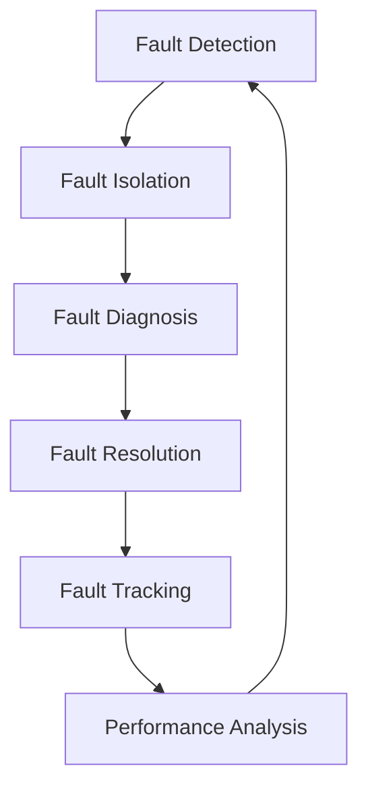

# Networks Fault Management

## Introduction

Network Fault Management is a critical component of overall Network Management that focuses on detecting, isolating, diagnosing, and resolving network problems or failures. In today's interconnected world, where businesses and services rely heavily on network infrastructure, even a minor network fault can lead to significant disruptions and financial losses. Effective fault management ensures that network issues are quickly identified and resolved, minimizing downtime and maintaining optimal network performance.

As a beginner in network programming, understanding fault management concepts and techniques will provide you with essential skills to build robust network applications and systems that can handle failures gracefully.

## The Fault Management Process

The fault management process typically consists of the following key phases:

1. **Fault Detection** - Identifying that a problem exists
2. **Fault Isolation** - Determining where the problem is located
3. **Fault Diagnosis** - Determining what is causing the problem
4. **Fault Resolution** - Fixing the problem
5. **Fault Tracking** - Recording the problem and its resolution

Let's visualize this process with a diagram:



## Fault Detection Techniques

### 1. Network Monitoring

Network monitoring involves continuously observing network components, traffic, and performance metrics to detect anomalies or failures. Common monitoring approaches include:

- **Active Monitoring**: Sending test traffic (like ping or traceroute) to verify connectivity and measure response times
- **Passive Monitoring**: Observing actual network traffic without generating additional traffic

Here's a simple Python example using the `ping3` library to implement active monitoring:

```python
from ping3 import ping
import time

def monitor_server(hostname, interval=60, threshold=200):
    """
    Monitor a server with ping and alert if response time exceeds threshold.
    
    Args:
        hostname (str): Server hostname or IP address
        interval (int): Check interval in seconds
        threshold (float): Response time threshold in milliseconds
    """
    while True:
        try:
            response_time = ping(hostname) * 1000  # Convert to milliseconds
            
            if response_time is None:
                print(f"ALERT: {hostname} is unreachable!")
            elif response_time > threshold:
                print(f"WARNING: {hostname} response time ({response_time:.2f}ms) exceeds threshold ({threshold}ms)")
            else:
                print(f"OK: {hostname} response time: {response_time:.2f}ms")
                
        except Exception as e:
            print(f"ERROR: Failed to ping {hostname}: {str(e)}")
            
        time.sleep(interval)

# Example usage
if __name__ == "__main__":
    monitor_server("example.com", interval=5, threshold=100)
```

Output example:
```
OK: example.com response time: 45.23ms
OK: example.com response time: 38.76ms
WARNING: example.com response time (123.45ms) exceeds threshold (100ms)
OK: example.com response time: 56.12ms
ALERT: example.com is unreachable!
```

### 2. SNMP (Simple Network Management Protocol)

SNMP is a widely used protocol for network management and monitoring. It allows administrators to collect information from network devices, monitor performance, and detect faults.

Here's a Python example using the `pysnmp` library to query a device for its system uptime:

```python
from pysnmp.hlapi import *

def get_system_uptime(hostname, community="public"):
    """
    Get system uptime from a device using SNMP.
    
    Args:
        hostname (str): Device hostname or IP address
        community (str): SNMP community string
    
    Returns:
        str: System uptime or error message
    """
    try:
        # OID for system uptime
        system_uptime_oid = '1.3.6.1.2.1.1.3.0'
        
        error_indication, error_status, error_index, var_binds = next(
            getCmd(SnmpEngine(),
                   CommunityData(community),
                   UdpTransportTarget((hostname, 161)),
                   ContextData(),
                   ObjectType(ObjectIdentity(system_uptime_oid)))
        )
        
        if error_indication:
            return f"Error: {error_indication}"
        elif error_status:
            return f"Error: {error_status.prettyPrint()} at {var_binds[int(error_index) - 1][0] if error_index else '?'}"
        else:
            for var_bind in var_binds:
                return f"System Uptime: {var_bind[1]}"
    
    except Exception as e:
        return f"Error: {str(e)}"

# Example usage
print(get_system_uptime("192.168.1.1"))
```

Output example:
```
System Uptime: 28 days, 4:12:36.47
```

### 3. Syslog Monitoring

Syslog is a standard protocol used for computer message logging. Many network devices send log messages using the syslog protocol, which can be collected and analyzed to detect faults.

Here's a simple Python example of a syslog server that listens for and processes log messages:

```python
import socketserver
import re
from datetime import datetime

class SyslogUDPHandler(socketserver.BaseRequestHandler):
    """
    Handler for processing syslog messages received via UDP.
    """
    
    # Regular expression to identify error messages
    ERROR_PATTERN = re.compile(r'error|fail|down|critical', re.IGNORECASE)
    
    def handle(self):
        data = bytes.decode(self.request[0].strip())
        
        # Log the message with timestamp and source
        timestamp = datetime.now().strftime('%Y-%m-%d %H:%M:%S')
        source = self.client_address[0]
        print(f"{timestamp} - {source} - {data}")
        
        # Check if message contains error indicators
        if self.ERROR_PATTERN.search(data):
            print(f"ALERT: Possible network issue detected from {source}: {data}")
            # In a real system, you might trigger an alert, send an email, etc.

if __name__ == "__main__":
    HOST, PORT = "0.0.0.0", 514  # Standard syslog port
    server = socketserver.UDPServer((HOST, PORT), SyslogUDPHandler)
    print(f"Syslog server started on port {PORT}...")
    server.serve_forever()
```

Output example:
```
Syslog server started on port 514...
2023-05-20 10:23:15 - 192.168.1.10 - May 20 10:23:15 ROUTER01 %LINK-5-CHANGED: Interface GigabitEthernet0/1, changed state to up
2023-05-20 10:24:32 - 192.168.1.20 - May 20 10:24:32 SWITCH02 %LINEPROTO-5-UPDOWN: Line protocol on Interface Vlan10, changed state to down
ALERT: Possible network issue detected from 192.168.1.20: May 20 10:24:32 SWITCH02 %LINEPROTO-5-UPDOWN: Line protocol on Interface Vlan10, changed state to down
```

## Fault Isolation and Diagnosis

Once a fault is detected, the next steps are to isolate and diagnose the problem. These techniques help pinpoint the location and nature of the fault:

### 1. Traceroute

Traceroute helps identify the path packets take through the network and where they might be getting dropped or delayed.

```python
import subprocess
import platform

def perform_traceroute(hostname):
    """
    Perform a traceroute to the specified hostname.
    
    Args:
        hostname (str): Target hostname or IP address
    
    Returns:
        str: Traceroute output
    """
    # Determine the command based on the operating system
    if platform.system().lower() == "windows":
        command = ["tracert", hostname]
    else:
        command = ["traceroute", hostname]
    
    try:
        process = subprocess.Popen(command, stdout=subprocess.PIPE, stderr=subprocess.PIPE)
        stdout, stderr = process.communicate()
        
        if stderr:
            return f"Error: {stderr.decode()}"
        
        return stdout.decode()
    
    except Exception as e:
        return f"Error: {str(e)}"

# Example usage
trace_result = perform_traceroute("google.com")
print(trace_result)
```

Output example (on Linux):
```
traceroute to google.com (142.250.200.110), 30 hops max, 60 byte packets
 1  192.168.1.1 (192.168.1.1)  3.171 ms  3.144 ms  3.116 ms
 2  10.0.0.1 (10.0.0.1)  15.267 ms  15.238 ms  15.210 ms
 3  203.0.113.1 (203.0.113.1)  20.336 ms  20.309 ms  20.282 ms
 4  198.51.100.1 (198.51.100.1)  25.405 ms  25.377 ms  25.350 ms
 5  142.250.200.110 (142.250.200.110)  30.474 ms  30.446 ms  30.419 ms
```

### 2. Network Topology Analysis

Understanding your network's topology is essential for fault isolation. You can represent network topology using a graph structure and perform analysis to identify critical points of failure.

Here's a simplified example using the `networkx` library in Python:

```python
import networkx as nx
import matplotlib.pyplot as plt

def analyze_network_topology(topology_data):
    """
    Analyze network topology to identify critical nodes.
    
    Args:
        topology_data (list): List of (source, target) tuples representing network links
    """
    # Create a network graph
    G = nx.Graph()
    G.add_edges_from(topology_data)
    
    # Calculate node betweenness centrality to identify critical nodes
    betweenness = nx.betweenness_centrality(G)
    
    # Find the most critical nodes (highest betweenness centrality)
    critical_nodes = sorted(betweenness.items(), key=lambda x: x[1], reverse=True)
    
    print("Critical nodes in order of importance:")
    for node, score in critical_nodes[:5]:  # Display top 5 critical nodes
        print(f"Node {node}: Criticality score = {score:.4f}")
    
    # Return the graph for visualization if needed
    return G

# Example network topology (device connections)
topology = [
    ("Router1", "Switch1"),
    ("Router1", "Switch2"),
    ("Switch1", "Server1"),
    ("Switch1", "Server2"),
    ("Switch2", "Server3"),
    ("Switch2", "Server4"),
    ("Switch1", "Switch3"),
    ("Switch3", "Server5"),
    ("Switch3", "Server6")
]

# Analyze the topology
network_graph = analyze_network_topology(topology)

# Visualize the network
plt.figure(figsize=(10, 8))
pos = nx.spring_layout(network_graph, seed=42)
nx.draw(network_graph, pos, with_labels=True, node_color="lightblue", 
       node_size=1500, font_size=10, font_weight="bold", edge_color="gray")
plt.title("Network Topology")
plt.savefig("network_topology.png")  # Save the visualization if desired
plt.close()
```

Output example:
```
Critical nodes in order of importance:
Node Switch1: Criticality score = 0.3952
Node Router1: Criticality score = 0.2619
Node Switch3: Criticality score = 0.2381
Node Switch2: Criticality score = 0.1429
Node Server1: Criticality score = 0.0000
```

### 3. Log Analysis

Log files contain valuable information for diagnosing network issues. Here's a Python example that scans log files for patterns indicating network problems:

```python
import re
from collections import Counter
from datetime import datetime, timedelta

def analyze_log_file(log_file, hours=24):
    """
    Analyze a log file for network-related issues within the specified time frame.
    
    Args:
        log_file (str): Path to the log file
        hours (int): Hours to look back from now
    
    Returns:
        dict: Analysis results
    """
    # Define patterns to look for
    patterns = {
        'connection_timeout': r'connection timed? ?out|unable to connect',
        'authentication_failure': r'authentication fail(ed|ure)|login fail(ed|ure)',
        'interface_down': r'interface .+ (down|failed)',
        'high_cpu': r'high cpu|cpu utilization .+ (\d{2,3})%',
        'memory_issue': r'out of memory|memory (critical|low)',
        'packet_loss': r'packet loss|(\d+)% loss'
    }
    
    compiled_patterns = {k: re.compile(v, re.IGNORECASE) for k, v in patterns.items()}
    time_threshold = datetime.now() - timedelta(hours=hours)
    
    results = {
        'total_events': 0,
        'events_by_type': Counter(),
        'recent_critical_events': [],
        'affected_devices': set()
    }
    
    try:
        with open(log_file, 'r') as f:
            for line in f:
                # Try to extract timestamp - adjust regex based on your log format
                timestamp_match = re.search(r'(\d{4}-\d{2}-\d{2} \d{2}:\d{2}:\d{2})', line)
                if timestamp_match:
                    timestamp = datetime.strptime(timestamp_match.group(1), '%Y-%m-%d %H:%M:%S')
                    if timestamp < time_threshold:
                        continue
                
                # Extract device information if available
                device_match = re.search(r'(\w+\d+|(?:\d{1,3}\.){3}\d{1,3})', line)
                device = device_match.group(1) if device_match else 'unknown'
                
                # Check for issues
                for issue_type, pattern in compiled_patterns.items():
                    if pattern.search(line):
                        results['total_events'] += 1
                        results['events_by_type'][issue_type] += 1
                        results['affected_devices'].add(device)
                        
                        # Save critical events for detailed review
                        if issue_type in ['interface_down', 'high_cpu', 'memory_issue']:
                            results['recent_critical_events'].append({
                                'timestamp': timestamp.strftime('%Y-%m-%d %H:%M:%S'),
                                'device': device,
                                'type': issue_type,
                                'log_entry': line.strip()
                            })
                        
                        break  # Count each line only once
    
    except Exception as e:
        results['error'] = str(e)
    
    return results

# Example usage
log_analysis = analyze_log_file("/var/log/network.log", hours=12)
print(f"Total network events: {log_analysis['total_events']}")
print(f"Events by type: {dict(log_analysis['events_by_type'])}")
print(f"Affected devices: {list(log_analysis['affected_devices'])}")
print("
Recent critical events:")
for event in log_analysis['recent_critical_events'][:5]:  # Show top 5
    print(f"{event['timestamp']} - {event['device']} - {event['type']}: {event['log_entry']}")
```

Output example:
```
Total network events: 42
Events by type: {'connection_timeout': 15, 'interface_down': 8, 'high_cpu': 12, 'packet_loss': 7}
Affected devices: ['Router1', '192.168.1.5', 'Switch3', 'CoreRouter']

Recent critical events:
2023-05-20 09:14:32 - Router1 - interface_down: 2023-05-20 09:14:32 Router1: Interface GigabitEthernet0/1 is down, line protocol is down
2023-05-20 10:23:15 - CoreRouter - high_cpu: 2023-05-20 10:23:15 CoreRouter: High CPU utilization alert - CPU utilization is 92%
2023-05-20 11:05:47 - Switch3 - interface_down: 2023-05-20 11:05:47 Switch3: Interface Vlan10 changed state to down
```

## Fault Resolution Techniques

After diagnosing a network issue, the next step is to resolve it. Here are some common resolution approaches:

### 1. Automated Recovery Scripts

You can create scripts that automatically remediate common issues. Here's a simple example of a Python script that attempts to restart a network service if it's detected as down:

```python
import subprocess
import time
import logging

# Configure logging
logging.basicConfig(
    level=logging.INFO,
    format='%(asctime)s - %(levelname)s - %(message)s',
    filename='service_monitor.log'
)

def check_service_status(service_name):
    """
    Check if a service is running.
    
    Args:
        service_name (str): Name of the service to check
    
    Returns:
        bool: True if running, False otherwise
    """
    try:
        result = subprocess.run(
            ['systemctl', 'is-active', service_name],
            capture_output=True,
            text=True,
            check=False
        )
        return result.stdout.strip() == 'active'
    except Exception as e:
        logging.error(f"Error checking service {service_name}: {str(e)}")
        return False

def restart_service(service_name):
    """
    Attempt to restart a service.
    
    Args:
        service_name (str): Name of the service to restart
    
    Returns:
        bool: True if successful, False otherwise
    """
    try:
        logging.info(f"Attempting to restart {service_name}")
        result = subprocess.run(
            ['sudo', 'systemctl', 'restart', service_name],
            capture_output=True,
            text=True,
            check=False
        )
        
        if result.returncode == 0:
            logging.info(f"Successfully restarted {service_name}")
            return True
        else:
            logging.error(f"Failed to restart {service_name}: {result.stderr}")
            return False
    except Exception as e:
        logging.error(f"Error restarting service {service_name}: {str(e)}")
        return False

def monitor_and_recover_service(service_name, check_interval=60, max_restarts=3):
    """
    Monitor a service and restart it if it goes down.
    
    Args:
        service_name (str): Name of the service to monitor
        check_interval (int): Time between checks in seconds
        max_restarts (int): Maximum number of restart attempts
    """
    restart_count = 0
    
    logging.info(f"Starting monitoring of service: {service_name}")
    
    while restart_count < max_restarts:
        if not check_service_status(service_name):
            logging.warning(f"Service {service_name} is down!")
            
            # Attempt to restart the service
            if restart_service(service_name):
                restart_count += 1
                logging.info(f"Restart attempt {restart_count}/{max_restarts} successful")
                
                # Verify the service is now running
                time.sleep(5)  # Give it time to start
                if check_service_status(service_name):
                    logging.info(f"Service {service_name} is now running")
                else:
                    logging.error(f"Service {service_name} failed to start properly")
            else:
                restart_count += 1
                logging.error(f"Restart attempt {restart_count}/{max_restarts} failed")
            
            if restart_count >= max_restarts:
                logging.critical(f"Maximum restart attempts ({max_restarts}) reached for {service_name}. Manual intervention required.")
                # Here you could trigger additional alerts (email, SMS, etc.)
                break
        else:
            logging.info(f"Service {service_name} is running normally")
        
        time.sleep(check_interval)

# Example usage
if __name__ == "__main__":
    monitor_and_recover_service("nginx", check_interval=10, max_restarts=3)
```

### 2. Configuration Management

Using configuration management tools and version control helps maintain network device configurations and quickly restore them when issues occur. Here's a basic Python example for backing up network device configurations:

```python
from netmiko import ConnectHandler
import os
import datetime
import hashlib

def backup_device_config(device_info, backup_dir="./backups"):
    """
    Back up the configuration of a network device.
    
    Args:
        device_info (dict): Device connection parameters
        backup_dir (str): Directory to store backups
    
    Returns:
        dict: Backup result information
    """
    # Create backup directory if it doesn't exist
    if not os.path.exists(backup_dir):
        os.makedirs(backup_dir)
    
    # Generate a filename with timestamp
    timestamp = datetime.datetime.now().strftime("%Y%m%d_%H%M%S")
    device_name = device_info.get('host', 'unknown')
    filename = f"{device_name}_{timestamp}.cfg"
    filepath = os.path.join(backup_dir, filename)
    
    result = {
        'device': device_name,
        'timestamp': timestamp,
        'success': False,
        'filename': filename,
        'filepath': filepath,
    }
    
    try:
        # Connect to the device
        with ConnectHandler(**device_info) as connection:
            # Get device configuration
            if device_info['device_type'] == 'cisco_ios':
                config = connection.send_command("show running-config")
            elif device_info['device_type'] == 'juniper':
                config = connection.send_command("show configuration | display set")
            else:
                # Default command for other devices
                config = connection.send_command("show config")
            
            # Write config to file
            with open(filepath, 'w') as f:
                f.write(config)
            
            # Calculate MD5 hash for verification
            md5_hash = hashlib.md5(config.encode()).hexdigest()
            result['md5_hash'] = md5_hash
            result['success'] = True
            result['config_length'] = len(config)
            
            print(f"Successfully backed up {device_name} configuration to {filepath}")
            
    except Exception as e:
        result['error'] = str(e)
        print(f"Error backing up {device_name}: {str(e)}")
    
    return result

# Example usage
router = {
    'device_type': 'cisco_ios',
    'host': '192.168.1.1',
    'username': 'admin',
    'password': 'cisco123',
    'secret': 'enable_secret'
}

backup_result = backup_device_config(router)
if backup_result['success']:
    print(f"Backup successful: {backup_result['filepath']}")
    print(f"MD5 hash: {backup_result['md5_hash']}")
else:
    print(f"Backup failed: {backup_result.get('error', 'Unknown error')}")
```

## Fault Tracking and Documentation

Tracking network faults and their resolutions is crucial for:
- Building a knowledge base
- Identifying recurring issues
- Analyzing trends
- Improving network reliability

Here's a simple Python example for a basic fault tracking system:

```python
import sqlite3
import datetime
import json

class FaultTracker:
    """
    A simple fault tracking system for network issues.
    """
    
    def __init__(self, db_file="fault_tracker.db"):
        """
        Initialize the fault tracker.
        
        Args:
            db_file (str): SQLite database file path
        """
        self.db_file = db_file
        self._init_db()
    
    def _init_db(self):
        """Initialize the database if it doesn't exist."""
        conn = sqlite3.connect(self.db_file)
        cursor = conn.cursor()
        
        # Create faults table
        cursor.execute('''
            CREATE TABLE IF NOT EXISTS faults (
                id INTEGER PRIMARY KEY AUTOINCREMENT,
                timestamp TEXT,
                device_id TEXT,
                fault_type TEXT,
                description TEXT,
                severity TEXT,
                status TEXT,
                resolution TEXT,
                resolution_timestamp TEXT,
                metadata TEXT
            )
        ''')
        
        conn.commit()
        conn.close()
    
    def record_fault(self, device_id, fault_type, description, severity="medium", metadata=None):
        """
        Record a new fault.
        
        Args:
            device_id (str): Identifier for the affected device
            fault_type (str): Type of fault (e.g., "connectivity", "hardware", "performance")
            description (str): Description of the fault
            severity (str): Severity level ("low", "medium", "high", "critical")
            metadata (dict): Additional metadata about the fault
        
        Returns:
            int: ID of the recorded fault
        """
        conn = sqlite3.connect(self.db_file)
        cursor = conn.cursor()
        
        timestamp = datetime.datetime.now().isoformat()
        metadata_json = json.dumps(metadata or {})
        
        cursor.execute('''
            INSERT INTO faults 
            (timestamp, device_id, fault_type, description, severity, status, metadata)
            VALUES (?, ?, ?, ?, ?, ?, ?)
        ''', (timestamp, device_id, fault_type, description, severity, "open", metadata_json))
        
        fault_id = cursor.lastrowid
        conn.commit()
        conn.close()
        
        print(f"Recorded fault #{fault_id}: {fault_type} on {device_id} ({severity})")
        return fault_id
    
    def resolve_fault(self, fault_id, resolution):
        """
        Mark a fault as resolved.
        
        Args:
            fault_id (int): ID of the fault to resolve
            resolution (str): Description of how the fault was resolved
        
        Returns:
            bool: True if successful, False otherwise
        """
        conn = sqlite3.connect(self.db_file)
        cursor = conn.cursor()
        
        resolution_timestamp = datetime.datetime.now().isoformat()
        
        cursor.execute('''
            UPDATE faults
            SET status = ?, resolution = ?, resolution_timestamp = ?
            WHERE id = ?
        ''', ("resolved", resolution, resolution_timestamp, fault_id))
        
        if cursor.rowcount == 0:
            print(f"Error: Fault #{fault_id} not found")
            conn.close()
            return False
        
        conn.commit()
        conn.close()
        
        print(f"Resolved fault #{fault_id}")
        return True
    
    def get_fault(self, fault_id):
        """
        Get details of a specific fault.
        
        Args:
            fault_id (int): ID of the fault
        
        Returns:
            dict: Fault details or None if not found
        """
        conn = sqlite3.connect(self.db_file)
        conn.row_factory = sqlite3.Row
        cursor = conn.cursor()
        
        cursor.execute("SELECT * FROM faults WHERE id = ?", (fault_id,))
        row = cursor.fetchone()
        
        if not row:
            conn.close()
            return None
        
        fault = dict(row)
        fault['metadata'] = json.loads(fault['metadata'])
        
        conn.close()
        return fault
    
    def get_open_faults(self, device_id=None):
        """
        Get all open faults, optionally filtered by device.
        
        Args:
            device_id (str, optional): Filter by device ID
        
        Returns:
            list: List of open faults
        """
        conn = sqlite3.connect(self.db_file)
        conn.row_factory = sqlite3.Row
        cursor = conn.cursor()
        
        if device_id:
            cursor.execute("SELECT * FROM faults WHERE status = 'open' AND device_id = ?", (device_id,))
        else:
            cursor.execute("SELECT * FROM faults WHERE status = 'open'")
        
        rows = cursor.fetchall()
        
        faults = []
        for row in rows:
            fault = dict(row)
            fault['metadata'] = json.loads(fault['metadata'])
            faults.append(fault)
        
        conn.close()
        return faults

# Example usage
tracker = FaultTracker()

# Record a new fault
fault_id = tracker.record_fault(
    device_id="Router01",
    fault_type="connectivity",
    description="Interface GigabitEthernet0/1 is down",
    severity="high",
    metadata={
        "interface": "GigabitEthernet0/1",
        "last_seen": "2023-05-20T10:15:30",
        "affected_services": ["VoIP", "Internet"]
    }
)

# Later, resolve the fault
tracker.resolve_fault(
    fault_id=fault_id,
    resolution="Replaced faulty SFP module and verified connectivity"
)

# Retrieve fault details
fault = tracker.get_fault(fault_id)
print(json.dumps(fault, indent=2))

# Get all open faults for a device
open_faults = tracker.get_open_faults("Switch02")
print(f"Open faults for Switch02: {len(open_faults)}")
```

Output example:
```
Recorded fault #1: connectivity on Router01 (high)
Resolved fault #1
{
  "id": 1,
  "timestamp": "2023-05-20T15:30:42.123456",
  "device_id": "Router01",
  "fault_type": "connectivity",
  "description": "Interface GigabitEthernet0/1 is down",
  "severity": "high",
  "status": "resolved",
  "resolution": "Replaced faulty SFP module and verified connectivity",
  "resolution_timestamp": "2023-05-20T16:45:12.654321",
  "metadata": {
    "interface": "GigabitEthernet0/1",
    "last_seen": "2023-05-20T10:15:30",
    "affected_services": ["VoIP", "Internet"]
  }
}
Open faults for Switch02: 0
```

## Real-World Network Fault Management Scenario

Let's walk through a complete real-world scenario to tie together the concepts we've covered:

### Scenario: Critical Web Application Connectivity Issue

**Situation:** Users are reporting intermittent connectivity issues to a critical web application.

#### 1. Fault Detection

The monitoring system detected high latency and packet loss to the web servers:

```python
# Pseudo-code for the monitoring system alert
alert = {
    'timestamp': '2023-05-20T14:30:15',
    'source': 'network_monitor',
    'target': 'web_app_cluster',
    'metric': 'latency',
    'value': 250,  # milliseconds
    'threshold':