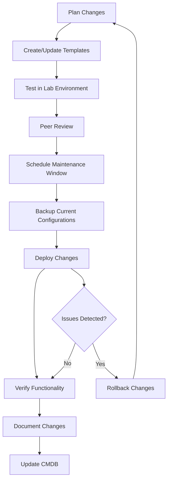

# Networks Configuration Management

## Introduction

Network Configuration Management is a critical discipline within network management that focuses on establishing and maintaining consistent network device configurations across an organization's infrastructure. As networks grow in complexity and scale, managing configurations manually becomes increasingly error-prone and time-consuming. This is where configuration management comes in - providing systematic approaches to handle network device settings, updates, and changes.

In this guide, we'll explore the fundamentals of network configuration management, its importance in maintaining network stability, and practical tools and techniques to implement effective configuration management practices.

## Why Network Configuration Management Matters

Network Configuration Management is essential for several reasons:

- **Consistency**: Ensures all network devices follow standardized configurations
- **Reliability**: Reduces network downtime caused by configuration errors
- **Security**: Helps maintain security policies across all devices
- **Compliance**: Assists in meeting regulatory requirements
- **Troubleshooting**: Provides historical configuration data for problem-solving
- **Efficiency**: Automates repetitive configuration tasks

## Core Components of Network Configuration Management

### Configuration Templates

Templates provide standardized configurations that can be applied across multiple devices, ensuring consistency and reducing manual errors.

```bash
# Example Cisco IOS Router Template
hostname {{HOSTNAME}}
!
interface GigabitEthernet0/0
 description {{WAN_DESCRIPTION}}
 ip address {{WAN_IP}} {{WAN_SUBNET}}
 no shutdown
!
ip route 0.0.0.0 0.0.0.0 {{DEFAULT_GATEWAY}}
!
```

This template uses variables (enclosed in double curly braces) that can be replaced with specific values for each device.

### Configuration Backup and Versioning

Regular backups of network device configurations with proper versioning are crucial for:

1. Recovery from failed changes
2. Auditing purposes
3. Troubleshooting configuration-related issues

```bash
# Example script to back up Cisco device configuration
#!/bin/bash

# Variables
IP="192.168.1.1"
USERNAME="admin"
PASSWORD="secure_password"
BACKUP_DIR="/backups/network"
DATE=$(date +%Y%m%d-%H%M)

# Create backup directory if it doesn't exist
mkdir -p $BACKUP_DIR

# Backup the configuration
sshpass -p "$PASSWORD" ssh $USERNAME@$IP "show running-config" > $BACKUP_DIR/router-$IP-$DATE.conf

echo "Backup completed: router-$IP-$DATE.conf"
```

### Configuration Drift Detection

Configuration drift occurs when device configurations deviate from their intended state due to manual changes or other factors. Detecting and resolving configuration drift is a key aspect of configuration management.

```python
# Simple Python script to detect configuration drift
import difflib

def compare_configs(baseline_file, current_file):
    with open(baseline_file, 'r') as f1:
        baseline = f1.readlines()
    
    with open(current_file, 'r') as f2:
        current = f2.readlines()
    
    diff = difflib.unified_diff(baseline, current, fromfile=baseline_file, 
                               tofile=current_file, lineterm='')
    
    differences = list(diff)
    if differences:
        print("Configuration drift detected:")
        for line in differences:
            print(line)
    else:
        print("No configuration drift detected.")

# Usage
compare_configs('router1_baseline.conf', 'router1_current.conf')
```

### Automated Configuration Deployment

Automation is essential for scaling configuration management across large networks. Tools like Ansible, Puppet, and Chef help push configurations to multiple devices simultaneously.

```yaml
# Example Ansible playbook for configuring Cisco switches
---
- name: Configure access switches
  hosts: access_switches
  gather_facts: no
  
  vars:
    ntp_servers:
      - 10.1.1.1
      - 10.1.1.2
    syslog_server: 10.2.1.5
  
  tasks:
    - name: Configure hostname
      cisco.ios.ios_config:
        lines:
          - hostname {{ inventory_hostname }}
    
    - name: Configure NTP
      cisco.ios.ios_config:
        lines:
          - ntp server {{ item }}
      loop: "{{ ntp_servers }}"
    
    - name: Configure syslog
      cisco.ios.ios_config:
        lines:
          - logging host {{ syslog_server }}
          - logging trap notifications
```

## Network Configuration Management Workflow

An effective configuration management workflow typically follows these steps:



Let's explore each step:

1. **Plan Changes**: Identify requirements and plan configuration changes
2. **Create/Update Templates**: Develop or modify configuration templates
3. **Test in Lab**: Validate changes in a test environment
4. **Peer Review**: Have another engineer review the changes
5. **Schedule Maintenance**: Coordinate change implementation during low-impact periods
6. **Backup Configurations**: Create a backup of current configurations before changes
7. **Deploy Changes**: Implement the planned changes
8. **Verify Functionality**: Test that the network operates correctly after changes
9. **Document Changes**: Update documentation with the changes made
10. **Update CMDB**: Update the Configuration Management Database
11. **Rollback if Needed**: Return to previous configuration if issues arise

## Configuration Management Tools

Several tools can help streamline network configuration management:

### 1. Version Control Systems

Tools like Git provide version tracking for configuration files:

```bash
# Initialize a Git repository for network configurations
git init network-configs

# Add configuration files
git add .

# Commit changes with descriptive message
git commit -m "Add initial router configurations for branch offices"

# Create a branch for testing new configurations
git checkout -b test-vlan-changes
```

### 2. Configuration Automation Tools

#### Ansible

Ansible is a popular choice for network automation due to its agentless architecture.

```yaml
# Example inventory file for Ansible
[routers]
router1 ansible_host=192.168.1.1
router2 ansible_host=192.168.1.2

[switches]
switch1 ansible_host=192.168.2.1
switch2 ansible_host=192.168.2.2

[network:children]
routers
switches

[network:vars]
ansible_network_os=ios
ansible_user=admin
ansible_password=secure_password
ansible_connection=network_cli
```

#### Terraform

Terraform can manage network infrastructure as code:

```hcl
# Example Terraform configuration for Cisco devices
provider "ciscoasa" {
  username = "admin"
  password = var.cisco_password
  host     = "192.168.1.1"
}

resource "ciscoasa_network_object" "internal_network" {
  name  = "INTERNAL_NETWORK"
  value = "10.0.0.0/24"
}

resource "ciscoasa_acl" "allow_internal" {
  name    = "ALLOW_INTERNAL"
  rule {
    source      = ciscoasa_network_object.internal_network.name
    destination = "any"
    action      = "permit"
  }
}
```

### 3. Specialized Network Management Tools

Commercial solutions like:

- Cisco DNA Center
- SolarWinds Network Configuration Manager
- ManageEngine Network Configuration Manager

Offer comprehensive features for enterprise network configuration management.

## Best Practices for Network Configuration Management

### 1. Standardization

Develop standard templates for common device types and roles. For example:

```bash
# Standard Interface Description Format
interface GigabitEthernet0/0
 description [LOCATION]-[DEVICE_TYPE]-[CONNECTION_TYPE]-[REMOTE_DEVICE]
```

### 2. Change Control Process

Implement a formal change control process:

- Document the proposed change
- Assess impact and risks
- Obtain approvals
- Schedule implementation
- Plan rollback procedures
- Test and verify

### 3. Regular Audits

Conduct regular configuration audits to:

- Identify unauthorized changes
- Ensure compliance with security policies
- Detect potential vulnerabilities
- Verify standardization

### 4. Documentation

Maintain comprehensive documentation:

- Network diagrams
- IP addressing schemes
- Configuration standards
- Change history
- Troubleshooting procedures

## Real-World Example: Enterprise Network Configuration Management

Let's walk through a practical example of implementing configuration management for an enterprise with multiple branch offices.

### Scenario:

- 1 headquarters location
- 10 branch offices
- Each location has 2 routers, 5 switches, and 2 firewalls
- Need to implement standardized configurations with location-specific parameters

### Solution:

1. **Create a Configuration Repository**:

```bash
mkdir -p network-configs/{templates,deployments,backups}
cd network-configs
git init
```

2. **Develop Templates**:

```jinja
# templates/branch-router.j2
hostname {{ location }}-RTR-{{ number }}
!
interface GigabitEthernet0/0
 description WAN-TO-HQ
 ip address {{ wan_ip }} {{ wan_subnet }}
 no shutdown
!
interface GigabitEthernet0/1
 description LAN-INTERNAL
 ip address {{ lan_ip }} {{ lan_subnet }}
 no shutdown
!
ip route 0.0.0.0 0.0.0.0 {{ wan_gateway }}
!
ntp server 10.0.0.10
logging host 10.0.0.20
!
line vty 0 4
 login local
 transport input ssh
!
username admin secret {{ admin_password }}
!
```

3. **Create Variable Files**:

```yaml
# deployments/branch1-vars.yml
location: BRANCH1
devices:
  - type: router
    number: 01
    wan_ip: 203.0.113.2
    wan_subnet: 255.255.255.252
    wan_gateway: 203.0.113.1
    lan_ip: 10.1.0.1
    lan_subnet: 255.255.255.0
  - type: router
    number: 02
    wan_ip: 203.0.113.6
    wan_subnet: 255.255.255.252
    wan_gateway: 203.0.113.5
    lan_ip: 10.1.0.2
    lan_subnet: 255.255.255.0
```

4. **Create Deployment Script**:

```python
#!/usr/bin/env python3
import os
import yaml
import jinja2
import paramiko
import datetime

def render_template(template_file, variables):
    """Render a Jinja2 template with the provided variables"""
    with open(template_file, 'r') as f:
        template_content = f.read()
    
    template = jinja2.Template(template_content)
    return template.render(variables)

def deploy_config(device_ip, username, password, config):
    """Deploy configuration to a device"""
    try:
        ssh = paramiko.SSHClient()
        ssh.set_missing_host_key_policy(paramiko.AutoAddPolicy())
        ssh.connect(device_ip, username=username, password=password)
        
        # Enter configuration mode
        channel = ssh.invoke_shell()
        channel.send('conf t
')
        
        # Send configuration line by line
        for line in config.splitlines():
            channel.send(line + '
')
        
        # Exit configuration mode and save
        channel.send('end
')
        channel.send('write memory
')
        
        # Wait for completion
        output = ""
        while not channel.exit_status_ready():
            if channel.recv_ready():
                output += channel.recv(1024).decode('utf-8')
        
        ssh.close()
        return True, output
    except Exception as e:
        return False, str(e)

def backup_config(device_ip, username, password):
    """Backup device configuration"""
    try:
        ssh = paramiko.SSHClient()
        ssh.set_missing_host_key_policy(paramiko.AutoAddPolicy())
        ssh.connect(device_ip, username=username, password=password)
        
        stdin, stdout, stderr = ssh.exec_command('show running-config')
        config = stdout.read().decode('utf-8')
        
        # Create backup file
        timestamp = datetime.datetime.now().strftime('%Y%m%d-%H%M%S')
        backup_file = f"backups/{device_ip}-{timestamp}.conf"
        
        with open(backup_file, 'w') as f:
            f.write(config)
        
        ssh.close()
        return True, backup_file
    except Exception as e:
        return False, str(e)

# Main deployment function
def main():
    # Load credentials (in a real environment, use a more secure method)
    username = 'admin'
    password = 'secure_password'
    
    # Process each branch
    branches_dir = 'deployments'
    for filename in os.listdir(branches_dir):
        if filename.endswith('-vars.yml'):
            with open(os.path.join(branches_dir, filename), 'r') as f:
                branch_vars = yaml.safe_load(f)
            
            location = branch_vars['location']
            print(f"Processing {location}...")
            
            # Process each device in the branch
            for device in branch_vars['devices']:
                if device['type'] == 'router':
                    template_file = 'templates/branch-router.j2'
                    device_ip = device['wan_ip']
                    
                    # Merge branch and device variables
                    variables = {**branch_vars, **device}
                    
                    # Render configuration
                    config = render_template(template_file, variables)
                    
                    # Backup existing configuration
                    print(f"Backing up {device_ip}...")
                    success, result = backup_config(device_ip, username, password)
                    if success:
                        print(f"Backup saved to {result}")
                    else:
                        print(f"Backup failed: {result}")
                        continue
                    
                    # Deploy new configuration
                    print(f"Deploying configuration to {device_ip}...")
                    success, result = deploy_config(device_ip, username, password, config)
                    if success:
                        print(f"Deployment successful")
                    else:
                        print(f"Deployment failed: {result}")

if __name__ == '__main__':
    main()
```

This implementation allows for:
- Standardized configurations across all branches
- Location-specific customization
- Automated deployment
- Configuration backups
- Version control

## Configuration Validation and Compliance

Ensuring configurations meet security and compliance requirements is another important aspect of configuration management.

### Example: Checking for Security Compliance

```python
import re

def check_compliance(config_file, rules):
    """Check if a configuration file complies with security rules"""
    with open(config_file, 'r') as f:
        config = f.read()
    
    violations = []
    
    for rule in rules:
        if rule['type'] == 'presence':
            if not re.search(rule['pattern'], config, re.MULTILINE):
                violations.append(f"Missing required configuration: {rule['description']}")
        elif rule['type'] == 'absence':
            if re.search(rule['pattern'], config, re.MULTILINE):
                violations.append(f"Prohibited configuration found: {rule['description']}")
    
    return violations

# Example usage
security_rules = [
    {
        'type': 'presence',
        'pattern': r'password encryption aes',
        'description': 'Password encryption must be enabled'
    },
    {
        'type': 'presence',
        'pattern': r'login authentication',
        'description': 'Authentication must be configured for all access methods'
    },
    {
        'type': 'absence',
        'pattern': r'no ip domain-lookup',
        'description': 'DNS lookups should be enabled'
    }
]

violations = check_compliance('router1-config.txt', security_rules)
if violations:
    print("Compliance violations found:")
    for violation in violations:
        print(f"- {violation}")
else:
    print("Configuration passes all compliance checks")
```

## Advanced Topic: Network Configuration as Code

Modern network management is increasingly moving toward treating network configurations as code, similar to software development practices.

Benefits include:

- **Version Control**: Track changes over time
- **Collaboration**: Multiple engineers can work on configurations
- **Testing**: Test configurations before deployment
- **Automation**: Deploy configurations programmatically
- **Documentation**: Self-documenting infrastructure

Example using Nornir (a Python automation framework):

```python
from nornir import InitNornir
from nornir_utils.plugins.functions import print_result
from nornir_netmiko.tasks import netmiko_send_config

# Initialize Nornir with inventory
nr = InitNornir(
    config_file="config.yaml",
    dry_run=True,  # Set to False for actual deployment
)

# Filter devices by type
routers = nr.filter(device_type="router")

# Configuration commands to apply
commands = [
    "ntp server 10.0.0.1",
    "ntp server 10.0.0.2",
    "logging host 10.0.0.5",
    "logging trap notifications",
    "service timestamps log datetime msec",
]

# Apply configuration to all routers
result = routers.run(
    task=netmiko_send_config,
    config_commands=commands,
)

# Print results
print_result(result)
```

## Summary

Network Configuration Management is a critical discipline for maintaining stable, secure, and reliable networks. Key takeaways include:

- Standardized configuration templates ensure consistency across devices
- Regular backups and version control provide protection against errors
- Automated deployment reduces manual errors and saves time
- Configuration validation ensures security compliance
- Treating network configuration as code brings software development best practices to networking

By implementing effective configuration management practices, organizations can reduce downtime, improve security, and make their network operations more efficient and scalable.

## Additional Resources

### Books and Guides

- "Network Programmability and Automation" by Jason Edelman, Scott S. Lowe & Matt Oswalt
- "Practical Network Automation" by Abhishek Ratan

### Online Resources

- [NIST Guide to Enterprise Patch Management Technologies](https://nvlpubs.nist.gov/nistpubs/SpecialPublications/NIST.SP.800-40r3.pdf)
- Cisco DevNet Learning Labs

## Exercises

1. **Basic Exercise**: Create a basic configuration template for a network switch that includes VLAN configuration, spanning tree settings, and management access.

2. **Intermediate Exercise**: Write a Python script that backs up configurations from multiple network devices and compares them to a baseline to detect configuration drift.

3. **Advanced Exercise**: Implement a complete configuration management solution using Ansible for a small network consisting of 2 routers, 4 switches, and a firewall. Include:
   - Configuration templates
   - Variable files for device-specific settings
   - Backup and restore capability
   - Compliance checking