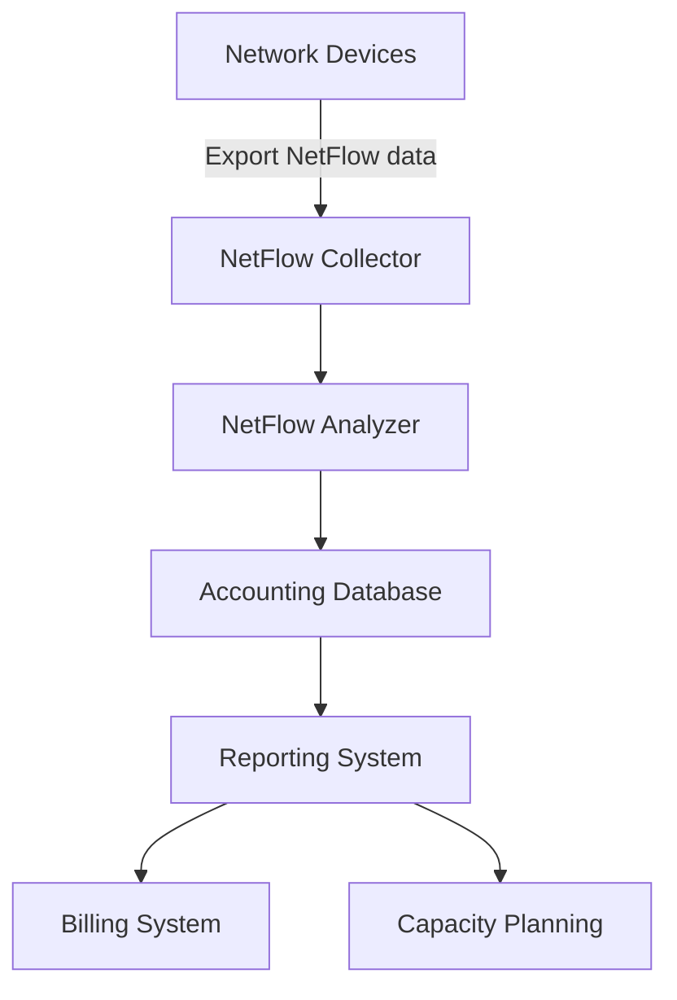
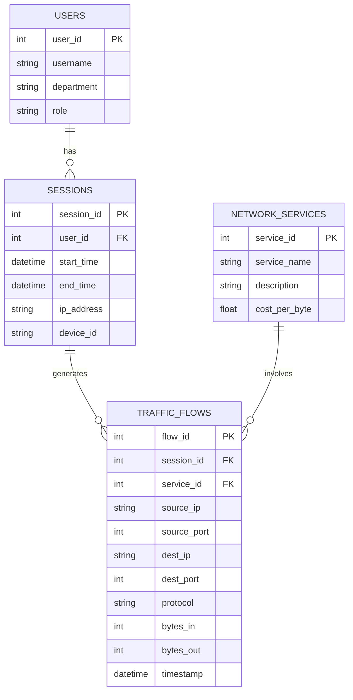

# Networks Accounting Management

## Introduction

Network Accounting Management is a crucial component of overall network management that focuses on tracking and measuring resource usage across a network. It involves monitoring who is using network resources, how much they're using, and for what purposes. This information is essential for billing purposes, resource allocation, capacity planning, and detecting potential security issues.

In this guide, we'll explore the fundamentals of Networks Accounting Management, its importance in modern networks, and how to implement basic accounting mechanisms in your network environment.

## What is Networks Accounting Management?

Network Accounting Management is one of the five pillars of the FCAPS network management model (Fault, Configuration, Accounting, Performance, and Security). The accounting aspect specifically deals with:

1. **Resource Usage Tracking**: Monitoring bandwidth consumption, connection time, and service utilization
2. **User Activity Monitoring**: Recording which users access which resources and services
3. **Usage-Based Billing**: Generating billing information based on resource consumption
4. **Quota Management**: Enforcing usage limits for users or departments
5. **Trend Analysis**: Identifying patterns in network usage over time

For beginners in network management, understanding accounting principles is essential for building efficient, cost-effective, and secure networks.

## Key Accounting Metrics

Before diving into implementation, let's understand the common metrics tracked in network accounting:

- **Bandwidth usage**: Volume of data transferred (bytes in/out)
- **Connection time**: Duration of network connections
- **Service access counts**: Number of times specific services are accessed
- **Resource utilization**: CPU, memory, and storage use on network devices
- **Application-specific metrics**: Usage patterns for specific network applications

## Implementing Basic Network Accounting

Let's explore how to implement basic network accounting using common tools and protocols.

### Using SNMP for Basic Accounting

Simple Network Management Protocol (SNMP) is widely used for collecting accounting information. Here's a basic example using Python's `pysnmp` library to gather interface statistics:

```python
from pysnmp.hlapi import *

def get_interface_statistics(device_ip, community, interface_index):
    # OIDs for interface counters
    in_octets_oid = '1.3.6.1.2.1.2.2.1.10.' + str(interface_index)  # ifInOctets
    out_octets_oid = '1.3.6.1.2.1.2.2.1.16.' + str(interface_index)  # ifOutOctets
    
    # Query for inbound traffic
    error_indication, error_status, error_index, var_binds = next(
        getCmd(SnmpEngine(),
               CommunityData(community),
               UdpTransportTarget((device_ip, 161)),
               ContextData(),
               ObjectType(ObjectIdentity(in_octets_oid)))
    )
    
    if error_indication:
        print(f"Error: {error_indication}")
        return None
    
    in_octets = var_binds[0][1]
    
    # Query for outbound traffic
    error_indication, error_status, error_index, var_binds = next(
        getCmd(SnmpEngine(),
               CommunityData(community),
               UdpTransportTarget((device_ip, 161)),
               ContextData(),
               ObjectType(ObjectIdentity(out_octets_oid)))
    )
    
    if error_indication:
        print(f"Error: {error_indication}")
        return None
    
    out_octets = var_binds[0][1]
    
    return {
        'in_octets': in_octets,
        'out_octets': out_octets
    }

# Example usage
router_ip = '192.168.1.1'
community_string = 'public'
interface = 1  # Usually 1 is the first interface

stats = get_interface_statistics(router_ip, community_string, interface)
print(f"Inbound traffic: {stats['in_octets']} bytes")
print(f"Outbound traffic: {stats['out_octets']} bytes")
```

Expected output:
```
Inbound traffic: 1258764 bytes
Outbound traffic: 8574962 bytes
```

This basic script retrieves the total number of bytes sent and received on a specific interface, which is fundamental accounting data.

### Using NetFlow/IPFIX for Detailed Accounting

For more detailed accounting, NetFlow or IPFIX (IP Flow Information Export) provides comprehensive flow-based network traffic measurements. Here's how a basic NetFlow collection system works:



To implement a basic NetFlow collector in Python using the `nfstream` library:

```python
import nfstream
import pandas as pd
from datetime import datetime

def collect_netflow_data(interface, duration_seconds):
    print(f"Starting NetFlow collection on {interface} for {duration_seconds} seconds...")
    
    # Create a new streamer
    my_streamer = nfstream.NFStreamer(source=interface, 
                                      decode_tunnels=True,
                                      bpf_filter=None,
                                      promiscuous_mode=True,
                                      snapshot_length=1536,
                                      idle_timeout=30,
                                      active_timeout=300,
                                      accounting_mode=0,
                                      udps=None,
                                      n_dissections=20,
                                      statistical_analysis=False,
                                      splt_analysis=0,
                                      n_meters=0,
                                      max_nflows=0)
    
    # Collect flows for the specified duration
    flows = []
    for flow in my_streamer:
        flows.append(flow)
        
    # Convert to pandas DataFrame for easier analysis
    df = pd.DataFrame([flow.to_dict() for flow in flows])
    
    # Generate a simple accounting report
    report = {
        'total_flows': len(df),
        'total_bytes': df['bidirectional_bytes'].sum(),
        'bytes_per_ip': df.groupby('src_ip')['bidirectional_bytes'].sum().to_dict(),
        'top_protocols': df['protocol'].value_counts().head(5).to_dict(),
        'timestamp': datetime.now().strftime('%Y-%m-%d %H:%M:%S')
    }
    
    return report

# Example usage
interface = "eth0"  # Replace with your network interface
duration = 60  # Collect data for 60 seconds

accounting_data = collect_netflow_data(interface, duration)

# Print the report
print("
Network Accounting Report:")
print(f"Time: {accounting_data['timestamp']}")
print(f"Total Flows: {accounting_data['total_flows']}")
print(f"Total Bytes: {accounting_data['total_bytes']} bytes")
print("
Top 5 Protocols:")
for protocol, count in accounting_data['top_protocols'].items():
    print(f"  {protocol}: {count} flows")
print("
Top IP Addresses by Bandwidth:")
sorted_ips = sorted(accounting_data['bytes_per_ip'].items(), 
                   key=lambda x: x[1], reverse=True)[:5]
for ip, bytes_used in sorted_ips:
    print(f"  {ip}: {bytes_used} bytes")
```

Example output:
```
Starting NetFlow collection on eth0 for 60 seconds...

Network Accounting Report:
Time: 2025-03-15 14:32:15
Total Flows: 1258
Total Bytes: 45782964 bytes

Top 5 Protocols:
  TCP: 875 flows
  UDP: 342 flows
  ICMP: 31 flows
  HTTP: 8 flows
  DNS: 2 flows

Top IP Addresses by Bandwidth:
  192.168.1.105: 23456789 bytes
  192.168.1.110: 12345678 bytes
  192.168.1.120: 5678901 bytes
  192.168.1.115: 2345678 bytes
  192.168.1.125: 1234567 bytes
```

## Accounting Database Design

For effective network accounting, you need a well-designed database to store and analyze accounting data. Here's a simplified schema for a network accounting database:



You can implement this schema in SQL as follows:

```sql
CREATE TABLE Users (
    user_id INT PRIMARY KEY,
    username VARCHAR(50) NOT NULL,
    department VARCHAR(50),
    role VARCHAR(30)
);

CREATE TABLE Sessions (
    session_id INT PRIMARY KEY,
    user_id INT,
    start_time DATETIME NOT NULL,
    end_time DATETIME,
    ip_address VARCHAR(15) NOT NULL,
    device_id VARCHAR(50),
    FOREIGN KEY (user_id) REFERENCES Users(user_id)
);

CREATE TABLE NetworkServices (
    service_id INT PRIMARY KEY,
    service_name VARCHAR(50) NOT NULL,
    description TEXT,
    cost_per_byte DECIMAL(10,8)
);

CREATE TABLE TrafficFlows (
    flow_id INT PRIMARY KEY,
    session_id INT,
    service_id INT,
    source_ip VARCHAR(15) NOT NULL,
    source_port INT,
    dest_ip VARCHAR(15) NOT NULL,
    dest_port INT,
    protocol VARCHAR(10),
    bytes_in BIGINT,
    bytes_out BIGINT,
    timestamp DATETIME NOT NULL,
    FOREIGN KEY (session_id) REFERENCES Sessions(session_id),
    FOREIGN KEY (service_id) REFERENCES NetworkServices(service_id)
);
```

## Creating Usage Reports

Once you've collected accounting data, you need to generate meaningful reports. Here's a Python example using Pandas and Matplotlib to create a simple usage report:

```python
import pandas as pd
import matplotlib.pyplot as plt
import sqlite3
from datetime import datetime, timedelta

def generate_usage_report(db_path, days=7):
    # Connect to the database
    conn = sqlite3.connect(db_path)
    
    # Calculate the date range
    end_date = datetime.now()
    start_date = end_date - timedelta(days=days)
    
    # Query to get daily bandwidth usage by department
    query = """
    SELECT 
        strftime('%Y-%m-%d', t.timestamp) as date,
        u.department,
        SUM(t.bytes_in + t.bytes_out) as total_bytes
    FROM 
        TrafficFlows t
    JOIN 
        Sessions s ON t.session_id = s.session_id
    JOIN 
        Users u ON s.user_id = u.user_id
    WHERE 
        t.timestamp BETWEEN ? AND ?
    GROUP BY 
        date, u.department
    ORDER BY 
        date, u.department
    """
    
    # Load data into a DataFrame
    df = pd.read_sql_query(query, conn, params=(start_date, end_date))
    
    # Close connection
    conn.close()
    
    # Pivot the data for better visualization
    pivot_df = df.pivot(index='date', columns='department', values='total_bytes')
    
    # Fill NaN values with 0
    pivot_df = pivot_df.fillna(0)
    
    # Convert bytes to gigabytes for readability
    pivot_df = pivot_df / (1024 * 1024 * 1024)
    
    # Create stacked bar chart
    ax = pivot_df.plot(kind='bar', stacked=True, figsize=(12, 6))
    ax.set_xlabel('Date')
    ax.set_ylabel('Bandwidth Usage (GB)')
    ax.set_title('Daily Bandwidth Usage by Department')
    plt.xticks(rotation=45)
    plt.tight_layout()
    
    # Save the chart
    report_path = f"bandwidth_report_{start_date.strftime('%Y%m%d')}_to_{end_date.strftime('%Y%m%d')}.png"
    plt.savefig(report_path)
    plt.close()
    
    # Generate summary statistics
    summary = {
        'total_usage_gb': pivot_df.sum().sum(),
        'avg_daily_usage_gb': pivot_df.sum(axis=1).mean(),
        'top_department': pivot_df.sum().idxmax(),
        'top_department_usage_gb': pivot_df.sum()[pivot_df.sum().idxmax()],
        'report_period': f"{start_date.strftime('%Y-%m-%d')} to {end_date.strftime('%Y-%m-%d')}"
    }
    
    return {
        'chart_path': report_path,
        'summary': summary,
        'daily_data': pivot_df
    }

# Example usage
report = generate_usage_report('network_accounting.db', days=30)
print("Network Usage Report Summary:")
print(f"Period: {report['summary']['report_period']}")
print(f"Total Bandwidth Usage: {report['summary']['total_usage_gb']:.2f} GB")
print(f"Average Daily Usage: {report['summary']['avg_daily_usage_gb']:.2f} GB")
print(f"Department with Highest Usage: {report['summary']['top_department']}")
print(f"Top Department Usage: {report['summary']['top_department_usage_gb']:.2f} GB")
```

## Implementing Usage-Based Billing

One of the primary purposes of network accounting is to enable usage-based billing. Here's a simple implementation:

```python
def calculate_billing(db_path, billing_period_start, billing_period_end):
    # Connect to the database
    conn = sqlite3.connect(db_path)
    
    # Query to calculate usage costs by user/department
    query = """
    SELECT 
        u.user_id,
        u.username,
        u.department,
        SUM(t.bytes_in + t.bytes_out) as total_bytes,
        SUM((t.bytes_in + t.bytes_out) * ns.cost_per_byte) as cost
    FROM 
        TrafficFlows t
    JOIN 
        Sessions s ON t.session_id = s.session_id
    JOIN 
        Users u ON s.user_id = u.user_id
    JOIN
        NetworkServices ns ON t.service_id = ns.service_id
    WHERE 
        t.timestamp BETWEEN ? AND ?
    GROUP BY 
        u.user_id, u.username, u.department
    ORDER BY 
        cost DESC
    """
    
    # Load data into a DataFrame
    df = pd.read_sql_query(query, conn, params=(billing_period_start, billing_period_end))
    
    # Close connection
    conn.close()
    
    # Generate billing report
    department_billing = df.groupby('department').agg({
        'total_bytes': 'sum',
        'cost': 'sum'
    }).reset_index()
    
    # Convert bytes to gigabytes for readability
    department_billing['total_gb'] = department_billing['total_bytes'] / (1024 * 1024 * 1024)
    
    return {
        'user_billing': df,
        'department_billing': department_billing,
        'total_cost': df['cost'].sum(),
        'billing_period': f"{billing_period_start} to {billing_period_end}"
    }

# Example usage
from datetime import datetime

start_date = '2025-02-01 00:00:00'
end_date = '2025-02-28 23:59:59'

billing = calculate_billing('network_accounting.db', start_date, end_date)

# Print department billing summary
print(f"Billing Report for period: {billing['billing_period']}")
print("
Department Billing Summary:")
print(billing['department_billing'][['department', 'total_gb', 'cost']])

print(f"
Total Billing Amount: ${billing['total_cost']:.2f}")
```

Example output:
```
Billing Report for period: 2025-02-01 00:00:00 to 2025-02-28 23:59:59

Department Billing Summary:
     department  total_gb      cost
0  Engineering    1250.45  12504.50
1      Finance     458.21   4582.10
2         Sales     752.67   7526.70
3     Marketing     625.33   6253.30

Total Billing Amount: $30866.60
```

## Real-World Applications

Network accounting management is essential in various scenarios:

### 1. Internet Service Providers (ISPs)

ISPs use network accounting to:
- Track bandwidth usage for customer billing
- Enforce data caps and fair usage policies
- Plan for network capacity based on usage patterns
- Detect unusual traffic that might indicate security issues

### 2. Enterprise Networks

In corporate environments, accounting helps:
- Allocate network costs to different departments
- Justify IT infrastructure investments
- Identify bandwidth-hungry applications
- Enforce compliance with network usage policies

### 3. Cloud Service Providers

Cloud providers implement extensive accounting to:
- Bill customers based on resource consumption
- Provide detailed usage reports
- Offer auto-scaling based on usage metrics
- Detect potential security issues or resource misuse

## Best Practices for Network Accounting

To implement effective accounting management:

1. **Define Clear Metrics**: Identify exactly what you need to measure based on business requirements
2. **Use Appropriate Tools**: Select accounting tools that match your network size and complexity
3. **Implement Regular Reporting**: Set up automated reports to track usage trends
4. **Ensure Data Security**: Protect accounting data as it may contain sensitive information
5. **Validate Billing Accuracy**: Regularly check that accounting data correctly reflects actual usage
6. **Retain Historical Data**: Keep historical accounting information for trend analysis
7. **Document Policies**: Clearly define usage policies and how accounting information applies to billing

## Implementation Challenges

When implementing network accounting, be aware of these common challenges:

1. **Volume of Data**: Accounting systems can generate enormous amounts of data, requiring efficient storage and processing
2. **Privacy Concerns**: Accounting data may contain sensitive information about user activities
3. **Accuracy Issues**: Ensuring that all network traffic is properly captured and attributed
4. **Performance Impact**: High-volume accounting can impact network device performance
5. **Integration Complexity**: Integrating accounting with billing and management systems

## Summary

Network Accounting Management is a crucial component of comprehensive network management. It provides the data needed for billing, resource allocation, capacity planning, and security monitoring. By implementing proper accounting mechanisms, network administrators can ensure fair resource usage, optimize network investments, and provide accurate usage reporting.

As networks continue to grow in complexity, effective accounting management becomes even more important. The tools and techniques covered in this guide provide a starting point for implementing basic accounting systems that can be expanded as needed.

## Additional Resources and Exercises

### Resources for Further Learning

- RFC 2975: "Introduction to Accounting Management"
- RFC 2924: "Accounting Attributes and Record Formats"
- Books: "Network Management: Principles and Practice" by Mani Subramanian

### Exercises to Practice

1. **Basic SNMP Data Collection**:
   - Set up an SNMP server (like Net-SNMP) on a test machine
   - Write a script to collect interface statistics over a 24-hour period
   - Generate a report showing peak usage times

2. **NetFlow Monitoring Project**:
   - Configure a router or switch to export NetFlow data
   - Set up a NetFlow collector (like nfcapd)
   - Create a dashboard showing top talkers and applications

3. **Accounting Database Implementation**:
   - Implement the database schema described in this guide
   - Create a script to populate it with test data
   - Write queries to generate various accounting reports

4. **Billing System Integration**:
   - Extend the accounting database with billing rates
   - Implement a monthly billing report generator
   - Add features for different rate plans based on time of day or service type

5. **Advanced Project: Complete Accounting System**:
   - Combine all the components into a complete accounting system
   - Add a web interface for viewing reports and managing the system
   - Implement alerts for usage thresholds