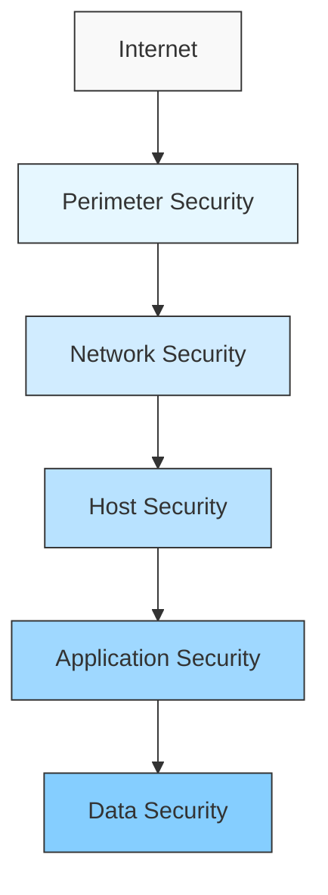
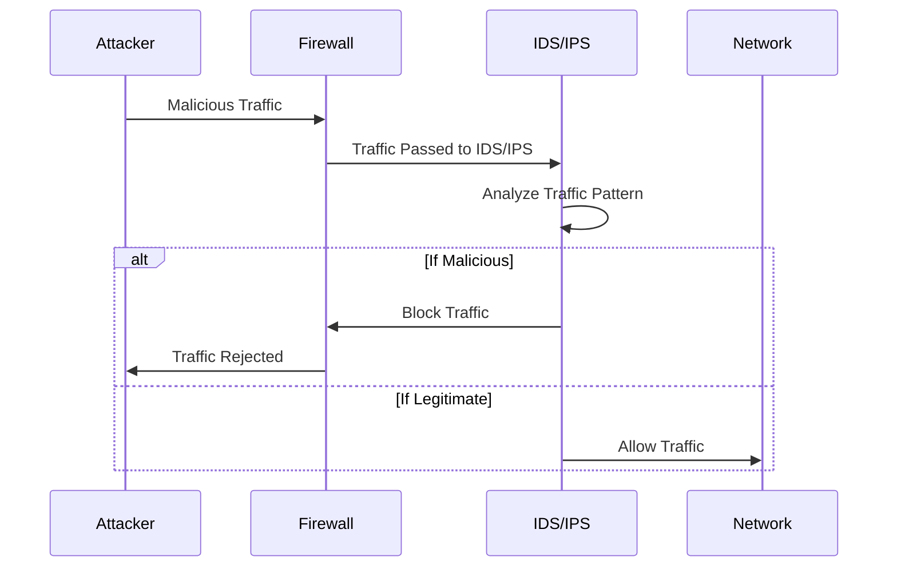
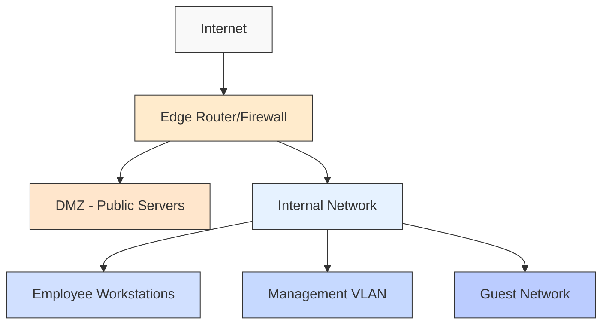

# Network Security Management

## Introduction

Network Security Management is the process of protecting a computer network infrastructure against threats, unauthorized access, and data breaches. As networks become increasingly complex and vital for organizations, implementing robust security measures is essential for maintaining data integrity, confidentiality, and availability.

This guide introduces fundamental concepts of network security management for beginners, providing a solid foundation for understanding how to protect network resources in today's interconnected world.

## Why Network Security Management Matters

In our connected world, network security breaches can lead to:

- Unauthorized access to sensitive data
- Financial losses
- Damage to reputation
- Legal consequences
- Service disruptions

According to recent studies, the average cost of a data breach in 2024 exceeded $4.5 million, making network security not just a technical concern but a business imperative.

## Core Network Security Concepts

### 1. Defense in Depth

Defense in depth is a security strategy that employs multiple layers of protection throughout a network. If one security measure fails, others remain in place.



### 2. CIA Triad

The CIA triad represents the three core objectives of network security:

- **Confidentiality**: Ensuring that information is accessible only to authorized users
- **Integrity**: Maintaining the accuracy and reliability of data
- **Availability**: Guaranteeing that authorized users have reliable access to resources when needed

### 3. Principle of Least Privilege

This principle involves giving users only the minimum level of access or permissions needed to perform their job functions.

## Essential Network Security Components

### 1. Firewalls

Firewalls act as barriers between trusted and untrusted networks, controlling traffic based on predetermined security rules.

#### Types of Firewalls:

- **Packet Filtering Firewalls**: Examine packets and allow or deny based on rules
- **Stateful Inspection Firewalls**: Track the state of network connections
- **Application Layer Firewalls**: Operate at the application layer to filter traffic
- **Next-Generation Firewalls (NGFW)**: Combine traditional firewall capabilities with advanced features

#### Basic Firewall Rule Example:

```bash
# Allow incoming SSH connections from a specific IP range
iptables -A INPUT -p tcp -s 192.168.1.0/24 --dport 22 -j ACCEPT

# Block all other incoming SSH connection attempts
iptables -A INPUT -p tcp --dport 22 -j DROP
```

### 2. Intrusion Detection and Prevention Systems (IDS/IPS)

- **IDS**: Monitors network traffic for suspicious activity and alerts administrators
- **IPS**: Actively blocks or prevents detected threats

#### How IDS/IPS Work:



### 3. Virtual Private Networks (VPNs)

VPNs create encrypted tunnels for secure communication over public networks.

#### Basic OpenVPN Configuration Example:

```bash
# Server configuration
port 1194
proto udp
dev tun
ca ca.crt
cert server.crt
key server.key
dh dh2048.pem
server 10.8.0.0 255.255.255.0
push "redirect-gateway def1 bypass-dhcp"
keepalive 10 120
comp-lzo
user nobody
group nogroup
persist-key
persist-tun
status openvpn-status.log
verb 3
```

### 4. Encryption

Encryption transforms readable data into encoded text to prevent unauthorized access.

#### Encryption Types:

- **Symmetric Encryption**: Uses the same key for encryption and decryption
- **Asymmetric Encryption**: Uses a pair of keys (public and private)
- **Transport Layer Security (TLS)**: Secures data in transit

#### Simple Encryption Example with Python:

```python
from cryptography.fernet import Fernet

# Generate a key
key = Fernet.generate_key()
cipher_suite = Fernet(key)

# Encrypt a message
message = b"Sensitive network configuration data"
encrypted_message = cipher_suite.encrypt(message)
print(f"Encrypted: {encrypted_message}")

# Decrypt the message
decrypted_message = cipher_suite.decrypt(encrypted_message)
print(f"Decrypted: {decrypted_message}")
```

**Output:**
```
Encrypted: b'gAAAAABk1Jh7t3...[truncated for brevity]...KqCB1VjpAg=='
Decrypted: b'Sensitive network configuration data'
```

## Network Security Monitoring

Effective security management requires continuous monitoring and analysis of network activity.

### Key Monitoring Components:

1. **Log Management**
2. **Security Information and Event Management (SIEM)**
3. **Network Traffic Analysis**
4. **Vulnerability Scanning**

### Example Log Analysis with ELK Stack:

The Elasticsearch, Logstash, and Kibana (ELK) stack is commonly used for log aggregation and analysis.

```yaml
# Simple Logstash configuration for network logs
input {
  file {
    path => "/var/log/firewall.log"
    start_position => "beginning"
  }
}

filter {
  grok {
    match => { "message" => "%{COMBINEDAPACHELOG}" }
  }
  date {
    match => [ "timestamp", "dd/MMM/yyyy:HH:mm:ss Z" ]
  }
}

output {
  elasticsearch {
    hosts => ["localhost:9200"]
    index => "firewall-logs-%{+YYYY.MM.dd}"
  }
}
```

## Implementing Network Access Control

Access control is about managing who can access your network resources and what they can do with them.

### Authentication Methods:

1. **Username and Password**: Basic authentication
2. **Multi-Factor Authentication (MFA)**: Adds additional verification steps
3. **Certificate-Based Authentication**: Uses digital certificates
4. **Biometric Authentication**: Uses physical characteristics

### Simple RADIUS Server Configuration:

```bash
# /etc/raddb/clients.conf
client 192.168.1.0/24 {
  secret = "shared_secret_key"
  shortname = internal_network
}

# /etc/raddb/users
username Auth-Type := PAP, User-Password == "securepassword"
  Service-Type = Login-User,
  Framed-Protocol = PPP,
  Framed-IP-Address = 192.168.1.100
```

## Practical Implementation: Setting Up a Basic Secure Network

Let's walk through a practical example of securing a small office network:

### Step 1: Network Segmentation

Divide the network into segments based on security requirements:



### Step 2: Configure Firewall Rules

```bash
# Allow internal users to access the internet
iptables -A FORWARD -i eth1 -o eth0 -j ACCEPT

# Allow established connections
iptables -A FORWARD -i eth0 -o eth1 -m state --state ESTABLISHED,RELATED -j ACCEPT

# Deny all other incoming traffic
iptables -A FORWARD -i eth0 -o eth1 -j DROP

# Allow specific services in DMZ
iptables -A FORWARD -i eth0 -o eth2 -p tcp --dport 443 -j ACCEPT
iptables -A FORWARD -i eth0 -o eth2 -p tcp --dport 80 -j ACCEPT
```

### Step 3: Implement VPN for Remote Access

Use OpenVPN or other VPN solutions to enable secure remote access for employees.

### Step 4: Set Up Network Monitoring

Configure monitoring tools like Nagios, Zabbix, or ELK stack to monitor network activity.

### Step 5: Regular Security Audits

Implement a schedule for security audits and vulnerability scans.

## Best Practices for Network Security Management

1. **Regular Updates and Patching**: Keep all network devices, operating systems, and applications up to date
2. **Strong Password Policies**: Enforce complex passwords and regular password changes
3. **Network Segmentation**: Separate network resources based on security requirements
4. **Regular Backups**: Maintain regular backups of critical data and systems
5. **Security Awareness Training**: Educate users about security threats and best practices
6. **Incident Response Plan**: Develop and test a plan for responding to security incidents
7. **Documentation**: Maintain detailed documentation of network configurations and security policies

## Security Tools Every Network Administrator Should Know

1. **Wireshark**: Network protocol analyzer
2. **Nmap**: Network scanner
3. **Metasploit**: Penetration testing framework
4. **OpenVAS**: Vulnerability scanner
5. **Snort**: Intrusion detection system
6. **Fail2ban**: Intrusion prevention system
7. **Kali Linux**: Security-focused Linux distribution

## Common Network Security Threats

### 1. Malware

Malicious software designed to damage systems or steal data.

#### Protection Measures:
- Antivirus software
- Regular system updates
- User awareness training

### 2. Phishing Attacks

Attempts to steal sensitive information by masquerading as a trustworthy entity.

#### Protection Measures:
- Email filtering
- User education
- Multi-factor authentication

### 3. Denial of Service (DoS) Attacks

Attacks designed to make a network or service unavailable.

#### Protection Measures:
- Traffic filtering
- Rate limiting
- Content Delivery Networks (CDNs)

### 4. Man-in-the-Middle Attacks

Intercepting communication between two parties.

#### Protection Measures:
- Encryption (HTTPS, TLS)
- Certificate validation
- Secure communication channels

## Compliance and Regulatory Considerations

Depending on your industry, you may need to comply with regulations such as:

- **GDPR**: European data protection regulation
- **HIPAA**: Healthcare information protection (US)
- **PCI DSS**: Payment card industry standards
- **SOX**: Financial reporting standards (US)

## Summary

Network security management is a critical aspect of modern IT infrastructure. By implementing a defense-in-depth approach with multiple security layers, organizations can significantly reduce the risk of breaches and unauthorized access.

Remember that network security is not a one-time setup but an ongoing process that requires continuous monitoring, updates, and improvements as new threats emerge and technologies evolve.

## Exercises and Practice Activities

1. **Firewall Configuration Exercise**:
   - Set up a basic firewall on a virtual machine
   - Create rules to allow specific services while blocking others
   - Test the configuration with various access attempts

2. **Security Audit Challenge**:
   - Perform a security audit on a test network
   - Identify and document potential vulnerabilities
   - Suggest improvements to enhance security

3. **Incident Response Simulation**:
   - Create a scenario for a security breach
   - Develop and implement an incident response plan
   - Document the steps taken and lessons learned

## Additional Resources

- **Books**:
  - "Network Security Essentials" by William Stallings
  - "Practical Network Security" by Nina Godbole

- **Online Courses**:
  - CompTIA Security+ Certification
  - Cisco Certified Network Associate (CCNA) Security

- **Websites and Communities**:
  - SANS Internet Storm Center
  - Open Web Application Security Project (OWASP)
  - Krebs on Security

By following the principles and practices outlined in this guide, you'll be well on your way to implementing effective network security management for your organization.