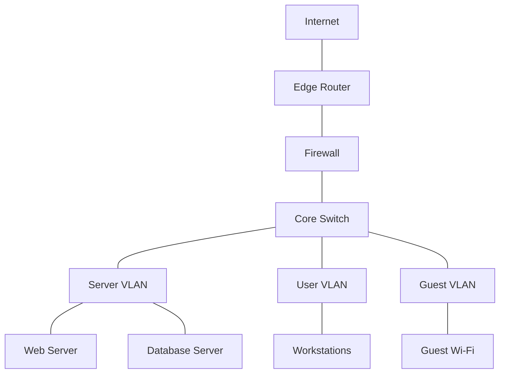
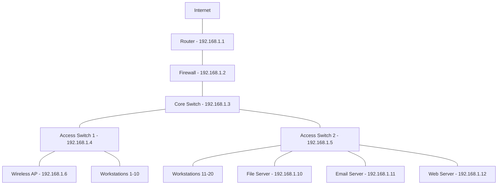

# Network Documentation

## Introduction

Network documentation is a critical aspect of network management that involves creating and maintaining detailed records of your network infrastructure, configurations, policies, and procedures. Proper documentation serves as a foundation for effective network management, troubleshooting, and future planning.

For beginners in network management, understanding how to document networks effectively is an essential skill that will save countless hours during network issues and provide a clear roadmap for network growth.

## Why Network Documentation Matters

Network documentation is not just busywork—it provides numerous benefits:

- **Faster troubleshooting**: When issues arise, documentation helps identify the source quickly
- **Knowledge transfer**: New team members can understand the network without relying on tribal knowledge
- **Disaster recovery**: Properly documented networks can be rebuilt more easily after failures
- **Compliance requirements**: Many industries require detailed network documentation
- **Improved security**: Documentation helps identify vulnerabilities and ensure proper security measures
- **Change management**: Track modifications to network infrastructure over time

## Essential Components of Network Documentation

### 1. Network Topology Diagrams

Network diagrams provide visual representations of your network's physical and logical layouts. They should include:



Different types of network diagrams include:

- **Physical topology diagrams**: Show actual physical connections
- **Logical topology diagrams**: Show how data flows through the network
- **Rack diagrams**: Show equipment placement in server racks
- **Wiring diagrams**: Document cable paths and connections

### 2. Network Inventory

Your inventory should include all network devices with details such as:

```
| Device      | Make/Model    | IP Address   | MAC Address       | Location     | Purpose          |
|-------------|---------------|--------------|-------------------|--------------|------------------|
| Router01    | Cisco 4321    | 192.168.1.1  | 00:11:22:33:44:55 | Server Room  | Edge Router      |
| Switch01    | HP ProCurve   | 192.168.1.2  | AA:BB:CC:DD:EE:FF | Server Room  | Core Switch      |
| AP01        | Ubiquiti UAP  | 192.168.1.10 | 11:22:33:44:55:66 | Office Floor | Wireless Access  |
```

This information can be maintained in spreadsheets, specialized IT asset management software, or network management systems.

### 3. IP Address Management (IPAM)

Document your IP address allocation scheme:

```
| Network       | VLAN ID | Purpose         | Available IPs | Used IPs | Notes                   |
|---------------|---------|-----------------|---------------|----------|-------------------------|
| 192.168.1.0/24| 10      | Management      | 254          | 12       | Network equipment only  |
| 192.168.10.0/24| 20     | User Workstations| 254         | 156      | DHCP range: .50-.200    |
| 192.168.20.0/24| 30     | Servers         | 254          | 28       | Static IP assignments   |
| 192.168.30.0/24| 40     | Guest Network   | 254          | varies   | Isolated from internal  |
```

### 4. Configuration Backups

Store backup configurations for all network devices. Here's a simple script example to back up Cisco device configurations:

```python
#!/usr/bin/env python3
import paramiko
import time
import os
from datetime import datetime

# Device connection details
device = {
    'ip': '192.168.1.1',
    'username': 'admin',
    'password': 'secure_password',
    'device_type': 'cisco_ios'
}

# Create backup directory with date
backup_dir = f"backup_{datetime.now().strftime('%Y%m%d')}"
if not os.path.exists(backup_dir):
    os.makedirs(backup_dir)

# Connect to device
ssh_client = paramiko.SSHClient()
ssh_client.set_missing_host_key_policy(paramiko.AutoAddPolicy())
ssh_client.connect(device['ip'], username=device['username'], password=device['password'])

# Start interactive shell
shell = ssh_client.invoke_shell()

# Send commands
shell.send('terminal length 0
')
time.sleep(1)
shell.send('show running-config
')
time.sleep(5)

# Get output
output = shell.recv(65535).decode('utf-8')

# Save to file
filename = f"{backup_dir}/{device['ip']}_config.txt"
with open(filename, 'w') as f:
    f.write(output)

print(f"Backup saved to {filename}")

# Close connection
ssh_client.close()
```

For a production environment, you would want to:
1. Loop through multiple devices
2. Implement proper error handling
3. Use secure credential storage
4. Schedule regular backups

### 5. Standard Operating Procedures (SOPs)

Document common network procedures, such as:

- Adding new devices to the network
- Creating/modifying VLANs
- User access provisioning
- Firewall rule changes
- Backup and recovery procedures

Example SOP for adding a new network switch:

```markdown
# SOP: Adding a New Network Switch

## Purpose
This procedure documents the process for adding a new network switch to the existing infrastructure.

## Prerequisites
- New switch (model approved by IT)
- Console cable
- Network cables
- Latest approved firmware
- IP address assignment from IPAM

## Procedure
1. Rack the switch in the designated location
2. Connect console cable and perform initial configuration:
   - Set hostname: switch-[location]-[number]
   - Configure management IP from IPAM
   - Set admin credentials
   - Configure SSH access
3. Update firmware to current approved version
4. Configure VLANs according to network standards
5. Configure port security settings
6. Connect uplink to core switch
7. Test connectivity
8. Document the new switch in:
   - Network inventory
   - Network diagram
   - IPAM system

## Verification
- Verify ping to management interface
- Verify SSH access
- Verify proper VLAN configuration
- Verify spanning tree operation

## Documentation Update
Update the following documentation:
- Network inventory with switch details
- IPAM with IP assignment
- Network diagrams showing new switch
- Backup the final configuration
```

### 6. Network Change Log

Track all changes made to your network:

```
| Date       | Change Description                  | Performed By | Approved By | Ticket # |
|------------|-------------------------------------|--------------|-------------|----------|
| 2023-05-15 | Added VLAN 40 for IoT devices       | Jane Smith   | John Doe    | CHG-1234 |
| 2023-05-20 | Updated firewall rules for new VPN  | Mike Johnson | Sarah Lee   | CHG-1235 |
| 2023-06-01 | Replaced failed switch in Rack B4   | Jane Smith   | John Doe    | INC-5678 |
```

### 7. Network Policies and Security Documentation

Document network policies including:

- Password policy
- Access control policy
- Firewall rule management
- Wireless network security
- Remote access requirements
- Incident response procedures

Example password policy:

```markdown
# Network Device Password Policy

## Purpose
To establish standards for creating and managing passwords for network infrastructure devices.

## Scope
This policy applies to all network devices including routers, switches, firewalls, wireless controllers, and access points.

## Policy
1. All default passwords must be changed before devices are deployed in production
2. Passwords must be a minimum of 14 characters
3. Passwords must include:
   - Uppercase letters
   - Lowercase letters
   - Numbers
   - Special characters
4. Device passwords must be changed every 90 days
5. Previous 5 passwords cannot be reused
6. Passwords must be stored in the approved password management system
7. Only administrators with proper clearance have access to network device passwords
8. All password changes must be documented in the change management system
```

## Documentation Tools

Several tools can help with network documentation:

1. **Diagramming tools**:
   - Lucidchart
   - draw.io
   - Microsoft Visio

2. **IPAM solutions**:
   - NetBox
   - phpIPAM
   - SolarWinds IPAM

3. **Network monitoring systems with documentation capabilities**:
   - LibreNMS
   - Nagios
   - PRTG Network Monitor

4. **Configuration management**:
   - Ansible
   - Git repositories
   - Network Configuration Manager

5. **Knowledge base systems**:
   - Confluence
   - MediaWiki
   - Docusaurus (like your current platform)

## Documentation Best Practices

1. **Keep it updated**: Outdated documentation is often worse than no documentation
2. **Standardize formats**: Create templates for consistency
3. **Automate where possible**: Use scripts to gather information automatically
4. **Version control**: Track changes to documentation over time
5. **Make it accessible**: Store documentation where team members can easily access it
6. **Regular reviews**: Schedule periodic reviews to keep documentation current
7. **Balance detail**: Include enough detail to be useful without overwhelming

## Practical Example: Documenting a Small Office Network

Let's walk through documenting a small office network with:
- 1 Internet router
- 1 Firewall
- 2 Switches
- 1 Wireless access point
- 20 Workstations
- 3 Servers

### Step 1: Create Network Diagram



### Step 2: Document IP Address Scheme

```
VLAN 10 - Management: 192.168.1.0/24
VLAN 20 - Staff: 192.168.10.0/24
VLAN 30 - Servers: 192.168.20.0/24
VLAN 40 - Guest: 192.168.30.0/24
```

### Step 3: Document Configuration Standards

Example switch configuration standard:

```
! Standard Switch Configuration Template
hostname SWITCH-[LOCATION]-[NUMBER]
!
enable secret [SECURE-PASSWORD]
!
no ip domain-lookup
ip domain-name company.local
!
username admin privilege 15 secret [SECURE-PASSWORD]
!
vlan 10
 name Management
vlan 20
 name Staff
vlan 30
 name Servers
vlan 40
 name Guest
!
interface Vlan10
 ip address [ASSIGNED-IP] 255.255.255.0
 no shutdown
!
ip default-gateway 192.168.1.1
!
line con 0
 logging synchronous
 login local
line vty 0 15
 logging synchronous
 login local
 transport input ssh
!
ntp server 192.168.1.10
!
service timestamps log datetime msec
logging 192.168.1.10
!
spanning-tree mode rapid-pvst
!
end
```

### Step 4: Create Device Inventory

Maintain a detailed inventory of all network devices with support contract information, purchase dates, warranty details, and maintenance schedules.

### Step 5: Document Backup Procedures

```markdown
# Network Backup Procedure

## Scheduled Backups
- Configuration backups run automatically every night at 1:00 AM
- Backups stored on backup server at 192.168.1.15:/backups/network
- Retention policy: Daily backups kept for 30 days, monthly backups kept for 1 year

## Manual Backup Process
1. Log into device
2. Execute appropriate backup command:
   - Cisco: `show running-config`
   - FortiGate: `show full-configuration`
   - HP: `show running-config`
3. Save output to file with naming convention: [device-name]_[date]_config.txt
4. Upload file to backup server

## Restoration Process
1. Connect to device via console
2. Enter configuration mode
3. Apply configuration using appropriate method:
   - Cisco: `copy tftp://192.168.1.15/backup/[filename] running-config`
   - FortiGate: Restore from management interface
   - HP: `copy tftp://192.168.1.15/backup/[filename] startup-config`
4. Verify configuration
5. Document the restoration in the change log
```

## Automating Network Documentation

As your network grows, manual documentation becomes increasingly difficult. Consider these automation approaches:

### Using Python for Automated Inventory

```python
#!/usr/bin/env python3
import csv
from netmiko import ConnectHandler
import json

# List of devices to inventory
devices = [
    {
        'device_type': 'cisco_ios',
        'ip': '192.168.1.1',
        'username': 'admin',
        'password': 'password123',
    },
    {
        'device_type': 'cisco_ios',
        'ip': '192.168.1.2',
        'username': 'admin',
        'password': 'password123',
    }
]

# Create CSV file for inventory
with open('network_inventory.csv', 'w', newline='') as csvfile:
    fieldnames = ['hostname', 'ip_address', 'model', 'ios_version', 'serial_number']
    writer = csv.DictWriter(csvfile, fieldnames=fieldnames)
    writer.writeheader()
    
    # Connect to each device and gather information
    for device in devices:
        try:
            # Connect to device
            connection = ConnectHandler(**device)
            
            # Get hostname
            hostname = connection.send_command('show run | include hostname')
            hostname = hostname.split('hostname ')[1] if 'hostname' in hostname else 'Unknown'
            
            # Get version info
            version_info = connection.send_command('show version', use_textfsm=True)
            
            if version_info and isinstance(version_info, list) and len(version_info) > 0:
                version_data = version_info[0]
                model = version_data.get('hardware', 'Unknown')
                ios_version = version_data.get('version', 'Unknown')
                serial = version_data.get('serial', 'Unknown')
            else:
                model = 'Error retrieving'
                ios_version = 'Error retrieving'
                serial = 'Error retrieving'
            
            # Write to CSV
            writer.writerow({
                'hostname': hostname,
                'ip_address': device['ip'],
                'model': model,
                'ios_version': ios_version,
                'serial_number': serial
            })
            
            connection.disconnect()
            print(f"Successfully inventoried {device['ip']}")
            
        except Exception as e:
            print(f"Failed to inventory {device['ip']}: {str(e)}")

print("Inventory complete. Results saved to network_inventory.csv")
```

This script requires the following packages: `netmiko` and `textfsm`.

### Using Network Management Systems

Modern network management systems can automatically discover and document your network, including:

- Device configurations
- Network topology
- IP address usage
- Performance metrics
- Changes over time

## Best Practices for Continuous Documentation

Documentation is not a one-time project but an ongoing process:

1. **Make documentation part of change management**: No change is complete until documentation is updated
2. **Review regularly**: Schedule quarterly reviews of all documentation
3. **Assign ownership**: Make specific team members responsible for different aspects
4. **Automate where possible**: Use scripts and tools to keep information current
5. **Use version control**: Track changes to documentation over time
6. **Validate accuracy**: Periodically verify that documentation matches reality
7. **Collect feedback**: Ask team members what's missing or unclear

## Summary

Network documentation is a critical foundation for effective network management. Proper documentation:

- Accelerates troubleshooting
- Facilitates knowledge transfer
- Supports disaster recovery
- Assists with compliance
- Improves security posture
- Enables effective change management

For beginners, starting with basic documentation and gradually expanding is the best approach. Focus on:

1. Network diagrams
2. Device inventory
3. IP address management
4. Configuration backups
5. Standard procedures
6. Change logs

As your skills and network grow, incorporate automation tools to maintain accurate documentation with less manual effort.

## Additional Resources and Exercises

### Resources
- Cisco Network Documentation Guide
- NIST Special Publication 800-53: Security and Privacy Controls
- Reddit r/networking community
- NetworkLessons.com documentation tutorials

### Exercises

1. **Create a basic network diagram** of your home network including all connected devices
2. **Develop an IP addressing scheme** for a small business with three departments
3. **Write a standard operating procedure** for adding a new user to your network
4. **Research network automation tools** and evaluate which might work best for your environment
5. **Create a disaster recovery plan** that utilizes your network documentation

Remember that good documentation is an investment that pays dividends when problems arise or when scaling your network infrastructure.