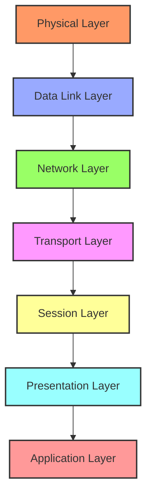
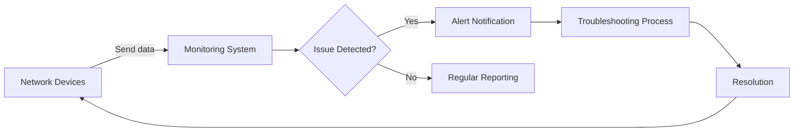

# Networks Troubleshooting

## Introduction

Network troubleshooting is the systematic process of identifying, diagnosing, and resolving problems within computer networks. As networks grow in complexity, the ability to effectively troubleshoot becomes increasingly valuable. This guide will walk you through a structured approach to network troubleshooting, equipping you with the knowledge and tools to diagnose and fix common network issues.

Network issues can manifest in various ways - from complete connectivity loss to intermittent performance problems. By following a methodical approach, you can efficiently pinpoint the source of problems and implement appropriate solutions.

## The Troubleshooting Mindset

Before diving into specific techniques, it's important to develop the right mindset for troubleshooting:

1. **Stay calm and methodical** - Network issues can be stressful, especially when services are down. A systematic approach yields better results than random attempts.
2. **Document everything** - Record what you observe, what you try, and the results. This creates a valuable reference for current and future issues.
3. **Test one change at a time** - Making multiple changes simultaneously makes it difficult to identify what actually fixed the problem.
4. **Consider the simplest explanation first** - Often the issue is something basic like a disconnected cable or misconfigured setting.

## The Network Troubleshooting Process

### Step 1: Identify the Problem

The first step is clearly defining what's not working:

- What exactly is happening (or not happening)?
- When did the problem start?
- Is it affecting all users or just some?
- Is it constant or intermittent?
- Has anything changed recently in the network environment?

### Step 2: Establish a Theory

Based on the symptoms, form hypotheses about potential causes. Consider the OSI model layers for a structured approach.



### Step 3: Test Your Theory

Use appropriate tools and commands to test your hypotheses. Here are essential diagnostic tools:

#### Basic Connectivity Tools

**ping** - Tests basic connectivity to a host:

```bash
ping 192.168.1.1
```

Example output:
```
PING 192.168.1.1 (192.168.1.1) 56(84) bytes of data.
64 bytes from 192.168.1.1: icmp_seq=1 ttl=64 time=0.345 ms
64 bytes from 192.168.1.1: icmp_seq=2 ttl=64 time=0.411 ms
64 bytes from 192.168.1.1: icmp_seq=3 ttl=64 time=0.375 ms
```

**traceroute/tracert** - Shows the path packets take to a destination:

```bash
# On Linux/Mac
traceroute google.com

# On Windows
tracert google.com
```

Example output:
```
traceroute to google.com (142.250.190.78), 30 hops max, 60 byte packets
 1  _gateway (192.168.1.1)  0.339 ms  0.313 ms  0.304 ms
 2  192.168.100.1 (192.168.100.1)  1.546 ms  1.539 ms  1.534 ms
 3  10.10.10.1 (10.10.10.1)  5.476 ms  5.471 ms  5.463 ms
 ...
```

**nslookup/dig** - Tests DNS resolution:

```bash
# On Linux/Mac
dig google.com

# On Windows
nslookup google.com
```

Example output:
```
; <<>> DiG 9.16.1-Ubuntu <<>> google.com
;; global options: +cmd
;; Got answer:
;; ->>HEADER<<- opcode: QUERY, status: NOERROR, id: 16892
;; flags: qr rd ra; QUERY: 1, ANSWER: 1, AUTHORITY: 0, ADDITIONAL: 1
...
```

#### Advanced Diagnostic Tools

**netstat** - Displays network connections, routing tables, and interface statistics:

```bash
# Display all active connections and listening ports
netstat -a

# Display network interfaces
netstat -i
```

**tcpdump/Wireshark** - Captures and analyzes network packets:

```bash
# Capture packets on interface eth0
sudo tcpdump -i eth0
```

Example output:
```
13:24:30.123456 IP 192.168.1.100.52146 > 192.168.1.1.53: 12345+ A? google.com. (28)
13:24:30.234567 IP 192.168.1.1.53 > 192.168.1.100.52146: 12345 1/0/0 A 142.250.190.78 (44)
```

### Step 4: Create an Action Plan

Based on your findings, develop a plan to resolve the issue. This might involve:

- Correcting configuration settings
- Updating firmware or software
- Replacing hardware components
- Reconfiguring network services

### Step 5: Implement the Solution

Execute your plan carefully, making one change at a time. Document each step.

### Step 6: Verify System Functionality

Confirm that the solution resolved the problem by testing the functionality that was previously failing.

### Step 7: Document the Process

Record the entire troubleshooting process, including:
- Initial symptoms
- Diagnostic steps performed
- Solution implemented
- Verification results

This documentation helps with future troubleshooting and knowledge sharing.

## Common Network Issues and Solutions

### 1. Physical Connectivity Problems

**Symptoms:**
- No network connection
- Link lights off on network devices
- "Network cable unplugged" errors

**Troubleshooting Steps:**
1. Check all physical connections (cables, ports, etc.)
2. Test cables with a cable tester
3. Try different ports or cables
4. Check for hardware damage

**Example:**

```bash
# Check interface status on Linux
ip link show

# Check interface status on Windows
ipconfig /all
```

### 2. IP Configuration Issues

**Symptoms:**
- "Limited or no connectivity" warnings
- Can connect to local network but not internet
- Unable to reach certain network resources

**Troubleshooting Steps:**
1. Verify IP address configuration
2. Check for IP address conflicts
3. Verify default gateway and DNS settings
4. Test DHCP functionality

**Example:**

```bash
# Linux IP configuration check
ip addr show
ip route show

# Windows IP configuration check
ipconfig /all
```

### 3. DNS Resolution Problems

**Symptoms:**
- Can ping IP addresses but not domain names
- "Server not found" errors in browsers
- Some applications work while others fail

**Troubleshooting Steps:**
1. Check DNS server settings
2. Test DNS resolution with nslookup or dig
3. Check local hosts file
4. Try alternative DNS servers

**Example resolving domain name:**

```bash
dig google.com

# Or on Windows
nslookup google.com
```

### 4. Routing Issues

**Symptoms:**
- Can access local resources but not remote ones
- Inconsistent connectivity to specific networks
- High packet loss or latency to certain destinations

**Troubleshooting Steps:**
1. Check routing tables
2. Trace the route to problematic destinations
3. Verify router/gateway functionality
4. Check for network segmentation issues

**Example checking routes:**

```bash
# On Linux
ip route show

# On Windows
route print
```

### 5. Performance Problems

**Symptoms:**
- Slow network speeds
- High latency
- Intermittent connectivity

**Troubleshooting Steps:**
1. Test network bandwidth
2. Check for network congestion
3. Monitor resource utilization
4. Identify bandwidth-intensive applications

**Example bandwidth test:**

```bash
# Using iperf to test bandwidth between two hosts
# On server
iperf -s

# On client
iperf -c server_ip
```

## Best Practices for Network Troubleshooting

### Network Documentation

Maintain updated documentation including:
- Network topology diagrams
- IP address allocations
- Configuration settings
- Change logs

### Network Monitoring

Implement proactive monitoring to detect issues before they cause major problems:



### Regular Network Maintenance

Perform routine maintenance to prevent issues:
- Update firmware and software
- Check for hardware failures
- Validate backups
- Review security settings

## Troubleshooting Case Study: Web Application Connectivity Issue

### Scenario
Users report they cannot access a web application hosted on an internal server.

### Step-by-Step Troubleshooting

**1. Identify the problem scope:**
- Is it affecting all users or just some?
- Can other applications or services be accessed?
- Did the problem start after a recent change?

**2. Check basic connectivity:**

```bash
# Ping the web server
ping webserver.internal.com
```

**3. Test DNS resolution:**

```bash
# Check if the domain resolves correctly
nslookup webserver.internal.com
```

**4. Check web server status:**

```bash
# Test HTTP connection
curl -I http://webserver.internal.com
```

**5. Trace the network path:**

```bash
# Trace route to server
traceroute webserver.internal.com
```

**6. Check firewall settings:**

```bash
# Check for blocked connections
sudo iptables -L
```

**7. Resolution:**
In this scenario, the issue was traced to a misconfigured firewall rule blocking HTTP traffic to the web server. After updating the firewall rules, connectivity was restored.

## Summary

Effective network troubleshooting follows a systematic process:
1. Identify the specific problem
2. Establish theories about possible causes
3. Test each theory methodically
4. Create and implement an action plan
5. Verify the solution
6. Document everything

By applying these principles and utilizing the appropriate diagnostic tools, you can efficiently identify and resolve network issues, minimizing downtime and disruption.

## Practice Exercises

1. **Basic Network Diagnostics**
   - Set up a simple network with two computers
   - Intentionally disconnect a network cable
   - Practice troubleshooting the connection

2. **DNS Troubleshooting**
   - Configure incorrect DNS settings on a device
   - Document the symptoms observed
   - Use appropriate tools to diagnose and fix the issue

3. **Network Mapping**
   - Map your home or office network
   - Identify all connected devices
   - Document IP addresses and network roles

## Additional Resources

- **Books:**
  - "Network Warrior" by Gary A. Donahue
  - "TCP/IP Illustrated" by W. Richard Stevens

- **Online Courses:**
  - CompTIA Network+ certification materials
  - Cisco Networking Academy courses

- **Tools:**
  - Wireshark - For packet analysis
  - Nmap - For network scanning and discovery
  - Nagios - For network monitoring

Remember that network troubleshooting is both an art and a science - the more you practice, the more proficient you'll become at quickly identifying and resolving issues.