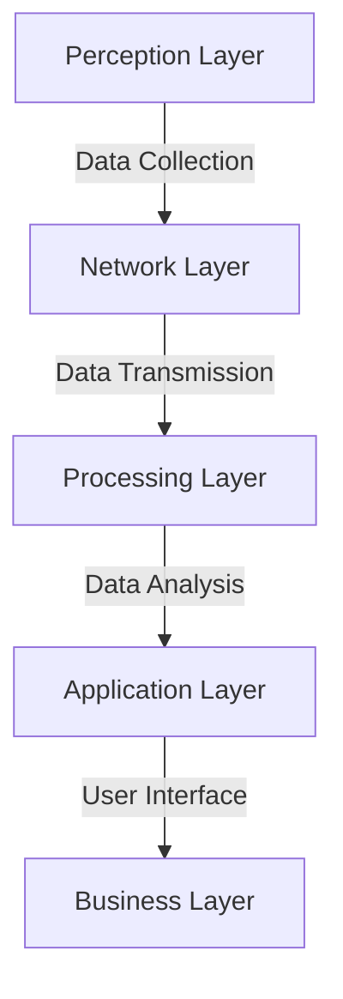
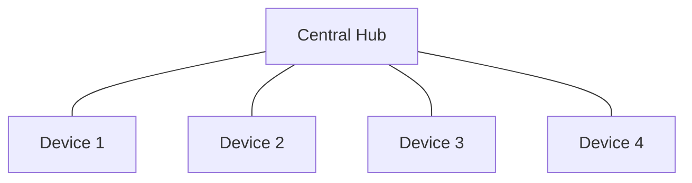
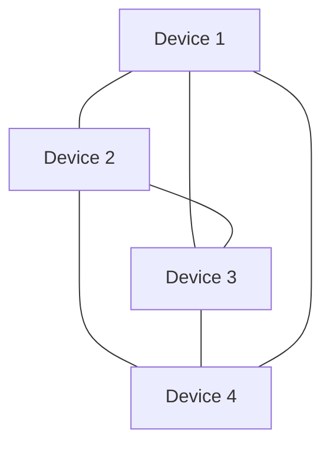
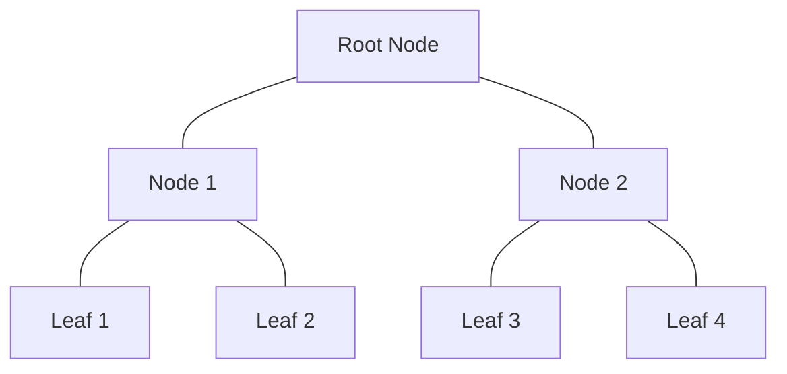
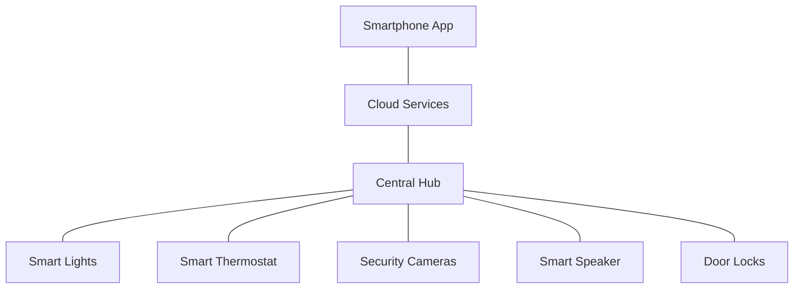

# Networks IoT Basics

## Introduction

The Internet of Things (IoT) represents one of the most significant technological revolutions of our time. At its core, IoT refers to the network of physical objects—"things"—embedded with sensors, software, and other technologies that enable them to connect and exchange data with other devices and systems over the internet. From smart home devices and wearable fitness trackers to industrial sensors and autonomous vehicles, IoT is rapidly transforming how we interact with the world around us.

In this guide, we'll explore the fundamental concepts of IoT networks, the technologies that power them, and how they're implemented in real-world applications. Whether you're a budding developer, a curious student, or simply someone interested in understanding this transformative technology, this guide will provide you with a solid foundation in IoT networking basics.

## What is IoT?

The Internet of Things (IoT) describes the network of physical objects that are embedded with sensors, software, and other technologies for the purpose of connecting and exchanging data with other devices and systems over the internet.

### Key Characteristics of IoT Devices

1. **Connectivity**: IoT devices can connect to the internet and communicate with other devices or systems.
2. **Sensing Capabilities**: Most IoT devices have sensors that collect data from their environment.
3. **Data Processing**: IoT devices can process data locally or send it to cloud-based systems for analysis.
4. **Actuation**: Many IoT devices can perform actions based on the data they collect or commands they receive.
5. **Unique Identification**: Each IoT device has a unique identifier (like an IP address) that distinguishes it within a network.

## IoT Network Architecture

IoT networks typically follow a layered architecture model. Let's break this down:



1. **Perception Layer**: This is where physical sensors and actuators operate. These devices collect data from the environment.

2. **Network Layer**: This layer is responsible for transmitting data collected by the perception layer to the processing systems.

3. **Processing Layer**: Here, data is processed, analyzed, and stored. This layer might include cloud computing services or edge computing devices.

4. **Application Layer**: This layer provides specific services to users based on the processed data.

5. **Business Layer**: This top layer manages the overall IoT system and its applications, often involving business models and strategies.

## IoT Communication Protocols

Communication protocols are essential for IoT devices to exchange data. Here are some common protocols used in IoT networks:

### Network Protocols

1. **Wi-Fi**: High-speed data transfer but higher power consumption
2. **Bluetooth Low Energy (BLE)**: Short-range, low-power wireless communication
3. **Zigbee**: Low-power, mesh networking protocol
4. **LoRaWAN**: Long-range, low-power wireless communication
5. **Cellular (3G/4G/5G)**: Wide-area coverage for mobile IoT devices

### Application Protocols

1. **MQTT (Message Queuing Telemetry Transport)**: Lightweight messaging protocol for small sensors and mobile devices
2. **CoAP (Constrained Application Protocol)**: Designed for internet devices with limited resources
3. **HTTP/HTTPS**: Standard web protocols used for RESTful APIs
4. **WebSockets**: Enables two-way communication between clients and servers

Let's see an example of how to implement a basic MQTT client in Python:

```python
import paho.mqtt.client as mqtt

# Callback when the client receives a CONNACK response from the server
def on_connect(client, userdata, flags, rc):
    print(f"Connected with result code {rc}")
    # Subscribe to a topic
    client.subscribe("iot/sensors/temperature")

# Callback when a message is received from the server
def on_message(client, userdata, msg):
    print(f"Topic: {msg.topic}
Message: {msg.payload.decode()}")

# Create a client instance
client = mqtt.Client()
client.on_connect = on_connect
client.on_message = on_message

# Connect to a broker
client.connect("mqtt.example.com", 1883, 60)

# Publish a message
client.publish("iot/sensors/temperature", "24.5")

# Start the network loop
client.loop_forever()
```

Output:
```
Connected with result code 0
Topic: iot/sensors/temperature
Message: 24.5
```

## IoT Network Topologies

IoT networks can be organized in various topologies:

### Star Topology

In a star topology, all devices connect directly to a central hub or gateway.



**Advantages**:
- Simple to implement and manage
- Device failure doesn't affect other devices
- Easy to add new devices

**Disadvantages**:
- Single point of failure (the central hub)
- Limited scalability
- Higher power requirements for distant devices

### Mesh Topology

In a mesh topology, devices are interconnected, allowing multiple paths for data.



**Advantages**:
- Increased reliability (multiple paths)
- Extended range through hopping
- Self-healing capabilities
- Better scalability

**Disadvantages**:
- Increased complexity
- Higher latency for multi-hop messages
- More processing power required on devices

### Tree Topology

Tree topology combines aspects of star and bus topologies, organized in a hierarchical structure.



**Advantages**:
- Scalable and organized
- Easier network management
- Support for different types of devices

**Disadvantages**:
- Dependent on parent nodes
- Potential bottlenecks at higher levels

## Edge Computing in IoT

Edge computing moves processing closer to where data is generated (the "edge" of the network) rather than sending all data to a centralized cloud.

### Benefits of Edge Computing in IoT

1. **Reduced Latency**: Processing data locally reduces response time
2. **Bandwidth Conservation**: Only relevant data is sent to the cloud
3. **Enhanced Privacy**: Sensitive data can be processed locally
4. **Improved Reliability**: Less dependence on internet connectivity
5. **Scalability**: Distributed processing enables handling more devices

Here's a simple example of edge computing with a Raspberry Pi that processes sensor data locally:

```python
import time
import random
from datetime import datetime

def read_temperature_sensor():
    # Simulate reading from a temperature sensor
    return round(random.uniform(20.0, 30.0), 1)

def process_data_locally(temp_reading):
    # Simple edge processing: Check if temperature exceeds threshold
    threshold = 25.0
    timestamp = datetime.now().strftime("%Y-%m-%d %H:%M:%S")
    
    if temp_reading > threshold:
        alert = True
        message = f"ALERT: High temperature detected: {temp_reading}°C at {timestamp}"
    else:
        alert = False
        message = f"Normal temperature: {temp_reading}°C at {timestamp}"
    
    return {"temperature": temp_reading, "timestamp": timestamp, "alert": alert, "message": message}

def send_to_cloud(processed_data):
    # In a real application, this would send data to a cloud service
    # Here we'll just print what would be sent
    if processed_data["alert"]:
        print(f"Sending alert to cloud: {processed_data['message']}")
    else:
        # Only send hourly updates for normal readings to save bandwidth
        current_minute = datetime.now().minute
        if current_minute == 0:
            print(f"Sending hourly update to cloud: {processed_data['message']}")

# Main loop
try:
    print("Starting IoT edge computing demo...")
    while True:
        # 1. Read sensor
        temp = read_temperature_sensor()
        
        # 2. Process data at the edge
        processed_data = process_data_locally(temp)
        
        # 3. Display locally (edge action)
        print(processed_data["message"])
        
        # 4. Selectively send to cloud
        send_to_cloud(processed_data)
        
        # Wait before next reading
        time.sleep(5)
        
except KeyboardInterrupt:
    print("Edge computing demo ended.")
```

Sample Output:
```
Starting IoT edge computing demo...
Normal temperature: 22.3°C at 2025-03-15 14:30:15
Normal temperature: 24.1°C at 2025-03-15 14:30:20
ALERT: High temperature detected: 28.7°C at 2025-03-15 14:30:25
Sending alert to cloud: ALERT: High temperature detected: 28.7°C at 2025-03-15 14:30:25
Normal temperature: 23.8°C at 2025-03-15 14:30:30
Edge computing demo ended.
```

## IoT Security Considerations

Security is a critical concern in IoT networks due to their widespread connectivity and the sensitive nature of collected data.

### Common Security Challenges

1. **Device Authentication**: Ensuring only authorized devices can connect to the network
2. **Data Encryption**: Protecting data as it travels through the network
3. **Software Updates**: Keeping device firmware and software up-to-date
4. **Physical Security**: Protecting devices from tampering
5. **Privacy Concerns**: Managing sensitive user data appropriately

### Basic Security Measures

1. **Secure Boot**: Verifying device firmware integrity during startup
2. **Device Identity**: Using unique identifiers and certificates for authentication
3. **Transport Layer Security (TLS)**: Encrypting data in transit
4. **Access Control**: Implementing proper authorization mechanisms
5. **Regular Updates**: Maintaining patched and secure systems

Here's a simple example showing how to secure MQTT communications with TLS:

```python
import ssl
import paho.mqtt.client as mqtt

# Define callback functions
def on_connect(client, userdata, flags, rc):
    print(f"Connected with result code {rc}")
    client.subscribe("iot/secure")

def on_message(client, userdata, msg):
    print(f"Received message: {msg.payload.decode()}")

# Create a client instance
client = mqtt.Client()
client.on_connect = on_connect
client.on_message = on_message

# Set up TLS
client.tls_set(
    ca_certs="ca.crt",                # Path to the CA certificate
    certfile="client.crt",            # Path to the client certificate
    keyfile="client.key",             # Path to the client key
    cert_reqs=ssl.CERT_REQUIRED,      # Require server certificate verification
    tls_version=ssl.PROTOCOL_TLS,     # Use the latest TLS protocol
    ciphers=None                      # Use default cipher suite
)

# Set username and password
client.username_pw_set("user", "password")

# Connect securely
client.connect("secure-mqtt-broker.example.com", 8883, 60)

# Publish a message
client.publish("iot/secure", "This is a secure message")

# Start the network loop
client.loop_forever()
```

## Real-World IoT Network Applications

IoT networks are transforming various industries. Here are some practical examples:

### Smart Home Automation

A basic smart home network might include:



In this scenario, devices communicate with a central hub, which connects to cloud services that can be accessed via a smartphone app.

### Industrial IoT (IIoT)

Industrial applications often use more robust protocols and have stricter requirements:

```python
# Example of reading industrial sensor data using Modbus protocol
from pymodbus.client.sync import ModbusTcpClient

def read_industrial_sensors():
    # Connect to the Modbus server (PLC or other industrial device)
    client = ModbusTcpClient('192.168.1.120', port=502)
    connection = client.connect()
    
    if connection:
        try:
            # Read input registers (containing sensor values)
            # Parameters: starting address, count
            temperature = client.read_input_registers(0, 1)
            pressure = client.read_input_registers(1, 1)
            flow_rate = client.read_input_registers(2, 1)
            
            # Scale the values based on sensor specifications
            temp_scaled = temperature.registers[0] / 10.0  # Celsius
            pressure_scaled = pressure.registers[0] / 100.0  # Bar
            flow_scaled = flow_rate.registers[0] / 10.0  # Liters/minute
            
            print(f"Temperature: {temp_scaled}°C")
            print(f"Pressure: {pressure_scaled} bar")
            print(f"Flow Rate: {flow_scaled} L/min")
            
            # Check for alarm conditions
            if temp_scaled > 80.0:
                print("WARNING: High temperature detected!")
                # In a real system, this might trigger an alert or shutdown
                
        finally:
            client.close()
    else:
        print("Failed to connect to the industrial controller")

# Call the function
read_industrial_sensors()
```

Sample Output:
```
Temperature: 65.2°C
Pressure: 3.45 bar
Flow Rate: 18.7 L/min
```

### Smart Agriculture

IoT networks in agriculture can monitor soil conditions, automate irrigation, and optimize crop yields:

```python
# Simplified example of a smart agriculture system
import time
import random

class SoilSensor:
    def read_moisture(self):
        # Simulate soil moisture reading (0-100%)
        return round(random.uniform(20, 90), 1)
    
    def read_temperature(self):
        # Simulate soil temperature in Celsius
        return round(random.uniform(15, 30), 1)
    
    def read_ph(self):
        # Simulate soil pH (0-14)
        return round(random.uniform(5.5, 7.5), 1)

class IrrigationController:
    def __init__(self):
        self.valve_open = False
    
    def open_valve(self):
        if not self.valve_open:
            print("Opening irrigation valve")
            self.valve_open = True
    
    def close_valve(self):
        if self.valve_open:
            print("Closing irrigation valve")
            self.valve_open = False

# Initialize devices
soil_sensor = SoilSensor()
irrigation = IrrigationController()

# Main control loop
def smart_farm_control():
    try:
        print("Smart Farm Monitoring System Started")
        
        while True:
            # Read sensors
            moisture = soil_sensor.read_moisture()
            temperature = soil_sensor.read_temperature()
            ph = soil_sensor.read_ph()
            
            # Log current conditions
            print(f"
--- Farm Conditions at {time.strftime('%H:%M:%S')} ---")
            print(f"Soil Moisture: {moisture}%")
            print(f"Soil Temperature: {temperature}°C")
            print(f"Soil pH: {ph}")
            
            # Decision logic for irrigation
            if moisture < 40:
                print("Soil is too dry!")
                irrigation.open_valve()
            elif moisture > 70:
                irrigation.close_valve()
                print("Soil moisture is optimal")
            
            # Decision logic for pH alerts
            if ph < 6.0:
                print("WARNING: Soil is too acidic!")
            elif ph > 7.0:
                print("WARNING: Soil is too alkaline!")
            
            # Sleep before next reading
            time.sleep(10)  # In a real system, this might be much longer
            
    except KeyboardInterrupt:
        irrigation.close_valve()  # Safety shutdown
        print("
Smart Farm Monitoring System Stopped")

# Run the system
smart_farm_control()
```

Sample Output:
```
Smart Farm Monitoring System Started

--- Farm Conditions at 14:45:23 ---
Soil Moisture: 35.8%
Soil Temperature: 22.3°C
Soil pH: 6.2
Soil is too dry!
Opening irrigation valve

--- Farm Conditions at 14:45:33 ---
Soil Moisture: 58.4%
Soil Temperature: 22.5°C
Soil pH: 6.3
```

## Challenges in IoT Networks

Despite their potential, IoT networks face several challenges:

1. **Interoperability**: Different devices and standards may not work well together
2. **Scalability**: Managing large numbers of devices can be complex
3. **Power Management**: Many IoT devices operate on batteries and require efficient power usage
4. **Security and Privacy**: Protecting sensitive data and securing numerous endpoints
5. **Network Reliability**: Ensuring consistent operation even in adverse conditions
6. **Data Management**: Handling the massive amounts of data generated by IoT devices

## Summary

In this guide, we've explored the fundamental concepts of IoT networks, including:

- The basic architecture of IoT systems
- Common communication protocols used in IoT
- Different network topologies for IoT deployments
- The role of edge computing in IoT networks
- Critical security considerations
- Real-world applications across various industries

IoT networks are revolutionizing how we interact with the world around us, creating smarter homes, more efficient industries, and improved quality of life. As this technology continues to evolve, understanding these networking basics provides a strong foundation for further exploration and development.

## Exercises for Practice

1. **Basic MQTT Communication**: Set up a simple MQTT publisher and subscriber using a free public broker like test.mosquitto.org.

2. **Edge Computing Simulation**: Create a program that simulates an edge device processing sensor data locally and only sending alerts when certain thresholds are crossed.

3. **Network Topology Design**: Design an IoT network for a specific application (e.g., smart classroom, hydroponic garden) and justify your choice of topology.

4. **Security Analysis**: Analyze a consumer IoT device and identify potential security vulnerabilities and how they might be addressed.

5. **Protocol Comparison**: Compare two IoT communication protocols (e.g., MQTT vs. CoAP) for a specific application scenario.

## Additional Resources

- **Books**:
  - "Designing the Internet of Things" by Adrian McEwen and Hakim Cassimally
  - "IoT Fundamentals: Networking Technologies, Protocols, and Use Cases for the Internet of Things" by David Hanes et al.

- **Online Courses**:
  - edX and Coursera offer several courses on IoT networking fundamentals
  - The official Arduino and Raspberry Pi websites have excellent tutorials for IoT beginners

- **Development Platforms**:
  - Arduino IoT Cloud
  - Raspberry Pi with Python
  - ESP32/ESP8266 with MicroPython or Arduino
  - AWS IoT, Azure IoT, or Google Cloud IoT platforms for cloud integration