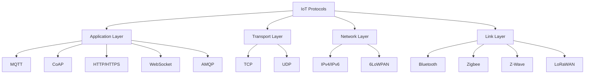
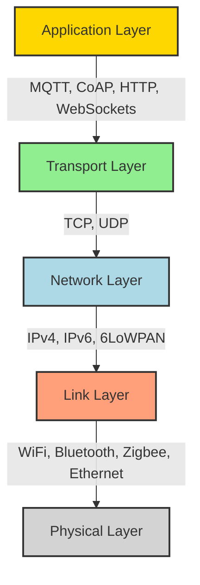

# Networks IoT Protocols

## Introduction

Internet of Things (IoT) networks rely on specialized communication protocols to enable effective data exchange between devices, sensors, gateways, and cloud platforms. These protocols are designed to address the unique challenges of IoT environments, such as:

- Limited power and processing capabilities
- Constrained bandwidth
- Need for security
- Diverse deployment scenarios
- Scalability requirements

In this guide, we'll explore the key IoT protocols that form the backbone of IoT communication, their characteristics, and how to implement them in your projects.

## Common IoT Protocols

Let's examine the most widely used protocols in IoT applications:



### 1. MQTT (Message Queuing Telemetry Transport)

MQTT is a lightweight publish/subscribe messaging protocol designed for constrained devices and low-bandwidth, high-latency networks.

#### Key Features:
- Minimal overhead (as small as 2 bytes per message)
- Publish/subscribe architecture
- Three quality of service (QoS) levels
- Last Will and Testament feature
- Retained messages

#### How MQTT Works:

1. Clients connect to a central broker
2. Clients publish messages to topics
3. Broker distributes messages to subscribed clients
4. QoS ensures message delivery reliability

#### Code Example: MQTT Client with Node.js

First, install the MQTT library:

```bash
npm install mqtt
```

Then create an MQTT publisher:

```javascript
const mqtt = require('mqtt');

// Connect to a broker
const client = mqtt.connect('mqtt://broker.example.com');

client.on('connect', () => {
  console.log('Connected to MQTT broker');
  
  // Publish temperature readings every 5 seconds
  setInterval(() => {
    const temperature = (20 + Math.random() * 10).toFixed(1);
    const message = JSON.stringify({ 
      deviceId: 'temp-sensor-001', 
      temperature: temperature,
      unit: 'celsius',
      timestamp: new Date().toISOString()
    });
    
    client.publish('sensors/temperature', message, { qos: 1 });
    console.log(`Published: ${message}`);
  }, 5000);
});

client.on('error', (error) => {
  console.error('MQTT Error:', error);
});
```

And an MQTT subscriber:

```javascript
const mqtt = require('mqtt');

// Connect to a broker
const client = mqtt.connect('mqtt://broker.example.com');

client.on('connect', () => {
  console.log('Connected to MQTT broker');
  
  // Subscribe to temperature sensor topic
  client.subscribe('sensors/temperature', { qos: 1 });
  console.log('Subscribed to sensors/temperature');
});

client.on('message', (topic, message) => {
  try {
    const data = JSON.parse(message.toString());
    console.log(`Received temperature from ${data.deviceId}: ${data.temperature}°C`);
    
    // Process the data (e.g., store in database, trigger alert)
    if (parseFloat(data.temperature) > 28) {
      console.log('ALERT: Temperature too high!');
    }
  } catch (e) {
    console.error('Error parsing message:', e);
  }
});
```

### 2. CoAP (Constrained Application Protocol)

CoAP is a specialized web transfer protocol for constrained nodes and networks in the IoT. It's designed to easily translate to HTTP for simplified integration with the web while meeting specialized requirements such as multicast support, very low overhead, and simplicity.

#### Key Features:
- UDP-based with optional reliability
- Request/response model similar to HTTP
- Low overhead and simple to implement
- Built-in discovery
- Support for multicast
- Asynchronous message exchange

#### Code Example: CoAP Client with Node.js

Install the CoAP library:

```bash
npm install coap
```

CoAP server example:

```javascript
const coap = require('coap');
const server = coap.createServer();

// Create a CoAP resource
server.on('request', (req, res) => {
  console.log('Request received', req.url);
  
  if (req.url === '/temperature') {
    // Simulate temperature sensor reading
    const temperature = (20 + Math.random() * 10).toFixed(1);
    const payload = JSON.stringify({
      temperature: temperature,
      unit: 'celsius',
      timestamp: new Date().toISOString()
    });
    
    res.setOption('Content-Format', 'application/json');
    res.code = '2.05'; // Content
    res.end(payload);
  } else {
    res.code = '4.04'; // Not Found
    res.end();
  }
});

// Start CoAP server
server.listen(() => {
  console.log('CoAP server started on port 5683');
});
```

CoAP client example:

```javascript
const coap = require('coap');

// Create a CoAP request
const req = coap.request({
  host: 'localhost',
  pathname: '/temperature',
  method: 'GET'
});

req.on('response', (res) => {
  console.log('Response code:', res.code);
  
  if (res.code === '2.05') {
    res.on('data', (data) => {
      try {
        const payload = JSON.parse(data.toString());
        console.log(`Current temperature: ${payload.temperature}°C`);
      } catch (e) {
        console.error('Error parsing response:', e);
      }
    });
  } else {
    console.error('Error:', res.code);
  }
});

req.end();
```

### 3. HTTP/HTTPS

HTTP (Hypertext Transfer Protocol) and its secure version HTTPS are fundamental web protocols also used in IoT applications, particularly for devices with sufficient resources and when compatibility with web infrastructure is important.

#### Key Features in IoT Context:
- RESTful API interfaces
- Widely supported in all platforms
- Stateless request/response model
- Not optimized for constrained devices
- Excellent for integration with existing web services

#### Code Example: HTTP-based IoT Device with Node.js

```javascript
const express = require('express');
const app = express();
const port = 3000;

// Simulate IoT device data
let deviceStatus = {
  powerOn: true,
  temperature: 22.5,
  humidity: 45,
  lastUpdated: new Date().toISOString()
};

// Parse JSON bodies
app.use(express.json());

// GET endpoint to retrieve device status
app.get('/api/status', (req, res) => {
  res.json(deviceStatus);
});

// POST endpoint to update device settings
app.post('/api/control', (req, res) => {
  const { powerOn } = req.body;
  
  if (typeof powerOn === 'boolean') {
    deviceStatus.powerOn = powerOn;
    deviceStatus.lastUpdated = new Date().toISOString();
    
    console.log(`Device power set to: ${powerOn ? 'ON' : 'OFF'}`);
    res.json({ success: true, message: 'Device updated', deviceStatus });
  } else {
    res.status(400).json({ success: false, message: 'Invalid control parameters' });
  }
});

// Start the server
app.listen(port, () => {
  console.log(`IoT device HTTP server listening at http://localhost:${port}`);
});
```

Client interaction (using `fetch` in a browser or Node.js):

```javascript
// Get device status
async function getDeviceStatus() {
  try {
    const response = await fetch('http://localhost:3000/api/status');
    const data = await response.json();
    console.log('Device status:', data);
    return data;
  } catch (error) {
    console.error('Error fetching device status:', error);
  }
}

// Control device
async function controlDevice(powerOn) {
  try {
    const response = await fetch('http://localhost:3000/api/control', {
      method: 'POST',
      headers: {
        'Content-Type': 'application/json'
      },
      body: JSON.stringify({ powerOn })
    });
    const data = await response.json();
    console.log('Control response:', data);
    return data;
  } catch (error) {
    console.error('Error controlling device:', error);
  }
}
```

### 4. WebSockets

WebSockets provide a persistent connection between a client and server, allowing for bidirectional, real-time data transfer. This makes them ideal for IoT applications requiring live updates.

#### Key Features:
- Full-duplex communication
- Single TCP connection stays open
- Low latency communication
- Ideal for real-time dashboards and monitoring
- Better performance than HTTP polling

#### Code Example: WebSocket IoT Application

Server (Node.js with `ws` library):

```javascript
const WebSocket = require('ws');
const server = new WebSocket.Server({ port: 8080 });

// Track connected clients
const clients = new Set();

// Simulate sensor readings
function generateSensorData() {
  return {
    type: 'sensorUpdate',
    temperature: (20 + Math.random() * 10).toFixed(1),
    humidity: (30 + Math.random() * 40).toFixed(1),
    light: Math.floor(Math.random() * 1000),
    timestamp: new Date().toISOString()
  };
}

// Broadcast to all connected clients
function broadcast(data) {
  const message = JSON.stringify(data);
  for (const client of clients) {
    if (client.readyState === WebSocket.OPEN) {
      client.send(message);
    }
  }
}

// Connection handler
server.on('connection', (ws) => {
  clients.add(ws);
  console.log('Client connected. Total connected clients:', clients.size);
  
  // Send initial data
  ws.send(JSON.stringify({
    type: 'welcome',
    message: 'Connected to IoT sensor stream'
  }));
  
  // Handle messages from clients
  ws.on('message', (message) => {
    try {
      const data = JSON.parse(message);
      console.log('Received message:', data);
      
      // Handle client commands
      if (data.type === 'command' && data.action) {
        console.log(`Executing command: ${data.action}`);
        ws.send(JSON.stringify({
          type: 'commandResponse',
          action: data.action,
          success: true
        }));
      }
    } catch (e) {
      console.error('Error processing message:', e);
    }
  });
  
  // Handle client disconnection
  ws.on('close', () => {
    clients.delete(ws);
    console.log('Client disconnected. Remaining clients:', clients.size);
  });
});

// Periodically send sensor data to all clients
setInterval(() => {
  if (clients.size > 0) {
    const data = generateSensorData();
    broadcast(data);
    console.log('Broadcasting sensor data:', data);
  }
}, 5000);

console.log('WebSocket IoT server started on port 8080');
```

Client (JavaScript for browser):

```javascript
// Connect to the WebSocket server
const socket = new WebSocket('ws://localhost:8080');

// Handle connection open
socket.addEventListener('open', (event) => {
  console.log('Connected to IoT WebSocket server');
  
  // UI updates to show connected status
  document.getElementById('status').textContent = 'Connected';
  document.getElementById('status').className = 'connected';
});

// Handle incoming messages
socket.addEventListener('message', (event) => {
  const data = JSON.parse(event.data);
  console.log('Message from server:', data);
  
  if (data.type === 'sensorUpdate') {
    // Update UI with sensor data
    document.getElementById('temperature').textContent = `${data.temperature}°C`;
    document.getElementById('humidity').textContent = `${data.humidity}%`;
    document.getElementById('light').textContent = `${data.light} lux`;
    document.getElementById('timestamp').textContent = new Date(data.timestamp).toLocaleTimeString();
  } else if (data.type === 'welcome') {
    console.log(data.message);
  }
});

// Handle errors
socket.addEventListener('error', (event) => {
  console.error('WebSocket error:', event);
  document.getElementById('status').textContent = 'Error';
  document.getElementById('status').className = 'error';
});

// Handle connection close
socket.addEventListener('close', (event) => {
  console.log('Connection closed');
  document.getElementById('status').textContent = 'Disconnected';
  document.getElementById('status').className = 'disconnected';
});

// Send command to server
function sendCommand(action) {
  if (socket.readyState === WebSocket.OPEN) {
    socket.send(JSON.stringify({
      type: 'command',
      action: action
    }));
  } else {
    console.error('WebSocket not connected');
  }
}
```

## Protocol Selection Guide

Choosing the right protocol depends on your specific IoT application requirements:

| Protocol | Best For | Limitations | Data Model |
|----------|----------|-------------|------------|
| MQTT | Resource-constrained devices, unreliable networks, real-time updates | Limited built-in security features | Publish/Subscribe |
| CoAP | Low-power devices, device-to-device communication | Less widespread adoption | Request/Response |
| HTTP/HTTPS | Resource-rich devices, integration with web services | Overhead for constrained devices | Request/Response |
| WebSockets | Real-time dashboards, bidirectional communication | More resource-intensive than lightweight protocols | Bidirectional stream |

## Protocol Stack in IoT Systems

IoT systems typically implement a layered approach to communication:



## Security Considerations

Security is paramount in IoT protocols. Common security measures include:

1. **Transport Layer Security (TLS/SSL)**: Encrypting communications for MQTT, HTTP, and WebSockets
2. **DTLS (Datagram TLS)**: Security for CoAP and other UDP-based protocols
3. **Authentication**: Username/password, certificates, or token-based
4. **Authorization**: Access control to topics or resources
5. **Payload Encryption**: End-to-end encryption of message content

Code example for secure MQTT connection:

```javascript
const mqtt = require('mqtt');
const fs = require('fs');

// Setup TLS options
const options = {
  port: 8883,
  host: 'secure-broker.example.com',
  protocol: 'mqtts',
  rejectUnauthorized: true,
  ca: fs.readFileSync('ca.crt'),
  cert: fs.readFileSync('client.crt'),
  key: fs.readFileSync('client.key')
};

// Connect with security options
const client = mqtt.connect(options);

client.on('connect', () => {
  console.log('Connected to secure MQTT broker');
  // Proceed with secure publishing/subscribing
});

client.on('error', (error) => {
  console.error('MQTT Error:', error);
});
```

## Real-World Applications

### Smart Home Automation

A smart home system might use:
- **MQTT**: For lightweight communication between sensors and central hub
- **WebSockets**: For real-time updates to mobile apps and dashboards
- **HTTP/REST API**: For integration with cloud services and third-party platforms

### Industrial IoT Monitoring

An industrial monitoring system could employ:
- **MQTT**: For reliable sensor data collection with QoS guarantees
- **CoAP**: For resource-constrained factory floor devices
- **AMQP**: For enterprise integration and message queuing

### Agricultural Monitoring

A smart agriculture solution might implement:
- **LoRaWAN**: For long-range communication with remote sensors
- **MQTT**: For aggregating data at gateways
- **HTTP/REST API**: For cloud-based analytics and dashboards

## Practical Exercise: Building a Multi-Protocol IoT System

Let's create a simple temperature monitoring system that uses multiple protocols:

1. **Temperature Sensor Node**: Uses MQTT to publish readings
2. **Gateway/Broker**: Receives MQTT messages and provides HTTP/WebSocket access
3. **Dashboard**: Uses WebSockets for real-time updates and HTTP for historical data

Core components:

1. **MQTT Sensor Client**:
```javascript
// sensor.js
const mqtt = require('mqtt');
const client = mqtt.connect('mqtt://localhost:1883');

// Simulate temperature sensor
function readTemperature() {
  return (20 + Math.random() * 10).toFixed(1);
}

client.on('connect', () => {
  console.log('Sensor connected to MQTT broker');
  
  // Publish temperature every 10 seconds
  setInterval(() => {
    const temperature = readTemperature();
    const message = JSON.stringify({
      deviceId: 'temp001',
      value: temperature,
      unit: 'celsius',
      timestamp: new Date().toISOString()
    });
    
    client.publish('sensors/temperature', message);
    console.log(`Published: ${temperature}°C`);
  }, 10000);
});
```

2. **Gateway with HTTP and WebSocket interfaces**:
```javascript
// gateway.js
const mqtt = require('mqtt');
const express = require('express');
const http = require('http');
const WebSocket = require('ws');
const cors = require('cors');

// Create Express app and HTTP server
const app = express();
app.use(cors());
const server = http.createServer(app);

// Create WebSocket server
const wss = new WebSocket.Server({ server });

// Connect to MQTT broker
const mqttClient = mqtt.connect('mqtt://localhost:1883');

// Store recent readings
const readings = [];
const MAX_READINGS = 100;

// Subscribe to temperature topic
mqttClient.on('connect', () => {
  console.log('Gateway connected to MQTT broker');
  mqttClient.subscribe('sensors/temperature');
});

// Process incoming MQTT messages
mqttClient.on('message', (topic, message) => {
  try {
    const data = JSON.parse(message.toString());
    console.log(`Received temperature: ${data.value}°C`);
    
    // Store reading
    readings.push(data);
    if (readings.length > MAX_READINGS) {
      readings.shift();
    }
    
    // Broadcast to all WebSocket clients
    wss.clients.forEach((client) => {
      if (client.readyState === WebSocket.OPEN) {
        client.send(JSON.stringify({
          type: 'temperatureUpdate',
          data: data
        }));
      }
    });
  } catch (e) {
    console.error('Error processing message:', e);
  }
});

// HTTP endpoint for historical data
app.get('/api/temperature/history', (req, res) => {
  res.json(readings);
});

// HTTP endpoint for latest reading
app.get('/api/temperature/latest', (req, res) => {
  if (readings.length > 0) {
    res.json(readings[readings.length - 1]);
  } else {
    res.status(404).json({ error: 'No readings available' });
  }
});

// Handle WebSocket connections
wss.on('connection', (ws) => {
  console.log('WebSocket client connected');
  
  // Send current data
  ws.send(JSON.stringify({
    type: 'temperatureHistory',
    data: readings
  }));
  
  ws.on('close', () => {
    console.log('WebSocket client disconnected');
  });
});

// Start the server
const PORT = 3000;
server.listen(PORT, () => {
  console.log(`Gateway server running on port ${PORT}`);
});
```

3. **Web Dashboard (HTML/JS)**:
```html
<!DOCTYPE html>
<html lang="en">
<head>
  <meta charset="UTF-8">
  <meta name="viewport" content="width=device-width, initial-scale=1.0">
  <title>IoT Temperature Dashboard</title>
  <style>
    body {
      font-family: Arial, sans-serif;
      max-width: 800px;
      margin: 0 auto;
      padding: 20px;
    }
    .container {
      display: flex;
      flex-direction: column;
      gap: 20px;
    }
    .current-temp {
      font-size: 72px;
      text-align: center;
    }
    .unit {
      font-size: 32px;
      vertical-align: super;
    }
    .readings-table {
      width: 100%;
      border-collapse: collapse;
    }
    .readings-table th, .readings-table td {
      border: 1px solid #ddd;
      padding: 8px;
      text-align: left;
    }
    .readings-table th {
      background-color: #f2f2f2;
    }
    .status {
      text-align: center;
      padding: 10px;
      border-radius: 4px;
    }
    .connected {
      background-color: #d4edda;
      color: #155724;
    }
    .disconnected {
      background-color: #f8d7da;
      color: #721c24;
    }
  </style>
</head>
<body>
  <div class="container">
    <h1>IoT Temperature Monitor</h1>
    
    <div id="connection-status" class="status disconnected">Disconnected</div>
    
    <div>
      <h2>Current Temperature</h2>
      <div class="current-temp">
        <span id="current-temp">--.-</span>
        <span class="unit">°C</span>
      </div>
      <div id="timestamp">Last updated: Never</div>
    </div>
    
    <div>
      <h2>Recent Readings</h2>
      <table class="readings-table">
        <thead>
          <tr>
            <th>Time</th>
            <th>Temperature</th>
            <th>Device ID</th>
          </tr>
        </thead>
        <tbody id="readings-table-body">
          <!-- Readings will be added here -->
        </tbody>
      </table>
    </div>
  </div>

  <script>
    // URLs and connection variables
    const API_URL = 'http://localhost:3000';
    const WS_URL = 'ws://localhost:3000';
    let socket;
    let readings = [];
    
    // Connect to WebSocket for real-time updates
    function connectWebSocket() {
      socket = new WebSocket(WS_URL);
      
      socket.addEventListener('open', () => {
        document.getElementById('connection-status').textContent = 'Connected';
        document.getElementById('connection-status').className = 'status connected';
        console.log('WebSocket connected');
      });
      
      socket.addEventListener('message', (event) => {
        const message = JSON.parse(event.data);
        
        if (message.type === 'temperatureUpdate') {
          // Add new reading
          updateReadings([message.data]);
        } else if (message.type === 'temperatureHistory') {
          // Initialize with historical data
          updateReadings(message.data);
        }
      });
      
      socket.addEventListener('close', () => {
        document.getElementById('connection-status').textContent = 'Disconnected';
        document.getElementById('connection-status').className = 'status disconnected';
        console.log('WebSocket disconnected, reconnecting in 5s...');
        
        // Try to reconnect
        setTimeout(connectWebSocket, 5000);
      });
      
      socket.addEventListener('error', (error) => {
        console.error('WebSocket error:', error);
      });
    }
    
    // Update the UI with new readings
    function updateReadings(newReadings) {
      if (!newReadings || newReadings.length === 0) return;
      
      // Add to array, keep most recent 20
      readings = [...newReadings, ...readings].slice(0, 20);
      
      // Update current temperature display
      const latest = readings[0];
      document.getElementById('current-temp').textContent = latest.value;
      document.getElementById('timestamp').textContent = 
        `Last updated: ${new Date(latest.timestamp).toLocaleString()}`;
      
      // Update table
      const tableBody = document.getElementById('readings-table-body');
      tableBody.innerHTML = '';
      
      readings.forEach(reading => {
        const row = document.createElement('tr');
        
        const timeCell = document.createElement('td');
        timeCell.textContent = new Date(reading.timestamp).toLocaleString();
        row.appendChild(timeCell);
        
        const tempCell = document.createElement('td');
        tempCell.textContent = `${reading.value}°C`;
        row.appendChild(tempCell);
        
        const deviceCell = document.createElement('td');
        deviceCell.textContent = reading.deviceId;
        row.appendChild(deviceCell);
        
        tableBody.appendChild(row);
      });
    }
    
    // Fetch initial data using HTTP
    async function fetchHistoricalData() {
      try {
        const response = await fetch(`${API_URL}/api/temperature/history`);
        const data = await response.json();
        updateReadings(data);
      } catch (error) {
        console.error('Error fetching historical data:', error);
      }
    }
    
    // Initialize the dashboard
    fetchHistoricalData();
    connectWebSocket();
  </script>
</body>
</html>
```

## Summary

IoT protocols provide the foundation for communication in networked device ecosystems. Key takeaways:

1. **Protocol Selection Matters**: The choice of protocol significantly impacts power consumption, data efficiency, and application capabilities.

2. **Layered Approach**: Most IoT systems use multiple protocols at different layers of the communication stack.

3. **Security is Essential**: Always implement appropriate security measures for your IoT communications.

4. **Application Requirements Drive Protocol Choice**:
   - Battery-powered devices → MQTT, CoAP
   - Real-time dashboards → WebSockets
   - Integration with web services → HTTP/REST
   - Enterprise messaging → AMQP

5. **Interoperability**: Consider how your chosen protocols will interact with existing systems and services.

## Additional Resources

To continue learning about IoT protocols:

- [MQTT Specification](https://mqtt.org/)
- [CoAP RFC 7252](https://datatracker.ietf.org/doc/html/rfc7252)
- [WebSocket API on MDN](https://developer.mozilla.org/en-US/docs/Web/API/WebSockets_API)
- [IETF IoT Working Groups](https://datatracker.ietf.org/wg/)

## Exercises

1. **Basic MQTT Implementation**: Create a simple MQTT publisher and subscriber using the Mosquitto broker.

2. **Protocol Comparison**: Build the same IoT application using both MQTT and HTTP, then compare performance metrics like bandwidth usage and latency.

3. **Multi-Protocol Gateway**: Develop a gateway that receives data via MQTT and makes it available through an HTTP API.

4. **Secure IoT Communication**: Implement TLS/SSL security for an MQTT-based sensor network.

5. **IoT Protocol Analyzer**: Create a tool that can monitor and analyze the traffic of different IoT protocols on your network.