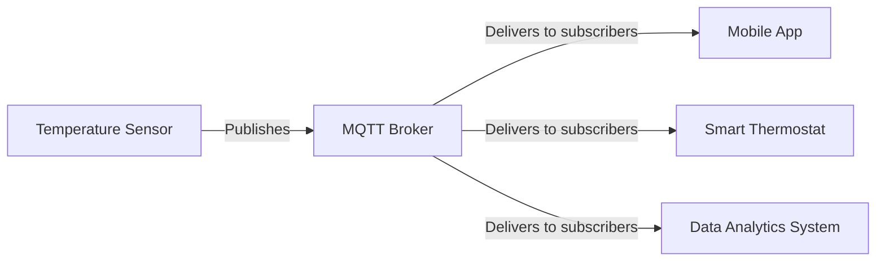

# Networks MQTT

## Introduction to MQTT

MQTT (Message Queuing Telemetry Transport) is a lightweight, publish-subscribe network protocol designed for constrained devices and low-bandwidth, high-latency, or unreliable networks. It's become one of the standard communication protocols in Internet of Things (IoT) ecosystems due to its minimal resource requirements and efficient data distribution mechanism.

Developed in the late 1990s by Andy Stanford-Clark (IBM) and Arlen Nipper (Cirrus Link), MQTT was initially created to monitor oil pipelines over satellite connections. Today, it powers millions of IoT devices worldwide, from smart home sensors to industrial equipment.

## Core Concepts of MQTT

### The Publish/Subscribe Model

Unlike traditional client-server models where clients directly communicate with endpoints, MQTT uses a publish/subscribe (pub/sub) architecture:

1. **Publishers**: Devices that send messages
2. **Subscribers**: Devices that receive messages
3. **Broker**: Central server that routes messages between publishers and subscribers

This decoupling allows for greater scalability and more dynamic network topologies.



### Topics and Messages

**Topics** are the routing information used by the broker. They're organized in a hierarchy using forward slashes, similar to URLs or file paths:

```
home/livingroom/temperature
building/floor3/room42/humidity
vehicle/bus12/location
```

**Messages** contain the actual data being transmitted, which can be in any format (JSON, XML, binary, text, etc.).

## MQTT Quality of Service (QoS) Levels

MQTT defines three QoS levels that balance reliability with resource usage:

1. **QoS 0 (At most once)**: Fire and forget - no guarantee of delivery
2. **QoS 1 (At least once)**: Guaranteed delivery, but duplicates possible
3. **QoS 2 (Exactly once)**: Guaranteed delivery exactly once, highest overhead

```
QoS 0: Publisher → Broker
QoS 1: Publisher → Broker → Acknowledgment
QoS 2: Publisher → Broker → PUBREC → PUBREL → PUBCOMP
```

## MQTT in Action: Code Examples

### Connecting to an MQTT Broker (Python with Paho-MQTT)

```python
import paho.mqtt.client as mqtt

# Callback when connection is established
def on_connect(client, userdata, flags, rc):
    print(f"Connected with result code {rc}")
    # Subscribe to topics upon successful connection
    client.subscribe("home/+/temperature")  # + is a single-level wildcard

# Callback when a message is received
def on_message(client, userdata, msg):
    print(f"Topic: {msg.topic}, Message: {msg.payload.decode()}")

# Create client and set callbacks
client = mqtt.Client()
client.on_connect = on_connect
client.on_message = on_message

# Optional authentication
client.username_pw_set("username", "password")

# Connect to the broker
client.connect("mqtt.example.com", 1883, 60)

# Start the loop to process network events
client.loop_forever()
```

### Publishing Messages (Node.js with MQTT.js)

```javascript
const mqtt = require('mqtt');
const client = mqtt.connect('mqtt://mqtt.example.com');

client.on('connect', function() {
  console.log('Connected to MQTT broker');
  
  // Publish temperature reading every 5 seconds
  setInterval(function() {
    const temperature = 22.5 + (Math.random() * 2 - 1);  // Random fluctuation
    const payload = JSON.stringify({
      value: temperature.toFixed(1),
      unit: 'C',
      timestamp: new Date().toISOString()
    });
    
    client.publish('home/livingroom/temperature', payload, { qos: 1 });
    console.log(`Published: ${payload}`);
  }, 5000);
});

client.on('error', function(error) {
  console.error('MQTT error:', error);
});
```

## Special MQTT Features

### Retained Messages

Retained messages are stored by the broker and immediately sent to new subscribers. This is useful for status information or configuration values:

```python
# Python: Publish a retained message
client.publish("device/status", "online", qos=1, retain=True)
```

### Last Will and Testament (LWT)

LWT allows a client to specify a message that the broker should publish if the client disconnects unexpectedly:

```python
# Python: Setting LWT during connection
client.will_set("device/status", "offline", qos=1, retain=True)
```

### Clean Sessions and Persistent Subscriptions

Clients can maintain their subscriptions between connections:

```python
# Python: Connect with clean_session=False to maintain subscriptions
client = mqtt.Client(client_id="unique-id", clean_session=False)
```

## Security Considerations

MQTT implementations should address several security aspects:

1. **Authentication**: Username/password or client certificates
2. **Encryption**: TLS/SSL for communication
3. **Authorization**: Access control for topic publishing/subscribing

### Secure Connection Example

```python
# Python: Secure connection with TLS
client = mqtt.Client()
client.username_pw_set("username", "password")
client.tls_set(ca_certs="ca.crt", certfile="client.crt", keyfile="client.key")
client.connect("secure-mqtt.example.com", 8883, 60)
```

## Real-world Applications

MQTT powers diverse IoT applications:

1. **Smart Homes**: Connecting lights, thermostats, and security devices
2. **Healthcare**: Remote patient monitoring and medical device data collection
3. **Industrial IoT**: Factory automation and predictive maintenance
4. **Transportation**: Fleet tracking and logistics
5. **Energy Management**: Smart grid monitoring and optimization

### Example: Smart Home Automation

```
Sensors publish to:
home/livingroom/temperature
home/kitchen/motion
home/frontdoor/lock/status

Controllers subscribe to relevant topics and publish commands:
home/livingroom/lights/command
home/kitchen/fan/command
```

## MQTT 5.0 Enhancements

The latest MQTT version (5.0) adds several improvements:

1. **Message Expiry**: TTL for messages
2. **Shared Subscriptions**: Load balancing across multiple subscribers
3. **Topic Aliases**: Reduced bandwidth usage
4. **User Properties**: Custom application metadata
5. **Reason Codes**: More detailed feedback for operations

## Getting Started with MQTT

### Setting Up Your Own MQTT Environment

1. **Choose a broker**:
   - Mosquitto: Open-source, lightweight broker
   - HiveMQ: Commercial with free community edition
   - EMQ X: Highly scalable, open-source
   - AWS IoT Core: Managed MQTT service

2. **Install a broker locally for testing**:
   ```bash
   # Install Mosquitto on Ubuntu
   sudo apt install mosquitto mosquitto-clients
   
   # Start the service
   sudo systemctl start mosquitto
   ```

3. **Command-line testing**:
   ```bash
   # Subscribe to a topic
   mosquitto_sub -h localhost -t "test/topic"
   
   # Publish to a topic
   mosquitto_pub -h localhost -t "test/topic" -m "Hello MQTT"
   ```

## Summary

MQTT provides an efficient, reliable way to connect IoT devices with minimal overhead. Its publish/subscribe model, quality of service levels, and lightweight design make it ideal for resource-constrained environments.

Key advantages include:
- Minimal bandwidth usage
- Support for unreliable networks
- Scalability from single devices to thousands
- Flexibility in message formats and patterns
- Wide industry adoption and implementation

## Additional Resources

For further exploration:
- Official MQTT specification: [MQTT.org](https://mqtt.org/)
- Eclipse Mosquitto Broker: [Mosquitto](https://mosquitto.org/)
- HiveMQ MQTT Client: [HiveMQ Client](https://www.hivemq.com/mqtt-client-library-encyclopedia/)
- MQTT and IoT Courses: [MQTT Essentials](https://www.hivemq.com/mqtt-essentials/)

## Exercises for Practice

1. Set up a local MQTT broker and connect two clients (one publisher, one subscriber)
2. Implement a simple sensor monitoring system using different QoS levels
3. Create a message structure for a smart home application
4. Explore how to secure an MQTT deployment with TLS and authentication
5. Design a topic hierarchy for a specific IoT use case