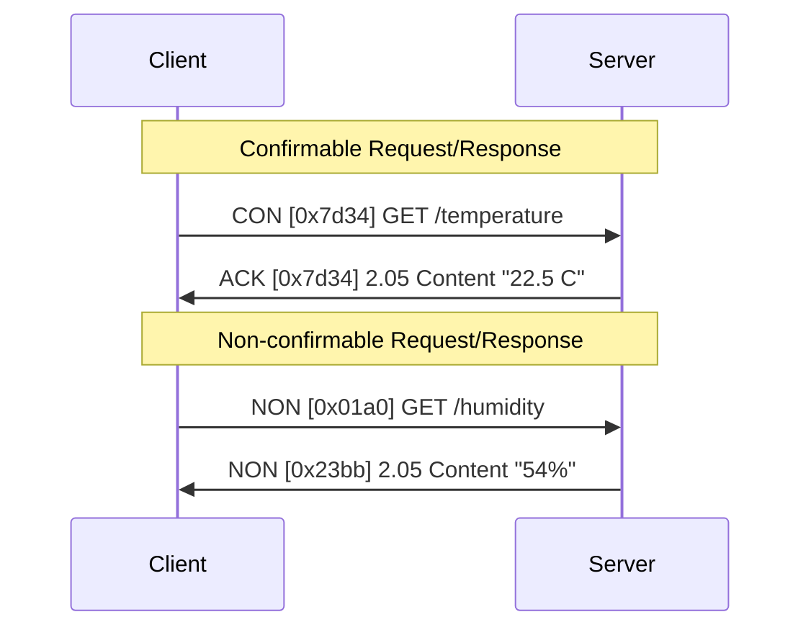
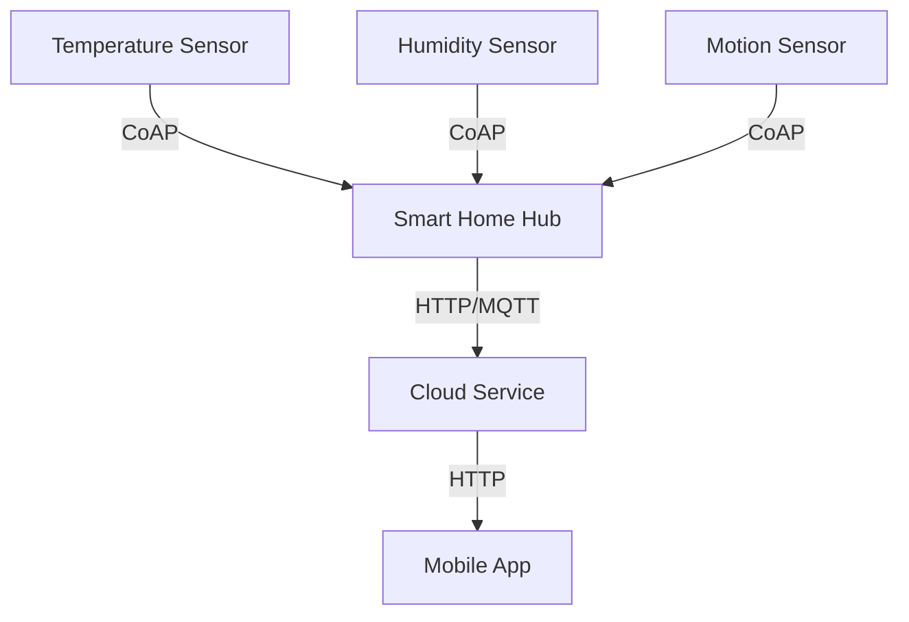

# Networks CoAP

## Introduction

The Constrained Application Protocol (CoAP) is a specialized Internet application protocol designed for constrained devices and networks in the Internet of Things (IoT) ecosystem. Developed by the Internet Engineering Task Force (IETF), CoAP enables resource-constrained devices with limited processing capabilities, memory, and power to communicate over the internet.

Think of CoAP as a lightweight alternative to HTTP, optimized for IoT devices. While HTTP is robust and feature-rich, it's often too heavy for devices like sensors, actuators, and other small IoT nodes. CoAP addresses this gap by providing a simpler protocol that maintains familiar RESTful interactions while consuming significantly fewer resources.

## Key Features of CoAP

### 1. Lightweight Design

CoAP is built for efficiency in environments where resources are constrained:

- **Small Header Size**: Minimizes overhead in each packet
- **Binary Format**: More compact than text-based protocols like HTTP
- **Simple Messaging Model**: Reduces complexity for implementation

### 2. UDP-Based Communication

Unlike HTTP which uses TCP, CoAP primarily operates over UDP:

- **Lower Overhead**: No connection establishment/termination required
- **Reduced Power Consumption**: Important for battery-powered devices
- **Faster Communication**: Eliminates TCP's handshaking delays

### 3. RESTful Architecture

Despite its simplicity, CoAP follows REST principles:

- **Resource-Oriented**: Resources are accessed via URIs
- **Standard Methods**: Supports GET, POST, PUT, and DELETE
- **Content Negotiation**: Allows format specification

### 4. Built-In Features for IoT

CoAP includes several features specifically designed for IoT scenarios:

- **Observe Option**: Enables subscription to resource changes
- **Resource Discovery**: Allows clients to discover available resources
- **Block-wise Transfers**: For handling larger payloads
- **Multicast Support**: Efficient one-to-many communication

## CoAP Message Format

CoAP uses a simple binary format with a 4-byte header:

```
 0                   1                   2                   3
 0 1 2 3 4 5 6 7 8 9 0 1 2 3 4 5 6 7 8 9 0 1 2 3 4 5 6 7 8 9 0 1
+-+-+-+-+-+-+-+-+-+-+-+-+-+-+-+-+-+-+-+-+-+-+-+-+-+-+-+-+-+-+-+-+
|Ver| T |  TKL  |      Code     |           Message ID          |
+-+-+-+-+-+-+-+-+-+-+-+-+-+-+-+-+-+-+-+-+-+-+-+-+-+-+-+-+-+-+-+-+
|   Token (if any, TKL bytes) ...
+-+-+-+-+-+-+-+-+-+-+-+-+-+-+-+-+-+-+-+-+-+-+-+-+-+-+-+-+-+-+-+-+
|   Options (if any) ...
+-+-+-+-+-+-+-+-+-+-+-+-+-+-+-+-+-+-+-+-+-+-+-+-+-+-+-+-+-+-+-+-+
|1 1 1 1 1 1 1 1|    Payload (if any) ...
+-+-+-+-+-+-+-+-+-+-+-+-+-+-+-+-+-+-+-+-+-+-+-+-+-+-+-+-+-+-+-+-+
```

Where:
- **Ver**: 2-bit version number (current version is 1)
- **T**: 2-bit message type (Confirmable, Non-confirmable, Acknowledgement, Reset)
- **TKL**: 4-bit token length
- **Code**: 8-bit response code (similar to HTTP status codes)
- **Message ID**: 16-bit message identifier for matching responses
- **Token**: Variable-length token for matching requests to responses
- **Options**: Protocol options
- **Payload**: The message payload (if any)

## CoAP vs. HTTP

Let's compare CoAP with the familiar HTTP protocol:

```mermaid
graph LR
    subgraph HTTP
        TCP --> HTTP_Protocol
        HTTP_Protocol --> "Large overhead"
        HTTP_Protocol --> "Text-based"
        HTTP_Protocol --> "Complex implementation"
    end
    
    subgraph CoAP
        UDP --> CoAP_Protocol
        CoAP_Protocol --> "Minimal overhead"
        CoAP_Protocol --> "Binary format"
        CoAP_Protocol --> "Simple implementation"
    end
```

| Feature | CoAP | HTTP |
|---------|------|------|
| Transport | UDP (primarily) | TCP |
| Header Size | 4 bytes | Varies, typically much larger |
| Message Format | Binary | Text |
| Methods | GET, POST, PUT, DELETE | GET, POST, PUT, DELETE, etc. |
| Response Codes | Similar to HTTP but compressed | Many status codes |
| URI Scheme | coap:// | http:// |
| Default Port | 5683 | 80 |
| Security | DTLS | TLS |

## Message Types in CoAP

CoAP defines four types of messages:

1. **Confirmable (CON)**:
   - Requires acknowledgment from receiver
   - Used when reliability is important
   - Retransmitted if no ACK is received

2. **Non-confirmable (NON)**:
   - Does not require acknowledgment
   - For scenarios where occasional message loss is acceptable
   - Used for periodic sensor readings, etc.

3. **Acknowledgement (ACK)**:
   - Confirms receipt of a CON message
   - Can contain response data (piggybacked response)

4. **Reset (RST)**:
   - Indicates that a message could not be processed
   - Used when receiver cannot process the message context

## CoAP Request/Response Model

Let's look at how CoAP implements the request/response pattern:



## Basic CoAP Implementation

Let's implement a simple CoAP client and server using the popular `coap` library for Node.js:

### Server Implementation

```javascript
const coap = require('coap');
const server = coap.createServer();

// Create a simple resource that returns temperature data
server.on('request', (req, res) => {
  console.log('Request received for: ' + req.url);
  
  if (req.url === '/temperature') {
    res.code = '2.05'; // Content
    res.setOption('Content-Format', 'application/json');
    res.end(JSON.stringify({ temperature: 22.5, unit: 'Celsius' }));
  }
  else if (req.url === '/humidity') {
    res.code = '2.05'; // Content
    res.setOption('Content-Format', 'application/json');
    res.end(JSON.stringify({ humidity: 54, unit: '%' }));
  }
  else {
    res.code = '4.04'; // Not Found
    res.end();
  }
});

// Start server on the default CoAP port (5683)
server.listen(() => {
  console.log('CoAP server started on port 5683');
});
```

### Client Implementation

```javascript
const coap = require('coap');

// Create a request to get temperature
const req = coap.request({
  host: 'localhost',
  port: 5683,
  pathname: '/temperature',
  method: 'GET'
});

req.on('response', (res) => {
  console.log('Response code:', res.code);
  if (res.payload) {
    console.log('Received data:', JSON.parse(res.payload.toString()));
  }
  
  // Exit after receiving response
  process.exit(0);
});

// Send the request
req.end();
```

### Output:

On the server side:
```
CoAP server started on port 5683
Request received for: /temperature
```

On the client side:
```
Response code: 2.05
Received data: { temperature: 22.5, unit: 'Celsius' }
```

## Implementing the Observe Pattern

One of CoAP's powerful features is the observe option, which allows clients to "subscribe" to resources and receive updates when they change. This is particularly useful for sensor readings:

### Observable Server

```javascript
const coap = require('coap');
const server = coap.createServer();

// Simulate a temperature sensor with changing values
let temperature = 22.5;

// Update temperature every 5 seconds
setInterval(() => {
  temperature = (20 + Math.random() * 5).toFixed(1);
  console.log(`Temperature updated to ${temperature}°C`);
}, 5000);

server.on('request', (req, res) => {
  if (req.url === '/temperature') {
    // Check if this is an observe request
    if (req.headers['Observe'] !== undefined) {
      console.log('Observe request received');
      
      // Set the observe option
      res.setOption('Observe', 1);
      
      // Send initial response
      res.write(JSON.stringify({ temperature, unit: 'Celsius' }));
      
      // Function to send updates
      const sendUpdate = () => {
        res.write(JSON.stringify({ temperature, unit: 'Celsius' }));
      };
      
      // Send updates when temperature changes
      const interval = setInterval(sendUpdate, 5000);
      
      // Stop sending updates when the client is done
      res.on('finish', () => {
        console.log('Client disconnected');
        clearInterval(interval);
      });
    } else {
      // Regular request without observe
      res.end(JSON.stringify({ temperature, unit: 'Celsius' }));
    }
  } else {
    res.code = '4.04'; // Not Found
    res.end();
  }
});

server.listen(() => {
  console.log('CoAP server started on port 5683');
});
```

### Observer Client

```javascript
const coap = require('coap');

// Create a request with the observe option
const req = coap.request({
  host: 'localhost',
  port: 5683,
  pathname: '/temperature',
  observe: true // Enable observe
});

req.on('response', (res) => {
  console.log('Response code:', res.code);
  
  res.on('data', (data) => {
    console.log('Temperature update:', JSON.parse(data.toString()));
  });
  
  // Stop observing after 30 seconds
  setTimeout(() => {
    console.log('Stopping observation');
    req.reset();
    process.exit(0);
  }, 30000);
});

// Send the request
req.end();
```

### Output (over time):

Server console:
```
CoAP server started on port 5683
Observe request received
Temperature updated to 22.3°C
Temperature updated to 24.1°C
Temperature updated to 21.7°C
Client disconnected
```

Client console:
```
Response code: 2.05
Temperature update: { temperature: 22.5, unit: 'Celsius' }
Temperature update: { temperature: 22.3, unit: 'Celsius' }
Temperature update: { temperature: 24.1, unit: 'Celsius' }
Temperature update: { temperature: 21.7, unit: 'Celsius' }
Stopping observation
```

## CoAP and DTLS (Secure CoAP)

For secure communications, CoAP can be used with Datagram Transport Layer Security (DTLS), creating a secure version often referred to as CoAPS. The URI scheme changes from `coap://` to `coaps://` and the default port changes from 5683 to 5684.

Here's a simplified approach to securing CoAP:

```javascript
const coap = require('coap');
const dtls = require('node-dtls');

// DTLS configuration
const dtlsParams = {
  key: fs.readFileSync('server-key.pem'),
  cert: fs.readFileSync('server-cert.pem')
};

// Create secure server
const server = coap.createServer({
  dtls: dtlsParams
});

// Rest of the server implementation remains the same
```

## Real-World Applications

### 1. Smart Home Environment Monitoring

A network of temperature and humidity sensors throughout a home can use CoAP to report data to a central hub. The hub can then make this data available to mobile apps or home automation systems.



### 2. Industrial Equipment Monitoring

In a factory setting, CoAP can be used to monitor the status of various equipment. Each machine can expose a CoAP endpoint that reports its operational parameters, allowing for centralized monitoring and predictive maintenance.

### 3. Smart Agriculture

Soil moisture sensors, weather stations, and irrigation controllers in a farm can communicate using CoAP. This allows for efficient water usage based on real-time conditions and crop needs.

## Limitations and Challenges

While CoAP offers many advantages for IoT applications, it's important to understand its limitations:

1. **Security Considerations**: While DTLS provides security, it adds overhead that may be challenging for the most constrained devices.

2. **NAT Traversal**: CoAP's UDP basis can sometimes cause issues with NAT traversal in certain network configurations.

3. **Implementation Complexity**: Although simpler than HTTP, implementing the full CoAP specification correctly can still be challenging.

4. **Interoperability**: Different implementations may support different subsets of the protocol, leading to potential interoperability issues.

## Summary

The Constrained Application Protocol (CoAP) represents a vital technology in the IoT ecosystem, enabling resource-constrained devices to communicate efficiently using familiar web paradigms. Its lightweight design, support for the observe pattern, and RESTful architecture make it ideal for many IoT applications.

Key takeaways from this guide:

- CoAP is designed specifically for resource-constrained IoT devices
- It uses UDP as its transport layer for efficiency
- Despite its simplicity, it maintains RESTful principles
- It offers special features like the observe pattern for IoT scenarios
- Secure communication is possible through CoAPS (CoAP with DTLS)

## Additional Resources

- [RFC 7252: The Constrained Application Protocol (CoAP)](https://tools.ietf.org/html/rfc7252)
- [Node.js CoAP library](https://github.com/mcollina/node-coap)
- [Copper (Cu) CoAP user-agent for Firefox](https://github.com/mkovatsc/Copper)

## Exercises

1. **Basic CoAP Server**: Implement a CoAP server that exposes readings from a simulated sensor.

2. **CoAP Client**: Create a client that retrieves data from a public CoAP server like `coap://coap.me`.

3. **Observe Implementation**: Extend your server to support the observe option and create a client that subscribes to updates.

4. **Resource Discovery**: Implement resource discovery on your server and create a client that can discover available resources.

5. **CoAPS**: If possible, secure your CoAP server using DTLS and modify your client to access it securely.