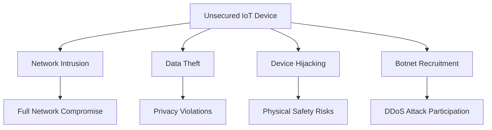
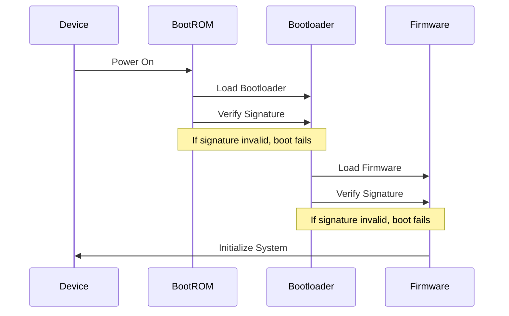
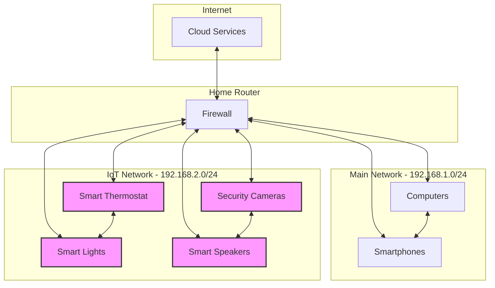

# Networks IoT Security

## Introduction

The Internet of Things (IoT) has revolutionized how we interact with technology, connecting everyday devices to the internet and each other. From smart thermostats and refrigerators to industrial sensors and medical devices, IoT is everywhere. However, this connectivity comes with significant security challenges. In this guide, we'll explore the fundamentals of IoT security, common vulnerabilities, and practical approaches to securing IoT networks.

## Why IoT Security Matters

IoT devices collect vast amounts of data, often including sensitive information, and can control critical systems. Poorly secured devices can become:

- Entry points for attackers to access your broader network
- Part of massive botnets for DDoS attacks
- Sources of data breaches and privacy violations
- Compromised systems that could cause physical harm in industrial or medical settings



## Common IoT Security Vulnerabilities

### 1. Weak Authentication

Many IoT devices ship with default credentials that never get changed. Some examples include:

```
Username: admin
Password: admin

Username: root  
Password: password123
```

### 2. Lack of Encryption

Data transmitted between IoT devices and cloud services is often unencrypted, leaving it vulnerable to eavesdropping.

### 3. Insufficient Update Mechanisms

Many devices lack proper update capabilities or are never updated by their owners.

### 4. Insecure APIs

Poorly designed APIs can expose device functionality and data to unauthorized users.

### 5. Privacy Concerns

Devices may collect more data than necessary and share it with third parties without clear consent.

## Implementing IoT Security - A Practical Approach

Let's explore how to secure IoT networks with practical code examples and configurations.

### Secure Communication with MQTT TLS

[MQTT (Message Queuing Telemetry Transport)](https://mqtt.org/) is a lightweight protocol commonly used in IoT. Here's how to implement secure MQTT with TLS in Python:

```python
# Secure MQTT Client Example using TLS
import ssl
import paho.mqtt.client as mqtt

def on_connect(client, userdata, flags, rc):
    print(f"Connected with result code {rc}")
    client.subscribe("iot/sensors")

def on_message(client, userdata, msg):
    print(f"Topic: {msg.topic}, Message: {msg.payload.decode()}")

# Create a client instance
client = mqtt.Client()
client.on_connect = on_connect
client.on_message = on_message

# Set username and password
client.username_pw_set("secure_user", "strong_password")

# Set up TLS encryption
client.tls_set(
    ca_certs="ca.crt",
    certfile="client.crt",
    keyfile="client.key",
    tls_version=ssl.PROTOCOL_TLS
)

# Connect to the broker
client.connect("mqtt.example.com", 8883, 60)

# Start the network loop
client.loop_forever()
```

### Device Authentication with X.509 Certificates

X.509 certificates provide strong authentication for IoT devices. Here's a Node.js example using client certificates:

```javascript
const fs = require('fs');
const mqtt = require('mqtt');

// TLS/SSL connection options
const options = {
  port: 8883,
  host: 'mqtt.example.com',
  key: fs.readFileSync('client.key'),
  cert: fs.readFileSync('client.crt'),
  ca: fs.readFileSync('ca.crt'),
  protocol: 'mqtts',
  rejectUnauthorized: true
};

// Create a secure client
const client = mqtt.connect(options);

client.on('connect', () => {
  console.log('Connected securely');
  client.subscribe('iot/commands');
  
  // Publish sensor data with QoS 1
  client.publish('iot/sensors', JSON.stringify({
    deviceId: 'sensor001',
    temperature: 22.5,
    humidity: 60,
    timestamp: Date.now()
  }), { qos: 1 });
});

client.on('message', (topic, message) => {
  console.log(`Received message on ${topic}: ${message.toString()}`);
});
```

### Network Segmentation for IoT Devices

A crucial security practice is to isolate IoT devices on a separate network segment. Here's a configuration example for a home router:

```
# Router configuration (conceptual)
# Create a separate VLAN for IoT devices
interface vlan 20
  description IoT_Network
  ip address 192.168.20.1 255.255.255.0
  ip dhcp pool IoT
    network 192.168.20.0 255.255.255.0
    default-router 192.168.20.1

# Apply firewall rules
access-list 101 permit tcp any any established
access-list 101 deny ip 192.168.20.0 0.0.0.255 192.168.10.0 0.0.0.255
access-list 101 permit icmp any any echo-reply
```

### Implementing a Firewall for IoT

The following Python script demonstrates a simple IoT device firewall using the `scapy` library:

```python
from scapy.all import *
import logging

# Setup logging
logging.basicConfig(filename="iot_firewall.log", level=logging.INFO,
                    format='%(asctime)s - %(message)s')

# List of allowed IP addresses
ALLOWED_IPS = ['192.168.1.100', '192.168.1.101', '8.8.8.8']
# Allowed ports
ALLOWED_PORTS = [443, 8883, 1883]

def packet_filter(packet):
    if IP in packet:
        src_ip = packet[IP].src
        dst_ip = packet[IP].dst
        
        # Check if communication is with allowed IPs
        if dst_ip not in ALLOWED_IPS and src_ip not in ALLOWED_IPS:
            logging.warning(f"Blocked packet: {src_ip} -> {dst_ip}")
            return True  # Drop packet
        
        # Check for suspicious port usage
        if TCP in packet:
            dst_port = packet[TCP].dport
            if dst_port not in ALLOWED_PORTS:
                logging.warning(f"Blocked TCP port {dst_port}: {src_ip} -> {dst_ip}")
                return True  # Drop packet
                
    return False  # Allow packet

# Start the firewall
print("Starting IoT firewall...")
logging.info("IoT firewall started")
sniff(prn=lambda x: x.summary(), lfilter=packet_filter, store=0)
```

## Real-World IoT Security Measures

### 1. Implementing a Secure Boot Process

Secure boot ensures that only authorized firmware runs on a device. Here's a high-level explanation of how secure boot works:



### 2. OTA (Over-the-Air) Updates

Secure OTA updates are essential for maintaining device security. Here's an ESP32 Arduino example for secure OTA updates:

```cpp
#include <WiFi.h>
#include <Update.h>
#include <HTTPClient.h>
#include <WiFiClientSecure.h>
#include <ArduinoJson.h>

const char* ssid = "YourWiFiSSID";
const char* password = "YourWiFiPassword";
const char* update_server = "https://updates.example.com";
const char* firmware_version = "1.0.0";
const char* update_cert = \
"-----BEGIN CERTIFICATE-----
"
"MIIEkjCCA3qgAwIBAgIQCgFBQgAAAVOFc2oLheynCDANBgkqhkiG9w0BAQsFADA/
"
/* Certificate data continues here */
"-----END CERTIFICATE-----
";

WiFiClientSecure client;
HTTPClient https;

void setup() {
  Serial.begin(115200);
  WiFi.begin(ssid, password);
  
  while (WiFi.status() != WL_CONNECTED) {
    delay(500);
    Serial.print(".");
  }
  
  Serial.println("Connected to WiFi");
  
  // Set server certificate
  client.setCACert(update_cert);
  
  // Check for updates
  checkForUpdates();
}

void checkForUpdates() {
  if (https.begin(client, String(update_server) + "/firmware/check")) {
    https.addHeader("Content-Type", "application/json");
    
    // Create JSON with device info
    DynamicJsonDocument doc(256);
    doc["device_id"] = WiFi.macAddress();
    doc["current_version"] = firmware_version;
    doc["model"] = "ESP32_IOT_DEVICE";
    
    String requestBody;
    serializeJson(doc, requestBody);
    
    int httpCode = https.POST(requestBody);
    
    if (httpCode == HTTP_CODE_OK) {
      String payload = https.getString();
      DynamicJsonDocument responseDoc(1024);
      deserializeJson(responseDoc, payload);
      
      if (responseDoc["update_available"].as<bool>()) {
        String downloadUrl = responseDoc["download_url"];
        String expectedHash = responseDoc["hash"];
        performUpdate(downloadUrl, expectedHash);
      } else {
        Serial.println("No updates available");
      }
    }
    
    https.end();
  }
}

void performUpdate(String url, String expectedHash) {
  Serial.println("Starting update process...");
  
  if (https.begin(client, url)) {
    int httpCode = https.GET();
    
    if (httpCode == HTTP_CODE_OK) {
      int contentLength = https.getSize();
      
      if (contentLength > 0) {
        bool canBegin = Update.begin(contentLength);
        
        if (canBegin) {
          Serial.println("Starting OTA");
          WiFiClient* stream = https.getStreamPtr();
          size_t written = Update.writeStream(*stream);
          
          if (written == contentLength) {
            Serial.println("Written : " + String(written) + " successfully");
          } else {
            Serial.println("Written only : " + String(written) + "/" + String(contentLength));
          }
          
          if (Update.end()) {
            Serial.println("OTA done!");
            if (Update.isFinished()) {
              Serial.println("Update successfully completed. Rebooting.");
              ESP.restart();
            } else {
              Serial.println("Update not finished? Something went wrong!");
            }
          } else {
            Serial.println("Error Occurred. Error #: " + String(Update.getError()));
          }
        } else {
          Serial.println("Not enough space to begin OTA");
        }
      } else {
        Serial.println("There was no content in the response");
      }
    } else {
      Serial.println("Error in HTTP request");
    }
    
    https.end();
  }
}

void loop() {
  // Regular device operation code here
  delay(60000);
}
```

## IoT Security Best Practices

To ensure your IoT implementations remain secure, follow these key principles:

1. **Apply the principle of least privilege**: Devices should only have access to what they absolutely need
2. **Implement robust authentication**: Use strong, unique credentials for each device
3. **Encrypt all communications**: Use TLS/SSL for all data transmissions
4. **Regularly update firmware**: Create a secure update mechanism and use it
5. **Segment your network**: Keep IoT devices isolated from critical systems
6. **Monitor device behavior**: Implement logging and anomaly detection
7. **Perform security audits**: Regularly test for vulnerabilities
8. **Have a response plan**: Know what to do if a device is compromised

## Security Testing for IoT Devices

Let's explore a simple security assessment script using Python:

```python
import socket
import requests
import ssl
import concurrent.futures
import re
from scapy.all import ARP, Ether, srp

def scan_network(ip_range):
    """Discover IoT devices on the network using ARP"""
    arp = ARP(pdst=ip_range)
    ether = Ether(dst="ff:ff:ff:ff:ff:ff")
    packet = ether/arp
    
    result = srp(packet, timeout=3, verbose=0)[0]
    devices = []
    
    for sent, received in result:
        devices.append({'ip': received.psrc, 'mac': received.hwsrc})
    
    return devices

def scan_ports(ip, ports):
    """Scan for open ports on a device"""
    open_ports = []
    for port in ports:
        sock = socket.socket(socket.AF_INET, socket.SOCK_STREAM)
        sock.settimeout(1)
        result = sock.connect_ex((ip, port))
        if result == 0:
            open_ports.append(port)
        sock.close()
    return open_ports

def check_default_credentials(ip, port, credentials):
    """Test for default credentials on web interfaces"""
    for cred in credentials:
        try:
            response = requests.get(f"http://{ip}:{port}/", 
                                   auth=(cred['username'], cred['password']),
                                   timeout=3)
            if response.status_code == 200:
                return cred
        except:
            pass
    return None

def check_ssl_security(ip, port):
    """Check SSL/TLS configuration security"""
    context = ssl.create_default_context()
    try:
        with socket.create_connection((ip, port), timeout=3) as sock:
            with context.wrap_socket(sock, server_hostname=ip) as ssock:
                cert = ssock.getpeercert()
                cipher = ssock.cipher()
                return {
                    "cert_valid": True,
                    "cipher": cipher,
                    "protocol": ssock.version()
                }
    except:
        return {"cert_valid": False}

def main():
    # Configure these values based on your network
    network_range = "192.168.1.0/24"
    common_ports = [80, 443, 8080, 8883, 1883, 22, 23, 2323, 9999]
    default_credentials = [
        {"username": "admin", "password": "admin"},
        {"username": "root", "password": "root"},
        {"username": "admin", "password": "password"},
        {"username": "", "password": ""}
    ]
    
    print("Scanning for IoT devices...")
    devices = scan_network(network_range)
    print(f"Found {len(devices)} devices on the network")
    
    for device in devices:
        print(f"
Analyzing device at {device['ip']} ({device['mac']})")
        
        # Scan for open ports
        open_ports = scan_ports(device['ip'], common_ports)
        if open_ports:
            print(f"Open ports: {', '.join(map(str, open_ports))}")
            
            # Check common web ports for default credentials
            for port in [p for p in open_ports if p in [80, 8080, 8888]]:
                cred = check_default_credentials(device['ip'], port, default_credentials)
                if cred:
                    print(f"WARNING: Default credentials found on port {port}: {cred['username']}:{cred['password']}")
            
            # Check SSL/TLS security
            for port in [p for p in open_ports if p in [443, 8443, 8883]]:
                ssl_info = check_ssl_security(device['ip'], port)
                if ssl_info["cert_valid"]:
                    print(f"SSL on port {port}: Protocol {ssl_info['protocol']}, Cipher {ssl_info['cipher'][0]}")
                else:
                    print(f"Failed to establish secure connection on port {port}")
        else:
            print("No open ports found")

if __name__ == "__main__":
    main()
```

This script performs:
1. Network discovery to find IoT devices
2. Port scanning to identify services
3. Default credential testing
4. SSL/TLS security assessment

## Case Study: Smart Home Security

Let's examine a typical smart home setup and how to secure it:



Security measures implemented:
1. Network segmentation: IoT devices on a separate VLAN
2. Firewall rules: Limited communication between networks
3. Encrypted communication: All devices use TLS
4. Regular updates: Automatic firmware updates
5. Strong authentication: Unique credentials for all devices

## Summary

IoT security is a critical consideration for any connected device implementation. By understanding the common vulnerabilities and implementing robust security measures, you can create IoT systems that are both functional and secure.

Remember these key takeaways:
- Security must be built into IoT systems from the beginning, not added as an afterthought
- Network segmentation, strong authentication, and encryption are fundamental security measures
- Regular updates and security testing are essential ongoing practices
- The principle of least privilege should guide all access decisions

## Exercises

1. **Security Assessment**: Perform a security audit of your home network using the security testing script provided. Identify any IoT devices with security issues.

2. **Secure MQTT Implementation**: Set up a secure MQTT broker with TLS and client certificate authentication using the examples provided.

3. **Network Segmentation**: Configure your home router to create a separate network for IoT devices.

4. **Penetration Testing**: Choose an IoT device you own and attempt to identify security vulnerabilities (only on devices you own and have permission to test).

5. **Secure IoT Project**: Design and implement a simple IoT project (like a temperature monitor) with security built-in from the start.

## Additional Resources

- [OWASP IoT Security Verification Standard](https://owasp.org/www-project-iot-security-verification-standard/)
- [NIST Guide to Industrial Control Systems Security](https://csrc.nist.gov/publications/detail/sp/800-82/rev-2/final)
- [IoT Security Foundation](https://www.iotsecurityfoundation.org/)
- [Mozilla IoT Web Security Guidelines](https://mozilla-iot.github.io/wot/)
- IoT Security by Design (O'Reilly)
- Practical IoT Hacking: The Definitive Guide (No Starch Press)