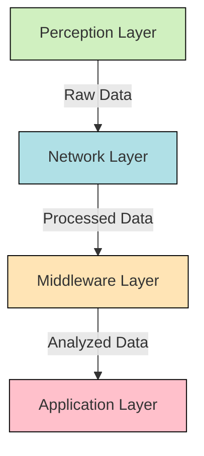
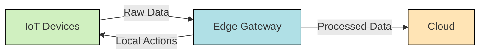
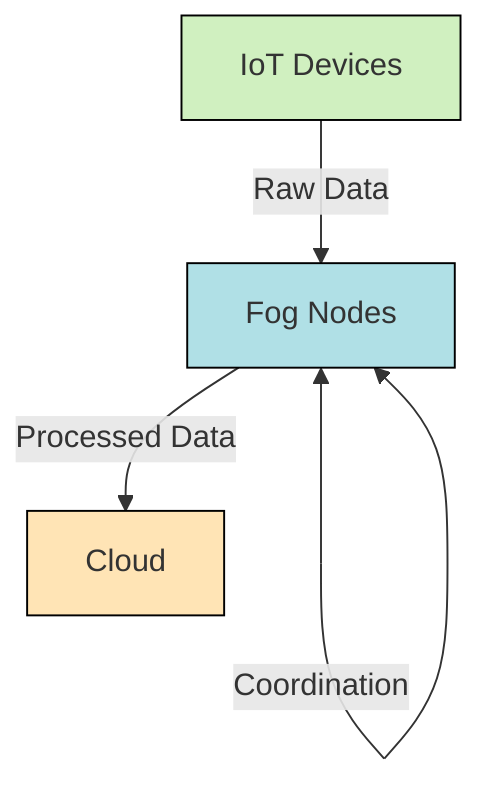
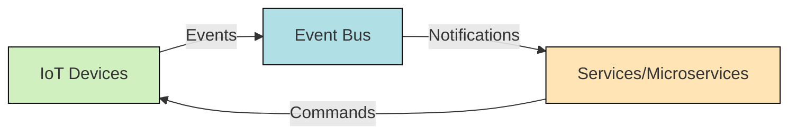
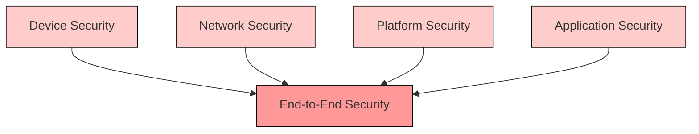
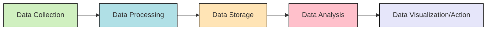
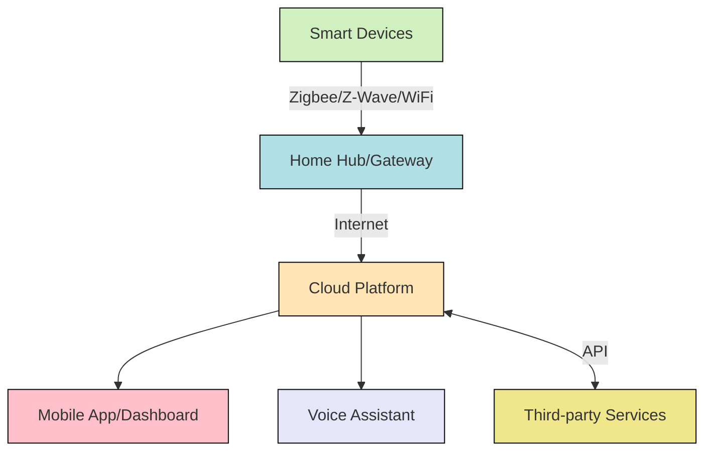
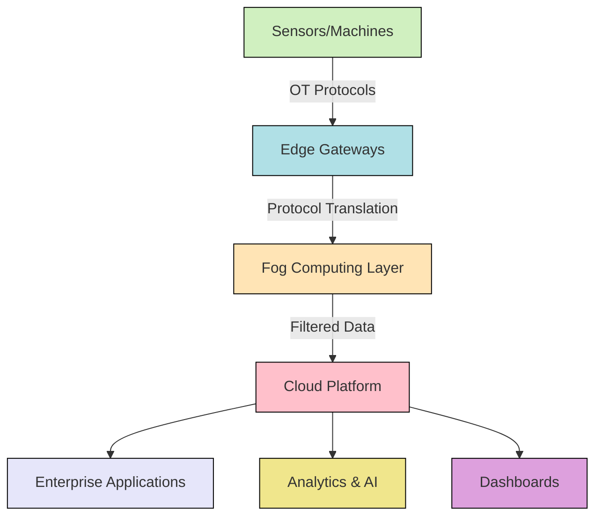

# Networks IoT Architecture

## Introduction

Internet of Things (IoT) architecture refers to the structural framework that enables billions of devices to connect, communicate, and exchange data across networks. As we enter an era where everyday objects are becoming "smart" - from refrigerators to thermostats to industrial sensors - understanding how these systems are organized becomes crucial for any developer.

This guide explores the layered architecture of IoT networks, the key components involved, and how data flows from physical devices to end-user applications. Whether you're building a small home automation project or planning to work with enterprise-level IoT deployments, grasping these architectural principles will provide a solid foundation.

## IoT Architecture Layers

IoT systems typically follow a multi-layered architecture that organizes functionality and data flow. While implementations may vary, most IoT architectures consist of four fundamental layers:



Let's examine each layer in detail:

### 1. Perception Layer (Device Layer)

This is the physical layer where sensors and actuators interact with the environment. It's responsible for:

- **Data collection**: Gathering physical parameters like temperature, humidity, light, motion, etc.
- **Identification**: Using technologies like RFID, QR codes, or biometrics to identify objects or users
- **Control**: Using actuators to perform physical actions based on commands

**Example Components**:
- Temperature and humidity sensors
- Motion detectors
- RFID tags and readers
- Smart cameras
- Actuators (motors, switches, valves)

### 2. Network Layer (Transport Layer)

This layer enables data transmission between devices and higher layers. It handles:

- **Connectivity**: Establishing links between devices and gateways
- **Communication protocols**: Implementing standards for data exchange
- **Data routing**: Determining optimal paths for data transmission
- **Gateway functionality**: Bridging different networks and protocols

**Communication Technologies**:
- Short-range: Wi-Fi, Bluetooth, Zigbee, Z-Wave
- Long-range: Cellular (4G/5G), LoRaWAN, Sigfox, NB-IoT
- Wired: Ethernet, Power Line Communication (PLC)

### 3. Middleware Layer (Processing Layer)

This layer processes, stores, and analyzes the collected data. Key functions include:

- **Data preprocessing**: Filtering, aggregating, and formatting raw data
- **Storage**: Maintaining databases for both real-time and historical data
- **Analytics**: Applying algorithms to extract insights
- **Service management**: Handling device registration, authentication, and service discovery

**Technologies**:
- Edge computing platforms
- Cloud services (AWS IoT, Azure IoT Hub, Google Cloud IoT)
- Data streaming platforms (Kafka, MQTT brokers)
- Databases (Time-series DBs, NoSQL, SQL)

### 4. Application Layer (Business Layer)

This is where end-user applications leverage the processed data to deliver specific functionality:

- **User interfaces**: Dashboards, mobile apps, web portals
- **Domain-specific applications**: Smart home control, industrial monitoring, health tracking
- **Integration with external systems**: ERP, CRM, or other business systems
- **Business logic**: Rules, workflows, and decision-making processes

## Key IoT Architectural Patterns

Beyond the layered approach, several architectural patterns are commonly used in IoT systems:

### Edge Computing Architecture

Instead of sending all data to the cloud, processing occurs closer to the data source.



**Benefits**:
- Reduced latency for time-critical applications
- Lower bandwidth consumption
- Improved privacy and security
- Continued operation during internet outages

**Example Code** (Python script running on an edge gateway):

```python
import time
from sense_hat import SenseHat
import paho.mqtt.client as mqtt

# Initialize SenseHat (IoT sensor)
sense = SenseHat()

# MQTT client setup
client = mqtt.Client()
client.connect("cloud-server.example.com", 1883, 60)

# Temperature threshold for local action
TEMP_THRESHOLD = 30.0

while True:
    # Read sensor data
    temperature = sense.get_temperature()
    humidity = sense.get_humidity()
    pressure = sense.get_pressure()
    
    # Local processing and decision making
    if temperature > TEMP_THRESHOLD:
        # Local action - display alert on LED matrix
        sense.show_message("TEMP HIGH!", text_colour=[255, 0, 0])
        # Send alert to cloud
        client.publish("alerts/temperature", f"High temperature: {temperature}")
    
    # Aggregate data (calculate 5-minute average before sending)
    # ... aggregation code here ...
    
    # Send processed data to cloud (less frequently)
    if time.time() % 300 == 0:  # Every 5 minutes
        payload = {
            "device_id": "edge01",
            "temperature_avg": temp_avg,
            "humidity_avg": humidity_avg,
            "pressure_avg": pressure_avg
        }
        client.publish("sensors/aggregated", str(payload))
    
    time.sleep(1)
```

### Fog Computing Architecture

Extends cloud computing by distributing services closer to the edge of the network.



**Use Case**: Smart traffic management where multiple fog nodes analyze traffic patterns across different areas and coordinate traffic light timing.

### Event-Driven Architecture

Components communicate through events, providing loose coupling and scalability.



**Example**: A smart home system where motion detection events trigger lighting services, security services, and notification services independently.

## Communication Protocols in IoT Architecture

The selection of appropriate protocols is crucial in IoT architecture:

### Data Layer Protocols

- **MQTT (Message Queuing Telemetry Transport)**
  - Lightweight publish-subscribe protocol
  - Ideal for constrained devices and unreliable networks
  
**Example MQTT Implementation** (JavaScript):

```javascript
// MQTT client for a smart thermostat
const mqtt = require('mqtt');
const client = mqtt.connect('mqtt://broker.example.com');

// Device information
const deviceId = 'thermostat-living-room';

// Subscribe to command topics
client.on('connect', () => {
  client.subscribe(`devices/${deviceId}/commands`);
  console.log('Connected to MQTT broker');
  
  // Publish status immediately after connecting
  publishStatus();
});

// Handle incoming commands
client.on('message', (topic, message) => {
  const command = JSON.parse(message.toString());
  console.log(`Received command: ${command.action}`);
  
  if (command.action === 'setTemperature') {
    setTemperature(command.value);
    publishStatus();
  }
});

// Publish device status
function publishStatus() {
  const status = {
    deviceId: deviceId,
    temperature: currentTemperature,
    targetTemperature: targetTemperature,
    humidity: currentHumidity,
    mode: currentMode,
    timestamp: new Date().toISOString()
  };
  
  client.publish(`devices/${deviceId}/status`, JSON.stringify(status));
}

// Simulate temperature reading and publish every minute
setInterval(publishStatus, 60000);
```

- **CoAP (Constrained Application Protocol)**
  - RESTful protocol designed for constrained devices
  - Support for discovery, multicast, and resource observation

- **AMQP (Advanced Message Queuing Protocol)**
  - Reliable queuing with guaranteed delivery
  - Suitable for backend systems and enterprise integration

### Network Layer Protocols

- **6LoWPAN**: IPv6 over Low-Power Wireless Personal Area Networks
- **Zigbee**: Mesh network protocol for low-power, short-range communication
- **Bluetooth Low Energy (BLE)**: Energy-efficient protocol for personal area networks
- **LoRaWAN**: Long-Range Wide Area Network for battery-operated devices

## Security Architecture in IoT

Security must be integrated at every layer of IoT architecture:



**Security Considerations**:

1. **Device Security**
   - Secure boot and firmware updates
   - Hardware security modules
   - Device authentication

2. **Network Security**
   - Transport Layer Security (TLS/DTLS)
   - Network segmentation
   - Intrusion detection systems

3. **Platform Security**
   - Authentication and authorization (OAuth, JWT)
   - API security
   - Data encryption at rest

4. **Application Security**
   - Input validation
   - Session management
   - Regular security testing

**Example** (Implementing TLS for MQTT):

```javascript
// Secure MQTT connection with TLS
const mqtt = require('mqtt');
const fs = require('fs');

// Load certificates and keys
const options = {
  port: 8883,
  protocol: 'mqtts',
  rejectUnauthorized: true,
  ca: fs.readFileSync('ca.crt'),
  cert: fs.readFileSync('client.crt'),
  key: fs.readFileSync('client.key')
};

// Connect with secure options
const client = mqtt.connect('mqtt://secure-broker.example.com', options);

client.on('connect', () => {
  console.log('Securely connected to MQTT broker');
  // Continue with normal operations
});

client.on('error', (error) => {
  console.error('Connection failed:', error);
});
```

## Data Management in IoT Architecture

Managing the vast amounts of data generated by IoT devices requires specialized approaches:

### Data Pipeline Architecture



### Time Series Data Management

Many IoT applications generate time-series data that requires specialized storage and query capabilities.

**Example** (Using InfluxDB for IoT sensor data):

```javascript
// Node.js example with InfluxDB for time series data
const Influx = require('influx');
const influx = new Influx.InfluxDB({
  host: 'localhost',
  database: 'sensor_data',
  schema: [
    {
      measurement: 'temperature',
      fields: { value: Influx.FieldType.FLOAT },
      tags: ['location', 'device_id']
    }
  ]
});

// Create database if it doesn't exist
influx.getDatabaseNames()
  .then(names => {
    if (!names.includes('sensor_data')) {
      return influx.createDatabase('sensor_data');
    }
  });

// Store sensor reading
function storeSensorReading(deviceId, location, temperature) {
  influx.writePoints([
    {
      measurement: 'temperature',
      tags: { 
        location: location, 
        device_id: deviceId 
      },
      fields: { value: temperature },
      timestamp: new Date()
    }
  ])
  .catch(error => console.error(`Error saving data: ${error}`));
}

// Query average temperature for the last hour
function getHourlyAverage(location) {
  return influx.query(`
    SELECT MEAN(value) AS avg_temp 
    FROM temperature 
    WHERE location = ${Influx.escape.stringLit(location)} 
    AND time > now() - 1h 
    GROUP BY time(10m)
  `);
}
```

## Real-World IoT Architecture Examples

### Smart Home Architecture



**Components**:
- Smart devices (lights, thermostats, locks, cameras)
- Home hub (SmartThings, Home Assistant, Hubitat)
- Cloud services for advanced processing and remote access
- User interfaces (mobile apps, voice assistants)

### Industrial IoT (IIoT) Architecture



**Key Features**:
- Integration of operational technology (OT) with information technology (IT)
- Robust edge processing for real-time control and monitoring
- Predictive maintenance using machine learning
- High reliability and fault tolerance

## Challenges in IoT Architecture

1. **Interoperability**: Ensuring devices from different manufacturers can work together
2. **Scalability**: Supporting potentially millions of connected devices
3. **Security**: Protecting vulnerable endpoints and sensitive data
4. **Energy Efficiency**: Maximizing battery life for remote devices
5. **Data Management**: Handling the volume, velocity, and variety of data
6. **Connectivity**: Maintaining reliable connections in challenging environments

## Future Trends in IoT Architecture

1. **Digital Twins**: Virtual representations of physical devices for simulation and analysis
2. **AI at the Edge**: More intelligent processing directly on IoT devices
3. **5G Integration**: Ultra-low latency and massive device connectivity
4. **Blockchain for IoT**: Decentralized security and device management
5. **Self-healing Networks**: Automated problem detection and resolution

## Summary

IoT architecture provides the blueprint for how devices, networks, data processing, and applications interact within an IoT ecosystem. The multi-layered approach—from perception to application—offers a structured way to design and implement IoT solutions.

Key takeaways:
- IoT systems typically follow a four-layer architecture: perception, network, middleware, and application
- Various architectural patterns (edge, fog, event-driven) serve different IoT requirements
- Communication protocols must be selected based on device capabilities and application needs
- Security and data management are fundamental concerns across all layers
- Real-world IoT architectures vary by domain but follow similar principles

Understanding these architectural principles provides a solid foundation for building reliable, scalable, and secure IoT systems, whether for personal projects or enterprise-level deployments.

## Exercises

1. **Design Exercise**: Sketch an IoT architecture for a smart agriculture system that monitors soil moisture, temperature, and sunlight to automate irrigation.

2. **Protocol Selection**: For each of the following scenarios, identify the most appropriate communication protocol and justify your choice:
   - Battery-powered temperature sensors reporting data every 15 minutes
   - Security cameras streaming video to a local server
   - Industrial equipment sending critical alerts

3. **Security Analysis**: Identify potential security vulnerabilities in a smart home system and propose architectural solutions to address each vulnerability.

4. **Coding Exercise**: Create a simple MQTT publisher and subscriber system using Python or JavaScript to simulate a weather station reporting data to a dashboard.

## Additional Resources

- **Books**:
  - "Designing the Internet of Things" by Adrian McEwen and Hakim Cassimally
  - "Building the Web of Things" by Dominique Guinard and Vlad Trifa

- **Online Courses**:
  - Coursera: "A Developer's Guide to the Internet of Things (IoT)"
  - edX: "Introduction to the Internet of Things (IoT)"

- **Development Platforms**:
  - Arduino IoT Cloud
  - Raspberry Pi for IoT projects
  - ESP32/ESP8266 development boards

- **IoT Standards Organizations**:
  - Industrial Internet Consortium (IIC)
  - Open Connectivity Foundation (OCF)
  - Internet Engineering Task Force (IETF)