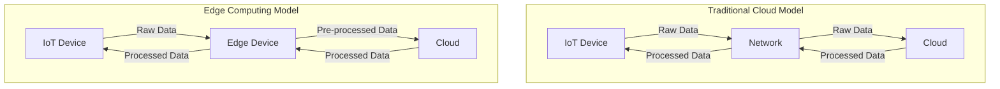
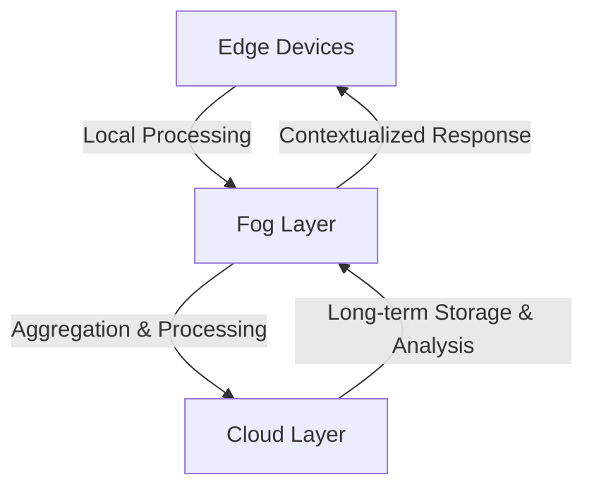

# Networks Edge Computing

## Introduction

Edge computing is revolutionizing how data is processed in Internet of Things (IoT) networks. Rather than sending all data to centralized cloud servers, edge computing brings computation and data storage closer to the devices where it's being generated. This paradigm shift allows for faster response times, reduced bandwidth usage, and enhanced privacy and security.

In this tutorial, we'll explore the fundamentals of edge computing in IoT networks, understand its architecture, and see how it's implemented in real-world applications. By the end, you'll have a solid understanding of how edge computing works and why it's becoming increasingly important in our connected world.

## What is Edge Computing?

Edge computing refers to the practice of processing data near the edge of the network, where the data is produced, rather than in a centralized data-processing warehouse. 

### Traditional Cloud vs. Edge Computing

To understand edge computing better, let's compare it with the traditional cloud computing model:



In the traditional cloud model, all data generated by IoT devices is sent to the cloud for processing, which can cause:
- High latency (delay in response)
- Bandwidth congestion
- Dependency on internet connectivity
- Privacy concerns

Edge computing addresses these issues by processing data closer to where it's generated, resulting in:
- Lower latency
- Reduced bandwidth usage
- Ability to work offline
- Better privacy and security

## Edge Computing Architecture

A typical edge computing architecture in IoT networks consists of the following layers:

### 1. Perception Layer
This layer consists of IoT devices and sensors that collect data from the environment.

### 2. Edge Layer
This is where edge devices and gateways are located. These devices process data from the perception layer before sending it to the cloud.

### 3. Network Layer
This layer facilitates communication between edge devices and the cloud.

### 4. Cloud Layer
The cloud provides additional storage and complex processing capabilities.

## Implementing Edge Computing

Let's look at how we can implement a simple edge computing solution using Node.js. This example shows a simple edge device that processes sensor data locally before sending aggregated results to the cloud.

```javascript
// Edge Device Code
const express = require('express');
const mqtt = require('mqtt');
const app = express();
const port = 3000;

// Configuration
const TEMPERATURE_THRESHOLD = 30; // Celsius
const REPORTING_INTERVAL = 60000; // 1 minute in milliseconds

// Connect to local sensors
const sensorData = [];
let aggregatedData = {
  avgTemperature: 0,
  maxTemperature: 0,
  minTemperature: Infinity,
  alertCount: 0
};

// Simulated sensor reading (in a real implementation, this would connect to physical sensors)
function readSensor() {
  return {
    temperature: Math.random() * 40, // Random temperature between 0-40 Celsius
    humidity: Math.random() * 100,   // Random humidity between 0-100%
    timestamp: new Date().toISOString()
  };
}

// Process data at the edge
function processData(data) {
  // Store raw data temporarily
  sensorData.push(data);
  
  // Alert logic - processed at the edge
  if (data.temperature > TEMPERATURE_THRESHOLD) {
    console.log(`ALERT: High temperature detected: ${data.temperature}°C`);
    aggregatedData.alertCount++;
    
    // Take immediate action locally
    // For example, trigger a cooling system
    // triggerCoolingSystem();
  }
  
  // Update aggregated statistics
  aggregatedData.avgTemperature = sensorData.reduce((sum, reading) => sum + reading.temperature, 0) / sensorData.length;
  aggregatedData.maxTemperature = Math.max(aggregatedData.maxTemperature, data.temperature);
  aggregatedData.minTemperature = Math.min(aggregatedData.minTemperature, data.temperature);
}

// Connect to cloud (MQTT broker)
const client = mqtt.connect('mqtt://broker.example.com');
client.on('connect', () => {
  console.log('Connected to cloud MQTT broker');
});

// Simulate reading sensor data every second
setInterval(() => {
  const data = readSensor();
  processData(data);
}, 1000);

// Send only aggregated data to the cloud at specified interval
setInterval(() => {
  console.log('Sending aggregated data to cloud:', aggregatedData);
  client.publish('edge/aggregated-data', JSON.stringify(aggregatedData));
  
  // Reset aggregated data after sending
  aggregatedData = {
    avgTemperature: 0,
    maxTemperature: 0,
    minTemperature: Infinity,
    alertCount: 0
  };
  
  // Clear sensor data array
  sensorData.length = 0;
}, REPORTING_INTERVAL);

// API to access local data from the edge device
app.get('/data', (req, res) => {
  res.json({
    rawData: sensorData,
    aggregatedData: aggregatedData
  });
});

app.listen(port, () => {
  console.log(`Edge device running at http://localhost:${port}`);
});
```

In this example:
1. Raw sensor data is collected every second
2. The data is processed locally on the edge device:
   - Immediate alerts are generated for high temperatures
   - Statistics are calculated continuously
3. Only aggregated data is sent to the cloud every minute
4. A local API allows other devices on the local network to access the data

### Expected Output

When running the code, you might see output like:

```
Edge device running at http://localhost:3000
Connected to cloud MQTT broker
ALERT: High temperature detected: 35.7°C
ALERT: High temperature detected: 32.1°C
Sending aggregated data to cloud: {
  avgTemperature: 25.3,
  maxTemperature: 35.7,
  minTemperature: 12.4,
  alertCount: 2
}
```

## Real-World Applications of Edge Computing

### 1. Smart Cities

In smart cities, edge computing is used to process data from thousands of sensors in real-time:

```javascript
// Traffic light control system with edge computing
function processTrafficData(vehicleCount, pedestrianCount, emergencyVehiclePresent) {
  if (emergencyVehiclePresent) {
    // Immediate response without waiting for cloud
    return 'GREEN_FOR_EMERGENCY';
  } else if (pedestrianCount > 10) {
    return 'GREEN_FOR_PEDESTRIANS';
  } else if (vehicleCount > 20) {
    return 'EXTEND_GREEN_FOR_VEHICLES';
  } else {
    return 'NORMAL_CYCLE';
  }
}
```

### 2. Industrial IoT (IIoT)

Edge computing in factories allows for real-time monitoring and predictive maintenance:

```javascript
// Predictive maintenance on an edge device
function analyzeMachineVibration(vibrationData) {
  // Process vibration data locally
  const vibrationPattern = performFFT(vibrationData);
  
  // Check for patterns indicating potential failure
  if (detectAnomalousPattern(vibrationPattern)) {
    // Immediate local action
    triggerMaintenanceAlert();
    reduceOperationalSpeed();
    
    // Send detailed data to cloud for further analysis
    sendToCloud({
      alertType: 'POTENTIAL_FAILURE',
      machineId: MACHINE_ID,
      vibrationPattern: vibrationPattern,
      timestamp: new Date().toISOString()
    });
  } else {
    // Send only summary data to cloud
    sendToCloud({
      machineId: MACHINE_ID,
      status: 'NORMAL',
      timestamp: new Date().toISOString()
    });
  }
}
```

### 3. Autonomous Vehicles

Edge computing is crucial for autonomous vehicles that need to make split-second decisions:

```javascript
// Simplified obstacle detection on edge device in vehicle
function processLidarData(lidarPoints) {
  // Process 3D point cloud locally
  const obstacles = detectObstacles(lidarPoints);
  
  for (const obstacle of obstacles) {
    if (obstacle.distance < EMERGENCY_THRESHOLD && obstacle.inPath) {
      // Immediate braking - can't wait for cloud response
      emergencyBrake();
      break;
    } else if (obstacle.distance < WARNING_THRESHOLD && obstacle.inPath) {
      // Reduce speed
      reduceSpeed(calculateSafeSpeed(obstacle));
    }
  }
  
  // Only send summary to cloud for mapping and future route planning
  sendToCloud({
    position: getCurrentGPS(),
    obstaclesSummary: summarizeObstacles(obstacles),
    timestamp: new Date().toISOString()
  });
}
```

### 4. Healthcare IoT

Edge computing can be life-saving in healthcare monitoring systems:

```javascript
// Patient monitoring with edge computing
function monitorPatientVitals(heartRate, bloodPressure, oxygenLevel) {
  // Store readings locally
  storeVitals(heartRate, bloodPressure, oxygenLevel);
  
  // Process at the edge for immediate response
  if (oxygenLevel < CRITICAL_OXYGEN_THRESHOLD) {
    // Immediate local alert - can't wait for cloud
    triggerNurseAlert('CRITICAL_OXYGEN', roomNumber);
    activateOxygenSystem();
  } else if (heartRate > MAX_HEART_RATE || heartRate < MIN_HEART_RATE) {
    triggerNurseAlert('ABNORMAL_HEART_RATE', roomNumber);
  }
  
  // Send aggregated data to cloud every hour for long-term analysis
  if (isTimeToSendAggregate()) {
    sendAggregatedVitalsToCloud();
  }
}
```

## Benefits and Challenges of Edge Computing

### Benefits

1. **Reduced Latency**: By processing data closer to the source, response times are significantly reduced.
2. **Bandwidth Efficiency**: Only relevant data is sent to the cloud, reducing bandwidth usage.
3. **Improved Reliability**: Edge devices can continue to function even when cloud connectivity is lost.
4. **Enhanced Privacy**: Sensitive data can be processed locally without sending it to the cloud.
5. **Real-time Processing**: Critical applications can respond in real-time.

### Challenges

1. **Limited Resources**: Edge devices have limited processing power and storage compared to cloud servers.
2. **Security Concerns**: Distributed edge devices create a larger attack surface.
3. **Device Management**: Managing and updating numerous edge devices can be complex.
4. **Standardization**: Lack of common standards across different edge computing platforms.

## Advanced Edge Computing Concepts

### Fog Computing

Fog computing extends cloud computing to the edge of the network, creating a three-tier architecture:



### Edge AI

Edge AI involves deploying machine learning models directly on edge devices:

```javascript
// Example: Running a TensorFlow.js model on an edge device
const tf = require('@tensorflow/tfjs-node');

// Load pre-trained model (would be trained in the cloud and deployed to edge)
async function loadModel() {
  const model = await tf.loadLayersModel('file://path/to/model/model.json');
  return model;
}

// Process image data on the edge
async function classifyImage(imageBuffer) {
  const model = await loadModel();
  
  // Prepare image for inference
  const tensor = tf.node.decodeImage(imageBuffer);
  const resized = tf.image.resizeBilinear(tensor, [224, 224]);
  const normalized = resized.div(255.0);
  const batched = normalized.expandDims(0);
  
  // Run inference locally on edge device
  const predictions = await model.predict(batched).data();
  const top3 = Array.from(predictions)
    .map((p, i) => ({probability: p, className: i}))
    .sort((a, b) => b.probability - a.probability)
    .slice(0, 3);
  
  // Take action based on predictions without cloud roundtrip
  if (top3[0].className === EMERGENCY_CLASS && top3[0].probability > 0.8) {
    triggerEmergencyResponse();
  }
  
  // Only send results to cloud, not raw image
  sendToCloud({
    predictions: top3,
    timestamp: new Date().toISOString()
  });
  
  // Clean up
  tf.dispose([tensor, resized, normalized, batched]);
  
  return top3;
}
```

## Summary

Edge computing is transforming IoT networks by bringing processing power closer to data sources, resulting in faster response times, reduced bandwidth usage, and enhanced privacy. The key benefits include reduced latency, improved reliability, and real-time processing capabilities, making edge computing ideal for applications like autonomous vehicles, industrial IoT, and smart cities.

While edge computing offers significant advantages, it also comes with challenges such as limited resources, security concerns, and device management complexities. As technology evolves, we can expect more powerful edge devices and better integration between edge and cloud computing.

## Exercises

1. **Basic Exercise**: Set up a simple edge computing device using a Raspberry Pi that collects temperature data and only sends alerts to the cloud when the temperature exceeds a threshold.

2. **Intermediate Exercise**: Implement a simple edge AI application that can detect objects in images locally and only send the detection results (not the images) to the cloud.

3. **Advanced Exercise**: Design a distributed edge computing system for a smart building that processes data from multiple sensors and coordinates actions between different edge nodes without relying on constant cloud connectivity.

## Additional Resources

- **[Edge Computing For Dummies](https://www.ibm.com/cloud/learn/edge-computing)** - IBM's comprehensive guide to edge computing
- **[Mozilla IoT](https://iot.mozilla.org/)** - Open source framework for IoT development
- **[TensorFlow Lite](https://www.tensorflow.org/lite)** - For implementing machine learning models on edge devices
- **[AWS IoT Greengrass](https://aws.amazon.com/greengrass/)** - AWS's edge computing service
- **[Azure IoT Edge](https://azure.microsoft.com/services/iot-edge/)** - Microsoft's edge computing platform