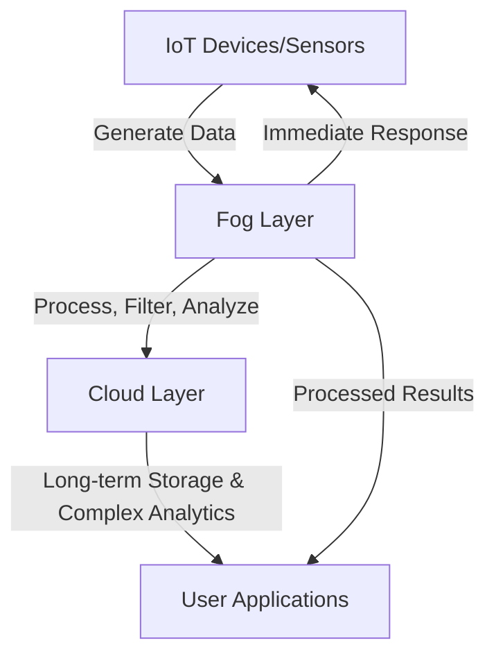

# Networks Fog Computing

## Introduction

Fog Computing represents a paradigm shift in how we process data in Internet of Things (IoT) environments. While cloud computing centralizes processing in remote data centers, fog computing brings computation, storage, and networking closer to where data is generated. This approach addresses critical limitations in traditional cloud architectures, particularly for IoT deployments that require minimal latency, bandwidth efficiency, and enhanced reliability.

Think of fog computing as an intermediate layer between IoT devices and the cloud—extending cloud capabilities to the network edge. Just as fog hovers close to the ground, fog computing positions computational resources close to data sources, creating a distributed computing infrastructure that optimizes IoT networks.

## What is Fog Computing?

Fog computing is a decentralized computing infrastructure that extends cloud computing capabilities to the edge of the network, closer to IoT devices and sensors that produce data. By processing data locally or at network edge devices, fog computing:

- Reduces latency in data processing
- Minimizes bandwidth usage by filtering and preprocessing data
- Improves system reliability through distributed architecture
- Enhances security by keeping sensitive data local
- Enables real-time analytics and decision-making



## Fog Computing vs. Cloud Computing vs. Edge Computing

Understanding fog computing requires contrasting it with related paradigms:

| Characteristic | Cloud Computing | Fog Computing | Edge Computing |
|----------------|----------------|---------------|----------------|
| Processing Location | Centralized data centers | Distributed nodes between devices and cloud | Directly on end devices |
| Latency | Higher (milliseconds to seconds) | Medium (milliseconds) | Lowest (microseconds to milliseconds) |
| Bandwidth Usage | High | Medium | Low |
| Geographic Distribution | Globally centralized | Locally distributed | At the endpoint |
| Resource Capacity | Virtually unlimited | Limited but substantial | Most limited |
| Typical Use Cases | Big data analytics, long-term storage | Local analytics, intermediate processing | Immediate data processing, real-time actions |

Fog computing complements both cloud and edge computing rather than replacing them. It forms part of a computing continuum that optimizes data processing based on application requirements.

## Fog Computing Architecture

A typical fog computing architecture includes multiple layers:

1. **Device Layer**: IoT devices and sensors that collect data
2. **Fog Layer**: Fog nodes (routers, gateways, dedicated fog servers) that process data
3. **Transport Layer**: Network infrastructure connecting fog nodes to the cloud
4. **Cloud Layer**: Traditional cloud infrastructure for long-term storage and complex processing

Fog nodes might include:
- IoT gateways
- Networking equipment (routers, switches)
- Industrial controllers
- Embedded servers
- Specialized fog computing appliances

These nodes typically contain:
- Computing resources (CPU, memory)
- Storage capabilities
- Networking interfaces
- Virtualization support for running applications

## Implementing Fog Computing

Let's examine a basic implementation of fog computing using a simple IoT temperature monitoring system.

### Example: Temperature Monitoring System

In this example, we'll create a simplified fog node that collects temperature data from sensors, processes it locally, and only sends summarized data to the cloud.

#### Device Layer (Sensor Code)

Here's a basic Arduino sketch for a temperature sensor:

```cpp
#include <DHT.h>
#include <ESP8266WiFi.h>
#include <PubSubClient.h>

#define DHTPIN 2
#define DHTTYPE DHT22

DHT dht(DHTPIN, DHTTYPE);
WiFiClient espClient;
PubSubClient client(espClient);

const char* ssid = "NetworkName";
const char* password = "NetworkPassword";
const char* mqtt_server = "192.168.1.100"; // Fog node IP

void setup() {
  Serial.begin(115200);
  dht.begin();
  
  // Connect to WiFi
  WiFi.begin(ssid, password);
  while (WiFi.status() != WL_CONNECTED) {
    delay(500);
    Serial.print(".");
  }
  
  // Connect to MQTT broker on fog node
  client.setServer(mqtt_server, 1883);
}

void loop() {
  if (!client.connected()) {
    reconnect();
  }
  
  float temp = dht.readTemperature();
  float humidity = dht.readHumidity();
  
  if (!isnan(temp) && !isnan(humidity)) {
    // Publish temperature reading to fog node
    String message = String(temp) + "," + String(humidity);
    client.publish("sensor/temperature", message.c_str());
  }
  
  delay(30000); // Read every 30 seconds
}

void reconnect() {
  while (!client.connected()) {
    if (client.connect("ESP8266Client")) {
      Serial.println("Connected to MQTT broker");
    } else {
      delay(5000);
    }
  }
}
```

#### Fog Layer (Node.js Fog Node)

This Node.js application runs on a fog node (such as a Raspberry Pi) that receives data from multiple sensors:

```javascript
const mqtt = require('mqtt');
const client = mqtt.connect('mqtt://localhost');
const axios = require('axios');

// Configuration
const CLOUD_API_ENDPOINT = 'https://your-cloud-api.com/data';
const ALERT_THRESHOLD = 30; // Celsius
const REPORTING_INTERVAL = 3600000; // 1 hour in milliseconds

// Storage for temperature readings
let temperatureReadings = [];
let lastReportTime = Date.now();

// Connect to MQTT broker and subscribe to temperature topic
client.on('connect', () => {
  console.log('Fog node connected to MQTT broker');
  client.subscribe('sensor/temperature');
});

// Process incoming sensor data
client.on('message', (topic, message) => {
  if (topic === 'sensor/temperature') {
    const [temperature, humidity] = message.toString().split(',');
    const reading = {
      temperature: parseFloat(temperature),
      humidity: parseFloat(humidity),
      timestamp: Date.now()
    };
    
    // Store the reading
    temperatureReadings.push(reading);
    
    // Process data locally - check for high temperature alerts
    if (reading.temperature > ALERT_THRESHOLD) {
      handleHighTemperatureAlert(reading);
    }
    
    // Check if it's time to send summarized data to cloud
    if (Date.now() - lastReportTime > REPORTING_INTERVAL) {
      sendSummaryToCloud();
    }
  }
});

// Handle high temperature alerts locally
function handleHighTemperatureAlert(reading) {
  console.log(`ALERT: High temperature detected: ${reading.temperature}°C`);
  // In a real system, this might trigger local actuators or notifications
  // without needing to wait for cloud communication
}

// Send summarized data to cloud
function sendSummaryToCloud() {
  if (temperatureReadings.length === 0) {
    return;
  }
  
  // Calculate summary statistics
  const avgTemp = temperatureReadings.reduce((sum, reading) => 
    sum + reading.temperature, 0) / temperatureReadings.length;
  
  const avgHumidity = temperatureReadings.reduce((sum, reading) => 
    sum + reading.humidity, 0) / temperatureReadings.length;
  
  const minTemp = Math.min(...temperatureReadings.map(r => r.temperature));
  const maxTemp = Math.max(...temperatureReadings.map(r => r.temperature));
  
  // Prepare summary data
  const summary = {
    deviceCount: new Set(temperatureReadings.map(r => r.deviceId)).size,
    readingCount: temperatureReadings.length,
    timeRange: {
      start: temperatureReadings[0].timestamp,
      end: temperatureReadings[temperatureReadings.length - 1].timestamp
    },
    temperature: {
      avg: avgTemp,
      min: minTemp,
      max: maxTemp
    },
    humidity: {
      avg: avgHumidity
    },
    // Send only 10% of raw readings as samples
    samples: temperatureReadings.filter((_, i) => i % 10 === 0)
  };
  
  // Send to cloud
  axios.post(CLOUD_API_ENDPOINT, summary)
    .then(() => {
      console.log('Summary data sent to cloud successfully');
      temperatureReadings = []; // Clear after sending
      lastReportTime = Date.now();
    })
    .catch(error => {
      console.error('Error sending data to cloud:', error);
      // In case of error, we keep the readings to try again later
    });
}
```

#### Output and Benefits

With this implementation:

1. Temperature readings occur every 30 seconds on the IoT device
2. The fog node processes all readings in real-time
3. High-temperature alerts are handled locally with minimal latency
4. Only summarized data is sent to the cloud once per hour

**Data traffic reduction:**
- Raw data: 120 readings per hour × number of sensors
- Sent to cloud: 1 summary + ~12 sample readings per hour

This represents approximately a 90% reduction in cloud bandwidth usage while maintaining real-time alerting capabilities.

## Real-World Applications of Fog Computing

### Smart Cities

In smart city deployments, fog computing manages the massive data flow from thousands of sensors:

- **Traffic management**: Traffic light controllers act as fog nodes, processing local camera data to optimize traffic flow in real-time, while sending summarized data to central systems for city-wide planning.
- **Public safety**: Video surveillance systems use fog computing to analyze footage locally, only alerting authorities when suspicious activities are detected rather than streaming all video to central servers.
- **Utility management**: Smart grid implementations use fog nodes to monitor power consumption patterns, detect anomalies, and balance load without requiring constant cloud connectivity.

### Industrial IoT (IIoT)

Manufacturing and industrial applications benefit significantly from fog computing:

- **Predictive maintenance**: Machinery sensors connect to local fog nodes that analyze vibration patterns and temperature data to predict equipment failures before they occur.
- **Quality control**: Production lines use fog computing to process image recognition data for defect detection without sending high-resolution images to remote servers.
- **Supply chain optimization**: Warehouse management systems use distributed fog nodes to track inventory, optimize picking routes, and coordinate with logistics systems.

### Healthcare

Healthcare IoT implementations rely on fog computing for responsive patient care:

- **Patient monitoring**: Hospital rooms equipped with fog nodes process vital sign data locally, providing immediate alerts to nursing stations while sending trend data to electronic health record systems.
- **Medical imaging**: Diagnostic equipment uses fog computing to pre-process images, reducing the volume of data sent to storage while ensuring critical findings are highlighted immediately.
- **Remote healthcare**: Telemedicine devices leverage fog computing to maintain service during connectivity disruptions and manage sensitive patient data locally.

## Challenges and Considerations

While fog computing offers significant benefits, implementers should consider several challenges:

### Security Concerns

Distributed architectures introduce multiple attack surfaces:
- **Data protection**: Sensitive information may reside on fog nodes with varying security capabilities
- **Authentication**: Devices, fog nodes, and cloud systems must maintain secure identity management
- **Physical security**: Fog nodes may be deployed in physically accessible locations

### Resource Management

Fog nodes have limited resources compared to cloud infrastructure:
- **Workload scheduling**: Determining which processes run locally versus in the cloud
- **Resource allocation**: Balancing computing resources across multiple applications
- **Power constraints**: Many fog nodes operate with limited power budgets

### Standardization

The fog computing landscape lacks full standardization:
- **Interoperability**: Ensuring different vendors' fog solutions work together
- **Management protocols**: Standardizing how fog nodes communicate and coordinate
- **Development frameworks**: Creating consistent programming models for fog applications

## Best Practices for Fog Computing Implementation

To successfully implement fog computing in IoT networks:

1. **Start with clear use cases**: Identify applications where latency, bandwidth, or reliability issues justify fog deployment
2. **Implement proper security**: Use encryption, authentication, and access controls across all layers
3. **Design for failure**: Ensure systems remain operational when cloud connectivity is lost
4. **Plan for scalability**: Create architectures that can accommodate growing numbers of devices
5. **Optimize data handling**: Determine what data should be processed locally versus sent to the cloud
6. **Consider management overhead**: Implement tools to monitor and maintain distributed fog nodes
7. **Balance workloads dynamically**: Create systems that can shift processing between fog and cloud as needed

## Summary

Fog computing represents a critical evolution in IoT network architecture, addressing the limitations of purely cloud-based approaches. By distributing computing, storage, and networking functions closer to data sources, fog computing enables:

- Reduced latency for time-sensitive applications
- Decreased bandwidth consumption through local processing
- Enhanced reliability through distributed architecture
- Improved privacy by keeping sensitive data local
- Greater scalability for large IoT deployments

As IoT continues to expand into more domains, fog computing will play an increasingly important role in building responsive, efficient, and reliable systems that can operate at the scale required by modern applications.

## Exercises

1. **Design Exercise**: Sketch a fog computing architecture for a smart home system that includes temperature sensors, security cameras, and voice assistants.

2. **Implementation Exercise**: Using a Raspberry Pi (or similar device), create a simple fog node that collects data from a simulated sensor, processes it locally, and forwards summaries to a cloud service.

3. **Analysis Exercise**: Compare the bandwidth usage of a direct-to-cloud approach versus a fog computing approach for a system that collects temperature readings every 5 seconds from 100 sensors.

4. **Research Exercise**: Investigate how major cloud providers (AWS, Azure, Google Cloud) are incorporating fog/edge computing into their IoT offerings.

5. **Security Exercise**: Identify three potential security vulnerabilities in a fog computing deployment and propose mitigation strategies for each.

## Additional Resources

- **Open Source Tools**: 
  - [Eclipse ioFog](https://iofog.org/) - A fog computing framework
  - [EdgeX Foundry](https://www.edgexfoundry.org/) - Open platform for edge/fog computing

- **Standards**: 
  - OpenFog Consortium Reference Architecture
  - Industrial Internet Consortium's Edge Computing Task Group publications

- **Further Learning**: 
  - Introduction to Edge Computing in IoT
  - Network Protocols for IoT Devices
  - Data Management in Distributed Systems