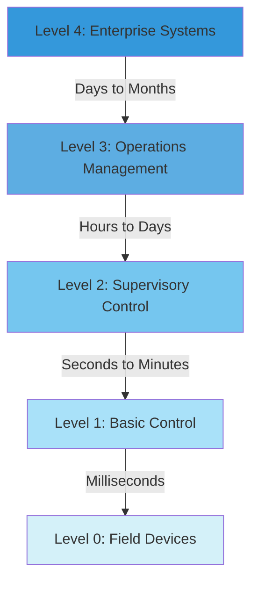
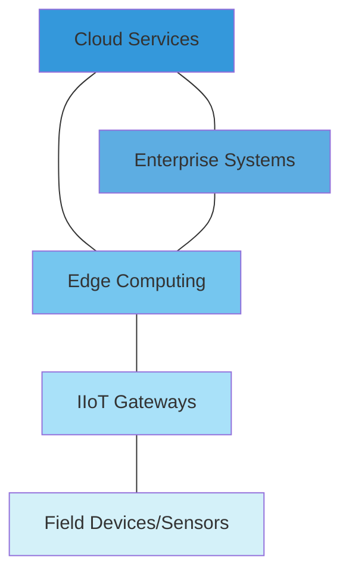
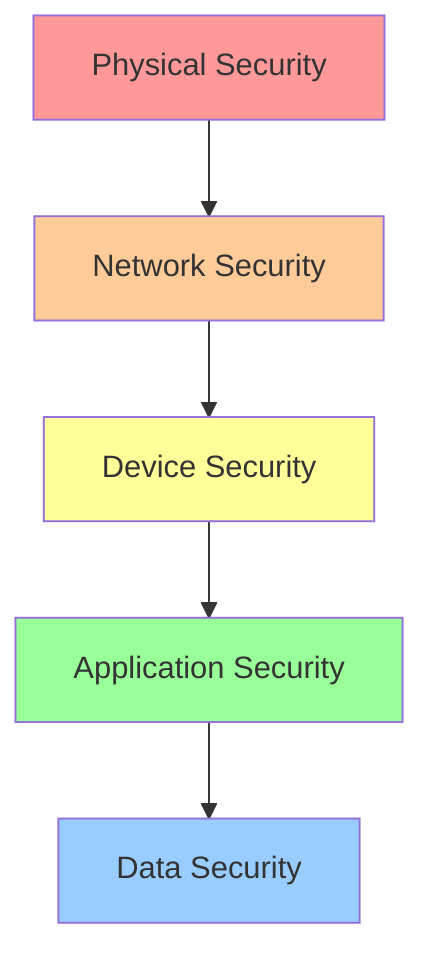

# Networks Industrial IoT

## Introduction

Industrial Internet of Things (IIoT) represents the application of IoT technologies specifically in industrial settings. Unlike consumer IoT, which focuses on convenience and lifestyle enhancement, IIoT connects critical machines, systems, and infrastructure to improve manufacturing efficiency, enable predictive maintenance, and create smarter factories and industrial processes.

IIoT networks are the backbone that enables this industrial transformation, providing the connectivity infrastructure that allows industrial equipment, sensors, and systems to communicate, share data, and operate as coordinated systems.

## Key Characteristics of Industrial IoT Networks

IIoT networks have unique requirements that differentiate them from consumer or enterprise networks:

1. **Reliability**: Industrial processes often cannot tolerate downtime
2. **Real-time communication**: Many applications require deterministic timing
3. **Ruggedness**: Must operate in harsh environments (heat, vibration, dust)
4. **Security**: Protection against cyber threats is critical for operational safety
5. **Longevity**: Industrial equipment often has lifecycles of 10-20+ years
6. **Scalability**: Must handle thousands of connected devices
7. **Low power operation**: Remote sensors may need to operate for years on battery power

## Common IIoT Network Architectures

### The ISA-95 Pyramid

The traditional model for industrial networks is the ISA-95 pyramid, which organizes industrial systems into hierarchical levels:



### Modern IIoT Reference Architecture

With IIoT, this traditional pyramid is evolving into a more flexible architecture:



## IIoT Network Protocols

Industrial networks use specialized protocols designed for their specific requirements:

### Field-Level Protocols

These protocols connect sensors, actuators, and controllers:

1. **Modbus**: One of the oldest and still widely used industrial protocols
2. **PROFINET**: High-speed industrial Ethernet protocol
3. **EtherNet/IP**: Adaptation of Ethernet for industrial applications
4. **OPC UA**: Platform-independent service-oriented architecture

### Gateway & Transport Protocols

These protocols handle data movement across the network:

1. **MQTT**: Lightweight publish/subscribe messaging protocol
2. **AMQP**: Advanced Message Queuing Protocol for reliable messaging
3. **CoAP**: Constrained Application Protocol for resource-constrained devices

Let's look at a simple example of MQTT communication, which is commonly used in IIoT:

```javascript
// Example: MQTT communication in Node.js
const mqtt = require('mqtt');

// Connect to MQTT broker (common in IIoT setups)
const client = mqtt.connect('mqtt://broker.example.com');

// Subscribe to sensor data topics
client.on('connect', () => {
  console.log('Connected to MQTT broker');
  client.subscribe('factory/machine1/temperature');
  client.subscribe('factory/machine1/pressure');
});

// Process incoming sensor data
client.on('message', (topic, message) => {
  const sensorValue = parseFloat(message.toString());
  console.log(`Received ${topic}: ${sensorValue}`);
  
  // Example alert condition
  if (topic === 'factory/machine1/temperature' && sensorValue > 85) {
    console.log('ALERT: Temperature exceeds threshold!');
    // Trigger alert actions
  }
});

// Example of publishing data (e.g., from an edge device)
function publishMachineStatus(machineId, status) {
  client.publish(`factory/${machineId}/status`, status.toString());
}

// Example: Control command
function setMachineSpeed(machineId, speedRPM) {
  client.publish(`factory/${machineId}/commands/speed`, speedRPM.toString());
}
```

### Output from the MQTT example:
```
Connected to MQTT broker
Received factory/machine1/temperature: 72.5
Received factory/machine1/pressure: 103.2
Received factory/machine1/temperature: 87.3
ALERT: Temperature exceeds threshold!
```

## Edge Computing in IIoT Networks

Edge computing plays a crucial role in IIoT networks by processing data closer to where it's generated, reducing latency and bandwidth usage.

### Example of Edge Processing with Node.js

```javascript
// Edge computing example for a manufacturing line
const mqtt = require('mqtt');
const client = mqtt.connect('mqtt://local-broker');
const fs = require('fs');

// Configuration
const SAMPLE_INTERVAL_MS = 100; // 100ms sampling
const ANALYSIS_WINDOW = 50;     // Analyze 50 samples at a time
const REPORTING_INTERVAL = 3600000; // Send summary to cloud every hour

// Local data storage
let vibrationReadings = [];
let temperatureReadings = [];
let lastReportTime = Date.now();

// Subscribe to high-frequency sensor data
client.on('connect', () => {
  client.subscribe('machine/motor/vibration');
  client.subscribe('machine/motor/temperature');
});

// Process incoming sensor data locally
client.on('message', (topic, message) => {
  const value = parseFloat(message.toString());
  const timestamp = Date.now();
  
  // Store readings in local memory
  if (topic === 'machine/motor/vibration') {
    vibrationReadings.push({ value, timestamp });
    
    // Once we have enough readings, analyze for anomalies
    if (vibrationReadings.length >= ANALYSIS_WINDOW) {
      detectVibrationAnomalies();
    }
  } else if (topic === 'machine/motor/temperature') {
    temperatureReadings.push({ value, timestamp });
  }
  
  // Periodically send summarized data to the cloud
  if (timestamp - lastReportTime > REPORTING_INTERVAL) {
    sendSummaryToCloud();
    lastReportTime = timestamp;
  }
});

// Local edge analysis function
function detectVibrationAnomalies() {
  // Get the most recent window of vibration data
  const recentData = vibrationReadings.slice(-ANALYSIS_WINDOW);
  
  // Calculate statistics
  const sum = recentData.reduce((acc, reading) => acc + reading.value, 0);
  const avg = sum / recentData.length;
  
  // Calculate standard deviation
  const squareDiffs = recentData.map(reading => {
    const diff = reading.value - avg;
    return diff * diff;
  });
  const avgSquareDiff = squareDiffs.reduce((acc, val) => acc + val, 0) / squareDiffs.length;
  const stdDev = Math.sqrt(avgSquareDiff);
  
  // Detect anomalies (values more than 3 standard deviations from mean)
  const anomalies = recentData.filter(reading => 
    Math.abs(reading.value - avg) > 3 * stdDev
  );
  
  // If anomalies detected, take immediate action locally
  if (anomalies.length > 0) {
    console.log(`ANOMALY DETECTED! ${anomalies.length} unusual vibration patterns`);
    
    // Take local action - alert local HMI
    client.publish('machine/alerts/vibration', JSON.stringify({
      severity: 'high',
      count: anomalies.length,
      timestamp: Date.now()
    }));
    
    // Log anomaly to local storage
    fs.appendFileSync('anomaly_log.txt', 
      `${new Date().toISOString()}: ${anomalies.length} vibration anomalies detected
`
    );
  }
  
  // Keep only the most recent 1000 readings to manage memory
  if (vibrationReadings.length > 1000) {
    vibrationReadings = vibrationReadings.slice(-1000);
  }
}

// Function to send summarized data to cloud
function sendSummaryToCloud() {
  // Calculate temperature statistics
  const tempValues = temperatureReadings.map(r => r.value);
  const tempMin = Math.min(...tempValues);
  const tempMax = Math.max(...tempValues);
  const tempAvg = tempValues.reduce((sum, val) => sum + val, 0) / tempValues.length;
  
  // Calculate vibration statistics
  const vibValues = vibrationReadings.map(r => r.value);
  const vibMin = Math.min(...vibValues);
  const vibMax = Math.max(...vibValues);
  const vibAvg = vibValues.reduce((sum, val) => sum + val, 0) / vibValues.length;
  
  // Send summary to cloud (using MQTT in this example)
  client.publish('cloud/machine/summary', JSON.stringify({
    deviceId: 'motor-unit-123',
    timestamp: Date.now(),
    period: REPORTING_INTERVAL,
    temperature: {
      min: tempMin,
      max: tempMax,
      avg: tempAvg,
      samples: temperatureReadings.length
    },
    vibration: {
      min: vibMin,
      max: vibMax,
      avg: vibAvg,
      samples: vibrationReadings.length
    }
  }));
  
  console.log('Sent summary data to cloud');
  
  // Reset or trim data arrays after reporting
  temperatureReadings = temperatureReadings.slice(-100);
  vibrationReadings = vibrationReadings.slice(-100);
}
```

This edge computing example demonstrates how an IIoT device can:
1. Collect high-frequency sensor data locally
2. Process data at the edge to detect anomalies in real-time
3. Take immediate local actions when needed
4. Send only summarized data to the cloud periodically
5. Manage local storage to operate efficiently

## IIoT Security Considerations

Security is paramount in industrial environments where breaches can lead to physical damage or safety risks:

### Security Layers in IIoT



### Implementing Basic IIoT Security

Here's a simple example of implementing a secure MQTT connection with TLS:

```javascript
// Secure MQTT connection example
const mqtt = require('mqtt');
const fs = require('fs');

// Security configuration
const options = {
  port: 8883, // Standard secure MQTT port
  host: 'secure-broker.example.com',
  protocol: 'mqtts', // MQTT over TLS
  rejectUnauthorized: true, // Verify server certificate
  ca: fs.readFileSync('ca.crt'), // CA certificate
  cert: fs.readFileSync('client.crt'), // Client certificate
  key: fs.readFileSync('client.key'), // Client private key
  clientId: 'machine-controller-' + Math.random().toString(16).substring(2, 8)
};

// Establish secure connection
const client = mqtt.connect(options);

client.on('connect', () => {
  console.log('Securely connected to MQTT broker');
  // Continue with secure communication
});

client.on('error', (error) => {
  console.error('Connection error:', error);
});
```

## Real-world IIoT Network Applications

### Predictive Maintenance

Predictive maintenance uses sensor data to predict when equipment will fail, allowing for maintenance before costly breakdowns occur.

```javascript
// Simplified predictive maintenance algorithm
function analyzeBearingHealth(vibrationData, temperatureData) {
  // Calculate vibration RMS (Root Mean Square)
  const vibrationRMS = Math.sqrt(
    vibrationData.reduce((sum, val) => sum + val * val, 0) / vibrationData.length
  );
  
  // Calculate average temperature
  const avgTemp = temperatureData.reduce((sum, val) => sum + val, 0) / temperatureData.length;
  
  // Simple health scoring
  let bearingHealth = 100; // Start with perfect health
  
  // Reduce health score based on vibration (higher vibration = lower health)
  if (vibrationRMS > 2.0) bearingHealth -= 20;
  if (vibrationRMS > 3.5) bearingHealth -= 30;
  if (vibrationRMS > 5.0) bearingHealth -= 40;
  
  // Reduce health score based on temperature
  if (avgTemp > 70) bearingHealth -= 10;
  if (avgTemp > 85) bearingHealth -= 25;
  if (avgTemp > 95) bearingHealth -= 45;
  
  // Determine maintenance action based on health score
  let action = "";
  if (bearingHealth < 20) {
    action = "URGENT: Replace bearing immediately";
  } else if (bearingHealth < 50) {
    action = "WARNING: Schedule bearing replacement within 1 week";
  } else if (bearingHealth < 80) {
    action = "CAUTION: Inspect bearing at next maintenance interval";
  } else {
    action = "HEALTHY: No action required";
  }
  
  return {
    healthScore: bearingHealth,
    recommendedAction: action,
    estimatedRemainingLife: Math.max(0, bearingHealth * 24), // Simple hours estimation
    metrics: {
      vibrationRMS,
      averageTemperature: avgTemp
    }
  };
}
```

### Energy Monitoring and Optimization

Many factories implement IIoT networks to monitor and optimize energy usage:

```javascript
// Energy monitoring and optimization example
class EnergyMonitor {
  constructor(deviceId, reportingInterval = 60000) {
    this.deviceId = deviceId;
    this.reportingInterval = reportingInterval;
    this.powerReadings = [];
    this.lastOptimization = Date.now();
    this.optimizationInterval = 3600000; // 1 hour
    this.client = mqtt.connect('mqtt://energy-broker.example.com');
    
    // Set up data collection
    this.client.on('connect', () => {
      this.client.subscribe(`device/${this.deviceId}/power`);
      console.log(`Energy monitor connected for device ${this.deviceId}`);
      
      // Set up reporting schedule
      setInterval(() => this.reportEnergyUsage(), this.reportingInterval);
      
      // Set up optimization schedule
      setInterval(() => this.suggestOptimizations(), this.optimizationInterval);
    });
    
    // Process incoming power readings
    this.client.on('message', (topic, message) => {
      if (topic === `device/${this.deviceId}/power`) {
        const reading = {
          timestamp: Date.now(),
          value: parseFloat(message.toString()),
        };
        this.powerReadings.push(reading);
      }
    });
  }
  
  // Report energy usage 
  reportEnergyUsage() {
    if (this.powerReadings.length === 0) return;
    
    const now = Date.now();
    const periodReadings = this.powerReadings.filter(
      r => r.timestamp > now - this.reportingInterval
    );
    
    if (periodReadings.length === 0) return;
    
    // Calculate energy usage for the period (kWh)
    // Power readings are in kW, need to convert time to hours
    let totalEnergy = 0;
    for (let i = 1; i < periodReadings.length; i++) {
      const timeDiff = (periodReadings[i].timestamp - periodReadings[i-1].timestamp) / 3600000; // hours
      const avgPower = (periodReadings[i].value + periodReadings[i-1].value) / 2;
      totalEnergy += avgPower * timeDiff;
    }
    
    // Report energy usage
    this.client.publish('energy/usage', JSON.stringify({
      deviceId: this.deviceId,
      timestamp: now,
      period: this.reportingInterval,
      energyUsed: totalEnergy,
      averagePower: periodReadings.reduce((sum, r) => sum + r.value, 0) / periodReadings.length,
      peakPower: Math.max(...periodReadings.map(r => r.value)),
      readings: periodReadings.length
    }));
    
    console.log(`Reported energy usage: ${totalEnergy.toFixed(3)} kWh`);
    
    // Keep last 24 hours of data
    const oneDayAgo = now - 86400000;
    this.powerReadings = this.powerReadings.filter(r => r.timestamp > oneDayAgo);
  }
  
  // Analyze patterns and suggest optimizations
  suggestOptimizations() {
    if (this.powerReadings.length < 100) return; // Need sufficient data
    
    const now = Date.now();
    
    // Group readings by hour of day to find patterns
    const hourlyUsage = Array(24).fill(0);
    const hourlyCount = Array(24).fill(0);
    
    this.powerReadings.forEach(reading => {
      const hour = new Date(reading.timestamp).getHours();
      hourlyUsage[hour] += reading.value;
      hourlyCount[hour]++;
    });
    
    // Calculate average power by hour
    const hourlyAvgPower = hourlyUsage.map((total, hour) => 
      hourlyCount[hour] ? total / hourlyCount[hour] : 0
    );
    
    // Find peak hours (top 20% of hours)
    const sortedHours = [...hourlyAvgPower]
      .map((power, hour) => ({ hour, power }))
      .sort((a, b) => b.power - a.power);
    
    const peakHours = sortedHours.slice(0, 5).map(h => h.hour);
    
    // Calculate potential savings by shifting load
    const peakAverage = peakHours.reduce((sum, hour) => sum + hourlyAvgPower[hour], 0) / peakHours.length;
    const offPeakAverage = hourlyAvgPower
      .filter((_, hour) => !peakHours.includes(hour))
      .reduce((sum, power) => sum + power, 0) / (24 - peakHours.length);
    
    const potentialSavings = peakHours.length * (peakAverage - offPeakAverage) * 30; // monthly kWh
    
    // Publish optimization suggestions
    this.client.publish('energy/optimizations', JSON.stringify({
      deviceId: this.deviceId,
      timestamp: now,
      peakHours: peakHours.map(h => `${h}:00-${h+1}:00`).join(', '),
      suggestion: peakHours.length > 0 
        ? `Consider shifting operations from peak hours (${peakHours.map(h => `${h}:00`).join(', ')}) to off-peak times`
        : "No clear optimization opportunities identified",
      potentialMonthlySavings: `${potentialSavings.toFixed(1)} kWh`,
      hourlyProfile: hourlyAvgPower.map((power, hour) => ({ hour: `${hour}:00`, avgPower: power }))
    }));
    
    console.log(`Energy optimization analysis complete. Identified ${peakHours.length} peak hours.`);
  }
}

// Usage
const machineMonitor = new EnergyMonitor('injection-molding-machine-7');
```

### Quality Control Systems

IIoT networks enable automated quality control through vision systems and sensor integration:

```javascript
// Example: Quality control with machine vision integration
class QualityControlSystem {
  constructor() {
    this.client = mqtt.connect('mqtt://factory-floor-broker');
    this.defectTypes = {
      SCRATCH: 'Surface scratch detected',
      DENT: 'Dent or deformation detected',
      COLOR: 'Color variation detected',
      DIMENSION: 'Dimension out of tolerance',
      MISSING: 'Missing component detected'
    };
    
    // Connect to vision system and sensors
    this.client.on('connect', () => {
      // Subscribe to camera image analysis results
      this.client.subscribe('vision/results');
      
      // Subscribe to dimensional measurement results
      this.client.subscribe('measurements/dimensions');
      
      console.log('Quality control system online');
    });
    
    // Process incoming quality data
    this.client.on('message', (topic, message) => {
      try {
        const data = JSON.parse(message.toString());
        
        if (topic === 'vision/results') {
          this.processVisionResults(data);
        } else if (topic === 'measurements/dimensions') {
          this.processDimensionResults(data);
        }
      } catch (err) {
        console.error('Error processing quality data:', err);
      }
    });
    
    // Initialize counters
    this.passCount = 0;
    this.failCount = 0;
    this.startTime = Date.now();
    
    // Report statistics hourly
    setInterval(() => this.reportStatistics(), 3600000);
  }
  
  // Process results from machine vision system
  processVisionResults(data) {
    const { productId, timestamp, defects } = data;
    
    if (defects.length === 0) {
      // Product passed visual inspection
      this.passCount++;
      this.client.publish('quality/status', JSON.stringify({
        productId,
        timestamp,
        result: 'PASS',
        inspectionType: 'VISUAL'
      }));
    } else {
      // Product failed visual inspection
      this.failCount++;
      
      // Map defect codes to human-readable descriptions
      const defectDescriptions = defects.map(code => this.defectTypes[code] || 'Unknown defect');
      
      // Publish result
      this.client.publish('quality/status', JSON.stringify({
        productId,
        timestamp,
        result: 'FAIL',
        inspectionType: 'VISUAL',
        defects: defectDescriptions,
        actionRequired: defects.length > 2 ? 'MAJOR_ADJUSTMENT' : 'MINOR_ADJUSTMENT'
      }));
      
      // If critical defect, alert maintenance
      if (defects.includes('MISSING')) {
        this.client.publish('maintenance/alerts', JSON.stringify({
          severity: 'HIGH',
          timestamp,
          message: 'Multiple products with missing components detected',
          recommendedAction: 'Check feeder system and component supply'
        }));
      }
    }
  }
  
  // Process dimensional measurement results
  processDimensionResults(data) {
    const { productId, timestamp, measurements } = data;
    
    // Check if any measurements are out of tolerance
    const outOfTolerance = measurements.filter(m => 
      m.value < m.lowerLimit || m.value > m.upperLimit
    );
    
    if (outOfTolerance.length === 0) {
      // All dimensions within tolerance
      this.passCount++;
      this.client.publish('quality/status', JSON.stringify({
        productId,
        timestamp,
        result: 'PASS',
        inspectionType: 'DIMENSIONAL'
      }));
    } else {
      // Some dimensions out of tolerance
      this.failCount++;
      
      // Calculate how far out of spec
      const deviations = outOfTolerance.map(m => {
        if (m.value < m.lowerLimit) {
          return {
            dimension: m.name,
            deviation: ((m.lowerLimit - m.value) / (m.upperLimit - m.lowerLimit) * 100).toFixed(1) + '%',
            actual: m.value,
            expected: `${m.lowerLimit} - ${m.upperLimit}`
          };
        } else {
          return {
            dimension: m.name,
            deviation: ((m.value - m.upperLimit) / (m.upperLimit - m.lowerLimit) * 100).toFixed(1) + '%',
            actual: m.value,
            expected: `${m.lowerLimit} - ${m.upperLimit}`
          };
        }
      });
      
      // Publish result
      this.client.publish('quality/status', JSON.stringify({
        productId,
        timestamp,
        result: 'FAIL',
        inspectionType: 'DIMENSIONAL',
        deviations,
        actionRequired: deviations.length > 2 ? 'RECALIBRATION' : 'ADJUSTMENT'
      }));
      
      // Alert if multiple consecutive dimension failures (potential tool wear)
      if (this.failCount > this.passCount && this.failCount > 5) {
        this.client.publish('maintenance/alerts', JSON.stringify({
          severity: 'MEDIUM',
          timestamp,
          message: 'Multiple dimensional failures detected',
          recommendedAction: 'Check tooling for wear and calibrate measurement system'
        }));
      }
    }
  }
  
  // Report quality statistics
  reportStatistics() {
    const totalInspected = this.passCount + this.failCount;
    const uptime = ((Date.now() - this.startTime) / 3600000).toFixed(1); // hours
    
    this.client.publish('quality/statistics', JSON.stringify({
      timestamp: Date.now(),
      totalInspected,
      passed: this.passCount,
      failed: this.failCount,
      passRate: totalInspected > 0 ? (this.passCount / totalInspected * 100).toFixed(2) + '%' : 'N/A',
      uptime: uptime + ' hours',
      throughput: (totalInspected / parseFloat(uptime)).toFixed(1) + ' units/hour'
    }));
    
    console.log(`Quality report: ${this.passCount} passed, ${this.failCount} failed`);
    
    // Reset counters for next period
    this.passCount = 0;
    this.failCount = 0;
    this.startTime = Date.now();
  }
}

// Initialize quality control system
const qualitySystem = new QualityControlSystem();
```

## Challenges in Industrial IoT Networks

Despite their potential, implementing IIoT networks comes with several challenges:

1. **Legacy System Integration**: Many industrial facilities have equipment spanning decades
2. **Protocol Fragmentation**: Multiple incompatible protocols exist in industrial settings
3. **IT/OT Convergence**: Merging Information Technology with Operational Technology
4. **Bandwidth Limitations**: Especially in remote or harsh environments
5. **Security**: Critical infrastructure requires robust protection
6. **Reliability and Redundancy**: Need for continuous operation

## Getting Started with Industrial IoT

### Basic IIoT Starter Project: Temperature Monitoring

Here's a simple starter project to monitor temperature in an industrial setting:

```javascript
// Simple temperature monitoring system
const mqtt = require('mqtt');
const fs = require('fs');

// Configuration
const config = {
  broker: 'mqtt://localhost',
  topic: 'sensors/temperature',
  logFile: 'temperature_log.csv',
  alertThreshold: 30, // Celsius
  sampleInterval: 5000 // 5 seconds
};

// Initialize MQTT client
const client = mqtt.connect(config.broker);

// Create CSV file with headers if it doesn't exist
if (!fs.existsSync(config.logFile)) {
  fs.writeFileSync(config.logFile, 'timestamp,temperature,status
');
  console.log(`Created log file: ${config.logFile}`);
}

// Connect to MQTT broker
client.on('connect', () => {
  console.log(`Connected to MQTT broker: ${config.broker}`);
  client.subscribe(config.topic);
  console.log(`Subscribed to topic: ${config.topic}`);
});

// Process incoming messages
client.on('message', (topic, message) => {
  try {
    const temperature = parseFloat(message.toString());
    const timestamp = new Date().toISOString();
    const status = temperature > config.alertThreshold ? 'ALERT' : 'NORMAL';
    
    // Log to console
    console.log(`${timestamp}: Temperature = ${temperature}°C (${status})`);
    
    // Log to file
    fs.appendFileSync(config.logFile, `${timestamp},${temperature},${status}
`);
    
    // Send alert if threshold exceeded
    if (status === 'ALERT') {
      client.publish('alerts/temperature', JSON.stringify({
        timestamp,
        temperature,
        message: `Temperature threshold exceeded: ${temperature}°C`
      }));
    }
  } catch (err) {
    console.error('Error processing temperature reading:', err);
  }
});

// Simulate temperature sensor (for demonstration)
// In a real system, this would be replaced with actual sensor readings
function simulateSensor() {
  // Base temperature with some random variation
  const baseTemp = 25;
  const variation = Math.random() * 10 - 5; // -5 to +5 degrees variation
  
  // Publish temperature reading
  const temperature = (baseTemp + variation).toFixed(1);
  client.publish(config.topic, temperature);
  
  // Schedule next reading
  setTimeout(simulateSensor, config.sampleInterval);
}

// Start simulation
console.log('Starting temperature monitoring system...');
simulateSensor();
```

To run this starter project:
1. Install Node.js on your development machine
2. Install the MQTT package: `npm install mqtt`
3. Run the code above: `node temperature_monitor.js`
4. For a real implementation, replace the simulation with actual sensor readings

## Summary

Industrial IoT networks are transforming manufacturing and industrial processes by connecting machines, sensors, and systems to enable smarter, more efficient operations. Key aspects include:

1. **Specialized Requirements**: IIoT networks must be reliable, deterministic, secure, and able to operate in harsh environments
2. **Protocols**: Industrial protocols like Modbus, PROFINET, MQTT, and OPC UA enable communication
3. **Architecture**: Modern IIoT networks combine edge computing with cloud connectivity
4. **Security**: Multiple layers of protection are essential for operational safety
5. **Applications**: Predictive maintenance, energy optimization, and quality control are common use cases
6. **Challenges**: Legacy integration, protocol fragmentation, and IT/OT convergence present obstacles

Industrial IoT networks continue to evolve, with trends toward increased standardization, more powerful edge computing capabilities, and improved security frameworks.

## Additional Resources

To learn more about Industrial IoT Networks, consider exploring these resources:

1. **Organizations**:
   - Industrial Internet Consortium (IIC)
   - OPC Foundation
   - Modbus Organization

2. **Learning Paths**:
   - Explore specific industrial protocols (Modbus, PROFINET, OPC UA)
   - Learn about MQTT for IIoT applications
   - Study edge computing frameworks for industrial use

3. **Exercises**:
   - Set up a local MQTT broker and connect multiple clients
   - Integrate a simple sensor with an edge device