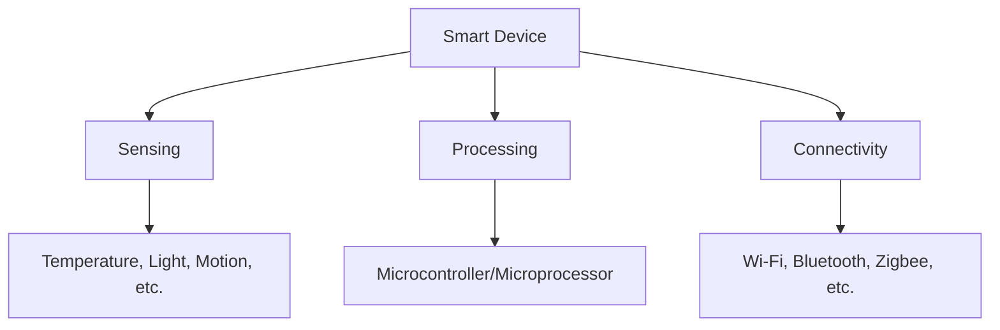
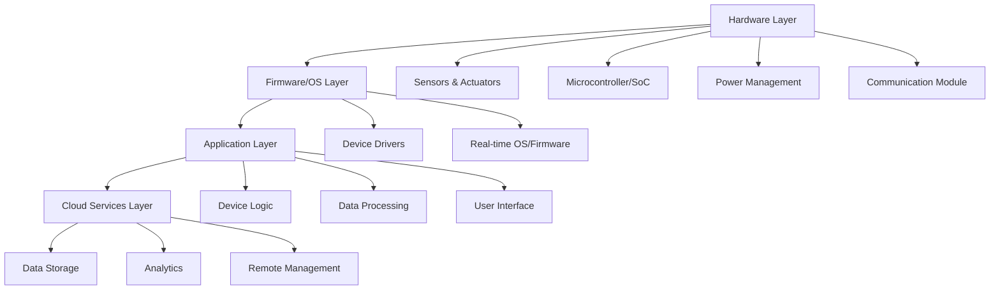
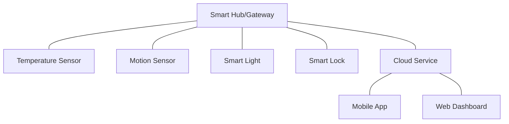

# Networks Smart Devices

## Introduction

Smart devices are the building blocks of the Internet of Things (IoT) ecosystem. These are everyday objects enhanced with sensors, processing capabilities, and network connectivity that allow them to collect and exchange data. From smart thermostats that learn your temperature preferences to wearable fitness trackers that monitor your health metrics, smart devices are transforming how we interact with the world around us.

In this guide, we'll explore what makes a device "smart," how these devices communicate within networks, and how you can start working with them in your own projects, even as a beginner.

## What Makes a Device "Smart"?

A device becomes "smart" when it combines three key capabilities:

1. **Sensing**: The ability to collect data from the environment using various sensors
2. **Processing**: On-board computing power to analyze data and make decisions
3. **Connectivity**: The ability to communicate with other devices, systems, or users

Let's visualize this concept:



### Common Types of Smart Devices

- **Smart Home Devices**: Thermostats, lighting systems, security cameras
- **Wearables**: Fitness trackers, smartwatches, health monitors
- **Industrial IoT**: Sensors for monitoring equipment, safety systems
- **Smart City Infrastructure**: Traffic management, environmental monitoring

## Network Connectivity for Smart Devices

Smart devices need to connect to networks to transmit and receive data. Several connectivity options exist, each with different advantages:

| Protocol | Range | Power Usage | Data Rate | Common Applications |
|----------|-------|-------------|-----------|---------------------|
| Wi-Fi | 50-100m | High | High (100+ Mbps) | Home automation, video streaming |
| Bluetooth | 10-100m | Low-Medium | Medium (1-3 Mbps) | Wearables, audio devices |
| Zigbee | 10-100m | Very Low | Low (250 Kbps) | Home automation, sensor networks |
| LoRaWAN | 2-15km | Very Low | Very Low (0.3-50 Kbps) | Smart cities, agriculture |
| Cellular (4G/5G) | Kilometers | High | Very High (100+ Mbps) | Mobile applications, remote monitoring |

## Smart Device Architecture

A typical smart device architecture consists of several layers:



## Coding for Smart Devices

Let's explore a simple example of how to interface with a smart temperature sensor using an Arduino (a popular platform for IoT beginners).

### Example: Reading Data from a DHT11 Temperature Sensor

First, we need to include the necessary library:

```cpp
#include <DHT.h>

#define DHTPIN 2      // Digital pin connected to the DHT sensor
#define DHTTYPE DHT11 // DHT 11 sensor type

DHT dht(DHTPIN, DHTTYPE);

void setup() {
  Serial.begin(9600);
  dht.begin();
}

void loop() {
  // Wait a few seconds between measurements
  delay(2000);

  // Reading temperature and humidity
  float humidity = dht.readHumidity();
  float temperature = dht.readTemperature();

  // Check if any reads failed
  if (isnan(humidity) || isnan(temperature)) {
    Serial.println("Failed to read from DHT sensor!");
    return;
  }

  Serial.print("Humidity: ");
  Serial.print(humidity);
  Serial.print("%  Temperature: ");
  Serial.print(temperature);
  Serial.println("°C");
}
```

**Output:**
```
Humidity: 45.20%  Temperature: 22.30°C
Humidity: 45.10%  Temperature: 22.40°C
Humidity: 45.30%  Temperature: 22.30°C
```

This simple example demonstrates how to read data from a sensor. In a real smart device, this data might be:
1. Processed locally to make decisions
2. Stored in memory
3. Transmitted to a cloud service or another device

## Communication Protocols

Smart devices use various protocols to communicate. Let's look at some common ones:

### HTTP/HTTPS

Many smart devices communicate with cloud services using familiar web protocols.

```javascript
// Example: Sending sensor data to a cloud service using HTTP
async function sendSensorData(temperature, humidity) {
  const data = {
    deviceId: 'temp_sensor_1',
    temperature: temperature,
    humidity: humidity,
    timestamp: new Date().toISOString()
  };

  try {
    const response = await fetch('https://your-iot-service.com/api/data', {
      method: 'POST',
      headers: {
        'Content-Type': 'application/json',
        'Authorization': 'Bearer YOUR_API_KEY'
      },
      body: JSON.stringify(data)
    });
    
    if (response.ok) {
      console.log('Data sent successfully');
    } else {
      console.error('Failed to send data');
    }
  } catch (error) {
    console.error('Error:', error);
  }
}
```

### MQTT (Message Queuing Telemetry Transport)

MQTT is a lightweight protocol designed specifically for IoT devices:

```javascript
// Example: Using MQTT to publish sensor data
const mqtt = require('mqtt');
const client = mqtt.connect('mqtt://broker.example.com');

client.on('connect', function() {
  console.log('Connected to MQTT broker');
  
  // Simulate sensor readings
  setInterval(function() {
    const temperature = 22.5 + (Math.random() * 2 - 1);  // Random temp around 22.5
    const humidity = 45 + (Math.random() * 5 - 2.5);     // Random humidity around 45
    
    // Publish to a topic
    client.publish('home/livingroom/temperature', temperature.toString());
    client.publish('home/livingroom/humidity', humidity.toString());
    
    console.log(`Published: Temp=${temperature.toFixed(1)}°C, Humidity=${humidity.toFixed(1)}%`);
  }, 5000);
});

client.on('error', function(error) {
  console.error('MQTT Error:', error);
});
```

## Building a Basic Smart Device Network

Let's explore how to create a simple network of smart devices for a home environment.

### Example Architecture



### Practical Example: Smart Home Automation

Here's a simplified Python script that could run on a Raspberry Pi acting as a smart home hub:

```python
import time
import paho.mqtt.client as mqtt
from datetime import datetime

# MQTT settings
MQTT_BROKER = "localhost"
MQTT_PORT = 1883

# Device states
devices = {
    "temperature_sensor": {"value": 21.0, "unit": "°C", "last_updated": None},
    "motion_sensor": {"value": False, "last_updated": None},
    "smart_light": {"state": "OFF", "brightness": 0, "last_updated": None}
}

# Automation rules
def apply_rules():
    # Rule 1: If motion detected and it's dark, turn on the light
    if devices["motion_sensor"]["value"] == True:
        if current_hour < 6 or current_hour > 18:  # Simplified day/night check
            if devices["smart_light"]["state"] == "OFF":
                control_light("ON", 80)
                print("Rule triggered: Motion detected at night - turning light ON")
    
    # Rule 2: If temperature is above 25°C, set warning
    if devices["temperature_sensor"]["value"] > 25:
        print(f"WARNING: High temperature detected: {devices['temperature_sensor']['value']}°C")

# MQTT callbacks
def on_connect(client, userdata, flags, rc):
    print(f"Connected to MQTT broker with result code {rc}")
    # Subscribe to topics
    client.subscribe("home/sensors/temperature")
    client.subscribe("home/sensors/motion")
    client.subscribe("home/devices/light/status")

def on_message(client, userdata, msg):
    topic = msg.topic
    payload = msg.payload.decode()
    current_time = datetime.now()
    
    print(f"Message received: {topic} = {payload}")
    
    # Update device states based on messages
    if topic == "home/sensors/temperature":
        devices["temperature_sensor"]["value"] = float(payload)
        devices["temperature_sensor"]["last_updated"] = current_time
    
    elif topic == "home/sensors/motion":
        devices["motion_sensor"]["value"] = payload.lower() == "true"
        devices["motion_sensor"]["last_updated"] = current_time
    
    elif topic == "home/devices/light/status":
        status_parts = payload.split(",")
        devices["smart_light"]["state"] = status_parts[0]
        if len(status_parts) > 1:
            devices["smart_light"]["brightness"] = int(status_parts[1])
        devices["smart_light"]["last_updated"] = current_time
    
    # Apply automation rules
    current_hour = current_time.hour
    apply_rules()

# Control functions
def control_light(state, brightness=None):
    command = state
    if brightness is not None and state == "ON":
        command += f",{brightness}"
    
    client.publish("home/devices/light/command", command)
    print(f"Light command sent: {command}")

# Set up MQTT client
client = mqtt.Client()
client.on_connect = on_connect
client.on_message = on_message

# Connect and start loop
client.connect(MQTT_BROKER, MQTT_PORT, 60)
client.loop_start()

# Main application loop
try:
    while True:
        # Display current status every 10 seconds
        print("
--- Current Status ---")
        for device, state in devices.items():
            last_updated = state["last_updated"].strftime("%H:%M:%S") if state["last_updated"] else "Never"
            print(f"{device}: {state.get('value', state.get('state'))} (Last updated: {last_updated})")
        
        time.sleep(10)
except KeyboardInterrupt:
    print("Shutting down...")
    client.loop_stop()
    client.disconnect()
```

## Security Considerations for Smart Devices

Security is a critical aspect of IoT networks. Here are key considerations:

1. **Authentication**: Ensure only authorized devices can join your network
2. **Encryption**: Use protocols like TLS/SSL to encrypt data in transit
3. **Updates**: Keep firmware and software updated to patch vulnerabilities
4. **Privacy**: Limit collection of sensitive data and implement proper data protection
5. **Physical Security**: Protect devices from unauthorized physical access

### Example: Implementing TLS for MQTT Communication

```javascript
const mqtt = require('mqtt');
const fs = require('fs');

// Load certificates
const options = {
  port: 8883,
  protocol: 'mqtts',
  rejectUnauthorized: true,
  ca: fs.readFileSync('ca-certificate.pem'),
  cert: fs.readFileSync('client-certificate.pem'),
  key: fs.readFileSync('client-key.pem')
};

// Connect with TLS
const client = mqtt.connect('mqtts://secure-broker.example.com', options);

client.on('connect', function() {
  console.log('Securely connected to MQTT broker');
  client.subscribe('secure-topic');
});

client.on('message', function(topic, message) {
  console.log(`Received message on ${topic}: ${message.toString()}`);
});
```

## Challenges in Smart Device Networks

Working with smart devices presents several challenges:

1. **Interoperability**: Devices from different manufacturers may use different protocols
2. **Power Management**: Many devices run on batteries and need efficient power usage
3. **Connectivity**: Network reliability and range limitations
4. **Scalability**: Managing networks with many devices
5. **Data Management**: Handling the volume of data generated

## Getting Started with Smart Devices: A Beginner's Guide

If you're new to smart devices and IoT, here's how to get started:

1. **Start with development kits**: Arduino, Raspberry Pi, ESP8266/ESP32
2. **Begin with simple projects**: Temperature monitors, motion detectors
3. **Learn key protocols**: HTTP, MQTT, Bluetooth LE
4. **Explore cloud platforms**: AWS IoT, Google Cloud IoT, Azure IoT
5. **Join communities**: Share knowledge and learn from others

### Starter Project: Wi-Fi Connected Temperature Monitor

Here's a simple project to begin with using an ESP8266 (NodeMCU) and a DHT22 sensor:

```cpp
#include <ESP8266WiFi.h>
#include <PubSubClient.h>
#include <DHT.h>

// Network credentials
const char* ssid = "YourWiFiName";
const char* password = "YourWiFiPassword";

// MQTT Broker settings
const char* mqtt_server = "broker.hivemq.com";
const int mqtt_port = 1883;
const char* mqtt_topic = "home/temperature_monitor";

// DHT sensor settings
#define DHTPIN D4
#define DHTTYPE DHT22
DHT dht(DHTPIN, DHTTYPE);

// Create clients
WiFiClient espClient;
PubSubClient client(espClient);

void setup_wifi() {
  delay(10);
  Serial.println("Connecting to WiFi...");
  
  WiFi.begin(ssid, password);
  
  while (WiFi.status() != WL_CONNECTED) {
    delay(500);
    Serial.print(".");
  }
  
  Serial.println("WiFi connected");
  Serial.println("IP address: ");
  Serial.println(WiFi.localIP());
}

void reconnect() {
  while (!client.connected()) {
    Serial.print("Connecting to MQTT broker...");
    String clientId = "ESP8266Client-" + String(random(0xffff), HEX);
    
    if (client.connect(clientId.c_str())) {
      Serial.println("connected");
    } else {
      Serial.print("failed, rc=");
      Serial.print(client.state());
      Serial.println(" retrying in 5 seconds");
      delay(5000);
    }
  }
}

void setup() {
  Serial.begin(115200);
  setup_wifi();
  client.setServer(mqtt_server, mqtt_port);
  dht.begin();
}

void loop() {
  if (!client.connected()) {
    reconnect();
  }
  client.loop();
  
  // Read temperature and humidity
  float humidity = dht.readHumidity();
  float temperature = dht.readTemperature();
  
  // Check if readings are valid
  if (isnan(humidity) || isnan(temperature)) {
    Serial.println("Failed to read from DHT sensor!");
    return;
  }
  
  // Create JSON payload
  String payload = "{\"temperature\":" + String(temperature) + 
                   ",\"humidity\":" + String(humidity) + 
                   ",\"device_id\":\"esp8266_temp_monitor\"}";
  
  // Publish to MQTT topic
  Serial.print("Publishing: ");
  Serial.println(payload);
  client.publish(mqtt_topic, payload.c_str());
  
  // Wait 30 seconds before next reading
  delay(30000);
}
```

## Summary

Smart devices form the foundation of IoT networks, combining sensing, processing, and connectivity capabilities to create intelligent systems. As we've explored:

- Smart devices use various communication protocols (Wi-Fi, Bluetooth, MQTT, etc.) to exchange data
- Building an IoT network involves considering device capabilities, power requirements, and security
- Starting with simple development kits like Arduino and Raspberry Pi provides an accessible entry point
- Security is a critical consideration for any smart device implementation
- Interoperability and scalability present ongoing challenges in IoT networks

By understanding these fundamentals, you've taken your first steps into the world of networked smart devices. With practice and experimentation, you'll be able to create increasingly sophisticated IoT systems.

## Exercises and Further Learning

### Exercises

1. **Sensor Basics**: Connect a simple sensor (temperature, motion, light) to an Arduino or Raspberry Pi and read data from it.
2. **Network Communication**: Modify the starter project to send data to a free public MQTT broker or a simple web service.
3. **Automation Rule**: Create a simple rule-based system that triggers an action (like turning on an LED) based on sensor readings.
4. **Data Visualization**: Build a simple web page or use an IoT platform to visualize the data from your smart device.
5. **Multi-Device Network**: Connect two or more devices to create a simple network where devices can communicate with each other.

### Additional Resources

- **Online Courses**: Coursera and Udemy offer numerous IoT development courses
- **Documentation**: Arduino, Raspberry Pi, and ESP8266/ESP32 official documentation
- **Forums**: Arduino Forum, Raspberry Pi Forum, ESP8266 Community
- **Books**: "Getting Started with Raspberry Pi" by Matt Richardson and Shawn Wallace, "Internet of Things with ESP8266" by Marco Schwartz

Happy networking with your smart devices!