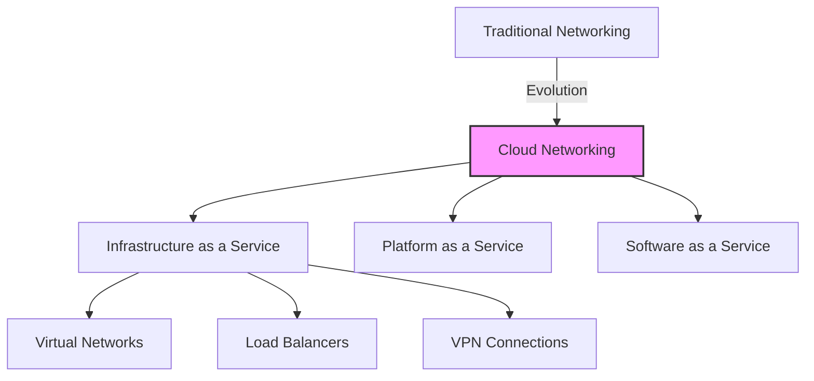
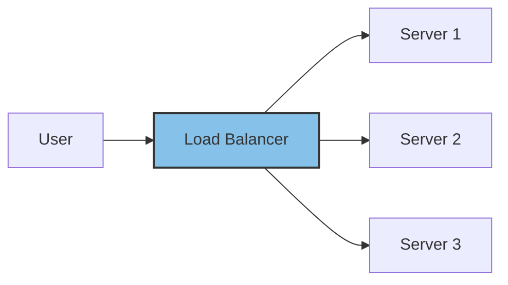

# Networks Cloud Basics

## Introduction

Cloud networking represents a fundamental shift in how we build, maintain, and scale network infrastructure. Instead of managing physical hardware in on-premises data centers, cloud networking leverages virtualized resources provided by cloud service providers. This approach offers unprecedented flexibility, scalability, and cost efficiency for businesses of all sizes.

In this guide, we'll explore the fundamental concepts of cloud networking, how it differs from traditional networking, and why it has become the backbone of modern application development and deployment.

## What is Cloud Networking?

Cloud networking refers to the infrastructure, services, and resources used to support network connectivity in cloud computing environments. It encompasses all network management tasks and resources hosted in the cloud rather than on physical hardware that you own and manage.



### Key Components of Cloud Networking

1. **Virtual Networks**: Software-defined networks that emulate physical networks
2. **Subnets**: Logical divisions of a network
3. **Security Groups**: Virtual firewalls that control traffic
4. **Load Balancers**: Distribute traffic across multiple servers
5. **VPN Gateways**: Secure connections between cloud and on-premises networks
6. **Content Delivery Networks (CDNs)**: Distributed servers that deliver content to users based on geographic location

## Cloud Networking vs. Traditional Networking

Let's compare cloud networking with traditional networking approaches:

| Feature | Traditional Networking | Cloud Networking |
|---------|------------------------|------------------|
| Infrastructure | Physical hardware | Virtualized resources |
| Initial Cost | High (capital expense) | Low (operational expense) |
| Scaling | Manual, time-consuming | Automated, rapid |
| Maintenance | Manual, on-site | Automated, remote |
| Deployment Time | Weeks/months | Minutes/hours |
| Accessibility | Limited to physical location | Global access |
| Resilience | Limited by hardware | High availability by design |

## Cloud Networking Models

Cloud providers offer different service models that influence how networking is handled:

### Infrastructure as a Service (IaaS)

In IaaS, you get virtual machines and networking components that you configure and manage yourself.

```javascript
// Example AWS SDK code for creating a VPC (Virtual Private Cloud)
const AWS = require('aws-sdk');
const ec2 = new AWS.EC2({region: 'us-west-2'});

const params = {
  CidrBlock: '10.0.0.0/16',
  AmazonProvidedIpv6CidrBlock: false,
  TagSpecifications: [
    {
      ResourceType: 'vpc',
      Tags: [
        {
          Key: 'Name',
          Value: 'MyFirstVPC'
        }
      ]
    }
  ]
};

ec2.createVpc(params, function(err, data) {
  if (err) console.log(err, err.stack);
  else console.log('VPC Created:', data.Vpc.VpcId);
});
```

**Output:**
```
VPC Created: vpc-1234567890abcdef0
```

### Platform as a Service (PaaS)

PaaS abstracts the infrastructure layer, allowing you to focus on application development while the platform handles networking configuration.

### Software as a Service (SaaS)

SaaS delivers applications over the internet, with all infrastructure, including networking, completely managed by the provider.

## Core Cloud Networking Concepts

### Virtual Private Cloud (VPC)

A VPC is a logically isolated section of the cloud where you can launch resources in a virtual network that you define.

```javascript
// Example for creating a subnet within a VPC
const subnetParams = {
  CidrBlock: '10.0.1.0/24',
  VpcId: 'vpc-1234567890abcdef0',
  AvailabilityZone: 'us-west-2a',
  TagSpecifications: [
    {
      ResourceType: 'subnet',
      Tags: [
        {
          Key: 'Name',
          Value: 'PublicSubnet'
        }
      ]
    }
  ]
};

ec2.createSubnet(subnetParams, function(err, data) {
  if (err) console.log(err, err.stack);
  else console.log('Subnet Created:', data.Subnet.SubnetId);
});
```

**Output:**
```
Subnet Created: subnet-1234567890abcdef0
```

### Subnets

Subnets are segments of a VPC's IP address range where you can place groups of isolated resources.

### Network Security Groups

Security groups act as virtual firewalls that control inbound and outbound traffic to your resources.

```javascript
// Creating a security group
const sgParams = {
  Description: 'Allow HTTP traffic',
  GroupName: 'WebServerSG',
  VpcId: 'vpc-1234567890abcdef0',
  TagSpecifications: [
    {
      ResourceType: 'security-group',
      Tags: [
        {
          Key: 'Name',
          Value: 'WebServerSecurityGroup'
        }
      ]
    }
  ]
};

ec2.createSecurityGroup(sgParams, function(err, data) {
  if (err) console.log(err, err.stack);
  else {
    console.log('Security Group Created:', data.GroupId);
    
    // Add inbound rule allowing HTTP traffic
    const ingressParams = {
      GroupId: data.GroupId,
      IpPermissions: [
        {
          IpProtocol: 'tcp',
          FromPort: 80,
          ToPort: 80,
          IpRanges: [{ CidrIp: '0.0.0.0/0' }]
        }
      ]
    };
    
    ec2.authorizeSecurityGroupIngress(ingressParams, function(err, data) {
      if (err) console.log(err, err.stack);
      else console.log('Ingress Rule Added:', data);
    });
  }
});
```

### Load Balancing

Cloud load balancers distribute incoming application traffic across multiple targets, improving application availability and fault tolerance.



## Practical Cloud Networking Example

Let's walk through setting up a basic web application infrastructure in the cloud:

1. **Create a VPC with public and private subnets:**
   - Public subnet for load balancers and bastion hosts
   - Private subnet for application servers and databases

2. **Set up security groups:**
   - Load balancer security group: Allow HTTP/HTTPS from the internet
   - Application server security group: Allow traffic only from the load balancer
   - Database security group: Allow traffic only from application servers

3. **Deploy resources:**
   - Load balancer in the public subnet
   - Application servers in the private subnet
   - Database in the private subnet

```javascript
// Pseudocode for deploying a web server in the cloud
function deployWebServer() {
  // Create VPC
  const vpc = createVPC('10.0.0.0/16');
  
  // Create subnets
  const publicSubnet = createSubnet(vpc, '10.0.1.0/24', 'public');
  const privateSubnet = createSubnet(vpc, '10.0.2.0/24', 'private');
  
  // Create Internet Gateway and attach to VPC
  const internetGateway = createInternetGateway();
  attachInternetGateway(internetGateway, vpc);
  
  // Create and configure route tables
  configureRoutes(vpc, publicSubnet, privateSubnet, internetGateway);
  
  // Create security groups
  const lbSecurityGroup = createSecurityGroup(vpc, 'LoadBalancerSG');
  const webSecurityGroup = createSecurityGroup(vpc, 'WebServerSG');
  
  // Allow traffic
  allowTraffic(lbSecurityGroup, 'tcp', 80, '0.0.0.0/0'); // Allow HTTP from anywhere
  allowTraffic(webSecurityGroup, 'tcp', 80, lbSecurityGroup); // Allow HTTP from LB only
  
  // Launch web servers in private subnet
  const webServers = launchInstances(privateSubnet, webSecurityGroup, 2);
  
  // Create load balancer in public subnet
  const loadBalancer = createLoadBalancer(publicSubnet, lbSecurityGroup);
  
  // Register web servers with load balancer
  registerTargets(loadBalancer, webServers);
  
  return {
    loadBalancerDNS: loadBalancer.dnsName,
    vpc: vpc.id,
    webServers: webServers.map(server => server.id)
  };
}

const deployment = deployWebServer();
console.log('Application deployed!');
console.log('Access your application at:', deployment.loadBalancerDNS);
```

## Cloud Network Monitoring

Monitoring is crucial for maintaining healthy cloud networks. Most cloud providers offer built-in monitoring tools that track:

- Network traffic
- Latency
- Packet loss
- CPU utilization
- Memory usage

```javascript
// Example of using AWS CloudWatch to set up network monitoring
const cloudwatch = new AWS.CloudWatch({region: 'us-west-2'});

const params = {
  AlarmName: 'High-Network-Utilization',
  ComparisonOperator: 'GreaterThanThreshold',
  EvaluationPeriods: 1,
  MetricName: 'NetworkIn',
  Namespace: 'AWS/EC2',
  Period: 300,
  Statistic: 'Average',
  Threshold: 1000000000, // 1 GB in bytes
  ActionsEnabled: true,
  AlarmDescription: 'Alarm when network utilization exceeds 1GB',
  AlarmActions: ['arn:aws:sns:us-west-2:123456789012:NetworkAlerts'],
  Dimensions: [
    {
      Name: 'InstanceId',
      Value: 'i-1234567890abcdef0'
    }
  ]
};

cloudwatch.putMetricAlarm(params, function(err, data) {
  if (err) console.log(err, err.stack);
  else console.log('Alarm Created:', data);
});
```

## Best Practices for Cloud Networking

1. **Use Private Subnets for Backend Resources**: Keep databases and application servers in private subnets without direct internet access.

2. **Implement Defense in Depth**: Use multiple security layers including security groups, network ACLs, and application-level security.

3. **Automate Network Configuration**: Use Infrastructure as Code (IaC) to define and deploy network configurations.

4. **Plan IP Address Space Carefully**: Design your VPC CIDR blocks and subnet ranges with future growth in mind.

5. **Enable Logging and Monitoring**: Track network activity to identify and respond to issues quickly.

6. **Implement Disaster Recovery**: Design your network for high availability across multiple availability zones.

7. **Regularly Audit Security Groups**: Remove unused or overly permissive rules to maintain security.

## Common Cloud Networking Challenges

1. **Security Concerns**: Cloud networks introduce new security considerations compared to traditional networks.

2. **Performance Issues**: Network latency can impact application performance, especially in globally distributed architectures.

3. **Cost Management**: Network data transfer costs can be significant and require careful monitoring.

4. **Compliance Requirements**: Certain industries have strict regulatory requirements that must be addressed in cloud networking designs.

5. **Skill Gaps**: Cloud networking requires different skills compared to traditional networking.

## Summary

Cloud networking fundamentally changes how we design, deploy, and manage network infrastructure. By leveraging virtualized resources in the cloud, organizations can achieve greater flexibility, scalability, and cost efficiency compared to traditional networking approaches.

Key takeaways from this guide:

- Cloud networking uses virtualized resources rather than physical hardware
- Virtual Private Clouds (VPCs) provide isolated network environments in the cloud
- Security groups, subnets, and load balancers are essential components of cloud networks
- Different service models (IaaS, PaaS, SaaS) offer varying levels of networking control
- Best practices include using private subnets, implementing defense in depth, and automating configurations

## Exercises

1. **VPC Design Exercise**: Design a VPC with public and private subnets for a three-tier web application.

2. **Security Group Configuration**: Create security groups for a web application with web, application, and database tiers.

3. **Load Balancer Setup**: Set up a load balancer to distribute traffic across multiple web servers.

4. **High Availability Planning**: Design a network architecture that remains available even if one availability zone fails.

5. **Networking Cost Calculation**: Calculate the monthly network transfer costs for an application serving 1TB of data to internet users.

## Further Learning

To deepen your understanding of cloud networking, explore these topics:

- Advanced VPC configurations
- Transit Gateways and VPC Peering
- Software-Defined Networking (SDN)
- Network function virtualization
- Container networking
- Serverless networking models
- Zero Trust network architecture