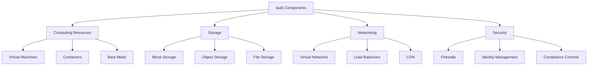
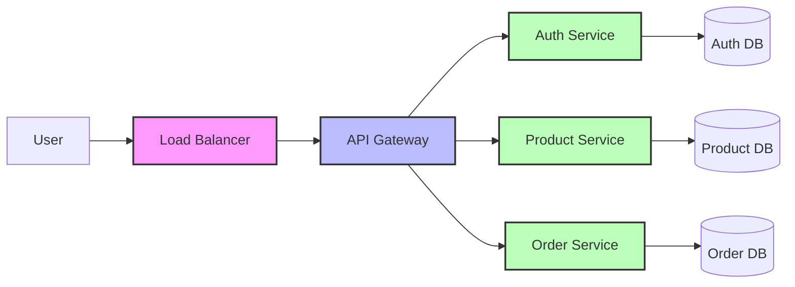
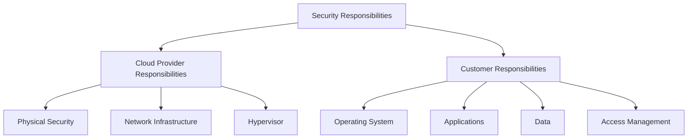

# Networks IaaS

## Introduction

Infrastructure as a Service (IaaS) represents a fundamental cloud computing service model that provides virtualized computing resources over the internet. At its core, IaaS delivers on-demand access to networking, storage, servers, and other computing infrastructure components that traditionally required significant hardware investments. This model shifts the responsibility of maintaining physical infrastructure from the organization to the cloud service provider, allowing businesses to focus on developing applications and services rather than managing the underlying hardware.

In this guide, we'll explore the concepts, components, benefits, and practical applications of IaaS in cloud networking. Whether you're just starting your journey in cloud computing or looking to expand your knowledge, this comprehensive overview will help you understand how IaaS revolutionizes network infrastructure management.

## What is Infrastructure as a Service (IaaS)?

Infrastructure as a Service is a cloud computing model where vendors provide computing infrastructure to users over the internet, typically through a pay-as-you-go pricing model. Instead of purchasing physical servers, networking equipment, and data center space, organizations can rent these resources from cloud providers.

### Key Characteristics of IaaS

- **Self-service capabilities**: Users can provision and manage resources without requiring human interaction from the service provider.
- **Pay-per-use billing**: Organizations only pay for the resources they actually use.
- **Scalability**: Resources can be scaled up or down based on demand.
- **Multi-tenancy**: Multiple users share the same physical infrastructure.
- **Automation**: Deployment and management of resources are largely automated.

## IaaS Components

IaaS typically includes several key components that together form a complete virtualized infrastructure:



### 1. Computing Resources

Computing resources form the processing backbone of IaaS offerings, providing the computational power needed to run applications and services.

#### Virtual Machines (VMs)

Virtual machines are software-based emulations of computer systems that run on physical hardware. They include their own CPU, memory, network interfaces, and storage.

**Example**: Creating a virtual machine using Terraform (Infrastructure as Code):

```hcl
provider "aws" {
  region = "us-west-2"
}

resource "aws_instance" "web_server" {
  ami           = "ami-0c55b159cbfafe1f0"
  instance_type = "t2.micro"
  
  tags = {
    Name = "WebServer"
  }
}
```

This code provisions a small EC2 instance on AWS that could serve as a web server.

#### Containers

Containers are lightweight, standalone, executable software packages that include everything needed to run an application: code, runtime, system tools, libraries, and settings.

#### Bare Metal Servers

Some IaaS providers offer bare metal servers—physical servers dedicated to a single tenant without virtualization layers.

### 2. Storage

IaaS platforms offer various types of storage solutions to meet different requirements:

#### Block Storage

Block storage divides data into blocks and stores them as separate pieces. Each block has a unique identifier, making it easy to locate and retrieve specific data blocks.

**Example**: Provisioning block storage in AWS using the CLI:

```bash
# Create a 50GB EBS volume
aws ec2 create-volume --size 50 --availability-zone us-west-2a --volume-type gp2

# Output
{
    "VolumeId": "vol-1234567890abcdef0",
    "Size": 50,
    "AvailabilityZone": "us-west-2a",
    "State": "creating",
    "VolumeType": "gp2",
    "CreateTime": "2023-03-15T13:00:00.000Z"
}
```

#### Object Storage

Object storage manages data as objects, each containing data, metadata, and a unique identifier. It's ideal for unstructured data like media files and backups.

#### File Storage

File storage organizes data in a hierarchical file structure, making it familiar for those accustomed to traditional file systems.

### 3. Networking

Networking components in IaaS enable communication between virtual resources and the outside world:

#### Virtual Networks

Virtual networks allow you to create logically isolated sections within the cloud where you can launch resources and define connectivity rules.

**Example**: Creating a Virtual Private Cloud (VPC) using Python and boto3:

```python
import boto3

# Initialize the client
ec2 = boto3.client('ec2', region_name='us-west-2')

# Create a VPC
response = ec2.create_vpc(CidrBlock='10.0.0.0/16')
vpc_id = response['Vpc']['VpcId']

# Add a name tag to the VPC
ec2.create_tags(Resources=[vpc_id], Tags=[{'Key': 'Name', 'Value': 'MyVPC'}])

# Enable DNS hostnames for the VPC
ec2.modify_vpc_attribute(VpcId=vpc_id, EnableDnsHostnames={'Value': True})

print(f"VPC created with ID: {vpc_id}")
```

#### Load Balancers

Load balancers distribute network traffic across multiple servers to ensure no single server is overwhelmed, improving reliability and performance.

#### Content Delivery Networks (CDNs)

CDNs cache content at edge locations worldwide to deliver it faster to users, reducing latency.

### 4. Security

IaaS providers implement various security measures to protect cloud resources:

#### Firewalls

Cloud firewalls control incoming and outgoing traffic based on predetermined security rules.

**Example**: Setting up a security group (firewall) in AWS using the CLI:

```bash
# Create a security group
aws ec2 create-security-group --group-name web-server-sg --description "Web Server Security Group" --vpc-id vpc-1234567890abcdef0

# Allow HTTP traffic
aws ec2 authorize-security-group-ingress --group-id sg-1234567890abcdef0 --protocol tcp --port 80 --cidr 0.0.0.0/0

# Allow HTTPS traffic
aws ec2 authorize-security-group-ingress --group-id sg-1234567890abcdef0 --protocol tcp --port 443 --cidr 0.0.0.0/0
```

#### Identity and Access Management

IAM services control who can access specific resources and what actions they can perform.

#### Compliance Controls

Cloud providers implement various compliance controls to meet industry regulations and standards.

## Popular IaaS Providers

Several major cloud vendors offer robust IaaS solutions:

### Amazon Web Services (AWS)

AWS provides a comprehensive suite of IaaS offerings, including:
- **Amazon EC2** (Elastic Compute Cloud) for computing resources
- **Amazon S3** (Simple Storage Service) for object storage
- **Amazon VPC** (Virtual Private Cloud) for networking

### Microsoft Azure

Azure's IaaS offerings include:
- **Azure Virtual Machines** for computing
- **Azure Blob Storage** for object storage
- **Azure Virtual Network** for networking

### Google Cloud Platform (GCP)

GCP offers:
- **Google Compute Engine** for computing
- **Google Cloud Storage** for object storage
- **Google Virtual Private Cloud** for networking

## Benefits of IaaS

Adopting IaaS can provide numerous advantages for organizations:

### Cost Efficiency

IaaS eliminates the need for upfront capital expenditure on hardware and data centers. The pay-as-you-go model converts capital expenses (CapEx) to operational expenses (OpEx).

### Scalability and Flexibility

Organizations can scale resources up or down based on demand, ensuring optimal performance without over-provisioning.

**Example**: Auto-scaling configuration in AWS using CloudFormation:

```yaml
AutoScalingGroup:
  Type: AWS::AutoScaling::AutoScalingGroup
  Properties:
    VPCZoneIdentifier:
      - subnet-12345678
      - subnet-87654321
    LaunchConfigurationName: !Ref LaunchConfiguration
    MinSize: '1'
    MaxSize: '5'
    DesiredCapacity: '2'
    Tags:
      - Key: Name
        Value: Web Server
        PropagateAtLaunch: true
```

### Reduced Time to Market

IaaS accelerates deployment of new applications and services by eliminating hardware procurement cycles.

### Disaster Recovery and Business Continuity

Cloud infrastructure makes it easier to implement robust disaster recovery solutions with reduced costs.

### Focus on Core Business

By outsourcing infrastructure management, organizations can focus more on developing applications and services that drive business value.

## Real-World Applications of IaaS

Let's explore some practical scenarios where IaaS proves valuable:

### Web Application Hosting

Organizations can host web applications on virtual machines, using load balancers to distribute traffic and auto-scaling to handle demand fluctuations.

**Scenario**: A small e-commerce startup uses IaaS to host their website, allowing them to handle seasonal traffic spikes without maintaining excess capacity year-round.

### Development and Testing Environments

Development teams can quickly provision environments for testing new features without waiting for hardware procurement.

**Implementation Example**:

```python
# Python script to provision a development environment
import boto3

def create_dev_environment(project_name):
    ec2 = boto3.resource('ec2')
    
    # Create 3 instances for different components
    instances = ec2.create_instances(
        ImageId='ami-0c55b159cbfafe1f0',
        MinCount=3,
        MaxCount=3,
        InstanceType='t2.micro',
        KeyName='dev-key',
        TagSpecifications=[
            {
                'ResourceType': 'instance',
                'Tags': [
                    {
                        'Key': 'Project',
                        'Value': project_name
                    },
                    {
                        'Key': 'Environment',
                        'Value': 'Development'
                    }
                ]
            }
        ]
    )
    
    print(f"Created {len(instances)} instances for {project_name} development")
    return [instance.id for instance in instances]

# Usage
dev_instances = create_dev_environment("e-commerce-platform")
```

### Big Data Processing

IaaS provides the ideal platform for big data workloads that require significant computing power but only run periodically.

### Backup and Recovery Solutions

Organizations can use cloud storage for cost-effective backup solutions, with the ability to restore quickly when needed.

### Microservices Architecture

IaaS supports modern microservices architectures by providing isolated environments for each service.

**Architecture Diagram**:



## IaaS vs. Other Cloud Service Models

To better understand IaaS, it's helpful to compare it with other cloud service models:

### IaaS vs. PaaS (Platform as a Service)

While IaaS provides the raw building blocks of cloud IT, PaaS offers a platform allowing customers to develop, run, and manage applications without dealing with the complexity of building and maintaining the infrastructure.

### IaaS vs. SaaS (Software as a Service)

SaaS delivers software applications over the internet, eliminating the need for users to install, maintain, or update software. Unlike IaaS, which provides infrastructure components, SaaS provides complete applications ready for end-user consumption.

## Challenges and Considerations

While IaaS offers many benefits, there are several challenges and considerations to keep in mind:

### Security Responsibilities

In the IaaS model, security responsibilities are shared between the provider and the customer. Understanding this shared responsibility model is crucial.

**Example**: AWS Shared Responsibility Model:



### Vendor Lock-in

Becoming too dependent on a specific provider's proprietary services can make it difficult to migrate to another provider later.

### Cost Management

While IaaS can reduce costs, improper resource allocation and management can lead to unexpected expenses. Implementing proper cost monitoring is essential.

### Performance Monitoring

Monitoring performance in cloud environments requires different tools and approaches compared to traditional on-premises infrastructure.

### Compliance and Governance

Organizations must ensure their cloud deployments meet regulatory requirements applicable to their industry and regions of operation.

## Getting Started with IaaS

If you're new to IaaS, here's a practical approach to get started:

### 1. Assess Your Needs

Identify which workloads would benefit most from moving to an IaaS model. Not all applications are suitable for cloud migration.

### 2. Choose a Provider

Research and select an IaaS provider that best meets your requirements. Consider factors like:
- Geographic availability
- Service offerings
- Pricing structure
- Support options
- Compliance certifications

### 3. Start Small

Begin with non-critical workloads to gain experience and confidence with the platform.

### 4. Implement Infrastructure as Code

Use Infrastructure as Code (IaC) tools like Terraform, AWS CloudFormation, or Azure Resource Manager templates to define and deploy your infrastructure programmatically.

**Example**: A simple Terraform configuration file:

```hcl
provider "aws" {
  region = "us-west-2"
}

# Define a VPC
resource "aws_vpc" "main" {
  cidr_block = "10.0.0.0/16"
  
  tags = {
    Name = "MainVPC"
  }
}

# Create a subnet
resource "aws_subnet" "public" {
  vpc_id     = aws_vpc.main.id
  cidr_block = "10.0.1.0/24"
  
  tags = {
    Name = "PublicSubnet"
  }
}

# Create a security group
resource "aws_security_group" "web" {
  name        = "web-sg"
  description = "Allow web traffic"
  vpc_id      = aws_vpc.main.id
  
  ingress {
    from_port   = 80
    to_port     = 80
    protocol    = "tcp"
    cidr_blocks = ["0.0.0.0/0"]
  }
  
  egress {
    from_port   = 0
    to_port     = 0
    protocol    = "-1"
    cidr_blocks = ["0.0.0.0/0"]
  }
}
```

### 5. Monitor and Optimize

Continuously monitor your cloud resources for performance and cost. Adjust and optimize as needed.

## Summary

Infrastructure as a Service (IaaS) represents a fundamental shift in how organizations acquire and manage IT infrastructure. By virtualizing computing resources and making them available over the internet, IaaS enables businesses to be more agile, cost-efficient, and focused on their core operations rather than infrastructure management.

The key components of IaaS—computing resources, storage, networking, and security—provide a complete foundation for building applications and services in the cloud. Major providers like AWS, Azure, and Google Cloud offer robust IaaS platforms with various options to meet different organizational needs.

As you embark on your cloud journey, remember that successful IaaS implementation requires careful planning, a good understanding of the shared responsibility model, and ongoing management to optimize both performance and costs.

## Additional Resources

### Practice Exercises

1. **Basic IaaS Setup**: 
   - Create a virtual machine in a public cloud provider (AWS, Azure, or GCP)
   - Connect to it via SSH
   - Install a web server and deploy a simple website

2. **Infrastructure as Code Practice**:
   - Write a Terraform script to create a VPC with public and private subnets
   - Deploy a load-balanced web application with auto-scaling

3. **Multi-Cloud Exploration**:
   - Compare the IaaS offerings of two different cloud providers
   - Create a similar setup in both environments and evaluate the differences

### Further Learning

- **Cloud Provider Documentation**:
  - [AWS Documentation](https://docs.aws.amazon.com/)
  - [Microsoft Azure Documentation](https://docs.microsoft.com/azure/)
  - [Google Cloud Documentation](https://cloud.google.com/docs)

- **Books**:
  - "Cloud Computing: Concepts, Technology & Architecture" by Thomas Erl
  - "Infrastructure as Code: Managing Servers in the Cloud" by Kief Morris

- **Online Courses**:
  - Cloud computing fundamentals courses on platforms like Coursera, Udemy, or edX
  - Provider-specific certification courses