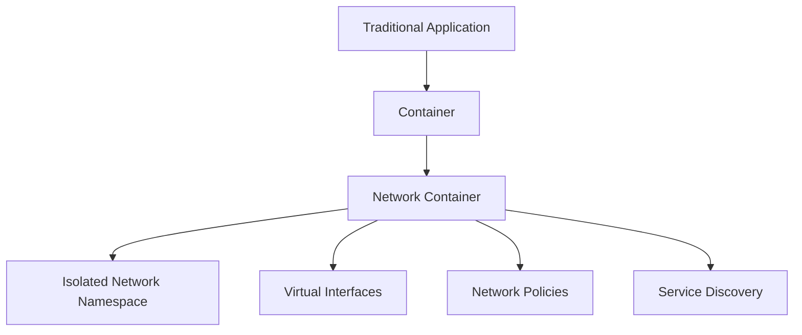
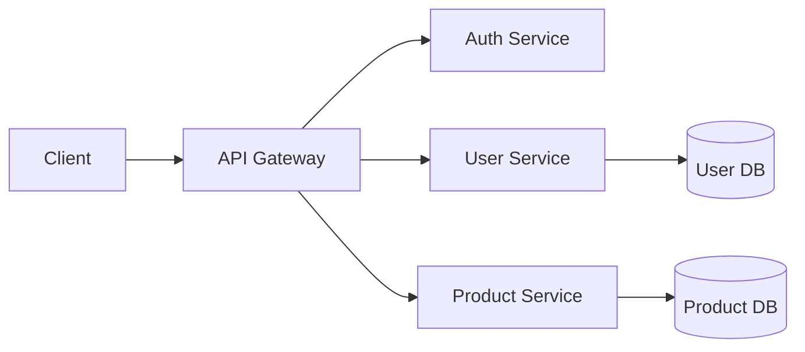

# Network Containers

## Introduction

Network containers are a fundamental concept in modern cloud infrastructure that enable applications to be packaged along with their networking requirements into isolated, portable units. They represent a revolutionary approach to application deployment and networking in distributed systems.

In traditional deployment models, applications often face the "it works on my machine" problem, where code runs differently across development, testing, and production environments. Network containers solve this by packaging not just the application code, but also its dependencies, configurations, and networking settings into a standardized unit that can run consistently anywhere.

## What Are Network Containers?

Network containers extend the container concept (like Docker) by focusing on networking capabilities. At their core, containers are lightweight, standalone executable packages that include everything needed to run an application:

- Code
- Runtime
- System tools
- Libraries
- Settings

Network containers add specific networking capabilities to this paradigm:

- Isolated network namespaces
- Virtual network interfaces
- Built-in DNS resolution
- Port mapping
- Network policies
- Service discovery mechanisms



## Networking Fundamentals in Containers

### Network Namespaces

At the foundation of container networking is the concept of network namespaces. In Linux, a network namespace is a logical copy of the network stack, with its own routes, firewall rules, and network interfaces.

When a container is created, it gets its own network namespace, isolating its network from the host system and other containers.

```bash
# Create a new network namespace
sudo ip netns add container1

# List network namespaces
sudo ip netns list

# Execute a command in the network namespace
sudo ip netns exec container1 ip link
```

Output:
```
1: lo: <LOOPBACK> mtu 65536 qdisc noop state DOWN mode DEFAULT group default qlen 1000
    link/loopback 00:00:00:00:00:00 brd 00:00:00:00:00:00
```

### Container Network Models

There are several network models used with containers:

1. **Bridge Networking**: The default network model in Docker, where each container connects to a software bridge
2. **Host Networking**: Containers share the host's network namespace
3. **Overlay Networking**: For connecting containers across multiple hosts
4. **Macvlan**: Containers get their own MAC address on the physical network
5. **None**: Containers have no external network connectivity

Let's look at a basic Docker networking example:

```bash
# Create a custom bridge network
docker network create my-network

# Run a container connected to this network
docker run --name container1 --network my-network -d nginx

# Inspect the network
docker network inspect my-network
```

This allows containers on the same bridge network to communicate with each other using container names as hostnames.

## Container Networking Technologies

### Docker Networking

Docker provides built-in networking capabilities that make it easy to connect containers:

```bash
# List networks
docker network ls

# Output:
# NETWORK ID     NAME      DRIVER    SCOPE
# f5a0b7b1b7a2   bridge    bridge    local
# 9d31b3ec61b7   host      host      local
# 7ec7d4516ce9   none      null      local
```

To connect containers to a specific network:

```bash
# Create a new network
docker network create --driver bridge my-network

# Start containers on this network
docker run --name web --network my-network -d nginx
docker run --name database --network my-network -d postgres

# These containers can now communicate using their names as hostnames
# For example, the web container can connect to postgres at "database:5432"
```

### Kubernetes Networking

Kubernetes extends container networking with concepts like Services, Pods, and Ingress:

```yaml
# Example Kubernetes Service definition
apiVersion: v1
kind: Service
metadata:
  name: my-service
spec:
  selector:
    app: MyApp
  ports:
    - protocol: TCP
      port: 80
      targetPort: 9376
```

This creates a service that directs traffic to any pods with the label `app: MyApp`. Kubernetes handles service discovery and load balancing automatically.

## Network Container Features

### Port Mapping

Containers typically have their own private network, so to make services accessible from outside, we use port mapping:

```bash
# Map container port 80 to host port 8080
docker run -p 8080:80 -d nginx

# Access the container via http://localhost:8080 on the host
```

### DNS and Service Discovery

Containers need to find and communicate with each other. Container platforms provide DNS-based service discovery:

- Docker: Containers on the same network can resolve each other by name
- Kubernetes: Service discovery via kube-dns or CoreDNS

```bash
# In Docker, ping another container by name
docker exec -it container1 ping container2

# Output:
# PING container2 (172.18.0.3): 56 data bytes
# 64 bytes from 172.18.0.3: icmp_seq=0 ttl=64 time=0.110 ms
```

### Network Policies

Network policies provide security by controlling which containers can communicate with each other:

```yaml
# Kubernetes Network Policy example
apiVersion: networking.k8s.io/v1
kind: NetworkPolicy
metadata:
  name: db-policy
spec:
  podSelector:
    matchLabels:
      role: db
  ingress:
  - from:
    - podSelector:
        matchLabels:
          role: frontend
    ports:
    - protocol: TCP
      port: 5432
```

This policy only allows pods with the label `role: frontend` to connect to pods with `role: db` on port 5432.

## Practical Examples

### Multi-Container Web Application

Let's build a simple web application using multiple containers:

1. Web frontend (Nginx)
2. API service (Node.js)
3. Database (MongoDB)

```yaml
# docker-compose.yml example
version: '3'
services:
  web:
    image: nginx:latest
    ports:
      - "80:80"
    networks:
      - app-network
    depends_on:
      - api
    
  api:
    build: ./api
    networks:
      - app-network
    depends_on:
      - db
    environment:
      - DB_HOST=db
      - DB_PORT=27017
  
  db:
    image: mongo:latest
    networks:
      - app-network
    volumes:
      - db-data:/data/db

networks:
  app-network:
    driver: bridge

volumes:
  db-data:
```

To run this application:

```bash
docker-compose up -d
```

Notice how we defined a custom network called `app-network` that connects all three services. The API service can access the database using the hostname `db`, and the web service can access the API using the hostname `api`.

### Microservices Architecture

Containers excel in microservices architectures, where applications are broken down into smaller, independent services:



Each service runs in its own container, communicating over well-defined APIs. This provides:

- Independent scaling of services
- Improved fault isolation
- Technology flexibility (each service can use different languages/frameworks)
- Simplified deployment and updates

## Advanced Topics

### CNI (Container Network Interface)

CNI is a specification and libraries for configuring network interfaces in Linux containers. It's used by Kubernetes, Amazon ECS, and other container orchestration systems.

CNI plugins handle different networking implementations:

- **Calico**: For network policy enforcement
- **Flannel**: Simple overlay network
- **Weave Net**: Mesh network for containers
- **Cilium**: Layer 7 aware security

### Overlay Networks

Overlay networks enable container communication across multiple hosts:

```bash
# On host1
docker swarm init

# On host2 (join the swarm)
docker swarm join --token <token> <host1-ip>:2377

# Create an overlay network
docker network create --driver overlay --attachable my-overlay

# Now containers on different hosts can communicate
```

### Network Troubleshooting

When troubleshooting container networks, these tools are invaluable:

```bash
# Check container networking details
docker inspect <container-name>

# Enter container network namespace
docker exec -it <container-name> bash

# Inside container, use standard tools
ping google.com
traceroute backend-service
netstat -tulpn
curl -v http://service:8080
```

## Best Practices

1. **Use Custom Networks**: Always create custom networks rather than using the default bridge network for better isolation and DNS resolution.

2. **Limit Exposed Ports**: Only expose the ports that are necessary for external communication.

3. **Implement Network Policies**: Use network policies to restrict traffic between containers.

4. **Monitor Network Traffic**: Use tools like Prometheus and Grafana to monitor container network performance.

5. **Use Labels and Tags**: Properly label your containers for easier identification and network policy targeting.

6. **Consider Network Performance**: Be aware of the overhead introduced by overlay networks and adjust accordingly.

## Summary

Network containers provide a powerful abstraction for application networking, enabling:

- Consistent networking across environments
- Isolation between applications
- Simplified service discovery
- Granular network security policies
- Portable networking configurations

These capabilities make containers the foundation of modern cloud-native applications, enabling developers to build resilient, scalable systems with minimal infrastructure overhead.

## Further Learning Resources

- Docker Networking Documentation
- Kubernetes Networking Guide
- CNI Specification
- Books:
  - "Docker Networking and Service Discovery" by Michael Hausenblas
  - "Kubernetes Networking" by James Strong

## Exercises

1. Create a custom bridge network in Docker and run two containers that communicate with each other.

2. Implement a basic network policy in Kubernetes that restricts traffic between pods.

3. Set up a multi-container application using docker-compose with proper networking between services.

4. Use overlay networking to connect containers across multiple hosts in a Docker Swarm.

5. Troubleshoot a networking issue between containers using the tools mentioned in this guide.