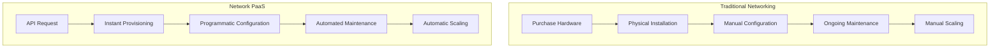
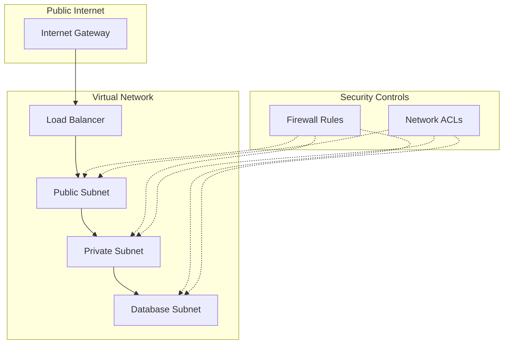
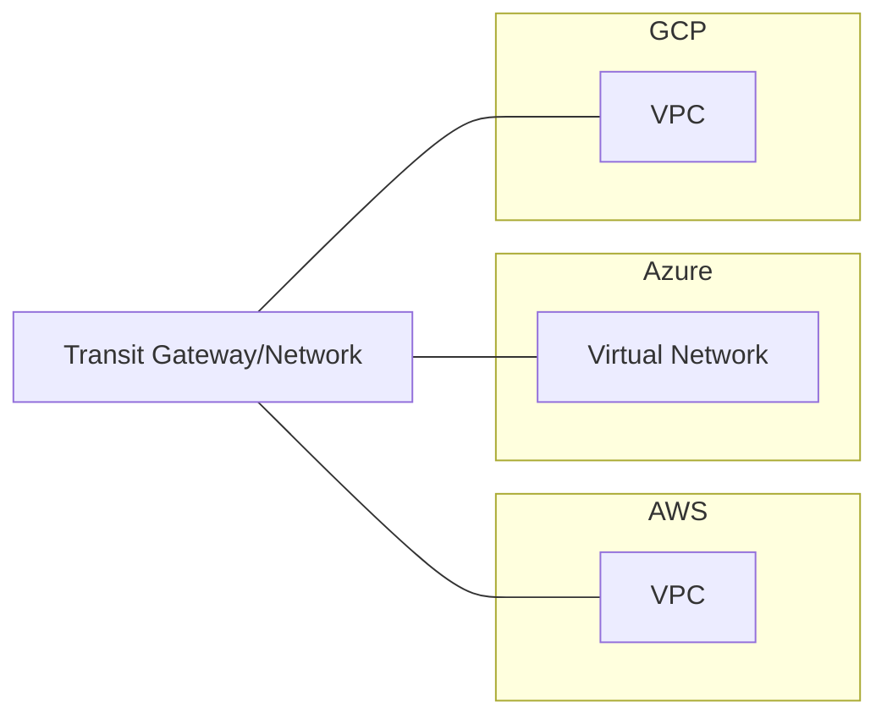

# Networks PaaS

## Introduction

Network Platform as a Service (Network PaaS) represents a critical evolution in cloud networking that simplifies how developers and organizations deploy, manage, and scale network infrastructure. Unlike traditional networking approaches that require extensive hardware configuration and maintenance, Network PaaS provides networking capabilities as a consumable service through cloud platforms.

This guide explores how Network PaaS works, its key components, and how beginners can start leveraging these services to build robust network architectures without deep networking expertise.

## What is Network PaaS?

Network PaaS (Platform as a Service) is a cloud service model that delivers networking infrastructure and services through a platform accessible via API or web interface. It abstracts the underlying network complexity, allowing developers to provision and configure network resources programmatically without managing the physical infrastructure.

### Key Characteristics of Network PaaS:

- **On-demand network provisioning**: Create network resources when needed
- **Self-service management**: Configure networks through APIs or dashboards
- **Automated scaling**: Expand network capacity based on demand
- **Pay-per-use billing**: Pay only for the resources consumed
- **Multi-tenancy**: Secure isolation between different users' networks

## Network PaaS vs. Traditional Networking

To understand the value of Network PaaS, let's compare it with traditional networking approaches:



## Core Components of Network PaaS

Network PaaS typically includes several key components that work together to provide networking capabilities:

### 1. Virtual Networks

Virtual networks are software-defined networks that emulate physical networks in the cloud:

```javascript
// Example: Creating a Virtual Network in Azure using JavaScript SDK
const { NetworkManagementClient } = require("@azure/arm-network");
const { DefaultAzureCredential } = require("@azure/identity");

async function createVirtualNetwork() {
  const credential = new DefaultAzureCredential();
  const networkClient = new NetworkManagementClient(credential, subscriptionId);
  
  const vnetParameters = {
    location: "eastus",
    addressSpace: {
      addressPrefixes: ["10.0.0.0/16"]
    },
    subnets: [
      {
        name: "default",
        addressPrefix: "10.0.0.0/24"
      }
    ]
  };
  
  const vnet = await networkClient.virtualNetworks.beginCreateOrUpdateAndWait(
    resourceGroupName,
    "myVirtualNetwork",
    vnetParameters
  );
  
  return vnet;
}

// Output: Virtual Network object with ID, name, subnets, etc.
```

### 2. Software-Defined Networking (SDN)

SDN separates the network control plane from the data plane, allowing for programmable network management:

```python
# Example: Using Python to configure SDN rules with OpenDaylight
import requests
import json

def create_flow_rule(switch_id, priority, in_port, out_port):
    base_url = "http://controller-ip:8181/restconf/config/opendaylight-inventory:nodes/node/"
    
    flow_data = {
        "flow": [
            {
                "id": "flow1",
                "priority": priority,
                "table_id": 0,
                "match": {
                    "in-port": in_port
                },
                "instructions": {
                    "instruction": [
                        {
                            "order": 0,
                            "apply-actions": {
                                "action": [
                                    {
                                        "order": 0,
                                        "output-action": {
                                            "output-node-connector": out_port
                                        }
                                    }
                                ]
                            }
                        }
                    ]
                }
            }
        ]
    }
    
    flow_url = f"{base_url}{switch_id}/flow-node-inventory:table/0/flow/flow1"
    response = requests.put(
        flow_url,
        data=json.dumps(flow_data),
        headers={"Content-Type": "application/json"},
        auth=("admin", "admin")
    )
    
    return response.status_code

# Output: HTTP status code (201 for success)
```

### 3. Network Function Virtualization (NFV)

NFV transforms network functions like firewalls, load balancers, and routers into software components:

```yaml
# Example: Defining a Network Service with NFV in TOSCA format
tosca_definitions_version: tosca_simple_yaml_1_0

topology_template:
  node_templates:
    firewall_vnf:
      type: tosca.nodes.nfv.VNF
      properties:
        descriptor_id: firewall-vnf-001
        descriptor_version: '1.0'
        provider: 'ACME'
        product_name: 'vFirewall'
        software_version: '1.0'
      
    loadbalancer_vnf:
      type: tosca.nodes.nfv.VNF
      properties:
        descriptor_id: lb-vnf-001
        descriptor_version: '1.0'
        provider: 'ACME'
        product_name: 'vLoadBalancer'
        software_version: '1.0'
    
  groups:
    nfv_service:
      type: tosca.groups.nfv.NfvService
      members: [ firewall_vnf, loadbalancer_vnf ]

# Output: TOSCA template that can be deployed to an NFV orchestrator
```

### 4. Network APIs

APIs allow programmatic control over network resources:

```javascript
// Example: Configuring a Load Balancer using AWS SDK for JavaScript
const AWS = require('aws-sdk');
const elbv2 = new AWS.ELBv2({region: 'us-east-1'});

async function createLoadBalancer() {
  // Step 1: Create the load balancer
  const lbParams = {
    Name: 'my-application-lb',
    Subnets: ['subnet-12345', 'subnet-67890'],
    SecurityGroups: ['sg-12345'],
    Type: 'application'
  };
  
  const lb = await elbv2.createLoadBalancer(lbParams).promise();
  const lbArn = lb.LoadBalancers[0].LoadBalancerArn;
  
  // Step 2: Create a target group
  const tgParams = {
    Name: 'my-targets',
    Protocol: 'HTTP',
    Port: 80,
    VpcId: 'vpc-12345',
    TargetType: 'instance',
    HealthCheckProtocol: 'HTTP',
    HealthCheckPath: '/'
  };
  
  const tg = await elbv2.createTargetGroup(tgParams).promise();
  const tgArn = tg.TargetGroups[0].TargetGroupArn;
  
  // Step 3: Create a listener
  const listenerParams = {
    LoadBalancerArn: lbArn,
    Protocol: 'HTTP',
    Port: 80,
    DefaultActions: [{
      Type: 'forward',
      TargetGroupArn: tgArn
    }]
  };
  
  const listener = await elbv2.createListener(listenerParams).promise();
  
  return {
    loadBalancerArn: lbArn,
    targetGroupArn: tgArn,
    listenerArn: listener.Listeners[0].ListenerArn
  };
}

// Output: Object containing ARNs for the created resources
```

## Popular Network PaaS Offerings

Several cloud providers offer robust Network PaaS solutions:

### AWS Network Services

Amazon Web Services provides a comprehensive set of networking services:
- Amazon VPC (Virtual Private Cloud)
- AWS Transit Gateway
- Elastic Load Balancing
- AWS App Mesh (service mesh)

### Azure Networking

Microsoft Azure offers:
- Azure Virtual Network
- Azure Load Balancer
- Azure Front Door
- Azure Virtual WAN

### Google Cloud Networking

Google Cloud Platform provides:
- Virtual Private Cloud (VPC)
- Cloud Load Balancing
- Cloud CDN
- Network Service Tiers

## Implementing Network PaaS: Step-by-Step

Let's walk through a complete example of setting up a basic network architecture using a Network PaaS approach.

### Step 1: Design Your Network Architecture

Before implementation, plan your network topology:



### Step 2: Create a Virtual Network

```javascript
// Example: Creating a Virtual Network with AWS SDK
const AWS = require('aws-sdk');
const ec2 = new AWS.EC2({region: 'us-east-1'});

async function createVPC() {
  // Create the VPC
  const vpcResult = await ec2.createVpc({
    CidrBlock: '10.0.0.0/16',
    AmazonProvidedIpv6CidrBlock: false,
    TagSpecifications: [{
      ResourceType: 'vpc',
      Tags: [{
        Key: 'Name',
        Value: 'MyNetworkPaaSVPC'
      }]
    }]
  }).promise();
  
  const vpcId = vpcResult.Vpc.VpcId;
  
  // Create an Internet Gateway
  const igwResult = await ec2.createInternetGateway({
    TagSpecifications: [{
      ResourceType: 'internet-gateway',
      Tags: [{
        Key: 'Name',
        Value: 'MyNetworkPaaSIGW'
      }]
    }]
  }).promise();
  
  const igwId = igwResult.InternetGateway.InternetGatewayId;
  
  // Attach the Internet Gateway to the VPC
  await ec2.attachInternetGateway({
    InternetGatewayId: igwId,
    VpcId: vpcId
  }).promise();
  
  return vpcId;
}

// Output: VPC ID
```

### Step 3: Create Subnets

```javascript
// Example: Creating subnets within our VPC
async function createSubnets(vpcId) {
  // Create public subnet
  const publicSubnet = await ec2.createSubnet({
    VpcId: vpcId,
    CidrBlock: '10.0.1.0/24',
    AvailabilityZone: 'us-east-1a',
    TagSpecifications: [{
      ResourceType: 'subnet',
      Tags: [{
        Key: 'Name',
        Value: 'Public-Subnet'
      }]
    }]
  }).promise();
  
  // Create private application subnet
  const privateSubnet = await ec2.createSubnet({
    VpcId: vpcId,
    CidrBlock: '10.0.2.0/24',
    AvailabilityZone: 'us-east-1a',
    TagSpecifications: [{
      ResourceType: 'subnet',
      Tags: [{
        Key: 'Name',
        Value: 'Private-Subnet'
      }]
    }]
  }).promise();
  
  // Create database subnet
  const dbSubnet = await ec2.createSubnet({
    VpcId: vpcId,
    CidrBlock: '10.0.3.0/24',
    AvailabilityZone: 'us-east-1a',
    TagSpecifications: [{
      ResourceType: 'subnet',
      Tags: [{
        Key: 'Name',
        Value: 'DB-Subnet'
      }]
    }]
  }).promise();
  
  return {
    publicSubnetId: publicSubnet.Subnet.SubnetId,
    privateSubnetId: privateSubnet.Subnet.SubnetId,
    dbSubnetId: dbSubnet.Subnet.SubnetId
  };
}

// Output: Object containing subnet IDs
```

### Step 4: Configure Security

```javascript
// Example: Creating security groups
async function configureSecurityGroups(vpcId) {
  // Web tier security group
  const webSG = await ec2.createSecurityGroup({
    GroupName: 'WebServerSG',
    Description: 'Security group for web servers',
    VpcId: vpcId
  }).promise();
  
  await ec2.authorizeSecurityGroupIngress({
    GroupId: webSG.GroupId,
    IpPermissions: [
      {
        IpProtocol: 'tcp',
        FromPort: 80,
        ToPort: 80,
        IpRanges: [{ CidrIp: '0.0.0.0/0' }]
      },
      {
        IpProtocol: 'tcp',
        FromPort: 443,
        ToPort: 443,
        IpRanges: [{ CidrIp: '0.0.0.0/0' }]
      }
    ]
  }).promise();
  
  // App tier security group
  const appSG = await ec2.createSecurityGroup({
    GroupName: 'AppServerSG',
    Description: 'Security group for application servers',
    VpcId: vpcId
  }).promise();
  
  await ec2.authorizeSecurityGroupIngress({
    GroupId: appSG.GroupId,
    IpPermissions: [
      {
        IpProtocol: 'tcp',
        FromPort: 8080,
        ToPort: 8080,
        UserIdGroupPairs: [{ GroupId: webSG.GroupId }]
      }
    ]
  }).promise();
  
  // Database security group
  const dbSG = await ec2.createSecurityGroup({
    GroupName: 'DatabaseSG',
    Description: 'Security group for database servers',
    VpcId: vpcId
  }).promise();
  
  await ec2.authorizeSecurityGroupIngress({
    GroupId: dbSG.GroupId,
    IpPermissions: [
      {
        IpProtocol: 'tcp',
        FromPort: 3306,
        ToPort: 3306,
        UserIdGroupPairs: [{ GroupId: appSG.GroupId }]
      }
    ]
  }).promise();
  
  return {
    webSGId: webSG.GroupId,
    appSGId: appSG.GroupId,
    dbSGId: dbSG.GroupId
  };
}

// Output: Object containing security group IDs
```

### Step 5: Deploy Network Services

```javascript
// Example: Creating a load balancer
async function createLoadBalancer(vpcId, publicSubnetId, securityGroupId) {
  const elbv2 = new AWS.ELBv2({region: 'us-east-1'});
  
  // Create the load balancer
  const lb = await elbv2.createLoadBalancer({
    Name: 'network-paas-lb',
    Subnets: [publicSubnetId],
    SecurityGroups: [securityGroupId],
    Scheme: 'internet-facing',
    Type: 'application',
    IpAddressType: 'ipv4'
  }).promise();
  
  // Create a target group
  const tg = await elbv2.createTargetGroup({
    Name: 'web-servers',
    Protocol: 'HTTP',
    Port: 80,
    VpcId: vpcId,
    HealthCheckProtocol: 'HTTP',
    HealthCheckPath: '/health',
    HealthCheckIntervalSeconds: 30,
    HealthCheckTimeoutSeconds: 5,
    HealthyThresholdCount: 5,
    UnhealthyThresholdCount: 2,
    Matcher: {
      HttpCode: '200'
    },
    TargetType: 'instance'
  }).promise();
  
  // Create a listener
  const listener = await elbv2.createListener({
    LoadBalancerArn: lb.LoadBalancers[0].LoadBalancerArn,
    Protocol: 'HTTP',
    Port: 80,
    DefaultActions: [
      {
        Type: 'forward',
        TargetGroupArn: tg.TargetGroups[0].TargetGroupArn
      }
    ]
  }).promise();
  
  return {
    loadBalancerArn: lb.LoadBalancers[0].LoadBalancerArn,
    targetGroupArn: tg.TargetGroups[0].TargetGroupArn
  };
}

// Output: Object containing load balancer and target group ARNs
```

## Real-World Applications of Network PaaS

Network PaaS has transformed how organizations deploy and manage networking infrastructure. Here are some practical applications:

### Microservices Architecture

Network PaaS enables the complex networking requirements of microservices by providing:

- Service discovery
- API gateways
- Load balancing between services
- Network isolation between service domains

### Multi-Cloud Networking

Organizations can create consistent networking across multiple cloud providers:



### DevOps CI/CD Integration

Network PaaS enables "Infrastructure as Code" for networking:

```yaml
# Example: Network configuration in Terraform
resource "aws_vpc" "main" {
  cidr_block = "10.0.0.0/16"
  
  tags = {
    Name = "main-vpc"
    Environment = "Production"
  }
}

resource "aws_subnet" "public" {
  vpc_id     = aws_vpc.main.id
  cidr_block = "10.0.1.0/24"
  
  tags = {
    Name = "public-subnet"
  }
}

resource "aws_subnet" "private" {
  vpc_id     = aws_vpc.main.id
  cidr_block = "10.0.2.0/24"
  
  tags = {
    Name = "private-subnet"
  }
}

resource "aws_security_group" "web" {
  name        = "web-sg"
  description = "Allow web traffic"
  vpc_id      = aws_vpc.main.id

  ingress {
    from_port   = 80
    to_port     = 80
    protocol    = "tcp"
    cidr_blocks = ["0.0.0.0/0"]
  }
  
  egress {
    from_port   = 0
    to_port     = 0
    protocol    = "-1"
    cidr_blocks = ["0.0.0.0/0"]
  }
}
```

### Edge Computing

Network PaaS extends cloud capabilities to edge locations:

- Content Delivery Networks (CDNs)
- Edge routing and load balancing
- Local traffic management
- IoT device networking

## Challenges and Considerations

While Network PaaS offers significant benefits, there are important considerations:

1. **Vendor Lock-in**: Using a specific provider's Network PaaS can create dependency on proprietary APIs and services
2. **Performance Overhead**: Abstraction layers may introduce minimal performance penalties
3. **Security Boundaries**: Understanding shared responsibility models is critical
4. **Cost Management**: Pay-as-you-go models require careful monitoring
5. **Compliance Requirements**: Regulated industries may face additional challenges

## Getting Started with Network PaaS

For beginners looking to start with Network PaaS, follow these steps:

1. **Learn the fundamentals**: Understand basic networking concepts like IP addressing, subnets, and routing
2. **Choose a cloud provider**: Start with one major provider (AWS, Azure, or GCP)
3. **Use management consoles**: Begin with web interfaces before moving to APIs
4. **Experiment with templates**: Use pre-built templates to deploy common network patterns
5. **Explore Infrastructure as Code**: Learn tools like Terraform or CloudFormation
6. **Start small**: Build a simple VPC with public and private subnets

## Summary

Network PaaS has revolutionized how organizations deploy and manage network infrastructure. By abstracting complex networking concepts into programmable services, it enables developers and operations teams to create sophisticated network architectures without specialized expertise.

Key benefits include:
- Faster deployment and provisioning
- Reduced operational overhead
- Programmatic control and automation
- Improved scalability and reliability
- Cost optimization through pay-per-use models

As cloud computing continues to evolve, Network PaaS will play an increasingly important role in enabling the next generation of applications and services.

## Additional Resources

To continue learning about Network PaaS, explore these resources:

- Cloud provider documentation (AWS, Azure, GCP)
- Network automation frameworks (Ansible, Terraform)
- Software-defined networking concepts
- Containerization and service mesh technologies
- DevOps practices for network infrastructure

## Practice Exercises

1. Create a basic virtual network with public and private subnets
2. Deploy a load balancer that distributes traffic to multiple backends
3. Implement security groups and network access controls
4. Create a network spanning multiple availability zones
5. Define your network infrastructure using code (Terraform or CloudFormation)