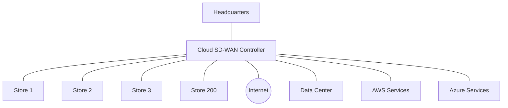

# Networks SaaS: Software as a Service in Cloud Networking

## Introduction

Network Software as a Service (SaaS) represents a fundamental shift in how networking solutions are delivered and consumed in the cloud era. Instead of purchasing, installing, and maintaining traditional network hardware and software, organizations can now access networking capabilities as services over the internet. This approach aligns with the broader "as-a-service" cloud computing paradigm, bringing its benefits to network infrastructure management.

In this guide, we'll explore what Network SaaS is, how it works, its advantages, common use cases, and how it's changing the landscape of network management for businesses of all sizes.

## What is Network SaaS?

Network SaaS delivers networking capabilities through cloud-based subscription services instead of on-premises hardware and software installations. With Network SaaS, critical networking functions such as routing, switching, security, and analytics are provided as on-demand services accessible through web interfaces.

### Key Characteristics of Network SaaS

- **Cloud-delivered**: Services run in provider-managed cloud infrastructure
- **Subscription-based**: Pay-as-you-go pricing model rather than capital expenditure
- **Managed service**: Provider handles updates, maintenance, and scaling
- **Self-service**: Users can provision and configure via control panels
- **Multi-tenant**: Architecture serves multiple customers on shared infrastructure

## Network SaaS vs. Traditional Networking

Let's compare the traditional approach to network management with the Network SaaS model:


## Common Network SaaS Solutions

Network SaaS encompasses several types of networking technologies:

### 1. SD-WAN as a Service

Software-Defined Wide Area Network (SD-WAN) delivered as a service helps organizations connect branch offices, data centers, and cloud resources without traditional MPLS circuits.

Example configuration (using a simplified management API):

```javascript
// Example: Configuring SD-WAN policies via API
const sdwanConfig = {
  site: "branch-office-101",
  policies: [
    {
      applicationClass: "video-conferencing",
      priority: "high",
      path: "preferred-internet"
    },
    {
      applicationClass: "email",
      priority: "medium",
      path: "backup-internet"
    }
  ]
};

// POST to SD-WAN SaaS API
await fetch('https://sdwan-provider.com/api/v1/policies', {
  method: 'POST',
  headers: { 'Content-Type': 'application/json' },
  body: JSON.stringify(sdwanConfig)
});
```

### 2. Network Security as a Service

Cloud-based security services protect networks without on-premises hardware. Examples include:

- Secure Web Gateways (SWG)
- Cloud Access Security Brokers (CASB)
- Firewall as a Service (FWaaS)
- Zero Trust Network Access (ZTNA)

Example implementation of a ZTNA policy:

```javascript
// Defining Zero Trust access policy
const zeroTrustPolicy = {
  applicationId: "accounting-app-12",
  allowedUsers: ["finance-department"],
  deviceRequirements: {
    osVersion: ">=10.15",
    encryptionEnabled: true,
    complianceStatus: "compliant"
  },
  authenticationRequirements: {
    mfaRequired: true,
    sessionTimeout: 3600 // seconds
  }
};

// Apply policy via API
await ztnaProvider.applyPolicy(zeroTrustPolicy);
```

### 3. Network Monitoring as a Service

Cloud-based tools that provide visibility into network performance, traffic, and issues across distributed environments.

Example dashboard data retrieval:

```javascript
// Fetch network performance metrics
async function getNetworkMetrics() {
  const response = await fetch('https://monitoring-saas.com/api/metrics', {
    headers: { 'Authorization': `Bearer ${API_KEY}` }
  });
  
  const data = await response.json();
  
  console.log('Current network status:');
  console.log(`Uptime: ${data.uptime}%`);
  console.log(`Latency: ${data.avgLatency}ms`);
  console.log(`Packet loss: ${data.packetLoss}%`);
  
  // Output:
  // Current network status:
  // Uptime: 99.98%
  // Latency: 24ms
  // Packet loss: 0.02%
}
```

## Benefits of Network SaaS

### 1. Cost Efficiency

Network SaaS converts capital expenditures (CapEx) into operational expenditures (OpEx):

- No upfront hardware purchase
- Reduced data center/hosting costs
- Lower maintenance and support expenses
- Pay-as-you-grow scaling

### 2. Simplicity and Agility

- Rapid deployment without hardware installation
- Self-service provisioning
- Centralized management
- Easier multi-site deployment

### 3. Automatic Updates and Security

- Always running latest versions
- Security patches applied promptly
- New features available immediately
- Reduced vulnerability window

### 4. Scalability

- Easily scale networking capabilities up/down
- Handle traffic spikes without overprovisioning
- Add new sites or services quickly
- Global reach through provider infrastructure

## Real-World Network SaaS Applications

### Case Study 1: Retail Chain Network Transformation

A retail chain with 200 locations replaced their traditional MPLS network with SD-WAN as a Service:



**Benefits achieved:**
- 65% reduction in connectivity costs
- 4x improvement in available bandwidth
- Deployment of new stores in days rather than months
- Centralized policy management for all locations

### Case Study 2: Financial Services Security Modernization

A financial services firm implemented Network Security as a Service:

**Before:**
- VPN access to internal applications
- Perimeter-based security model
- Hardware firewalls at each location
- Complex compliance documentation

**After:**
- Zero Trust Network Access for all applications
- Identity-based access regardless of location
- Continuous verification and monitoring
- Simplified compliance posture

**Implementation code example:**

```javascript
// Zero Trust Network Access implementation
function configureSecureAccess() {
  // Define protected applications
  const protectedApps = [
    {
      appId: "customer-portal",
      internalUrl: "https://portal.internal.example.com",
      allowedGroups: ["customer-service", "account-managers"],
      riskBasedAuth: true
    },
    {
      appId: "trading-platform",
      internalUrl: "https://trading.internal.example.com",
      allowedGroups: ["traders", "analysts"],
      riskBasedAuth: true,
      geoRestrictions: ["US", "UK", "JP"]
    }
  ];
  
  // Apply configurations to cloud security service
  return securityService.configureApplications(protectedApps);
}

// Output: Configured 2 applications with Zero Trust policies
```

## Implementing Network SaaS: Best Practices

When adopting Network SaaS solutions for your organization, consider these best practices:

### 1. Assessment and Planning

- Audit current network infrastructure and requirements
- Identify which functions are suitable for SaaS migration
- Create a phased migration approach
- Set clear objectives and success metrics

### 2. Connectivity Considerations

- Ensure reliable internet connectivity (consider redundant links)
- Evaluate bandwidth requirements for cloud-delivered services
- Plan for fallback/offline capabilities where needed

### 3. Integration Strategy

```javascript
// Example: API integration between Network SaaS and IT service management
async function integrateNetworkEvents() {
  // Set up webhook receiver for network events
  app.post('/network-events', async (req, res) => {
    const { eventType, severity, details } = req.body;
    
    // Create ticket in service management system
    if (severity >= 3) { // High severity
      await serviceDesk.createIncident({
        title: `Network event: ${eventType}`,
        description: details,
        priority: mapSeverityToPriority(severity),
        category: 'network'
      });
    }
    
    // Log all events
    await eventLogger.log({
      source: 'network-saas',
      type: eventType,
      details
    });
    
    res.status(200).send('Event processed');
  });
}

// Example output: Created high-priority incident for "BGP flap" event
```

### 4. Security and Compliance

- Evaluate provider security certifications (SOC 2, ISO 27001, etc.)
- Understand shared responsibility model
- Implement appropriate identity and access management
- Ensure compliance with relevant regulations

## Challenges and Considerations

While Network SaaS offers significant benefits, be aware of these challenges:

1. **Internet dependency**: Service quality depends on internet connectivity
2. **Vendor lock-in**: Migration between providers can be complex
3. **Control limitations**: Less direct control over infrastructure
4. **Data sovereignty**: Consider where network data is stored/processed
5. **Cost management**: Monitor consumption to prevent unexpected costs

## Summary

Network SaaS represents the evolution of networking from hardware-centric to service-centric delivery models. By subscribing to networking capabilities as cloud services, organizations can:

- Reduce capital expenditure and operational complexity
- Deploy and scale networking capabilities more rapidly
- Access modern features without hardware upgrades
- Shift focus from infrastructure management to business outcomes

The transition to Network SaaS aligns with broader digital transformation initiatives, enabling more agile, resilient, and cost-effective network architectures for the cloud era.

## Additional Resources

To deepen your understanding of Network SaaS concepts:

- Explore vendor documentation for specific Network SaaS offerings
- Take online courses on cloud networking fundamentals
- Join cloud networking communities and forums
- Experiment with free tiers of Network SaaS solutions

## Practice Exercises

1. Compare three different SD-WAN as a Service providers, focusing on features, pricing models, and global coverage.
2. Design a Network SaaS migration plan for a hypothetical small business with three office locations.
3. Create a proof-of-concept integration between a Network Monitoring SaaS API and a notification system.
4. Identify potential security concerns when migrating from on-premises firewalls to Firewall as a Service, and propose mitigation strategies.