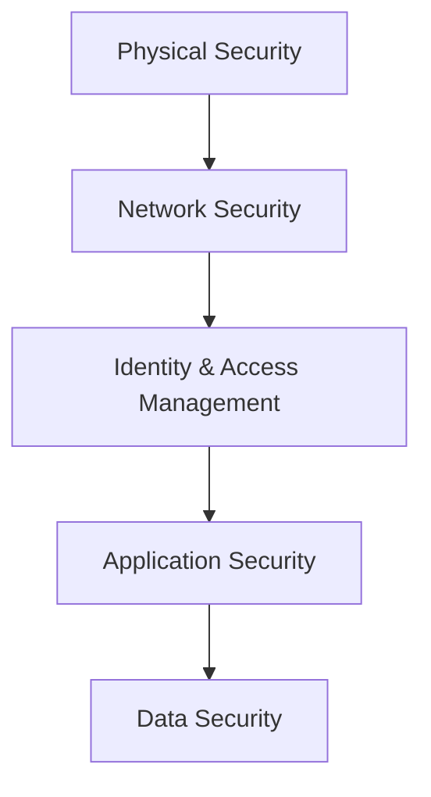
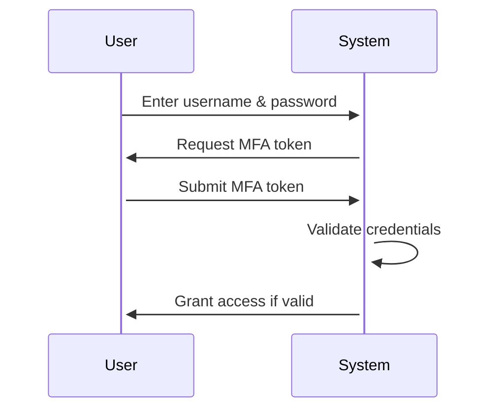
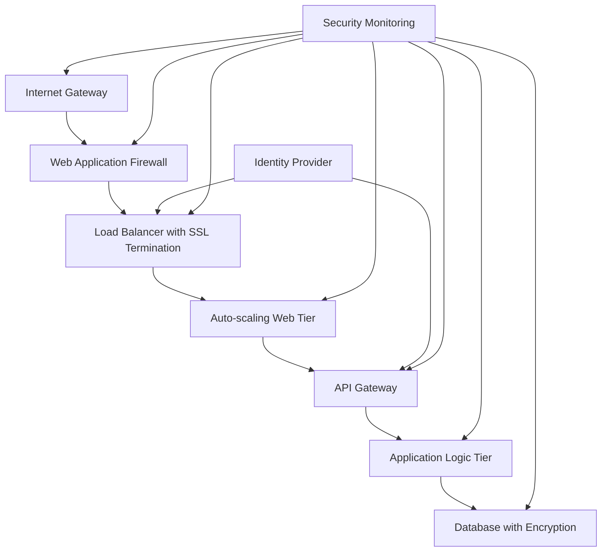

# Networks Cloud Security

## Introduction

Cloud security in networking environments involves protecting data, applications, and infrastructure hosted in cloud environments. As organizations migrate their networks to cloud platforms, understanding security principles becomes essential for maintaining data integrity, confidentiality, and availability. This guide introduces fundamental concepts of cloud network security for beginners.

## Core Cloud Security Concepts

### Shared Responsibility Model

Cloud security operates on a shared responsibility model where both the cloud service provider (CSP) and the customer have security obligations:

```
┌────────────────────────────────────────────┐
│             Security Responsibilities       │
├───────────────��───┬────────────────────────┤
│ Provider (CSP)    │ Customer               │
├───────────────────┼────────────────────────┤
│ • Infrastructure  │ • Data                 │
│ • Physical        │ • Access Management    │
│ • Host OS         │ • Identity Controls    │
│ • Network         │ • Application Logic    │
│   Infrastructure  │ • Client-side Security │
└───────────────────┴────────────────────────┘
```

### Defense in Depth Strategy

Cloud security employs multiple security layers to protect network resources:



## Network Security Controls in Cloud Environments

### Virtual Private Cloud (VPC)

A VPC is an isolated section of the cloud where you can launch resources in a virtual network:

```
// Example VPC Configuration
vpc = {
  cidr_block: "10.0.0.0/16",
  enable_dns_support: true,
  enable_dns_hostnames: true,
  subnets: [
    {
      cidr_block: "10.0.1.0/24",
      availability_zone: "us-east-1a",
      public: false
    },
    {
      cidr_block: "10.0.2.0/24",
      availability_zone: "us-east-1b",
      public: true
    }
  ]
}
```

### Security Groups and Network ACLs

These function as virtual firewalls to control traffic:

```
// Example Security Group Rule
security_group_rule = {
  type: "ingress",
  protocol: "tcp",
  from_port: 443,
  to_port: 443,
  cidr_blocks: ["0.0.0.0/0"],
  description: "Allow HTTPS from internet"
}
```

### Network Traffic Encryption

Encryption protects data in transit across networks:

```
// TLS Configuration Example
tls_config = {
  min_version: "TLS1.2",
  ciphers: [
    "TLS_ECDHE_RSA_WITH_AES_128_GCM_SHA256",
    "TLS_ECDHE_RSA_WITH_AES_256_GCM_SHA384"
  ],
  certificates: {
    source: "acm", // AWS Certificate Manager
    domain: "example.com"
  }
}
```

## Identity and Access Management

### Principle of Least Privilege

```
// Example IAM Policy (AWS Format)
{
  "Version": "2012-10-17",
  "Statement": [
    {
      "Effect": "Allow",
      "Action": [
        "s3:GetObject",
        "s3:ListBucket"
      ],
      "Resource": [
        "arn:aws:s3:::example-bucket",
        "arn:aws:s3:::example-bucket/*"
      ],
      "Condition": {
        "IpAddress": {
          "aws:SourceIp": "192.0.2.0/24"
        }
      }
    }
  ]
}
```

### Multi-Factor Authentication (MFA)

MFA adds an extra layer of security beyond passwords:



## Cloud Security Monitoring

### Security Information and Event Management (SIEM)

```
// Example Log Format
{
  "timestamp": "2023-07-15T13:45:30Z",
  "source_ip": "192.168.1.100",
  "destination_ip": "10.0.2.15",
  "action": "BLOCK",
  "protocol": "TCP",
  "port": 22,
  "user": "system",
  "resource_id": "i-08a7b62d",
  "event_type": "SecurityGroupViolation"
}
```

### Intrusion Detection & Prevention

Cloud-native IDS/IPS systems analyze network traffic patterns:

```
// IDS/IPS Rule Example
rule = {
  id: "SSH-BruteForce",
  type: "threshold",
  track: "by_src",
  count: 5,
  seconds: 60,
  filter: "dst_port=22 && protocol=TCP",
  action: "block_source"
}
```

## Practical Example: Securing a Web Application

The following demonstrates a secure architecture for a web application in the cloud:



### Example Traffic Flow

1. Client requests arrive at the Internet Gateway
2. Web Application Firewall filters malicious traffic
3. Load Balancer distributes traffic across web servers
4. Web servers authenticate via Identity Provider
5. API Gateway controls access to backend services
6. Application tier processes requests with limited permissions
7. Encrypted data is stored in the database
8. All components log to Security Monitoring

## Cloud Security Best Practices

1. **Automate security policies** using Infrastructure as Code
2. **Implement continuous compliance monitoring**
3. **Regularly patch and update** all systems
4. **Encrypt data** at rest and in transit
5. **Use private endpoints** for service connections
6. **Implement proper key management**
7. **Configure detailed logging** for all resources
8. **Conduct regular security assessments**
9. **Design for failure** with redundancy and isolation
10. **Train personnel** on security awareness

## Summary

Cloud network security combines traditional network protection with cloud-specific controls. By understanding the shared responsibility model, implementing defense in depth, and following security best practices, organizations can build secure network environments in the cloud.

## Additional Resources

- Cloud Security Alliance (CSA) Best Practices
- NIST Cloud Computing Security Guidelines
- OWASP Cloud Security Project
- Service-specific security documentation from AWS, Azure, and Google Cloud
- Practical cloud security courses and certification programs

## Exercises

1. Design a VPC architecture with public and private subnets
2. Create a security group policy for a three-tier application
3. Implement a monitoring solution for network traffic anomalies
4. Develop an IAM strategy following least privilege principles
5. Create an incident response plan for cloud network breaches