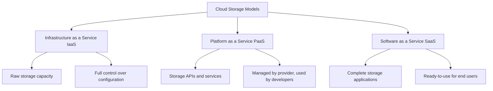

# Networks Cloud Storage

## Introduction

Cloud storage has revolutionized how we store, access, and manage data in networked environments. Rather than relying solely on local storage devices, cloud storage allows data to be stored on remote servers accessed via the internet. This fundamental shift enables greater flexibility, scalability, and reliability for applications and services.

In this guide, we'll explore cloud storage concepts, implementation approaches, and practical applications for beginners entering the world of cloud networking.

## What is Cloud Storage?

Cloud storage is a service model where data is maintained, managed, and backed up remotely while being made available to users over a network (typically the Internet). Instead of storing information on your computer's hard drive or other local storage devices, you save it to a remote database.

### Key Characteristics

- **On-demand access**: Data can be accessed anytime from anywhere with internet connectivity
- **Scalability**: Storage capacity can be easily increased or decreased based on needs
- **Redundancy**: Data is typically stored across multiple locations for reliability
- **Cost-effectiveness**: Pay only for the storage you use without hardware investments
- **Managed service**: Provider handles maintenance, security, and upgrades

## Cloud Storage Models

Cloud storage is typically offered in three primary service models:



### Infrastructure as a Service (IaaS)

IaaS providers offer virtualized computing resources including storage as a service. Users get raw storage capacity while maintaining control over the operating systems, applications, and configuration.

**Examples**: Amazon S3, Google Cloud Storage, Azure Blob Storage

### Platform as a Service (PaaS)

PaaS providers deliver platform-level solutions, including storage APIs and services. Developers use these platforms to build and deploy applications without managing the underlying infrastructure.

**Examples**: Firebase Storage, Heroku Postgres, Azure SQL Database

### Software as a Service (SaaS)

SaaS providers deliver fully-managed applications that include storage capabilities.

**Examples**: Dropbox, Google Drive, Microsoft OneDrive

## Types of Cloud Storage

### Object Storage

Object storage treats data as discrete units (objects) stored in a flat address space. Each object includes the data, metadata, and a unique identifier.

**Characteristics**:
- Highly scalable
- Good for unstructured data
- HTTP/HTTPS access via REST APIs
- Eventual consistency model

**Example (AWS S3)**:

```javascript
// Using AWS SDK for JavaScript
const AWS = require('aws-sdk');
const s3 = new AWS.S3({
  accessKeyId: 'YOUR_ACCESS_KEY',
  secretAccessKey: 'YOUR_SECRET_KEY',
  region: 'us-east-1'
});

// Upload file to S3
const uploadParams = {
  Bucket: 'my-bucket',
  Key: 'my-file.txt',
  Body: 'Hello World!'
};

s3.upload(uploadParams, (err, data) => {
  if (err) {
    console.error('Error uploading file:', err);
  } else {
    console.log('File uploaded successfully at:', data.Location);
    // Output: File uploaded successfully at: https://my-bucket.s3.amazonaws.com/my-file.txt
  }
});
```

### Block Storage

Block storage divides data into fixed-sized blocks, each with a unique address. This is similar to traditional hard drives but delivered as a cloud service.

**Characteristics**:
- High performance
- Suitable for structured data and applications
- Can be formatted with file systems
- Strong consistency model

**Example (AWS EBS with EC2)**:

```bash
# Create an EBS volume using AWS CLI
aws ec2 create-volume --size 100 --availability-zone us-east-1a --volume-type gp2

# Output:
# {
#     "VolumeId": "vol-1234567890abcdef0",
#     "Size": 100,
#     "SnapshotId": "",
#     "AvailabilityZone": "us-east-1a",
#     "State": "creating",
#     "VolumeType": "gp2",
#     "IOPS": 300,
#     "Encrypted": false,
#     "MultiAttachEnabled": false,
#     "CreateTime": "2023-01-01T00:00:00.000Z"
# }

# Attach the volume to an EC2 instance
aws ec2 attach-volume --volume-id vol-1234567890abcdef0 --instance-id i-0123456789abcdef0 --device /dev/sdf

# Format and mount the volume (on the EC2 instance)
sudo mkfs -t ext4 /dev/xvdf
sudo mkdir /mnt/data
sudo mount /dev/xvdf /mnt/data
```

### File Storage

File storage organizes data in a hierarchical structure of files and folders, similar to traditional file systems but delivered as a network-accessible service.

**Characteristics**:
- Familiar file/folder organization
- Suitable for shared access
- Supports file-level locking
- Access via standard protocols (NFS, SMB)

**Example (AWS EFS)**:

```bash
# Create an EFS file system using AWS CLI
aws efs create-file-system --performance-mode generalPurpose --region us-east-1

# Output:
# {
#     "CreationTime": "2023-01-01T00:00:00Z",
#     "FileSystemId": "fs-1a2b3c4d",
#     "LifeCycleState": "creating",
#     "PerformanceMode": "generalPurpose",
#     "Tags": []
# }

# Create a mount target
aws efs create-mount-target --file-system-id fs-1a2b3c4d --subnet-id subnet-1a2b3c4d --security-groups sg-1a2b3c4d

# Mount the file system on an EC2 instance
sudo apt-get -y install nfs-common
sudo mkdir /mnt/efs
sudo mount -t nfs4 -o nfsvers=4.1,rsize=1048576,wsize=1048576,hard,timeo=600,retrans=2 fs-1a2b3c4d.efs.us-east-1.amazonaws.com:/ /mnt/efs
```

## Implementing Cloud Storage in Applications

### Basic Integration Patterns

When integrating cloud storage into your applications, you'll typically use one of these patterns:

1. **Direct API Integration**: Your application communicates directly with the cloud storage service API

2. **SDK Integration**: Using provider-supplied software development kits to simplify interactions

3. **Storage Abstraction Layer**: Creating a layer in your application that abstracts multiple storage providers

Let's look at a simple example using the SDK integration pattern with Google Cloud Storage:

```python
# Install with: pip install google-cloud-storage

from google.cloud import storage

# Initialize storage client
client = storage.Client()

# Create a new bucket
bucket = client.create_bucket('my-new-bucket')
print(f"Bucket {bucket.name} created")
# Output: Bucket my-new-bucket created

# Upload a file to the bucket
blob = bucket.blob('my-file.txt')
blob.upload_from_string('This is the content of my file')
print(f"File uploaded to {blob.name}")
# Output: File uploaded to my-file.txt

# Download the file
content = blob.download_as_string()
print(f"Downloaded file content: {content.decode('utf-8')}")
# Output: Downloaded file content: This is the content of my file
```

### Security Considerations

When implementing cloud storage solutions, security is paramount:

1. **Authentication**: Use secure methods to authenticate to the storage service
2. **Authorization**: Implement proper access controls
3. **Encryption**: Enable encryption at rest and in transit
4. **Shared Responsibility**: Understand what security aspects are your responsibility vs. the provider's

Here's an example of setting up access controls on an AWS S3 bucket:

```javascript
// Set bucket policy to restrict access
const bucketPolicy = {
  Version: '2012-10-17',
  Statement: [{
    Sid: 'PublicReadGetObject',
    Effect: 'Allow',
    Principal: '*',
    Action: 's3:GetObject',
    Resource: 'arn:aws:s3:::my-bucket/*'
  }]
};

const setPolicyParams = {
  Bucket: 'my-bucket',
  Policy: JSON.stringify(bucketPolicy)
};

s3.putBucketPolicy(setPolicyParams, (err, data) => {
  if (err) {
    console.error('Error setting bucket policy:', err);
  } else {
    console.log('Successfully set bucket policy');
    // Output: Successfully set bucket policy
  }
});
```

## Cloud Storage Providers Comparison

Let's compare the major cloud storage providers and their offerings:

| Provider | Object Storage | Block Storage | File Storage | Key Features |
|----------|---------------|--------------|--------------|--------------|
| AWS | S3 | EBS | EFS | Global infrastructure, Glacier for archiving |
| Google Cloud | Cloud Storage | Persistent Disk | Filestore | Strong analytics integration, lifecycle management |
| Microsoft Azure | Blob Storage | Disk Storage | Files | Tight integration with Microsoft ecosystem |

## Real-world Applications

### Content Delivery Networks (CDNs)

Cloud storage forms the foundation of Content Delivery Networks, which cache content at edge locations worldwide for faster delivery.

**Implementation Example**:

```javascript
// Setting up an AWS S3 bucket with CloudFront distribution
const cloudfront = new AWS.CloudFront();

const distributionParams = {
  DistributionConfig: {
    Origins: {
      Quantity: 1,
      Items: [{
        DomainName: 'my-bucket.s3.amazonaws.com',
        Id: 'S3-my-bucket',
        S3OriginConfig: {
          OriginAccessIdentity: ''
        }
      }]
    },
    DefaultCacheBehavior: {
      TargetOriginId: 'S3-my-bucket',
      ViewerProtocolPolicy: 'redirect-to-https',
      AllowedMethods: {
        Quantity: 2,
        Items: ['GET', 'HEAD'],
        CachedMethods: {
          Quantity: 2,
          Items: ['GET', 'HEAD']
        }
      },
      ForwardedValues: {
        QueryString: false,
        Cookies: { Forward: 'none' }
      },
      MinTTL: 0
    },
    Enabled: true,
    Comment: 'CDN for my website assets'
  }
};

cloudfront.createDistribution(distributionParams, (err, data) => {
  if (err) {
    console.error('Error creating distribution:', err);
  } else {
    console.log('CloudFront distribution created:', data.Distribution.DomainName);
    // Output: CloudFront distribution created: d1234abcdef.cloudfront.net
  }
});
```

### Backup and Disaster Recovery

Cloud storage provides robust, geo-redundant options for backing up critical data and systems.

**Implementation Example**:

```python
# Using Azure Blob Storage for backups
from azure.storage.blob import BlobServiceClient

# Connect to storage account
connection_string = "DefaultEndpointsProtocol=https;AccountName=mystorageaccount;AccountKey=mykey;EndpointSuffix=core.windows.net"
blob_service_client = BlobServiceClient.from_connection_string(connection_string)

# Create a container for backups
container_name = "backups"
container_client = blob_service_client.create_container(container_name)
print(f"Container {container_name} created")
# Output: Container backups created

# Upload a backup file
backup_file_path = "./backup-2023-01-01.zip"
blob_client = blob_service_client.get_blob_client(container=container_name, blob="backup-2023-01-01.zip")

with open(backup_file_path, "rb") as data:
    blob_client.upload_blob(data)
    
print(f"Backup file uploaded to {container_name}/{blob_client.blob_name}")
# Output: Backup file uploaded to backups/backup-2023-01-01.zip
```

### Modern Web Applications

Cloud storage enables scalable, resilient web applications that can store and serve assets efficiently.

**Implementation Example (Next.js app with Firebase Storage)**:

```jsx
// React component that uploads and displays images from Firebase Storage
import { useState, useEffect } from 'react';
import { initializeApp } from 'firebase/app';
import { getStorage, ref, uploadBytes, listAll, getDownloadURL } from 'firebase/storage';

// Firebase configuration
const firebaseConfig = {
  apiKey: "YOUR_API_KEY",
  authDomain: "your-app.firebaseapp.com",
  projectId: "your-app",
  storageBucket: "your-app.appspot.com"
};

// Initialize Firebase
const app = initializeApp(firebaseConfig);
const storage = getStorage(app);

export default function ImageGallery() {
  const [file, setFile] = useState(null);
  const [images, setImages] = useState([]);
  
  // Load existing images
  useEffect(() => {
    const fetchImages = async () => {
      const imagesRef = ref(storage, 'images');
      const imagesList = await listAll(imagesRef);
      
      const urls = await Promise.all(
        imagesList.items.map(item => getDownloadURL(item))
      );
      
      setImages(urls);
    };
    
    fetchImages();
  }, []);
  
  // Handle file upload
  const handleUpload = async () => {
    if (!file) return;
    
    const storageRef = ref(storage, `images/${file.name}`);
    await uploadBytes(storageRef, file);
    
    // Get the download URL and add to images list
    const downloadURL = await getDownloadURL(storageRef);
    setImages([...images, downloadURL]);
    setFile(null);
  };
  
  return (
    <div>
      <h1>Image Gallery</h1>
      
      <div>
        <input 
          type="file" 
          accept="image/*" 
          onChange={(e) => setFile(e.target.files[0])} 
        />
        <button onClick={handleUpload} disabled={!file}>
          Upload Image
        </button>
      </div>
      
      <div style={{ display: 'grid', gridTemplateColumns: 'repeat(3, 1fr)', gap: '10px', marginTop: '20px' }}>
        {images.map((url, index) => (
          
        ))}
      </div>
    </div>
  );
}
```

## Best Practices

1. **Cost Optimization**:
   - Use lifecycle policies to transition data to cheaper storage tiers
   - Monitor and clean up unused resources
   - Choose the right storage class for your access patterns

2. **Performance**:
   - Store data close to where it's accessed
   - Use caching layers where appropriate
   - Choose the right storage type for your access pattern

3. **Data Management**:
   - Implement proper retention and deletion policies
   - Use versioning for critical data
   - Implement data classification

## Summary

Cloud storage has transformed how we approach data management in networked environments. By leveraging the scalability, reliability, and flexibility of cloud storage services, developers can build applications that handle data more efficiently and cost-effectively than ever before.

The key points to remember:

- Cloud storage comes in different service models (IaaS, PaaS, SaaS) and types (object, block, file)
- Each storage type has specific use cases and characteristics
- Major providers offer similar services with different strengths
- Security is a shared responsibility between you and the provider
- Best practices focus on cost optimization, performance, and data management

## Exercises

1. **Basic Cloud Storage Integration**:
   Create a simple web application that allows users to upload files to a cloud storage service and retrieve them.

2. **Cross-Provider Implementation**:
   Implement a storage abstraction layer that can work with multiple cloud providers.

3. **Backup Solution**:
   Design and implement a backup solution for a small business using cloud storage.

4. **Content Delivery Application**:
   Build a simple content delivery system using cloud storage and CDN services.

## Additional Resources

- [AWS S3 Documentation](https://docs.aws.amazon.com/s3/)
- [Google Cloud Storage Documentation](https://cloud.google.com/storage/docs)
- [Azure Blob Storage Documentation](https://docs.microsoft.com/en-us/azure/storage/blobs/)
- [Firebase Storage Documentation](https://firebase.google.com/docs/storage)