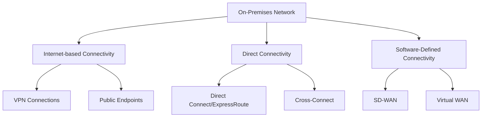
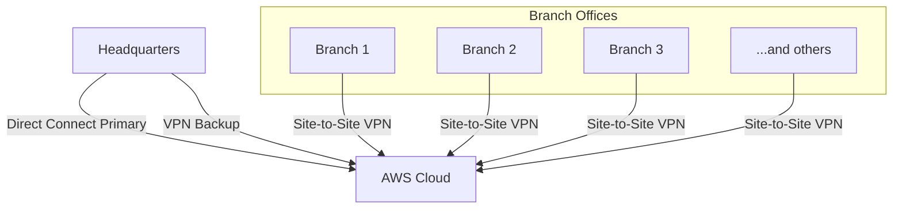

# Networks Cloud Connectivity

## Introduction

Cloud connectivity refers to how your on-premises networks connect to cloud service providers' networks. As organizations move more workloads to the cloud, establishing reliable, secure, and efficient connectivity between on-premises infrastructure and cloud resources becomes crucial. 

This guide explores the various connectivity options available for cloud networking, their benefits, challenges, and practical implementation strategies.

## Understanding Cloud Connectivity Options

Before diving into specific connectivity methods, let's understand why proper cloud connectivity matters:

- **Performance**: Direct connections often provide lower latency than public internet connections
- **Security**: Private connections can reduce exposure to internet-based threats
- **Reliability**: Dedicated connections offer more consistent performance than shared internet connections
- **Cost-effectiveness**: The right connectivity option can optimize both cost and performance

Let's explore the main cloud connectivity options:



## Internet-Based Connectivity

### VPN Connections

Virtual Private Networks (VPNs) create encrypted tunnels over the public internet between your on-premises network and cloud resources.

#### Types of Cloud VPNs

1. **Site-to-Site VPN**: Connects an entire on-premises network to a cloud network
2. **Point-to-Site VPN**: Connects individual devices to cloud resources
3. **Client VPN**: Enables individual users to connect securely to cloud resources

#### Setting up a basic Site-to-Site VPN (AWS example)

```bash
# Install the AWS CLI
pip install awscli

# Configure AWS credentials
aws configure

# Create a Customer Gateway (represents your on-premises router)
aws ec2 create-customer-gateway --type ipsec.1 --public-ip 203.0.113.1 --bgp-asn 65000

# Create a Virtual Private Gateway and attach to your VPC
aws ec2 create-vpn-gateway --type ipsec.1
aws ec2 attach-vpn-gateway --vpn-gateway-id vgw-1234567890abcdef0 --vpc-id vpc-1234567890abcdef0

# Create the VPN Connection
aws ec2 create-vpn-connection --type ipsec.1 --customer-gateway-id cgw-1234567890abcdef0 --vpn-gateway-id vgw-1234567890abcdef0
```

#### Benefits of VPN Connectivity

- **Cost-effective**: Uses existing internet connections
- **Relatively easy setup**: No specialized hardware required in many cases
- **Flexible**: Can be established quickly for temporary needs

#### Limitations

- **Performance variability**: Subject to internet congestion
- **Latency**: Higher compared to direct connections
- **Bandwidth limits**: May not be suitable for high-throughput workloads

### Public Endpoints

The simplest way to connect to cloud resources is through public endpoints over the internet.

```javascript
// Example: Connecting to an AWS S3 bucket through public endpoint
const AWS = require('aws-sdk');
const s3 = new AWS.S3({
  region: 'us-west-2',
  accessKeyId: 'YOUR_ACCESS_KEY',
  secretAccessKey: 'YOUR_SECRET_KEY'
});

// List all buckets
s3.listBuckets((err, data) => {
  if (err) console.error(err);
  else console.log('Buckets:', data.Buckets);
});
```

#### When to Use Public Endpoints

- For content delivery to end users
- For non-sensitive data access
- When simplicity outweighs security concerns
- For public-facing applications

## Direct Connectivity

### Direct Connect / ExpressRoute

Direct Connect (AWS), ExpressRoute (Azure), and Cloud Interconnect (Google Cloud) provide dedicated private connections between your data center and the cloud provider.

#### Features of Direct Connections

- Private dedicated connection (not over the internet)
- Higher bandwidth options (typically 1Gbps to 10Gbps)
- More consistent network performance
- Lower latency than internet-based connections


#### Implementation Steps (General)

1. Request a direct connection from your cloud provider or partner
2. Establish physical connectivity (often through a colocation facility)
3. Configure BGP (Border Gateway Protocol) for route exchange
4. Create virtual interfaces to connect to specific cloud resources

#### Benefits

- **Predictable performance**: Consistent latency and throughput
- **Enhanced security**: Traffic doesn't traverse the public internet
- **Scalability**: Support for higher bandwidth requirements
- **Reduced data transfer costs**: Often provides cheaper data egress rates

#### Limitations

- **Higher setup cost**: Requires physical infrastructure changes
- **Longer implementation time**: Physical installation required
- **Geographic limitations**: Must connect through specific locations

### Cross-Connect

A cross-connect is a physical cable that directly connects your equipment to the cloud provider's network within a colocation facility.

#### Use Cases

- High-frequency trading applications
- Media processing requiring ultra-low latency
- Database replication between on-premises and cloud

## Software-Defined Connectivity

### SD-WAN (Software-Defined Wide Area Network)

SD-WAN provides a software abstraction layer that can dynamically route traffic across multiple connection types based on application requirements.

```python
# Pseudocode for SD-WAN policy
sd_wan_policy = {
    "applications": {
        "voip": {
            "priority": "high",
            "preferred_path": "mpls"
        },
        "email": {
            "priority": "medium",
            "preferred_path": "internet"
        },
        "backup": {
            "priority": "low",
            "preferred_path": "any"
        }
    }
}
```

#### Benefits of SD-WAN for Cloud Connectivity

- **Application-aware routing**: Directs traffic based on application needs
- **Multiple connection utilization**: Can use various connections simultaneously
- **Centralized management**: Simplified control of complex networks
- **Cost optimization**: Can balance between expensive and cheaper connections

### Virtual WAN

Cloud providers offer Virtual WAN services that simplify connectivity between branches, data centers, and cloud resources.

#### Features

- Automated site-to-site connectivity
- Global transit network architecture
- Integration with SD-WAN devices
- Centralized connection management

## Hybrid Connectivity Patterns

Most organizations use multiple connectivity methods in combination:

1. **Multi-tier approach**: Critical applications use direct connections, while less sensitive traffic uses VPNs
2. **Redundant connections**: Using both direct connect and VPN for failover
3. **Regional optimization**: Different connection types based on geographic needs

## Real-World Implementation Example

Let's walk through a scenario for a medium-sized company connecting their on-premises infrastructure to AWS:

### Requirements

- Connect headquarters to AWS (high bandwidth, low latency)
- Connect 10 branch offices to the same AWS resources
- Ensure high availability
- Control costs

### Solution Architecture



### Implementation Steps

1. **Headquarters Setup**:
   - Order a 1Gbps AWS Direct Connect connection through a provider
   - Configure a hardware VPN as backup
   - Establish BGP routing

2. **Branch Office Setup**:
   - Configure site-to-site VPNs from each branch
   - Set up route propagation
   - Implement QoS for critical applications

3. **AWS Configuration**:
   - Create a Transit Gateway to consolidate connections
   - Configure route tables for proper traffic flow
   - Implement security groups and NACLs for security

### Code Example: Terraform Configuration for Hybrid Connectivity

```hcl
# Direct Connect configuration
resource "aws_dx_connection" "headquarters" {
  name          = "headquarters-direct-connect"
  bandwidth     = "1Gbps"
  location      = "Example Location"
}

# VPN Backup
resource "aws_customer_gateway" "main" {
  bgp_asn    = 65000
  ip_address = "203.0.113.1"
  type       = "ipsec.1"
}

resource "aws_vpn_gateway" "main" {
  vpc_id = aws_vpc.main.id
}

resource "aws_vpn_connection" "main" {
  vpn_gateway_id      = aws_vpn_gateway.main.id
  customer_gateway_id = aws_customer_gateway.main.id
  type                = "ipsec.1"
  static_routes_only  = false
}

# Transit Gateway for consolidating connections
resource "aws_ec2_transit_gateway" "main" {
  description = "Main Transit Gateway"
}

# Attach VPC to Transit Gateway
resource "aws_ec2_transit_gateway_vpc_attachment" "main" {
  subnet_ids         = [aws_subnet.example1.id, aws_subnet.example2.id]
  transit_gateway_id = aws_ec2_transit_gateway.main.id
  vpc_id             = aws_vpc.main.id
}
```

## Performance Considerations

When designing cloud connectivity solutions, consider these performance factors:

1. **Latency requirements**: Applications sensitive to delay need direct connections
2. **Bandwidth needs**: High data transfer requires higher capacity links
3. **Traffic patterns**: Asymmetric traffic may need different ingress/egress setups
4. **Geographic distribution**: User locations affect connection point choices

## Security Best Practices

1. **Encryption**: Encrypt data in transit, even on private connections
2. **Network segmentation**: Use VPC/VNET segmentation to isolate resources
3. **Traffic filtering**: Implement security groups, NACLs, and firewalls
4. **Monitoring**: Set up logging and monitoring for connection health and security events

## Cloud Connectivity Troubleshooting

Common issues and how to resolve them:

| Issue | Possible Causes | Troubleshooting Steps |
|-------|----------------|----------------------|
| High Latency | Network congestion, Routing issues | Run traceroute, Check for internet congestion, Verify BGP routes |
| Connection Drops | BGP flapping, Physical connectivity issues | Check BGP logs, Verify interface status, Contact provider |
| Throughput Problems | Bandwidth limitations, Traffic shaping | Run iperf tests, Check QoS settings, Verify MTU settings |
| Routing Problems | BGP misconfiguration, Route advertisement issues | Examine BGP neighbors, Verify route tables, Check route propagation |

### Troubleshooting Commands

```bash
# Check VPN connection status (AWS)
aws ec2 describe-vpn-connections

# Verify BGP sessions on router
show ip bgp neighbors

# Test connectivity
ping [cloud-resource-ip]
traceroute [cloud-resource-ip]

# Check throughput
iperf -c [cloud-endpoint] -p [port] -t 30
```

## Summary

Cloud connectivity is a critical component of any cloud strategy. The right approach depends on your specific requirements around performance, security, reliability, and cost. Most organizations benefit from a hybrid approach that leverages multiple connectivity methods.

Key takeaways:

- **VPNs** provide cost-effective, flexible connectivity suitable for smaller workloads
- **Direct Connect** options offer higher performance and reliability for critical applications
- **Software-defined networking** adds intelligence and flexibility to cloud connectivity
- A **hybrid approach** often provides the best balance of performance, reliability, and cost

## Exercises

1. Compare the latency difference between a VPN connection and a Direct Connect to your cloud provider using `ping` and `traceroute`.
2. Create a basic site-to-site VPN between a test environment and your cloud provider.
3. Design a hybrid connectivity solution for a fictional company with one headquarters and five branch offices.
4. Create a monitoring dashboard for your cloud connections to track latency, bandwidth utilization, and connection status.

## Additional Resources

- AWS, Azure, and Google Cloud documentation on connectivity options
- RFC 7348 - Virtual eXtensible Local Area Network (VXLAN)
- BGP routing tutorials and best practices
- SD-WAN deployment guides from leading vendors