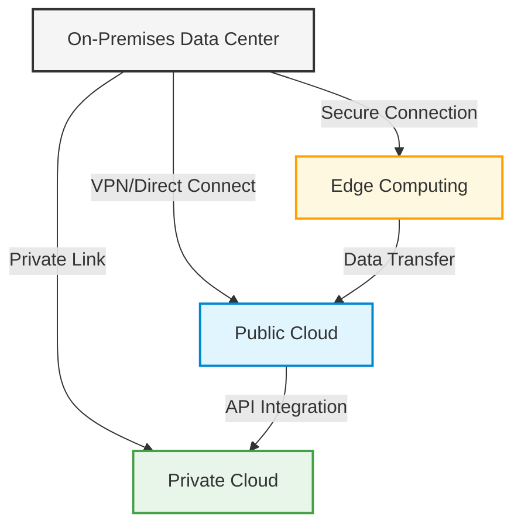
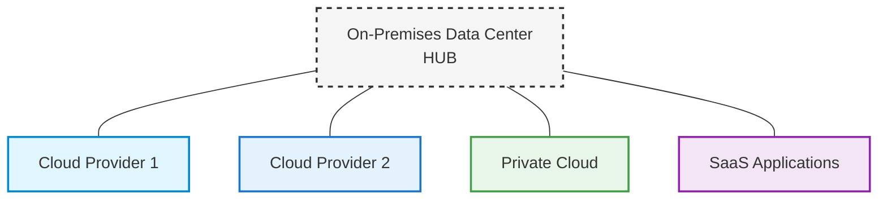
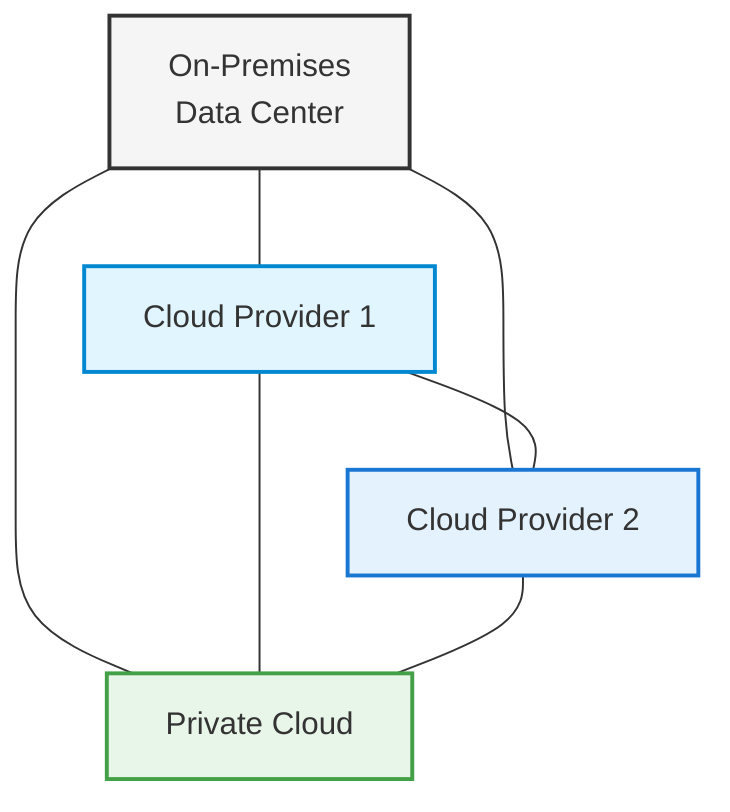

# Networks Hybrid Cloud

## Introduction

Hybrid cloud networking represents a pivotal evolution in modern IT infrastructure, combining the best elements of both private and public cloud environments. As organizations navigate the increasing complexity of digital transformation, hybrid cloud networks offer a flexible, scalable solution that balances security requirements with the need for innovation.

At its core, a hybrid cloud network is an integrated networking environment that connects on-premises infrastructure with public cloud resources. This architecture enables organizations to maintain control over sensitive workloads while leveraging the scalability and cost benefits of public cloud services.

## What is a Hybrid Cloud Network?

A hybrid cloud network is a networking architecture that seamlessly connects:

- **Private cloud infrastructure** (on-premises data centers or private hosted environments)
- **Public cloud platforms** (like AWS, Azure, Google Cloud)
- **Edge computing resources** (in some implementations)

This integration creates a unified networking environment where workloads and data can move between environments based on business requirements, compliance needs, and performance considerations.



## Key Components of Hybrid Cloud Networks

### 1. Connectivity Options

Hybrid clouds require robust connectivity solutions to function effectively:

- **Virtual Private Networks (VPNs)** - Encrypted tunnels over the internet
- **Direct Connect/ExpressRoute** - Dedicated private connections to cloud providers
- **Software-Defined Wide Area Networks (SD-WAN)** - Intelligent routing across multiple connection types
- **Inter-cloud Connectivity** - Connections between different cloud providers

### 2. Network Virtualization

Network virtualization creates abstracted, software-defined networks that span across physical boundaries:

```javascript
// Example: Creating a virtualized network in AWS using Terraform
const network = {
  vpc: {
    cidrBlock: "10.0.0.0/16",
    enableDnsSupport: true,
    enableDnsHostnames: true,
    tags: {
      Name: "hybrid-vpc"
    }
  },
  subnets: [
    {
      cidrBlock: "10.0.1.0/24",
      availabilityZone: "us-west-2a",
      tags: {
        Name: "private-subnet-1"
      }
    },
    {
      cidrBlock: "10.0.2.0/24",
      availabilityZone: "us-west-2b",
      tags: {
        Name: "private-subnet-2"
      }
    }
  ]
};

// Output would be a configured VPC with subnets ready for hybrid connectivity
```

### 3. Network Security

Hybrid environments require comprehensive security measures:

- **Network Segmentation** - Isolating network segments using security groups, NACLs
- **Encryption** - Protecting data in transit between environments
- **Identity and Access Management** - Controlling who can access resources
- **Firewall Rules** - Filtering traffic between network boundaries

### 4. Traffic Management

Efficient traffic routing is essential in hybrid environments:

- **Load Balancing** - Distributing traffic across multiple resources
- **DNS Management** - Directing users to appropriate resources
- **Traffic Shaping** - Prioritizing certain types of network traffic

## Hybrid Cloud Network Architectures

### Hub and Spoke Model

The hub and spoke model centralizes connectivity through a main hub (typically the on-premises data center) that connects to multiple cloud environments.



### Mesh Network Model

A mesh network creates direct connections between all environments, reducing the reliance on a central hub but increasing complexity.



## Implementing a Hybrid Cloud Network

### 1. Assessment and Planning

Before implementing a hybrid cloud network, organizations should:

- Identify which applications and data will reside where
- Determine connectivity requirements (bandwidth, latency, security)
- Assess compliance and regulatory considerations
- Establish governance policies

### 2. Network Design

Create a detailed network design including:

```
Private Network CIDR: 10.0.0.0/16
Public Cloud VPC CIDR: 172.16.0.0/16
Subnet Strategy: Separate subnets for web, application, and database tiers
Connectivity: Direct Connect with VPN backup
Security Zones: DMZ, Trusted, Highly Restricted
```

### 3. Connectivity Implementation

Setting up connectivity between environments is a critical step:

```python
# Example: Creating a site-to-site VPN using AWS CLI
import boto3

ec2 = boto3.client('ec2', region_name='us-west-2')

# Create a Customer Gateway
customer_gateway = ec2.create_customer_gateway(
    BgpAsn=65000,
    PublicIp='203.0.113.1',  # Your on-premises gateway IP
    Type='ipsec.1',
    TagSpecifications=[
        {
            'ResourceType': 'customer-gateway',
            'Tags': [
                {
                    'Key': 'Name',
                    'Value': 'Hybrid-CGW'
                },
            ]
        },
    ]
)

# Create a Virtual Private Gateway and attach to VPC
vpg = ec2.create_vpn_gateway(
    Type='ipsec.1',
    TagSpecifications=[
        {
            'ResourceType': 'vpn-gateway',
            'Tags': [
                {
                    'Key': 'Name',
                    'Value': 'Hybrid-VGW'
                },
            ]
        },
    ]
)

ec2.attach_vpn_gateway(
    VpcId='vpc-1234567890abcdef0',
    VpnGatewayId=vpg['VpnGateway']['VpnGatewayId']
)

# Create the VPN connection
vpn_connection = ec2.create_vpn_connection(
    CustomerGatewayId=customer_gateway['CustomerGateway']['CustomerGatewayId'],
    Type='ipsec.1',
    VpnGatewayId=vpg['VpnGateway']['VpnGatewayId'],
    Options={
        'StaticRoutesOnly': True
    },
    TagSpecifications=[
        {
            'ResourceType': 'vpn-connection',
            'Tags': [
                {
                    'Key': 'Name',
                    'Value': 'Hybrid-VPN'
                },
            ]
        },
    ]
)

# Add a static route
ec2.create_vpn_connection_route(
    DestinationCidrBlock='10.0.0.0/16',  # On-premises network CIDR
    VpnConnectionId=vpn_connection['VpnConnection']['VpnConnectionId']
)

print("VPN Connection Configuration:", vpn_connection)
```

### 4. Network Security Implementation

Implementing comprehensive security controls:

```bash
# Example: Configuring an AWS Security Group for hybrid access

# Create a security group for resources accessible from on-premises
aws ec2 create-security-group \
  --group-name hybrid-access-sg \
  --description "Allow traffic from on-premises network" \
  --vpc-id vpc-1234567890abcdef0

# Allow specific traffic from on-premises network
aws ec2 authorize-security-group-ingress \
  --group-id sg-1234567890abcdef0 \
  --protocol tcp \
  --port 443 \
  --cidr 10.0.0.0/16

# Allow database access from specific subnet in on-premises network
aws ec2 authorize-security-group-ingress \
  --group-id sg-1234567890abcdef0 \
  --protocol tcp \
  --port 3306 \
  --cidr 10.0.2.0/24
```

### 5. DNS and Routing Configuration

Configuring DNS for hybrid environments:

```javascript
// Example: Configuring Route 53 Private Hosted Zone for hybrid DNS

const AWS = require('aws-sdk');
const route53 = new AWS.Route53();

// Create a private hosted zone
route53.createHostedZone({
  Name: 'internal.example.com',
  VPC: {
    VPCRegion: 'us-west-2',
    VPCId: 'vpc-1234567890abcdef0'
  },
  CallerReference: Date.now().toString(),
  HostedZoneConfig: {
    Comment: 'Private hosted zone for hybrid cloud'
  }
}, (err, data) => {
  if (err) console.error(err);
  else {
    console.log('Created hosted zone:', data.HostedZone.Id);
    
    // Associate with on-premises via Route 53 Resolver endpoints
    // (Simplified - actual implementation would require additional steps)
  }
});
```

## Real-World Hybrid Cloud Network Examples

### Example 1: Financial Services Hybrid Architecture

A financial institution implements a hybrid cloud network where:

- Customer-facing applications run in the public cloud for scalability
- Transaction processing systems remain on-premises for security and compliance
- Data synchronization occurs over dedicated, encrypted connections
- Disaster recovery spans both environments

### Example 2: Healthcare Provider Hybrid Network

A healthcare organization uses a hybrid approach with:

- Patient portal hosted in the public cloud
- Electronic Health Records (EHR) systems hosted on-premises
- Secure connectivity ensuring HIPAA compliance
- Network segmentation isolating different data types

### Example 3: E-commerce Hybrid Implementation

An e-commerce company implements:

- Web frontends in public cloud to handle variable traffic
- Payment processing in private cloud for PCI compliance
- Inventory systems connecting to on-premises ERP
- Global content delivery using cloud CDN services

## Best Practices for Hybrid Cloud Networks

1. **Implement consistent security policies** across all environments
2. **Automate network provisioning** using Infrastructure as Code (IaC)
3. **Establish robust monitoring** spanning all network segments
4. **Design for resilience** with redundant connectivity options
5. **Optimize traffic routing** to minimize latency and costs
6. **Implement effective governance** with clear ownership and processes
7. **Plan for disaster recovery** across hybrid environments

## Common Challenges and Solutions

| Challenge | Solution |
|-----------|----------|
| Inconsistent network policies | Implement centralized policy management tools |
| Performance bottlenecks | Optimize connection sizing and implement caching |
| Complex troubleshooting | Deploy end-to-end monitoring and tracing |
| Security gaps | Implement Zero Trust security model |
| Skills gaps | Invest in training and consider managed services |

## Tools for Hybrid Cloud Networking

Several tools can help manage hybrid cloud networks effectively:

- **Network Virtualization Platforms**: VMware NSX, Cisco ACI
- **Multi-cloud Networking**: Aviatrix, Alkira
- **SD-WAN Solutions**: Cisco Viptela, VMware VeloCloud
- **Monitoring Tools**: ThousandEyes, AppDynamics
- **Security Solutions**: Palo Alto Prisma, CheckPoint CloudGuard

## Summary

Hybrid cloud networks represent the pragmatic middle ground for organizations navigating their cloud journey. By combining the control and security of private infrastructure with the scalability and innovation of public clouds, hybrid approaches offer significant advantages.

Key takeaways include:

- Hybrid networks require thoughtful architecture and planning
- Connectivity, security, and consistent policies are critical success factors
- Implementation should follow a phased approach with clear milestones
- The right tools and automation can significantly reduce complexity

As cloud technologies continue to evolve, hybrid cloud networks will remain relevant for organizations with diverse requirements and existing investments in on-premises infrastructure.

## Additional Resources

For those looking to deepen their understanding of hybrid cloud networking:

- Practice implementing a small-scale hybrid environment using cloud provider free tiers
- Experiment with different connectivity options to understand their characteristics
- Create a network diagram of your ideal hybrid architecture
- Develop a migration strategy for moving applications between environments

## Exercises

1. Design a hybrid cloud network architecture for a fictional company with specific requirements
2. Implement a simple VPN connection between a local environment and a cloud provider
3. Create a network security policy that spans both on-premises and cloud environments
4. Develop a disaster recovery plan for a hybrid architecture
5. Compare the costs of different connectivity options for a hybrid deployment