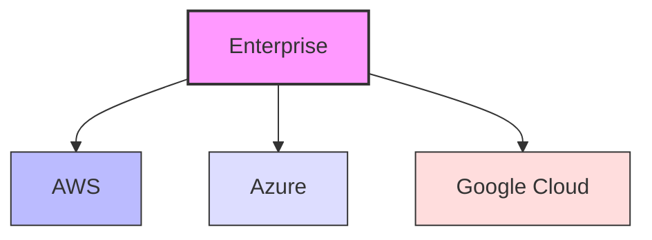
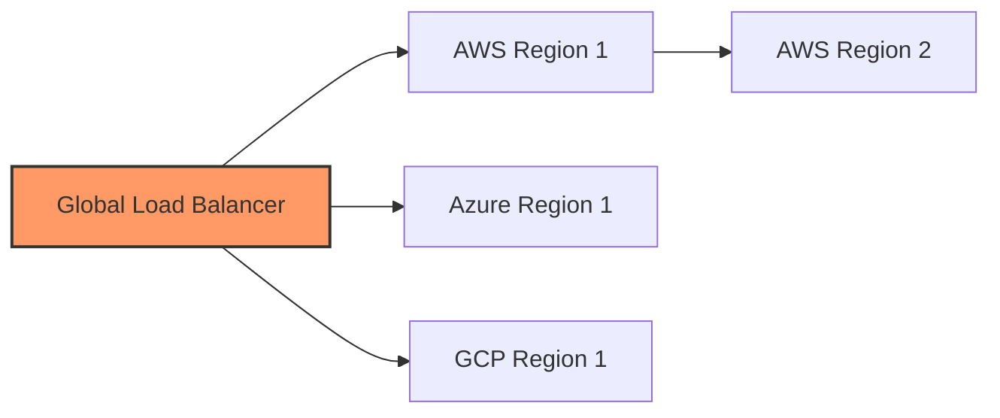
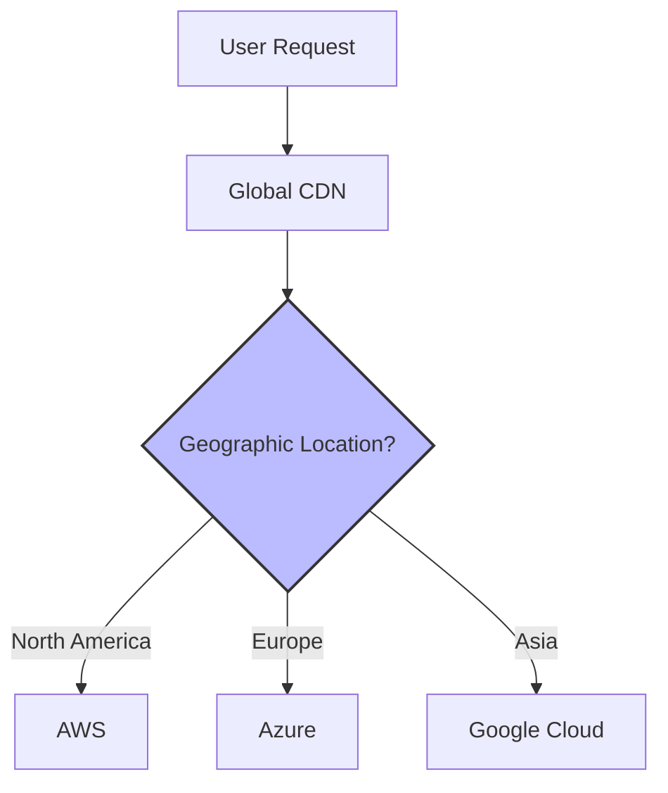

# Networks Multi-Cloud

## Introduction

Multi-cloud networking refers to the connecting, integrating, and managing network resources across multiple cloud service providers. Instead of relying on a single cloud provider (like AWS, Azure, or Google Cloud), a multi-cloud strategy involves using services from two or more cloud providers simultaneously. This approach offers various benefits including avoiding vendor lock-in, optimizing costs, and leveraging specific strengths of different providers.

For beginners entering the world of cloud networking, understanding multi-cloud architecture is increasingly important as organizations adopt this strategy to enhance their flexibility and resilience.

## Key Concepts in Multi-Cloud Networking

### What is Multi-Cloud?

Multi-cloud refers to the use of cloud computing services from multiple cloud providers to run applications and workloads. Unlike hybrid cloud (which combines private and public cloud environments), multi-cloud specifically focuses on utilizing multiple public cloud providers.



### Benefits of Multi-Cloud Networking

1. **Avoiding Vendor Lock-in**: Reduces dependency on a single provider
2. **Optimal Resource Allocation**: Leverage specific strengths of different providers
3. **Geographic Distribution**: Deploy services closer to users in different regions
4. **Cost Optimization**: Select the most cost-effective services from each provider
5. **Risk Mitigation**: Improve resilience against outages or service disruptions

## Multi-Cloud Network Architecture

Creating an effective multi-cloud network requires careful planning to ensure seamless connectivity between different cloud environments.

### Core Components

#### 1. Network Connectivity

Several options exist for connecting multiple cloud environments:

```python
# Example connection configuration in Python (pseudo-code)
def setup_multi_cloud_connection(source_cloud, target_cloud, connection_type):
    if connection_type == "vpn":
        return configure_vpn_tunnel(source_cloud, target_cloud)
    elif connection_type == "direct_connect":
        return configure_direct_connect(source_cloud, target_cloud)
    elif connection_type == "transit_gateway":
        return configure_transit_gateway(source_cloud, target_cloud)
    else:
        raise ValueError("Unsupported connection type")
```

- **VPN Connections**: Secure tunnels over the public internet
- **Direct Connect/ExpressRoute**: Private dedicated connections
- **Transit Gateways**: Central hub for managing connections

#### 2. Network Address Management

Managing IP addressing across multiple cloud providers is critical to avoid overlaps and conflicts.

```python
# IP address planning for multi-cloud (pseudo-code)
def plan_ip_addresses(cloud_environments):
    ip_ranges = {}
    for env in cloud_environments:
        # Assign non-overlapping CIDR blocks
        ip_ranges[env.name] = assign_cidr_block(env.region, env.size)
    
    # Verify no overlaps
    verify_no_overlaps(ip_ranges)
    return ip_ranges
```

#### 3. Traffic Management and Load Balancing

Distributing traffic effectively across multiple cloud providers:



## Implementation Steps

### 1. Network Design Planning

Before implementing a multi-cloud strategy, create a detailed network design:

1. **Inventory current resources** across all cloud providers
2. **Define connectivity requirements** (bandwidth, latency, security)
3. **Create address space planning** to avoid IP conflicts
4. **Design traffic flow patterns** between clouds

### 2. Setting Up Connectivity

Let's look at a basic example of connecting AWS and Azure using a site-to-site VPN:

```bash
# AWS CLI command to create a Customer Gateway
aws ec2 create-customer-gateway \
  --type ipsec.1 \
  --public-ip 203.0.113.12 \
  --bgp-asn 65000

# AWS CLI command to create a Virtual Private Gateway
aws ec2 create-vpn-gateway \
  --type ipsec.1
```

For Azure, you would configure a similar connection:

```bash
# Azure CLI command to create a Virtual Network Gateway
az network vnet-gateway create \
  --name MyVNetGateway \
  --resource-group MyResourceGroup \
  --vnet MyVNet \
  --gateway-type Vpn \
  --sku VpnGw1 \
  --vpn-type RouteBased \
  --no-wait
```

### 3. Network Security Considerations

Security in multi-cloud environments requires a consistent approach:

```python
# Example security group configuration (pseudo-code)
def create_consistent_security_groups():
    # Define standard security rules
    base_rules = [
        {"port": 443, "source": "0.0.0.0/0", "protocol": "tcp"},
        {"port": 22, "source": "10.0.0.0/8", "protocol": "tcp"}
    ]
    
    # Apply to each cloud provider
    for provider in ["aws", "azure", "gcp"]:
        apply_security_rules(provider, base_rules)
```

Key security considerations include:
- Implementing consistent firewall rules across providers
- Encrypting data in transit between clouds
- Creating centralized identity management
- Establishing monitoring and logging across all environments

## Real-World Examples

### Case Study: E-commerce Platform

An e-commerce company leverages multi-cloud networking to optimize their architecture:

- **AWS**: Hosts the main application and database
- **Google Cloud**: Handles image processing and ML-based recommendations
- **Azure**: Manages customer data analytics and reporting

Their network architecture includes:

1. Direct Connect between AWS and on-premises data center
2. VPN tunnels between all three cloud providers
3. Global DNS-based load balancing to route users to the nearest point of presence
4. Consistent security policies enforced through a central management platform

### Case Study: Media Streaming Service

A streaming service uses multi-cloud to ensure optimal content delivery:



## Common Challenges and Solutions

### Challenge 1: Network Complexity

**Solution**: Implement a centralized network management tool that provides visibility across all cloud environments.

```python
# Example of centralized network monitoring (pseudo-code)
def monitor_all_cloud_networks():
    metrics = {}
    for provider in cloud_providers:
        conn = connect_to_provider(provider)
        metrics[provider] = {
            "latency": collect_latency_metrics(conn),
            "bandwidth": collect_bandwidth_metrics(conn),
            "packet_loss": collect_packet_loss_metrics(conn)
        }
    return metrics
```

### Challenge 2: Cost Management

**Solution**: Use cloud-agnostic cost monitoring tools and implement tagging strategies to track spending across providers.

### Challenge 3: Consistent Security

**Solution**: Implement a zero-trust security model and centralized identity management.

## Tools for Multi-Cloud Networking

Several tools can help manage multi-cloud networking:

1. **Terraform**: Infrastructure as code for multiple providers
2. **Kubernetes**: Container orchestration across clouds
3. **Istio/Linkerd**: Service mesh for multi-cloud communication
4. **Cloudflare/Akamai**: Global traffic management

Example Terraform configuration for multi-cloud:

```hcl
# AWS provider configuration
provider "aws" {
  region = "us-west-2"
}

# Azure provider configuration
provider "azurerm" {
  features {}
}

# Create VPC in AWS
resource "aws_vpc" "main" {
  cidr_block = "10.0.0.0/16"
  tags = {
    Name = "multi-cloud-vpc"
  }
}

# Create Virtual Network in Azure
resource "azurerm_virtual_network" "main" {
  name                = "multi-cloud-vnet"
  resource_group_name = azurerm_resource_group.main.name
  location            = azurerm_resource_group.main.location
  address_space       = ["10.1.0.0/16"]
}
```

## Summary

Multi-cloud networking offers significant advantages in terms of flexibility, resilience, and optimized resource usage. By understanding the core concepts, implementation steps, and common challenges, beginners can prepare for designing and managing networks that span multiple cloud providers.

As cloud technologies continue to evolve, multi-cloud strategies are becoming increasingly important for organizations looking to avoid vendor lock-in while leveraging the best features of each cloud platform.

## Additional Resources

- Cloud provider documentation:
  - AWS Transit Gateway documentation
  - Azure Virtual WAN documentation
  - Google Cloud Network Connectivity Center
- Open-source tools:
  - Terraform multi-cloud examples
  - Kubernetes federation documentation
- Books and courses on cloud networking architecture
- Practice exercises:
  - Design a multi-cloud network for a hypothetical application
  - Implement a simple multi-cloud setup using free tier resources