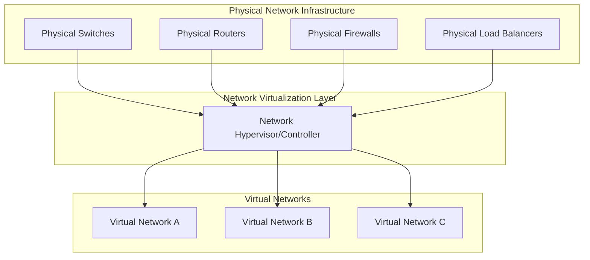
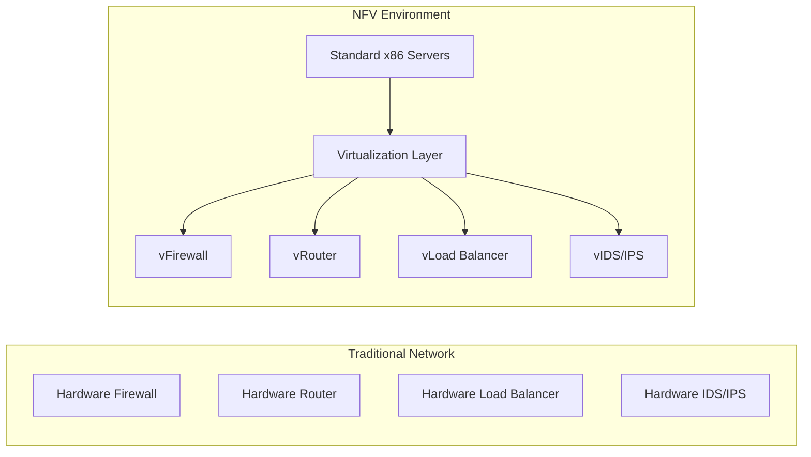
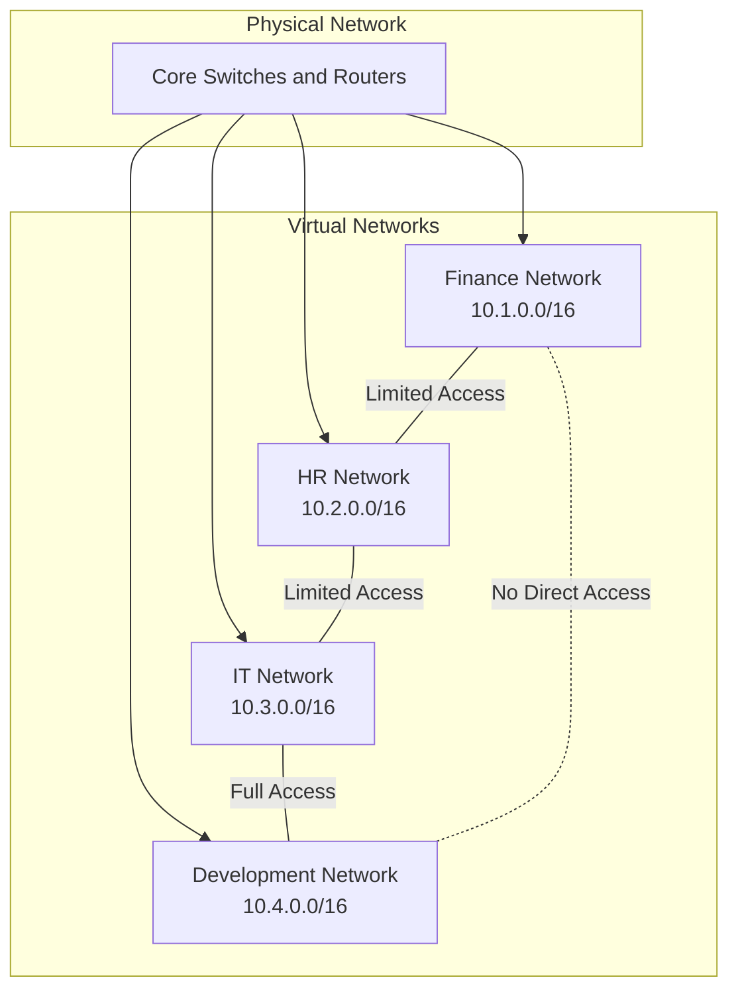

# Networks Virtualization

## Introduction

Network virtualization is a revolutionary approach to networking that abstracts physical networking resources into logical, virtual networks. Similar to how server virtualization separates operating systems from physical hardware, network virtualization decouples network services from the underlying physical infrastructure. This powerful concept enables organizations to create multiple isolated virtual networks on the same physical network infrastructure, improving efficiency, scalability, and management.

In today's cloud-first world, network virtualization forms a critical foundation for modern IT infrastructure, enabling the agility and flexibility demanded by businesses pursuing digital transformation.

## What is Network Virtualization?

Network virtualization is the process of combining hardware and software network resources into a single, software-based administrative entity - a virtual network. This abstraction layer allows network administrators to programmatically create, provision, and manage virtual networks without directly configuring physical hardware.



### Key Components of Network Virtualization

1. **Virtual Network Interface Cards (vNICs)**: Software-based network interfaces that connect virtual machines to virtual networks.

2. **Virtual Switches (vSwitches)**: Software implementations of physical switches that forward traffic between virtual machines.

3. **Network Hypervisor/Controller**: Central management software that creates, manages, and monitors virtual networks.

4. **Overlay Networks**: Logical networks created on top of the physical infrastructure using encapsulation protocols.

5. **Network Function Virtualization (NFV)**: Converting hardware network appliances into software-based services.

## Types of Network Virtualization

There are two primary approaches to network virtualization:

### 1. External Network Virtualization

External virtualization combines multiple physical networks or parts of networks into a single virtual unit. It's typically used in enterprise environments to partition a physical network into multiple virtual networks, each with its own set of policies and security protocols.

### 2. Internal Network Virtualization

Internal virtualization creates virtual networks between virtual machines within a single physical server. This is commonly seen in data centers and cloud environments where multiple virtual machines need to communicate with each other.

## Network Virtualization Technologies

Let's explore some key technologies that enable network virtualization:

### Software-Defined Networking (SDN)

SDN separates the network control plane (decision-making) from the data plane (traffic forwarding), enabling centralized management and programmability.

```javascript
// Example of SDN controller API call (in JavaScript)
// Creating a new virtual network
fetch('https://sdn-controller.example.com/api/networks', {
  method: 'POST',
  headers: {
    'Content-Type': 'application/json',
  },
  body: JSON.stringify({
    name: 'marketing-network',
    subnet: '10.0.1.0/24',
    gateway: '10.0.1.1',
    dhcp: true,
    vlan: 100
  }),
})
.then(response => response.json())
.then(data => console.log('Created virtual network:', data))
.catch(error => console.error('Error creating network:', error));
```

### VXLAN (Virtual Extensible LAN)

VXLAN is an encapsulation protocol that allows you to create isolated Layer 2 networks over a Layer 3 infrastructure, extending the VLAN address space.

```python
# Python code demonstrating VXLAN packet encapsulation (simplified)
def encapsulate_vxlan_packet(original_packet, vni, src_ip, dst_ip):
    """
    Encapsulates an Ethernet packet into a VXLAN packet
    
    Args:
        original_packet: The original Ethernet frame
        vni: VXLAN Network Identifier (24-bit value)
        src_ip: Source IP address for outer header
        dst_ip: Destination IP address for outer header
    
    Returns:
        VXLAN encapsulated packet
    """
    # Create VXLAN header (8 bytes)
    vxlan_header = bytearray(8)
    # Set VNI field (bytes 4-7)
    vxlan_header[4] = (vni >> 16) & 0xFF
    vxlan_header[5] = (vni >> 8) & 0xFF
    vxlan_header[6] = vni & 0xFF
    
    # Create UDP header (source port 4789, destination port 4789)
    udp_header = create_udp_header(
        src_port=4789,
        dst_port=4789,
        length=len(original_packet) + len(vxlan_header) + 8
    )
    
    # Create IP header
    ip_header = create_ip_header(
        src_ip=src_ip,
        dst_ip=dst_ip,
        protocol=17,  # UDP
        length=len(original_packet) + len(vxlan_header) + len(udp_header) + 20
    )
    
    # Create Ethernet header
    eth_header = create_ethernet_header(
        src_mac=get_mac_for_ip(src_ip),
        dst_mac=get_mac_for_ip(dst_ip),
        ether_type=0x0800  # IPv4
    )
    
    # Combine all headers with original packet
    vxlan_packet = eth_header + ip_header + udp_header + vxlan_header + original_packet
    
    return vxlan_packet

# Example usage
original_frame = get_ethernet_frame()
vxlan_packet = encapsulate_vxlan_packet(
    original_frame,
    vni=5000,
    src_ip='192.168.1.10',
    dst_ip='192.168.1.20'
)
```

### Network Function Virtualization (NFV)

NFV transforms traditional network appliances (routers, firewalls, load balancers) into virtualized instances running on commodity hardware.



## Implementing Network Virtualization

Let's walk through a basic implementation of network virtualization in a lab environment:

### Setting Up a Virtual Switch with Open vSwitch (OVS)

Open vSwitch is a production-quality, multilayer virtual switch designed to enable network automation through programmatic extension.

```bash
# Install Open vSwitch
sudo apt-get update
sudo apt-get install -y openvswitch-switch

# Create a virtual bridge
sudo ovs-vsctl add-br ovs-br0

# Add physical interface to bridge
sudo ovs-vsctl add-port ovs-br0 eth0

# Create two virtual networks (VLANs)
# VLAN 100 for Development team
sudo ovs-vsctl add-port ovs-br0 vnet1 tag=100 -- set interface vnet1 type=internal
# VLAN 200 for Marketing team
sudo ovs-vsctl add-port ovs-br0 vnet2 tag=200 -- set interface vnet2 type=internal

# Configure IP addresses for virtual networks
sudo ip addr add 10.100.0.1/24 dev vnet1
sudo ip addr add 10.200.0.1/24 dev vnet2
sudo ip link set vnet1 up
sudo ip link set vnet2 up

# View configuration
sudo ovs-vsctl show
```

### Creating Virtual Networks with OpenStack Neutron

OpenStack's Neutron project provides networking-as-a-service between interface devices managed by other OpenStack services.

```bash
# Create a private network
openstack network create private-net

# Create a subnet for the private network
openstack subnet create --network private-net \
  --subnet-range 192.168.1.0/24 \
  --gateway 192.168.1.1 \
  private-subnet

# Create a router to connect private network to external network
openstack router create main-router

# Connect router to private subnet
openstack router add subnet main-router private-subnet

# Connect router to external network
openstack router set --external-gateway public main-router

# Create security group rules
openstack security group rule create --protocol icmp default
openstack security group rule create --protocol tcp --dst-port 22 default

# Launch a VM with the private network
openstack server create --image ubuntu-20.04 \
  --flavor m1.small \
  --network private-net \
  example-vm
```

## Benefits of Network Virtualization

1. **Reduced Hardware Costs**: By consolidating multiple logical networks onto shared physical infrastructure.

2. **Improved Agility**: Networks can be created, modified, and removed programmatically without physical reconfiguration.

3. **Enhanced Security**: Through network segmentation and isolation, reducing the attack surface.

4. **Simplifies Network Management**: Centralized control and automation reduce operational complexity.

5. **Facilitates Multi-tenancy**: Enables multiple isolated networks to coexist on shared infrastructure.

6. **Supports Cloud Migration**: Creates consistent networking environments across on-premises and cloud infrastructure.

## Real-World Applications

### Case Study 1: Enterprise Network Segmentation

A large corporation needs to isolate department networks for security while maintaining a single physical infrastructure:



### Case Study 2: Cloud Service Provider

A cloud provider uses network virtualization to offer isolated networks to thousands of customers on shared infrastructure:

```javascript
// Example API code for customer network provisioning (pseudocode)
function createCustomerNetwork(customerId, networkSpecs) {
  // Allocate virtual network resources
  const vlan = allocateVlan();
  const subnetRange = allocateSubnetRange();
  const virtualRouterID = provisionVirtualRouter();
  
  // Configure network policies
  setupNetworkPolicies(customerId, {
    ingressRules: networkSpecs.ingressRules,
    egressRules: networkSpecs.egressRules,
    bandwidth: networkSpecs.bandwidth
  });
  
  // Set up traffic isolation
  configureTrafficIsolation(customerId, vlan);
  
  // Create virtual network interfaces for customer VMs
  networkSpecs.instances.forEach(instance => {
    createVirtualNetworkInterface(instance.id, {
      mac: generateMacAddress(),
      subnet: subnetRange,
      securityGroup: networkSpecs.securityGroup
    });
  });
  
  return {
    networkId: generateNetworkId(),
    vlan: vlan,
    subnet: subnetRange,
    status: 'active'
  };
}
```

### Case Study 3: DevOps Environment

A development team uses network virtualization to create identical test, staging, and production environments:

```bash
# Create development network environment
terraform apply -var-file=dev-environment.tfvars

# Example terraform configuration for virtual network
resource "aws_vpc" "main" {
  cidr_block = var.vpc_cidr
  tags = {
    Name = "${var.environment}-vpc"
    Environment = var.environment
  }
}

resource "aws_subnet" "private" {
  count = length(var.private_subnets)
  vpc_id = aws_vpc.main.id
  cidr_block = var.private_subnets[count.index]
  availability_zone = var.availability_zones[count.index % length(var.availability_zones)]
  
  tags = {
    Name = "${var.environment}-private-subnet-${count.index}"
    Environment = var.environment
  }
}

resource "aws_subnet" "public" {
  count = length(var.public_subnets)
  vpc_id = aws_vpc.main.id
  cidr_block = var.public_subnets[count.index]
  availability_zone = var.availability_zones[count.index % length(var.availability_zones)]
  map_public_ip_on_launch = true
  
  tags = {
    Name = "${var.environment}-public-subnet-${count.index}"
    Environment = var.environment
  }
}
```

## Challenges and Considerations

While network virtualization offers significant benefits, there are challenges to consider:

1. **Performance Overhead**: Virtualization adds a layer that may impact network performance, particularly for high-throughput applications.

2. **Complexity**: The abstraction layer can make troubleshooting more complex.

3. **Skills Gap**: Organizations need staff with both networking and virtualization expertise.

4. **Security Configurations**: Security policies must be carefully designed for virtual environments.

5. **Vendor Lock-in**: Some solutions may lead to dependency on specific vendors or technologies.

## Summary

Network virtualization represents a paradigm shift in how networks are designed, deployed, and managed. By abstracting the physical network infrastructure into software, organizations can achieve greater flexibility, efficiency, and control. Key technologies like SDN, VXLAN, and NFV form the foundation of modern virtualized networks, enabling everything from simple network segmentation to complex multi-tenant cloud environments.

As cloud computing continues to evolve, network virtualization will become increasingly essential for organizations seeking to modernize their infrastructure and accelerate digital transformation initiatives.

## Additional Resources and Exercises

### Exercises

1. **Build a Simple Virtual Network**: 
   - Install VirtualBox and create two VMs
   - Configure a host-only network
   - Implement isolation between VM networks using VLANs

2. **Experiment with SDN**:
   - Set up Mininet to create software-defined networks
   - Write a simple Python script to programmatically configure network paths

3. **Create an Overlay Network**:
   - Implement a VXLAN overlay between two hosts
   - Test connectivity and measure performance differences

### Further Learning

- Explore cloud provider network virtualization services (AWS VPC, Azure Virtual Network, GCP VPC)
- Learn about container networking with Kubernetes and Docker
- Investigate service mesh technologies like Istio and Linkerd

### Additional Reading Topics

- Network Virtualization Security Best Practices
- Performance Optimization in Virtualized Networks
- Multi-Cloud Networking Strategies
- Network Automation with Infrastructure as Code