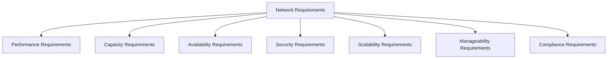
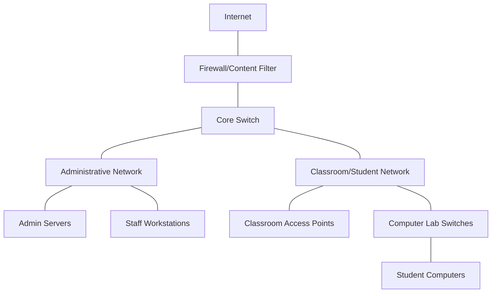

# Networks Requirements Analysis

## Introduction

When designing a network, one of the most critical initial steps is conducting a thorough requirements analysis. This process involves identifying, documenting, and analyzing the specific needs that your network must meet. Think of it as the foundation upon which your entire network will be built—if this foundation is weak or incomplete, the resulting network may fail to meet user expectations or business objectives.

Requirements analysis bridges the gap between vague statements like "we need better network performance" and actionable specifications like "the network must support 500 simultaneous users with a maximum latency of 50ms." This documentation serves as both a guide for network designers and a reference point for evaluating the success of the implementation.

## Why Requirements Analysis Matters

Before diving into the process, let's understand why requirements analysis is so crucial:

1. **Prevents costly redesigns** - Identifying requirements early helps avoid expensive changes later in the implementation process.
2. **Ensures stakeholder satisfaction** - A network that meets documented requirements is more likely to satisfy its users.
3. **Provides clear success criteria** - Well-defined requirements give you measurable goals to determine if your network design is successful.
4. **Helps with prioritization** - When faced with constraints, knowing which requirements are most important guides decision-making.
5. **Facilitates communication** - Requirements documents help technical and non-technical stakeholders understand the network's purpose and capabilities.

## The Requirements Analysis Process

Let's break down the process of network requirements analysis into manageable steps:

### 1. Identify Stakeholders

Begin by identifying all parties who have an interest in the network:

- End users who will utilize the network
- IT staff who will manage the network
- Department managers whose teams rely on network services
- Executive leadership concerned with costs and business objectives
- External parties (customers, partners) who may connect to the network

### 2. Gather Requirements

Use various techniques to collect detailed requirements from stakeholders:

#### Interviews

Direct conversations with key stakeholders can reveal important insights. Example questions might include:

- "What applications will you be running over the network?"
- "How many users need to access the network simultaneously?"
- "What are your expectations for network availability?"

#### Surveys

For larger organizations, surveys can efficiently collect requirements from many users:

```
Sample Network Requirements Survey Question:
How often do you experience network slowdowns that impact your productivity?
[ ] Never
[ ] Rarely (once a month)
[ ] Occasionally (weekly)
[ ] Frequently (daily)
[ ] Constantly
```

#### Observation

Sometimes users can't articulate their needs clearly. Observing how they currently use network resources can provide valuable insights.

#### Document Analysis

Review existing documentation like:

- Current network diagrams
- Application specifications
- Service level agreements (SLAs)
- Incident reports from the current network

### 3. Categorize Requirements

Organize the gathered requirements into categories to ensure comprehensive coverage:



Let's examine each category:

#### Performance Requirements

These specify how quickly the network should perform tasks:
- Latency (delay in data transmission)
- Jitter (variation in packet delay)
- Throughput (amount of data that can be transmitted)

Example: "The network must support video conferencing with less than 150ms latency and 30ms jitter."

#### Capacity Requirements

These define the volume the network must handle:
- Number of simultaneous users
- Bandwidth requirements for applications
- Total data volume expected

Example: "The network must support 250 concurrent users with an average bandwidth of 2Mbps per user."

#### Availability Requirements

These specify how reliable the network must be:
- Uptime percentage
- Maximum allowable downtime
- Redundancy needs

Example: "The network must maintain 99.9% uptime, equating to no more than 8.76 hours of downtime per year."

#### Security Requirements

These define how the network protects data and resources:
- Authentication mechanisms
- Encryption requirements
- Access control needs

Example: "All wireless network traffic must be encrypted using WPA3, and access must require multi-factor authentication."

#### Scalability Requirements

These specify how the network will grow:
- Expected growth in users
- Anticipated bandwidth increases
- Future application deployments

Example: "The network must be designed to accommodate 20% annual growth in users for the next 5 years."

#### Manageability Requirements

These define how the network will be monitored and maintained:
- Monitoring capabilities
- Troubleshooting tools
- Documentation standards

Example: "The network must support SNMP monitoring and provide automated alerts for devices exceeding 80% capacity."

#### Compliance Requirements

These specify standards the network must adhere to:
- Industry regulations (HIPAA, PCI-DSS, etc.)
- Corporate policies
- Legal requirements

Example: "The network must support segmentation of payment processing systems to maintain PCI-DSS compliance."

### 4. Prioritize Requirements

Not all requirements are equally important. Categorize them by priority:

- **Must-have**: Essential requirements without which the network cannot function properly
- **Should-have**: Important requirements that significantly improve the network but aren't essential
- **Nice-to-have**: Desirable requirements that would enhance the network but could be deferred

A simple prioritization table might look like this:

| Requirement | Priority | Justification |
|-------------|----------|---------------|
| Support for 200 concurrent users | Must-have | Matches current user base |
| Network monitoring dashboard | Should-have | Will improve maintenance efficiency |
| Guest Wi-Fi access | Nice-to-have | Convenient but not essential for operations |

### 5. Document Requirements

Create a formal Network Requirements Document (NRD) that includes:

- Executive summary
- Stakeholder information
- Detailed requirements by category
- Prioritization
- Constraints (budget, time, existing infrastructure)
- Assumptions made during the analysis

Here's a snippet of what a requirement might look like in your document:

```
REQ-PERF-001
Category: Performance
Priority: Must-have
Description: The network must support Voice over IP (VoIP) calls with a maximum latency of 100ms, jitter less than 30ms, and packet loss below 1%.
Verification Method: Network testing with simulated VoIP traffic.
Source: Interview with Communications Department Manager (04/15/2023)
```

### 6. Validate Requirements

Once documented, review requirements with stakeholders to ensure they accurately reflect their needs. This often reveals misunderstandings or overlooked requirements.

## Practical Example: School Network Requirements Analysis

Let's walk through a simplified example of a requirements analysis for a small school network:

### Gathering Information

After interviewing teachers, administrators, IT staff, and students, and observing current network usage, the following key needs were identified:

1. Teachers need to display multimedia content in classrooms
2. Students need internet access for research
3. Administrative staff need access to student information systems
4. The school plans to implement online testing within two years
5. Budget constraints limit hardware spending to $25,000

### Categorized Requirements

Based on the gathered information, here's how the requirements might be categorized and documented:

#### Performance Requirements

- Support streaming video in up to 15 classrooms simultaneously (720p minimum quality)
- Provide internet browsing with page load times under 3 seconds
- Support administrative applications with response times under 1 second

#### Capacity Requirements

- Support up to 300 concurrent student devices
- Support up to 30 staff computers
- Provide minimum 100Mbps internet connectivity

#### Security Requirements

- Separate student and administrative networks
- Filter inappropriate content for student access
- Secure wireless access with WPA2 or better encryption

#### Scalability Requirements

- Allow for 20% growth in devices annually
- Support online testing implementation within two years
- Accommodate potential 1:1 student device program in the future

### Prioritization

| Requirement | Priority | Justification |
|-------------|----------|---------------|
| Content filtering | Must-have | Legal requirement for student safety |
| Administrative/student network separation | Must-have | Data security requirement |
| Support for 300 concurrent devices | Must-have | Matches current student body size |
| Streaming video in classrooms | Should-have | Critical for modern teaching methods |
| Online testing support | Should-have | Needed within two years |
| 1:1 device program support | Nice-to-have | Long-term goal but not immediate |

### Network Diagram Based on Requirements

Here's a simplified network diagram that could be developed based on these requirements:



## Tools for Requirements Analysis

Several tools can assist with the requirements analysis process:

1. **Requirement management software** - Tools like Jira, ReqView, or IBM Rational DOORS help track and manage requirements.

2. **Network modeling tools** - Software like NetBrain, SolarWinds Network Topology Mapper, or Visio can help visualize current and proposed networks.

3. **Bandwidth calculators** - Tools that help estimate network capacity requirements based on applications and user counts.

4. **Survey tools** - Online platforms like SurveyMonkey or Microsoft Forms for gathering user requirements.

5. **Network analyzers** - Tools like Wireshark can analyze current network traffic to inform requirements.

Here's a simple code example of how you might use Python to analyze existing network traffic to inform your requirements:

```python
# Example Python script to analyze network packet captures for requirements analysis
import pyshark

# Open a previously saved capture file
capture = pyshark.FileCapture('network_sample.pcap')

# Initialize counters
total_packets = 0
protocols = {}
large_packets = 0

# Analyze packets
for packet in capture:
    total_packets += 1
    
    # Count protocols
    if hasattr(packet, 'highest_layer'):
        protocol = packet.highest_layer
        protocols[protocol] = protocols.get(protocol, 0) + 1
    
    # Count large packets (potential video/file transfers)
    if hasattr(packet, 'length'):
        if int(packet.length) > 1000:
            large_packets += 1

# Calculate percentages
for protocol in protocols:
    protocols[protocol] = (protocols[protocol] / total_packets) * 100

# Print results
print(f"Total packets analyzed: {total_packets}")
print("
Protocol distribution:")
for protocol, percentage in sorted(protocols.items(), key=lambda x: x[1], reverse=True)[:5]:
    print(f"{protocol}: {percentage:.2f}%")
print(f"
Percentage of large packets: {(large_packets/total_packets)*100:.2f}%")
```

Example output:

```
Total packets analyzed: 10435

Protocol distribution:
TCP: 68.42%
HTTP: 15.36%
TLS: 10.25%
DNS: 3.75%
QUIC: 2.22%

Percentage of large packets: 12.35%
```

This information could help determine what protocols your network needs to support efficiently and what proportion of traffic might be high-bandwidth.

## Common Challenges and Solutions

### Challenge 1: Conflicting Requirements

Different stakeholders often have competing needs. For example, the IT security team may want tight restrictions, while users want easy access.

**Solution**: Facilitate discussions between stakeholders to find compromises, use prioritization to resolve conflicts, and document trade-offs made.

### Challenge 2: Vague Requirements

Stakeholders might provide unclear statements like "the network needs to be fast."

**Solution**: Ask probing questions to quantify requirements: "How many seconds should it take to download a 100MB file?" Provide examples to help stakeholders think concretely.

### Challenge 3: Evolving Requirements

Network needs can change during the design process.

**Solution**: Implement a formal change management process for requirements. Document the impact of changes on other requirements, timeline, and budget.

### Challenge 4: Technical Limitations

Sometimes stakeholders request capabilities that aren't technically feasible or are prohibitively expensive.

**Solution**: Educate stakeholders about technical constraints, provide alternatives, and focus on underlying needs rather than specific requested solutions.

## Summary

Networks requirements analysis is an essential first step in designing an effective network. By methodically identifying, documenting, and prioritizing requirements, you create a solid foundation for network design that meets user needs and organizational objectives.

The process involves:
1. Identifying all stakeholders
2. Gathering detailed requirements through various methods
3. Categorizing requirements by type
4. Prioritizing requirements based on importance
5. Documenting requirements formally
6. Validating requirements with stakeholders

A well-executed requirements analysis significantly increases the likelihood of designing a network that satisfies users, meets business objectives, and avoids costly redesigns.

## Exercises

1. Create a simple network requirements survey for a small business with 20 employees.

2. Draft three performance requirements, three security requirements, and three capacity requirements for a network supporting a medical clinic.

3. Interview a friend about their home network needs, then document and categorize the requirements you identify.

4. Prioritize the following requirements for a retail store network:
   - Support for inventory management system
   - Customer Wi-Fi
   - Point-of-sale system connectivity
   - Security camera feeds
   - Music streaming system

5. Create a requirements traceability matrix showing how specific network components (router, firewall, switches, etc.) fulfill different requirements.

## Additional Resources

### Books
- "Network Analysis, Architecture, and Design" by James D. McCabe
- "Top-Down Network Design" by Priscilla Oppenheimer

### Online Courses
- Cisco's "Designing for Cisco Internetwork Solutions" course
- CompTIA Network+ certification materials

### Tools
- Draw.io for network diagramming
- Wireshark for network analysis
- Microsoft Excel for requirements tracking (for beginners)

Remember that requirements analysis is both an art and a science—it requires technical knowledge, good communication skills, and the ability to translate business needs into technical specifications. With practice, you'll become more proficient at identifying and documenting the requirements that lead to successful network designs.