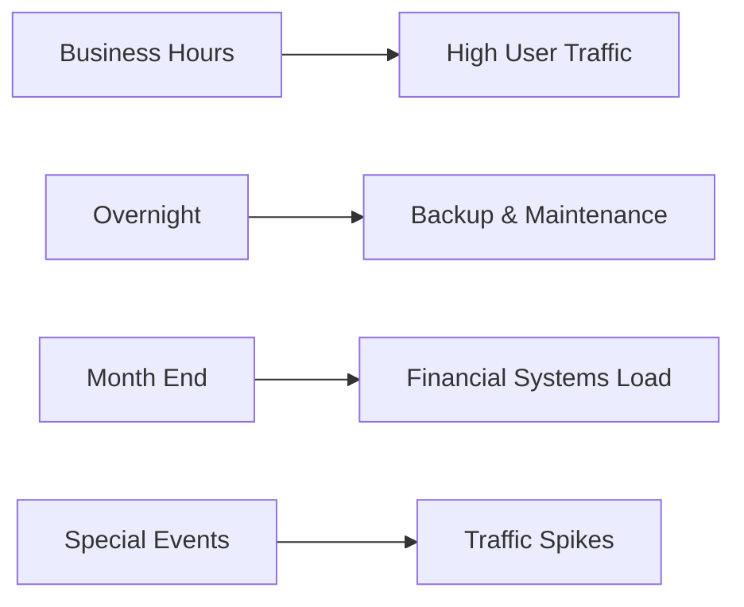
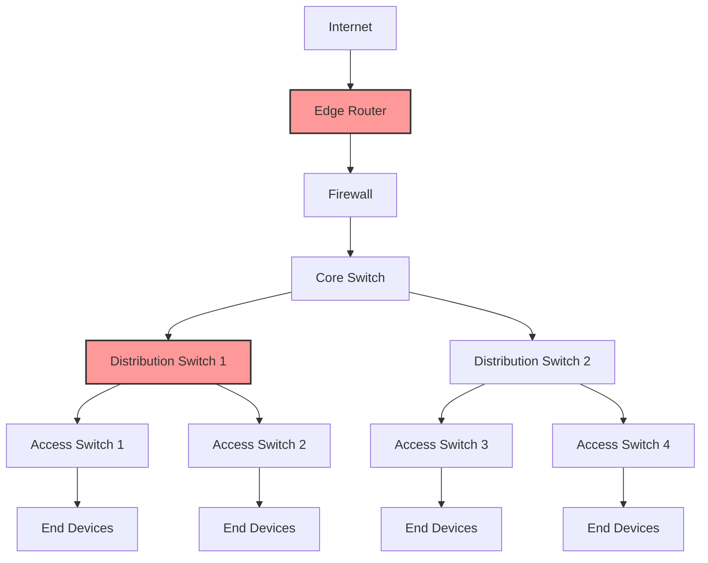

# Networks Capacity Planning

## Introduction

Network capacity planning is a critical process in network design that ensures your infrastructure can handle current and future demands without performance degradation. For beginners entering the world of networking, understanding how to properly plan network capacity is essential for creating robust, scalable, and efficient systems.

In this guide, we'll explore the fundamental concepts of network capacity planning, including how to assess current needs, forecast future requirements, and implement strategies to optimize your network resources.

## What is Network Capacity Planning?

Network capacity planning is the process of determining the network resources required to meet current and future demands. It involves:

- Analyzing current network utilization and performance
- Forecasting future growth and requirements
- Identifying potential bottlenecks and constraints
- Planning for network expansion and upgrades

Proper capacity planning helps prevent network congestion, service disruptions, and the need for expensive emergency upgrades.

## Key Network Capacity Metrics

Before diving into the planning process, let's understand the key metrics that determine network capacity:

### Bandwidth

Bandwidth represents the maximum data transfer rate of a network connection, typically measured in bits per second (bps), with common units being:

- Kilobits per second (Kbps)
- Megabits per second (Mbps)
- Gigabits per second (Gbps)

For example, a standard Ethernet connection might offer 1 Gbps bandwidth, while a fiber optic connection might provide 10 Gbps or more.

### Throughput

While bandwidth represents theoretical capacity, throughput measures the actual data transfer rate achieved in practice. It's always less than or equal to the available bandwidth due to overhead, protocol inefficiencies, and other factors.

### Latency

Latency is the time it takes for data to travel from source to destination, usually measured in milliseconds (ms). Lower latency means faster response times, which is crucial for real-time applications.

### Packet Loss

This metric represents the percentage of data packets that fail to reach their destination. Excessive packet loss (typically above 1-2%) indicates network congestion or hardware issues.

### Utilization

Network utilization refers to the percentage of total capacity being used at a given time. Industry best practices suggest keeping utilization below 70-80% during peak periods to allow for unexpected traffic spikes.

## The Capacity Planning Process

Let's break down the network capacity planning process into manageable steps:

### 1. Assess Current Network Utilization

Begin by gathering data about your current network usage. This involves:

```javascript
// Example code for a simple network monitor that logs utilization
function monitorNetworkUtilization(interface) {
  const startTime = Date.now();
  const startBytes = getInterfaceBytes(interface);
  
  setTimeout(() => {
    const endTime = Date.now();
    const endBytes = getInterfaceBytes(interface);
    const duration = (endTime - startTime) / 1000; // in seconds
    
    const bytesSent = endBytes.sent - startBytes.sent;
    const bytesReceived = endBytes.received - startBytes.received;
    
    const utilizationSent = (bytesSent * 8) / (duration * interfaceBandwidth);
    const utilizationReceived = (bytesReceived * 8) / (duration * interfaceBandwidth);
    
    console.log(`Network utilization for ${interface}:`);
    console.log(`Upload: ${(utilizationSent * 100).toFixed(2)}%`);
    console.log(`Download: ${(utilizationReceived * 100).toFixed(2)}%`);
  }, 60000); // Monitor for 1 minute
}

// Example output:
// Network utilization for eth0:
// Upload: 45.23%
// Download: 62.78%
```

Tools for network monitoring include:

- SNMP (Simple Network Management Protocol) based tools
- NetFlow or sFlow for traffic analysis
- Specialized monitoring tools like Wireshark, Nagios, or Zabbix

### 2. Identify Traffic Patterns

Understanding traffic patterns helps predict network behavior and plan accordingly:



Document regular patterns such as:

- Daily peaks during business hours
- Weekly backup schedules
- Monthly reporting periods
- Seasonal variations

### 3. Forecast Future Requirements

Projecting future network needs requires considering:

- Business growth plans
- New applications and services
- Technology trends
- User behavior changes

A simple growth calculation might look like:

```javascript
function forecastBandwidth(currentBandwidth, growthRate, years) {
  return currentBandwidth * Math.pow((1 + growthRate), years);
}

// Example:
// Current bandwidth: 100 Mbps
// Annual growth rate: 25% (0.25)
// Forecast period: 3 years
const forecast = forecastBandwidth(100, 0.25, 3);
console.log(`Estimated bandwidth needed in 3 years: ${forecast.toFixed(2)} Mbps`);
// Output: Estimated bandwidth needed in 3 years: 195.31 Mbps
```

### 4. Identify Bottlenecks

Common network bottlenecks include:

- Underprovisioned links between network segments
- Overloaded switches or routers
- Outdated network interface cards
- Poorly configured Quality of Service (QoS) settings

Use network mapping tools to visualize your infrastructure:



### 5. Design Capacity Solutions

Based on your analysis, develop solutions such as:

- Increasing bandwidth on critical links
- Implementing load balancing
- Upgrading network hardware
- Segmenting the network to isolate traffic
- Implementing QoS policies to prioritize important traffic

## Practical Example: Capacity Planning for a Small Business Network

Let's walk through a practical capacity planning exercise for a small business:

**Scenario**: A software development company with 50 employees is planning to expand to 100 employees over the next two years.

**Current network setup**:
- 100 Mbps internet connection
- Current peak utilization: 60 Mbps
- Average per-user bandwidth: 1.2 Mbps during peak hours

**Step 1**: Calculate future bandwidth requirements

```javascript
// Current employees: 50
// Future employees: 100
// Current peak bandwidth per user: 1.2 Mbps

const futureBandwidth = 100 * 1.2; // Future employees * bandwidth per user
console.log(`Estimated future bandwidth requirement: ${futureBandwidth} Mbps`);
// Output: Estimated future bandwidth requirement: 120 Mbps
```

**Step 2**: Account for additional factors

- New applications (cloud-based development tools): +20 Mbps
- Video conferencing increase: +15 Mbps
- Buffer for unexpected traffic (25%): +38.75 Mbps

```javascript
const totalRequirement = futureBandwidth + 20 + 15;
const withBuffer = totalRequirement * 1.25;
console.log(`Total future bandwidth with buffer: ${withBuffer.toFixed(2)} Mbps`);
// Output: Total future bandwidth with buffer: 193.75 Mbps
```

**Step 3**: Plan the upgrade path

Based on the calculation, the company should:
1. Upgrade from 100 Mbps to at least 200 Mbps internet connection
2. Ensure internal network infrastructure (switches, routers) can handle the increased traffic
3. Implement QoS to prioritize critical applications during peak hours
4. Schedule another review in 12 months to assess actual growth versus projections

## Best Practices for Network Capacity Planning

To ensure effective capacity planning, follow these best practices:

### 1. Regular Monitoring and Auditing

Implement continuous monitoring to track network performance in real-time:

```javascript
// Pseudocode for a scheduled monitoring system
function scheduleNetworkAudit() {
  const schedule = {
    daily: ['utilization', 'errors', 'interface status'],
    weekly: ['application performance', 'bandwidth usage trends'],
    monthly: ['capacity planning review', 'growth forecast update']
  };
  
  // Implementation details for each audit type
  // ...
  
  return schedule;
}
```

### 2. Document Everything

Maintain detailed documentation of:
- Network topology
- Baseline performance metrics
- Upgrade history
- Capacity planning decisions

### 3. Plan for the N+1 Principle

Always design with redundancy in mind, ensuring that if one component fails, sufficient capacity remains to handle the load.

### 4. Consider Cost-Benefit Analysis

Balance capacity needs against budget constraints:

```javascript
function calculateROI(currentCost, upgradeCost, productivityImpact) {
  const annualSavings = productivityImpact * employeeCount * hourlyRate * workingHours;
  const roi = (annualSavings - upgradeCost) / upgradeCost * 100;
  
  return {
    roi: roi.toFixed(2) + '%',
    breakEvenMonths: (upgradeCost / (annualSavings / 12)).toFixed(1)
  };
}
```

### 5. Consider Traffic Shaping and QoS

Implement traffic management policies to prioritize critical applications:

```javascript
// Example QoS configuration (pseudocode)
const qosPolicy = {
  highPriority: {
    applications: ['voip', 'video-conferencing', 'erp-system'],
    bandwidthAllocation: '40%',
    maxLatency: '30ms'
  },
  mediumPriority: {
    applications: ['email', 'web-browsing', 'file-sharing'],
    bandwidthAllocation: '30%',
    maxLatency: '100ms'
  },
  lowPriority: {
    applications: ['updates', 'backups', 'downloads'],
    bandwidthAllocation: '30%',
    maxLatency: 'best-effort'
  }
};
```

## Tools for Network Capacity Planning

Several tools can assist with capacity planning:

1. **Network Monitoring Systems**
   - Nagios, Zabbix, PRTG, SolarWinds

2. **Traffic Analysis Tools**
   - Wireshark, NetFlow Analyzers, sFlow collectors

3. **Simulation and Modeling Tools**
   - GNS3, Cisco Network Planner, OPNET

4. **Capacity Planning Calculators**
   - Spreadsheet templates, vendor-provided calculators

## Summary

Network capacity planning is a critical process that ensures your network infrastructure can support your organization's needs both now and in the future. By understanding key metrics, following a structured planning process, and implementing best practices, you can develop a network that performs well under current conditions and scales effectively as demands increase.

The capacity planning process isn't a one-time activity but rather an ongoing cycle of monitoring, analyzing, forecasting, and optimizing. Regular reviews and adjustments ensure your network continues to meet evolving requirements while providing a good return on investment.

## Exercises

1. Calculate the bandwidth requirements for a company with 200 employees, assuming average peak usage of 0.8 Mbps per employee plus 50 Mbps for shared services.

2. Create a simple network monitoring script that logs bandwidth utilization to a file every 15 minutes.

3. Design a capacity plan for transitioning a traditional office network to support a hybrid work model where 50% of employees work remotely.

4. Research and compare three network monitoring tools, focusing on their capacity planning features.

5. Create a QoS policy that prioritizes different types of network traffic for a multi-purpose network serving both voice and data applications.

## Additional Resources

- **Books**:
  - "Network Design and Architecture: A Comprehensive Guide"
  - "Capacity Planning for Web Services: Metrics, Models, and Methods"

- **Online Courses**:
  - Cisco Networking Academy
  - CompTIA Network+ certification materials

- **Communities**:
  - Network Engineering Stack Exchange
  - r/networking subreddit

- **Standards and Guidelines**:
  - TIA-942 Telecommunications Infrastructure Standard for Data Centers
  - ITIL Capacity Management frameworks