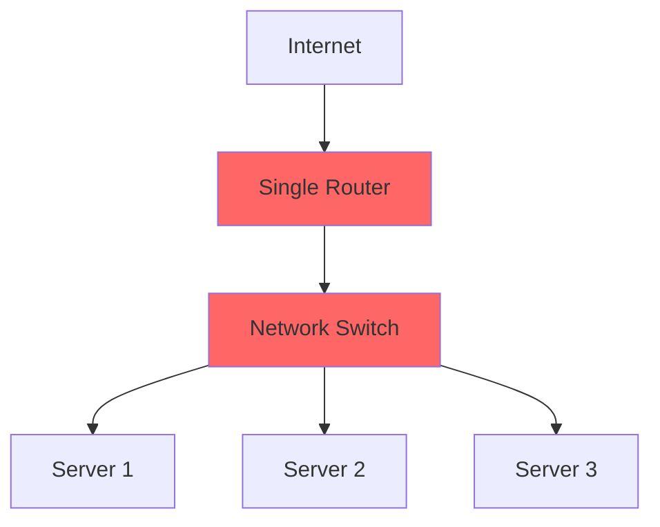
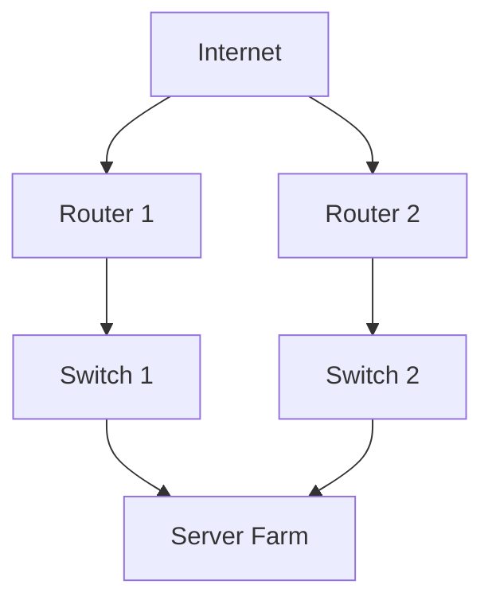
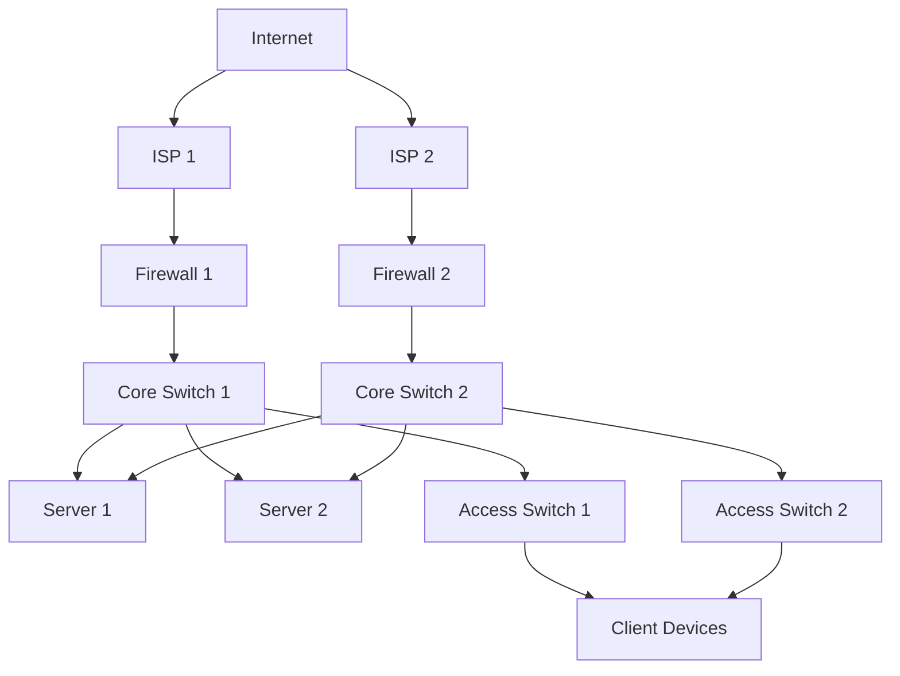
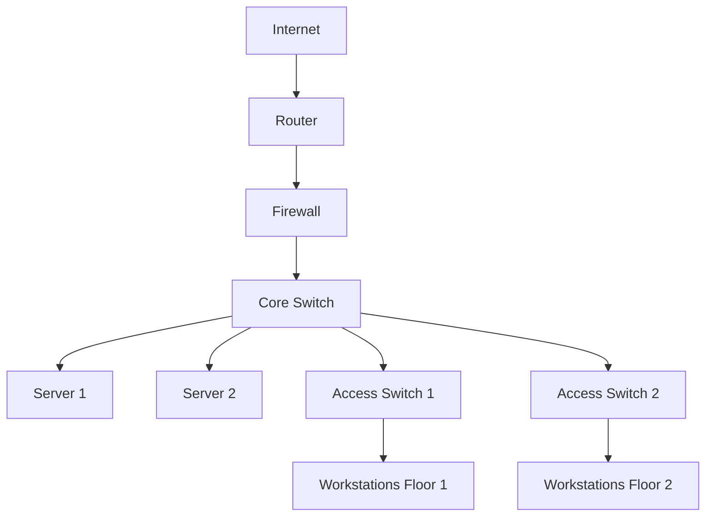

# Networks Redundancy

## Introduction

Network redundancy is a critical concept in network design that ensures reliability, availability, and fault tolerance. In simple terms, redundancy means having backup components or paths that can take over when primary components fail. Think of it as having multiple routes to reach a destination—if one road is blocked, you can take another to arrive at the same place.

For beginners entering the world of network design, understanding redundancy is essential as it forms the foundation for building robust systems that can withstand failures and maintain connectivity when things go wrong.

## Why Network Redundancy Matters

In today's interconnected world, network downtime can lead to:

- Loss of critical services
- Financial losses
- Damage to reputation
- Reduced productivity
- Loss of customer trust

A well-designed redundant network can reduce these risks by eliminating single points of failure and providing alternate paths when primary components fail.

## Key Redundancy Concepts

### Single Point of Failure (SPOF)

A single point of failure is any component that, if it fails, causes the entire system to fail. Identifying and eliminating SPOFs is a primary goal of network redundancy.



In the diagram above, both the router and the switch are SPOFs. If either fails, all servers lose connectivity.

### Redundancy vs. High Availability

While related, these terms have distinct meanings:

- **Redundancy**: Having duplicate components or paths that can be used if primary ones fail.
- **High Availability**: A system design approach that minimizes downtime by ensuring continuous operation, often leveraging redundancy as a key strategy.

### N+1 Redundancy

N+1 redundancy means having one more component than the minimum required (N) to function. For example, if you need two power supplies to run a system, N+1 redundancy would mean having three power supplies.

### N+N Redundancy

N+N redundancy means having double the components needed. Using the same example, if you need two power supplies, N+N redundancy would mean having four power supplies.

## Types of Network Redundancy

### Device Redundancy

This involves having backup hardware devices ready to take over when primary devices fail.

#### Redundant Routers and Switches



### Path Redundancy

Path redundancy ensures multiple network routes exist between devices.

#### Implementing Path Redundancy with Spanning Tree Protocol (STP)

The Spanning Tree Protocol prevents network loops while maintaining redundant paths:

```
// Basic STP configuration on a Cisco switch
switch# configure terminal
switch(config)# spanning-tree mode pvst
switch(config)# spanning-tree vlan 1-100 priority 24576
switch(config)# exit
```

This configures the switch to use Per-VLAN Spanning Tree (PVST) and sets a priority for VLANs 1-100.

### Link Aggregation

Link aggregation combines multiple network connections to increase throughput and provide redundancy.

#### Example: Configuring Link Aggregation with LACP

```
// Configure EtherChannel with LACP on Cisco switches
switch# configure terminal
switch(config)# interface range gigabitethernet 0/1-2
switch(config-if-range)# channel-protocol lacp
switch(config-if-range)# channel-group 1 mode active
switch(config-if-range)# exit
switch(config)# interface port-channel 1
switch(config-if)# switchport mode trunk
switch(config-if)# exit
```

This creates a link aggregation group (LAG) using ports GigabitEthernet 0/1 and 0/2 with LACP protocol.

### Power Redundancy

Power redundancy ensures systems continue to operate during power failures.

#### Components of Power Redundancy:

- Redundant Power Supplies (RPS)
- Uninterruptible Power Supplies (UPS)
- Generators
- Diverse power grids

### Data Redundancy

Data redundancy ensures that information remains available even when storage systems fail.

#### RAID (Redundant Array of Independent Disks)

RAID configurations provide data redundancy and improved performance:

- RAID 1: Mirroring
- RAID 5: Striping with parity
- RAID 10: Combination of mirroring and striping

## Redundancy Protocols and Technologies

### First Hop Redundancy Protocols (FHRPs)

FHRPs provide gateway redundancy by allowing multiple routers to present themselves as a single virtual router.

#### HSRP (Hot Standby Router Protocol)

```
// HSRP Configuration Example
router1# configure terminal
router1(config)# interface gigabitethernet 0/1
router1(config-if)# ip address 192.168.1.2 255.255.255.0
router1(config-if)# standby 1 ip 192.168.1.1
router1(config-if)# standby 1 priority 110
router1(config-if)# standby 1 preempt
router1(config-if)# exit

router2# configure terminal
router2(config)# interface gigabitethernet 0/1
router2(config-if)# ip address 192.168.1.3 255.255.255.0
router2(config-if)# standby 1 ip 192.168.1.1
router2(config-if)# standby 1 priority 100
router2(config-if)# exit
```

This configures two routers to share a virtual IP address (192.168.1.1), with router1 as the primary due to its higher priority.

#### VRRP (Virtual Router Redundancy Protocol)

VRRP is an open standard alternative to HSRP that works similarly.

#### GLBP (Gateway Load Balancing Protocol)

GLBP provides both redundancy and load balancing across multiple routers.

### Redundant Connections: BGP Multihoming

For internet connectivity redundancy, organizations can connect to multiple ISPs (Internet Service Providers) using BGP (Border Gateway Protocol).

```
// Basic BGP Multihoming Configuration
router# configure terminal
router(config)# router bgp 65000
router(config-router)# neighbor 203.0.113.1 remote-as 64500
router(config-router)# neighbor 198.51.100.1 remote-as 64600
router(config-router)# network 192.168.0.0 mask 255.255.0.0
router(config-router)# exit
```

This configures BGP to establish connections with two different ISPs (AS 64500 and AS 64600).

## Designing Redundant Networks: A Practical Approach

### Step 1: Identify Critical Network Components

Start by mapping your network and identifying potential single points of failure:

- Core routers and switches
- Distribution layer devices
- Access layer switches
- WAN connections
- Power systems
- Cooling systems
- DNS servers
- Authentication servers

### Step 2: Determine Acceptable Downtime

Different organizations have different requirements:

- **High availability (99.99%)**: 52.56 minutes of downtime per year
- **Five nines (99.999%)**: 5.26 minutes of downtime per year
- **Six nines (99.9999%)**: 31.5 seconds of downtime per year

### Step 3: Implement Appropriate Redundancy Solutions

#### Example: Small Business Redundancy Design



### Step 4: Test Redundancy Mechanisms

Regular testing is crucial to ensure redundancy works when needed:

- Scheduled maintenance windows
- Controlled failures
- Failover testing
- Disaster recovery drills

## Real-World Example: Building a Redundant Network

Let's design a redundant network for a medium-sized company with two office locations:

### Requirements:
- No single point of failure
- 99.99% uptime (less than 1 hour of downtime per year)
- Budget constraints (cannot implement full redundancy everywhere)

### Solution Components:

1. **Dual Internet Connections**:
   - Primary fiber connection (1 Gbps)
   - Secondary cable connection (500 Mbps)
   - BGP multihoming for automatic failover

2. **Firewall Redundancy**:
   - High-availability firewall pair with automatic failover
   - Active-passive configuration

3. **Core Layer Redundancy**:
   - Dual core switches with redundant power supplies
   - Multiple connections between core switches using LACP

4. **Server Redundancy**:
   - Critical servers deployed in pairs
   - Load balancer to distribute traffic
   - Redundant storage systems using RAID

5. **Power Redundancy**:
   - UPS for each equipment rack
   - Generator backup for server room

### Implementation Code Example (Simplified):

```
// Firewall HA Configuration (pfsense example)
// Primary Firewall
System > High Avail. Sync
Enable: Checked
Synchronize states: Checked
Synchronize interface: WAN2
pfsync Synchronize Peer IP: 10.0.0.2

// Secondary Firewall
System > High Avail. Sync
Enable: Checked
Synchronize states: Checked
Synchronize interface: WAN2
pfsync Synchronize Peer IP: 10.0.0.1

// Core Switch STP Configuration
switch# configure terminal
switch(config)# spanning-tree mode rapid-pvst
switch(config)# spanning-tree vlan 1-100 priority 4096
switch(config)# exit

// Link Aggregation Between Switches
switch1# configure terminal
switch1(config)# interface range gigabitethernet 1/0/1-4
switch1(config-if-range)# channel-group 1 mode active
switch1(config-if-range)# exit

switch2# configure terminal
switch2(config)# interface range gigabitethernet 1/0/1-4
switch2(config-if-range)# channel-group 1 mode active
switch2(config-if-range)# exit
```

## Best Practices for Network Redundancy

1. **Document your redundancy design**
   - Create network diagrams
   - Document configuration settings
   - Maintain up-to-date inventory

2. **Regularly test failover mechanisms**
   - Schedule periodic tests
   - Simulate failures
   - Document recovery times

3. **Monitor redundant systems**
   - Implement network monitoring
   - Set up alerts for failures
   - Track performance metrics

4. **Consider cost vs. benefit**
   - Prioritize critical systems
   - Analyze the cost of downtime
   - Implement appropriate redundancy levels

5. **Train staff on redundancy procedures**
   - Document failover procedures
   - Practice emergency scenarios
   - Ensure team understands redundancy designs

## Common Redundancy Challenges and Solutions

### Challenge 1: Budget Constraints
**Solution**: Implement redundancy based on priority. Critical systems get full redundancy, while less critical systems may have partial redundancy.

### Challenge 2: Complexity
**Solution**: Start with simpler redundancy solutions and gradually increase complexity as your team's expertise grows.

### Challenge 3: Maintenance
**Solution**: Develop maintenance procedures that allow for updates without disrupting service.

## Summary

Network redundancy is a fundamental aspect of reliable network design that eliminates single points of failure and ensures continuous operation when components fail. By implementing device, path, power, and data redundancy, organizations can significantly reduce downtime and maintain critical services.

Remember these key takeaways:
- Identify and eliminate single points of failure
- Implement appropriate redundancy based on your availability requirements
- Regularly test redundancy mechanisms
- Document your redundant network design
- Monitor all redundant systems

## Exercises

1. Identify potential single points of failure in the network diagram below:



2. Design a redundant network for a small business with:
   - Two internet connections
   - Redundant firewalls
   - High availability for critical servers

3. Create a redundancy implementation plan for a company upgrading from a non-redundant network.

4. Research and compare the features of HSRP, VRRP, and GLBP.

## Additional Resources

- [Cisco Documentation on High Availability Network Design](https://www.cisco.com/c/en/us/td/docs/solutions/Enterprise/Campus/HA_campus_DG/hacampusdg.html)
- [RFC 5798: Virtual Router Redundancy Protocol (VRRP) Version 3](https://tools.ietf.org/html/rfc5798)
- [IEEE 802.1D: Spanning Tree Protocol](https://1.ieee802.org/security/802-1d/)
- [IEEE 802.1AX: Link Aggregation](https://1.ieee802.org/tsn/802-1ax-2020/)

Remember that redundancy is not just about hardware—it's a comprehensive approach that includes planning, implementation, testing, and continuous improvement.