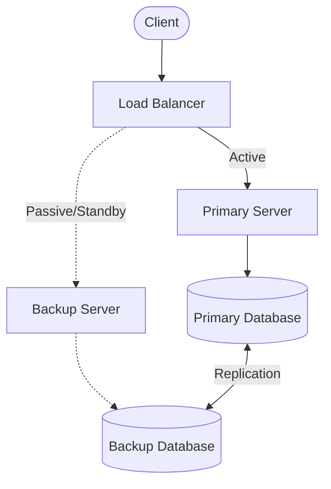
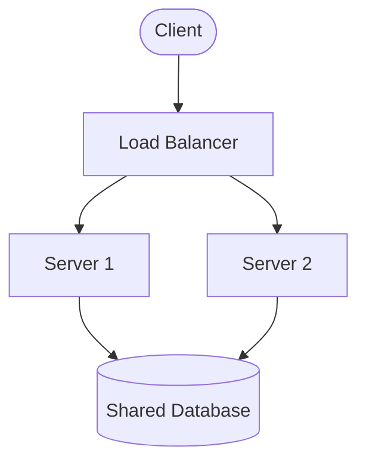
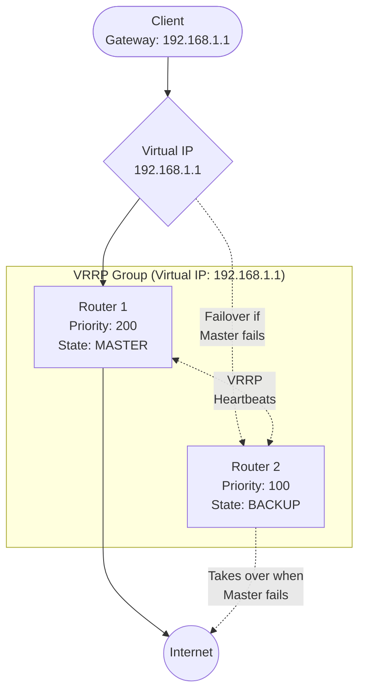
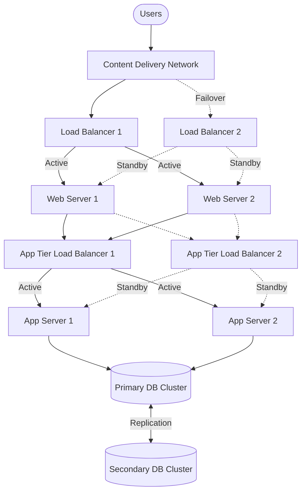
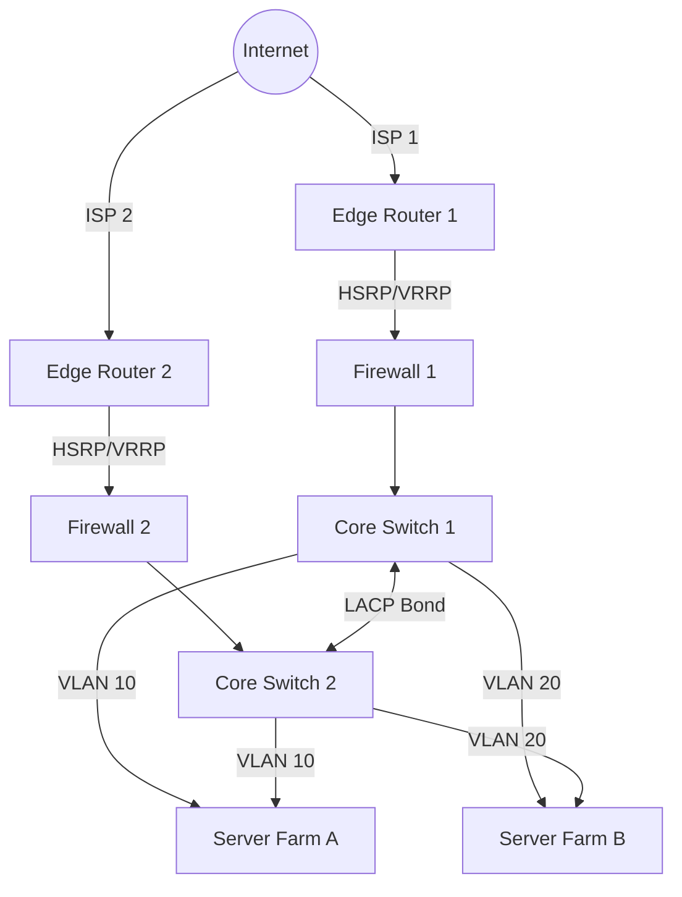
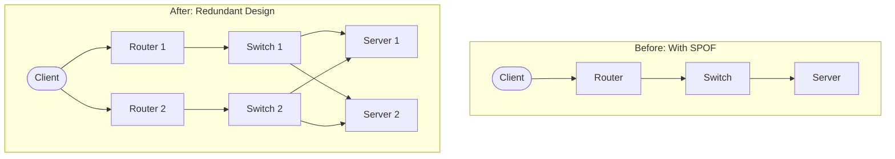
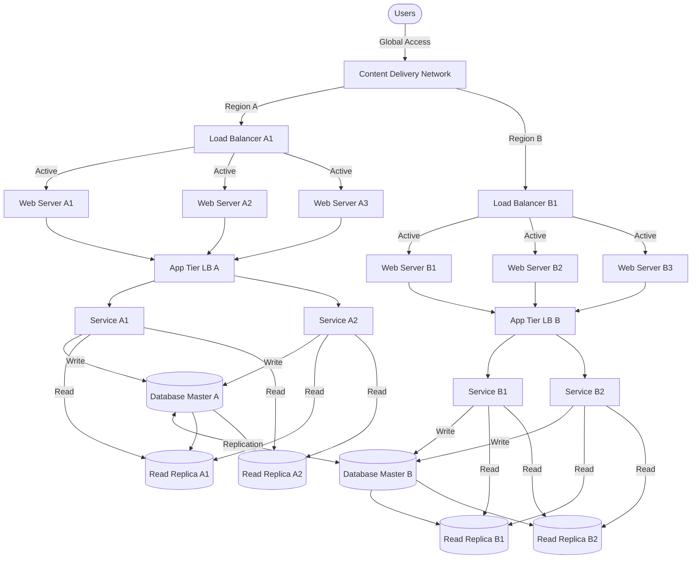

# Networks High Availability

## Introduction

High Availability (HA) is a critical concept in network design that ensures network services remain operational and accessible even when components fail. In today's digital landscape where downtime can lead to significant financial losses and damaged reputation, implementing high availability has become essential for organizations of all sizes.

High availability network architecture aims to eliminate single points of failure, provide reliable failover mechanisms, and ensure seamless service continuity. This is achieved through redundancy at various levels, automated failover systems, and proper monitoring and maintenance protocols.

In this guide, we'll explore the fundamentals of high availability networking, key implementation strategies, and practical examples to help you understand how to design resilient network infrastructures.

## Understanding Network Availability

### What is Network Availability?

Network availability is typically measured as a percentage of uptime in a given time period. It's often expressed in terms of "nines":

| Availability % | Downtime per year | Common term |
|----------------|-------------------|-------------|
| 99% | 3.65 days | "Two nines" |
| 99.9% | 8.76 hours | "Three nines" |
| 99.99% | 52.56 minutes | "Four nines" |
| 99.999% | 5.26 minutes | "Five nines" |
| 99.9999% | 31.5 seconds | "Six nines" |

Five nines (99.999%) availability is often considered the gold standard for critical systems, allowing for just over 5 minutes of downtime per year.

### The Cost of Downtime

Before diving into high availability strategies, it's important to understand why it matters. Let's calculate the cost of downtime for a small e-commerce business:

```js
// Simple downtime cost calculation
const hourlyRevenue = 5000; // $5,000 per hour
const hourlyEmployeeCost = 1000; // $1,000 per hour
const reputationCost = 2000; // $2,000 per hour (estimated impact)

const totalCostPerHour = hourlyRevenue + hourlyEmployeeCost + reputationCost;
const downtimeHours = 4; // Example: 4-hour outage

const totalDowntimeCost = totalCostPerHour * downtimeHours;

console.log(`Total cost of ${downtimeHours}-hour downtime: $${totalDowntimeCost}`);
// Output: Total cost of 4-hour downtime: $32000
```

As you can see, even a few hours of downtime can have significant financial implications.

## Key Components of High Availability Networks

### 1. Redundancy

Redundancy involves duplicating critical components or functions of a system to increase reliability. There are several levels of redundancy in network design:

#### Hardware Redundancy

- **Redundant Network Devices**: Deploy multiple switches, routers, and firewalls.
- **Redundant Power Supplies**: Ensure devices have multiple power supplies connected to different power sources.
- **Redundant Network Interfaces**: Configure multiple network interfaces on critical servers and devices.

#### Path Redundancy

- **Multiple Network Paths**: Design networks with multiple paths between critical points.
- **Diverse Routing**: Use physically diverse paths to protect against localized failures.

#### Data Redundancy

- **Data Replication**: Maintain copies of critical data across multiple locations.
- **Backup Systems**: Implement regular backups with fast recovery capabilities.

### 2. Failover Systems

Failover refers to the ability to automatically switch to redundant components when a failure occurs.

#### Active-Passive Configuration

In an active-passive setup, one system is actively handling requests while the backup system remains on standby:



#### Active-Active Configuration

In an active-active setup, multiple systems operate simultaneously, sharing the load:



### 3. Load Balancing

Load balancers distribute network traffic across multiple servers to ensure optimal resource utilization and prevent any single server from becoming overwhelmed.

#### Common Load Balancing Methods

- **Round Robin**: Distributes requests sequentially to each server in a pool.
- **Least Connections**: Directs traffic to the server with the fewest active connections.
- **IP Hash**: Uses the client's IP address to determine which server to direct the request to, ensuring session persistence.
- **Weighted Distribution**: Assigns different capacities to servers based on their capabilities.

Here's a simple Node.js example of a basic round-robin load balancer:

```js
const http = require('http');

// List of backend servers
const servers = [
  { host: '192.168.1.10', port: 8080 },
  { host: '192.168.1.11', port: 8080 },
  { host: '192.168.1.12', port: 8080 }
];

let currentServer = 0;

// Create a load balancer server
const loadBalancer = http.createServer((req, res) => {
  // Get next server using round-robin
  const server = servers[currentServer];
  
  // Update the counter for next request
  currentServer = (currentServer + 1) % servers.length;
  
  console.log(`Forwarding request to: ${server.host}:${server.port}`);
  
  // Options for the proxy request
  const options = {
    hostname: server.host,
    port: server.port,
    path: req.url,
    method: req.method,
    headers: req.headers
  };
  
  // Create proxy request
  const proxyReq = http.request(options, (proxyRes) => {
    res.writeHead(proxyRes.statusCode, proxyRes.headers);
    proxyRes.pipe(res, { end: true });
  });
  
  // Forward the request body to the proxy
  req.pipe(proxyReq, { end: true });
  
  // Handle errors
  proxyReq.on('error', (err) => {
    console.error(`Proxy request error: ${err.message}`);
    res.writeHead(502);
    res.end('Bad Gateway');
  });
});

// Start the load balancer
const PORT = 80;
loadBalancer.listen(PORT, () => {
  console.log(`Load balancer running on port ${PORT}`);
});
```

### 4. High Availability Protocols

Several protocols are designed specifically to support high availability:

#### VRRP (Virtual Router Redundancy Protocol)

VRRP allows multiple routers to share a virtual IP address. If the master router fails, a backup router takes over without disrupting the network:



#### HSRP (Hot Standby Router Protocol)

HSRP is Cisco's proprietary protocol that provides automatic router backup.

#### CARP (Common Address Redundancy Protocol)

CARP is an open-source alternative to VRRP and HSRP.

## Implementing High Availability: Practical Designs

### Example 1: High Availability Web Application Architecture

Let's design a high availability setup for a web application:



Key components in this architecture:

1. **Multiple Load Balancers**: Provides redundancy at the entry point
2. **Multiple Web Servers**: Ensures the application remains available if one server fails
3. **Application Tier Redundancy**: Separates business logic processing with its own redundancy
4. **Database Clustering**: Provides data redundancy and failover capabilities

### Example 2: High Availability Network Edge

This example shows redundancy at the network edge:



This design features:
- Dual ISP connections
- Redundant edge routers with failover protocols
- Redundant firewalls
- Redundant core switches
- Multiple paths to server farms

## Monitoring and Maintaining High Availability Systems

High availability isn't just about design—it requires ongoing monitoring and maintenance:

### Monitoring Tools

Implement comprehensive monitoring to detect issues before they cause outages:

```js
// Example of a simple Node.js health check script
const http = require('http');
const nodemailer = require('nodemailer');

// Configuration
const services = [
  { name: 'Web Server 1', url: 'http://webserver1.example.com/health' },
  { name: 'Web Server 2', url: 'http://webserver2.example.com/health' },
  { name: 'API Gateway', url: 'http://api.example.com/health' },
  { name: 'Database', url: 'http://dbproxy.example.com/health' }
];

// Email configuration
const emailConfig = {
  from: 'monitoring@example.com',
  to: 'sysadmin@example.com',
  subject: 'Service Health Alert'
};

const transporter = nodemailer.createTransport({
  host: 'smtp.example.com',
  port: 587,
  secure: false,
  auth: {
    user: 'monitoring@example.com',
    pass: 'password123'
  }
});

// Check health of all services
function checkServices() {
  services.forEach(service => {
    http.get(service.url, (res) => {
      const { statusCode } = res;
      
      if (statusCode !== 200) {
        // Service is not healthy
        sendAlert(service.name, statusCode);
      } else {
        console.log(`${service.name} is healthy`);
      }
    }).on('error', (e) => {
      // Service is unreachable
      sendAlert(service.name, 'Unreachable');
    });
  });
}

// Send alert email
function sendAlert(serviceName, status) {
  const emailBody = `
    Alert: ${serviceName} is not responding properly
    Status: ${status}
    Time: ${new Date().toISOString()}
    
    Please investigate immediately.
  `;
  
  const mailOptions = {
    ...emailConfig,
    subject: `ALERT: ${serviceName} is DOWN`,
    text: emailBody
  };
  
  transporter.sendMail(mailOptions, (error, info) => {
    if (error) {
      console.error('Error sending email:', error);
    } else {
      console.log('Alert email sent:', info.response);
    }
  });
}

// Run health checks every 5 minutes
setInterval(checkServices, 5 * 60 * 1000);
console.log('Health monitoring started');
```

### Maintenance Best Practices

1. **Regular Testing**:
   - Conduct failover tests regularly
   - Test backup systems and restoration procedures
   - Perform disaster recovery drills

2. **Change Management**:
   - Implement changes during maintenance windows
   - Use rolling updates to avoid complete service disruption
   - Have rollback plans for all changes

3. **Documentation**:
   - Maintain up-to-date network diagrams
   - Document failover procedures
   - Keep configuration backups

## High Availability Design Considerations

### 1. Requirements Analysis

Start by understanding your availability requirements:

- What is the acceptable downtime?
- Which services are mission-critical?
- What is the budget for redundancy?

### 2. Single Points of Failure (SPOF)

Identify and eliminate single points of failure:



### 3. Fault Isolation

Design your network to contain failures within specific segments:

- Use VLANs and subnets to isolate traffic
- Implement network segmentation
- Use separate domains for critical services

### 4. Scalability

Ensure your high availability design can scale with growing demands:

- Use modular designs that allow for expansion
- Implement auto-scaling where appropriate
- Consider cloud resources for overflow capacity

## Real-World Case Study: E-Commerce Platform

Let's examine a high availability implementation for an e-commerce platform:

### Requirements

- 99.99% uptime (less than 1 hour downtime per year)
- Peak traffic handling during sales events
- Protection against regional outages
- Seamless user experience during maintenance

### Solution Architecture



### Implementation Details

1. **Multi-Region Deployment**:
   - Two geographically separate regions
   - Active-active configuration across regions
   - Global DNS load balancing

2. **Auto-Scaling Groups**:
   - Web and application tiers can scale based on demand
   - Minimum 3 instances per service for redundancy

3. **Database Strategy**:
   - Master-master replication between regions
   - Read replicas for scaling read operations
   - Automated failover for master databases

4. **Deployment Process**:
   - Blue-green deployment for zero-downtime updates
   - Canary releases for testing changes with limited impact

5. **Disaster Recovery**:
   - Regular backups to separate storage system
   - Cross-region replication of critical data
   - Documented recovery procedures with regular drills

## Summary

High availability network design is essential for ensuring business continuity and maintaining service reliability. By implementing redundancy at multiple levels, utilizing failover mechanisms, and adopting proper monitoring and maintenance practices, organizations can significantly reduce downtime and provide consistent user experiences.

Key takeaways from this guide:

1. High availability is measured in "nines" of uptime percentage
2. Redundancy should exist at all levels: hardware, path, and data
3. Failover systems provide automated recovery from failures
4. Load balancing distributes traffic and prevents overloading
5. Proper monitoring and maintenance are essential for sustaining high availability
6. Eliminating single points of failure is critical for robust designs
7. High availability designs should be regularly tested and updated

## Exercises

1. **Network Audit**: Identify all potential single points of failure in your current network infrastructure.

2. **Failover Test Plan**: Create a test plan to verify the failover capabilities of a redundant system without impacting production services.

3. **Availability Calculation**: Calculate the maximum allowed downtime for different availability requirements (99.9%, 99.99%, 99.999%) and assess which level is appropriate for different services in your organization.

4. **HA Architecture Design**: Design a high availability architecture for a small web application with a database backend, detailing all components and connections.

5. **Monitoring Implementation**: Implement a basic monitoring system using open-source tools to track the health of network devices and services.

## Additional Resources

- Books:
  - "High Availability Network Fundamentals" by Chris Oggerino
  - "Network Warrior" by Gary A. Donahue
  - "The Art of High Availability Design" by Chris Oggerino

- Online Resources:
  - RFC 5798: Virtual Router Redundancy Protocol (VRRP) Version 3
  - Cisco High Availability Documentation
  - AWS Well-Architected Framework: Reliability Pillar

- Communities:
  - Network Engineering Stack Exchange
  - r/networking on Reddit
  - NANOG (North American Network Operators' Group)