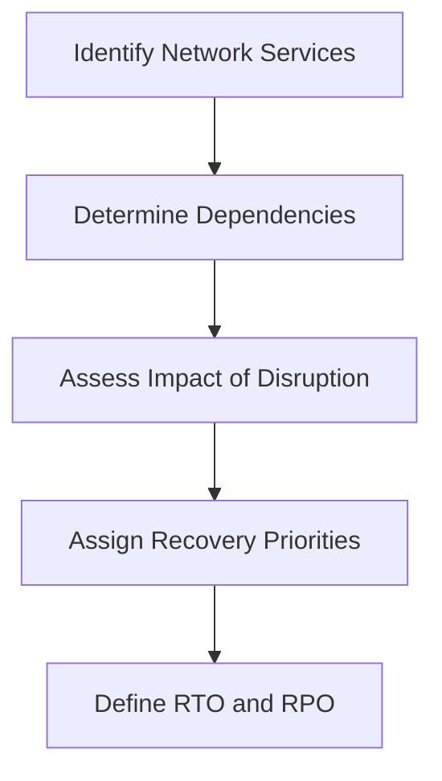
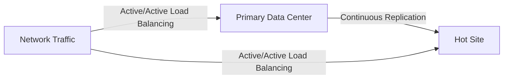
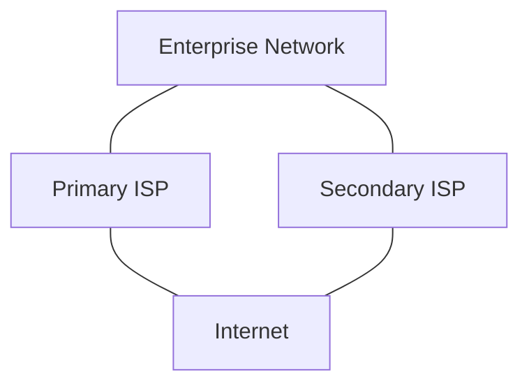

# Networks Disaster Recovery

## Introduction

Disaster recovery in the context of network design refers to the strategies, policies, procedures, and technologies that ensure critical network infrastructure can be restored after unexpected disruptions. These disruptions may range from natural disasters like floods or earthquakes to human-made situations such as cyberattacks or hardware failures.

For beginners in network design, understanding disaster recovery (DR) is essential as it represents the safety net that keeps organizations operational during crisis situations. This guide will walk you through the fundamental concepts of networks disaster recovery and provide practical examples of its implementation.

## Key Concepts in Networks Disaster Recovery

### 1. Recovery Time Objective (RTO)

**Definition**: The maximum acceptable time required to restore network services after a disaster.

RTO defines how quickly you need to recover your network to avoid unacceptable consequences. Different network services may have different RTOs based on their criticality.

```
Example RTO Calculation:
- Critical enterprise application access: 4 hours
- Email services: 8 hours
- Intranet portal: 24 hours
```

### 2. Recovery Point Objective (RPO)

**Definition**: The maximum acceptable amount of data loss measured in time.

RPO determines how frequently you need to back up your network configuration and data to limit potential data loss.

```
Example RPO Values:
- Financial transaction systems: 5 minutes (near-continuous backup)
- Customer database: 1 hour
- Development environment: 24 hours
```

### 3. Business Impact Analysis (BIA)

Before creating a disaster recovery plan, you must understand which network services are most critical to your organization's operations through a business impact analysis.



## Disaster Recovery Strategies

### 1. Backup and Restore

The most basic approach involves regularly backing up network configurations, routing tables, firewall rules, and other critical network components.

**Implementation Example**:
```bash
# Cisco IOS configuration backup
router# copy running-config tftp://10.1.1.1/router1-config.bak
```

**Restoration Process**:
```bash
# Restore configuration from backup
router# copy tftp://10.1.1.1/router1-config.bak running-config
```

### 2. Cold Site Recovery

A cold site is a backup facility with basic infrastructure (power, connectivity, etc.) where network equipment can be installed and configured after a disaster.

**Advantages**:
- Lower cost compared to hot sites
- Suitable for non-critical services with longer RTOs

**Disadvantages**:
- Longer recovery time (days to weeks)
- Requires manual equipment installation and configuration

### 3. Warm Site Recovery

A warm site is a partially equipped backup facility with some network infrastructure already in place.

**Key Components**:
- Core routers and switches pre-installed
- Network connectivity established
- Basic security systems configured

**Implementation Timeline**:
```
Hour 0: Disaster declared
Hour 1-2: Team arrives at warm site
Hour 2-6: Equipment configuration
Hour 6-12: Services validation and testing
Hour 12-24: Complete restoration
```

### 4. Hot Site Recovery

A hot site is a fully equipped duplicate of your primary network infrastructure that can take over operations almost immediately.

**Architecture Example**:


### 5. Cloud-Based Disaster Recovery

Modern disaster recovery often leverages cloud services to provide flexibility and cost-effectiveness.

**Implementation Example**:
```python
# Simple AWS disaster recovery using Python and Boto3
import boto3

def initiate_network_recovery():
    # Create VPC in recovery region
    ec2 = boto3.client('ec2', region_name='us-west-2')
    vpc = ec2.create_vpc(CidrBlock='10.0.0.0/16')
    
    # Create subnets
    subnet1 = ec2.create_subnet(
        VpcId=vpc['Vpc']['VpcId'],
        CidrBlock='10.0.1.0/24',
        AvailabilityZone='us-west-2a'
    )
    
    # Create internet gateway
    igw = ec2.create_internet_gateway()
    ec2.attach_internet_gateway(
        InternetGatewayId=igw['InternetGateway']['InternetGatewayId'],
        VpcId=vpc['Vpc']['VpcId']
    )
    
    print(f"Recovery VPC created: {vpc['Vpc']['VpcId']}")
    return vpc['Vpc']['VpcId']

# Output when run:
# Recovery VPC created: vpc-0abc123def456789
```

## Building a Disaster Recovery Plan

### 1. Risk Assessment

Identify potential threats to your network:

- Natural disasters (earthquakes, floods, fires)
- Hardware failures
- Power outages
- Cyberattacks
- Human errors

### 2. Creating Recovery Procedures

Document step-by-step procedures for different disaster scenarios:

```
Network Router Failure Recovery Procedure:
1. Identify failed router
2. Retrieve spare router from inventory
3. Load latest configuration backup (from Step 1.2)
4. Connect router to network following diagram D-14
5. Verify connectivity using checklist CL-112
6. Test critical service access using test suite TS-23
7. Notify stakeholders of recovery completion
```

### 3. Testing and Validation

Regular testing is crucial for effective disaster recovery:

**Types of Tests**:
- Tabletop exercises: Team discussions of disaster scenarios
- Walkthrough tests: Verifying recovery procedures without actual implementation
- Simulation tests: Testing recovery in an isolated environment
- Full interruption tests: Actual shutdown of primary systems to test recovery

**Testing Schedule**:
```
Q1: Tabletop exercise for ransomware attack
Q2: Walkthrough test for data center power failure
Q3: Simulation test for core router failure
Q4: Full interruption test (scheduled during maintenance window)
```

### 4. Documentation and Training

Maintain comprehensive documentation:
- Network topology diagrams
- Configuration templates
- Recovery procedures
- Contact information for key personnel
- Vendor support contracts

## Real-World Example: Financial Institution DR Implementation

Here's how a mid-sized financial institution might implement disaster recovery for their network:

1. **Primary Setup**:
   - Main data center with redundant routers, switches, and firewalls
   - MPLS network connecting branch locations
   
2. **Disaster Recovery Strategy**:
   - Hot site in a different geographic region
   - Real-time replication of network configurations
   - Automated failover for critical services
   
3. **Implementation Details**:
   ```
   RTO: 4 hours for all financial transaction systems
   RPO: 15 minutes for customer data
   
   Recovery procedure:
   1. Automatic monitoring detects main data center failure
   2. BGP routing automatically redirects traffic to DR site
   3. Load balancers at DR site distribute traffic to application servers
   4. Network Operations team validates service availability
   5. Notification sent to all stakeholders
   ```

4. **Results**:
   - During a major power outage, the financial institution maintained 99.8% service availability
   - Actual recovery time: 3.2 hours (within RTO)
   - Data loss: 7 minutes (within RPO)

## Network Redundancy Techniques

### 1. Redundant Hardware

Deploy duplicate network components to eliminate single points of failure:

```
Primary Router Configuration:
interface GigabitEthernet0/0
 ip address 192.168.1.1 255.255.255.0
 standby 1 ip 192.168.1.3
 standby 1 priority 110
 standby 1 preempt

Backup Router Configuration:
interface GigabitEthernet0/0
 ip address 192.168.1.2 255.255.255.0
 standby 1 ip 192.168.1.3
 standby 1 priority 100
 standby 1 preempt
```

### 2. Link Redundancy

Implement multiple network paths:



### 3. Geographic Redundancy

Distribute network infrastructure across multiple locations:

```
Site A (East Coast): 
- Primary data center
- Full production environment

Site B (Midwest):
- Hot standby
- Continuous replication from Site A

Site C (West Coast):
- Cold site
- Monthly configuration backups
```

## Disaster Recovery Budget Considerations

For beginners, it's important to understand that disaster recovery involves cost trade-offs:

| Recovery Strategy | Relative Cost | Recovery Time | Best For |
|-------------------|---------------|---------------|----------|
| Backup & Restore  | $             | Days          | Non-critical systems |
| Cold Site         | $$            | Days          | Budget-conscious organizations |
| Warm Site         | $$$           | Hours         | Medium-priority systems |
| Hot Site          | $$$$          | Minutes       | Mission-critical systems |
| Cloud-based DR    | $$ - $$$$     | Minutes-Hours | Flexible requirements |

## Summary

Network disaster recovery is an essential aspect of network design that ensures business continuity during unexpected disruptions. Key elements include:

1. Defining recovery objectives (RTO and RPO)
2. Implementing appropriate recovery strategies based on criticality
3. Creating detailed recovery procedures
4. Regular testing and validation
5. Comprehensive documentation and training

By properly implementing disaster recovery strategies, organizations can minimize downtime, reduce data loss, and maintain essential services even during major disruptions.

## Additional Resources and Exercises

### Resources
- NIST Special Publication 800-34: "Contingency Planning Guide for Federal Information Systems"
- ISO 22301: Business Continuity Management Systems
- Disaster Recovery Institute International (DRII) professional practices

### Exercises for Beginners

1. **Network Inventory Exercise**:
   Create a complete inventory of your network equipment, including configurations, dependencies, and recovery priorities.

2. **RTO/RPO Assessment**:
   For each network service, determine the acceptable downtime and data loss tolerances.

3. **Backup Verification**:
   Practice restoring network configurations from backups to verify the integrity of your backup system.

4. **Simple DR Plan Development**:
   Draft a disaster recovery plan for a small network with one router, two switches, and a firewall.

5. **Tabletop Exercise**:
   Simulate a disaster scenario (e.g., server room flood) and walk through the recovery steps with your team.