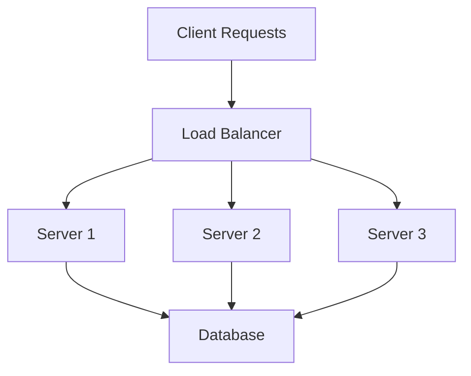
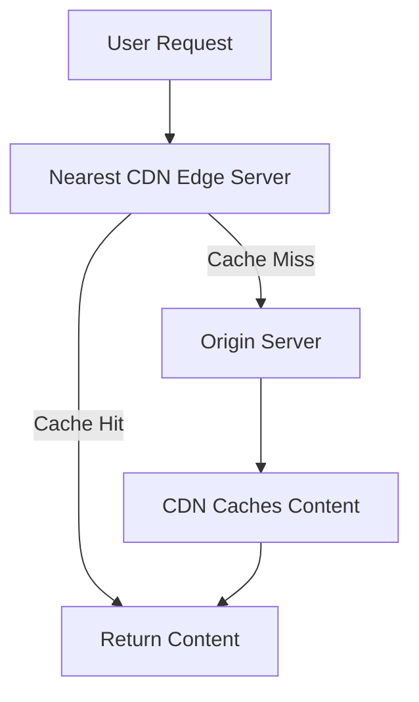
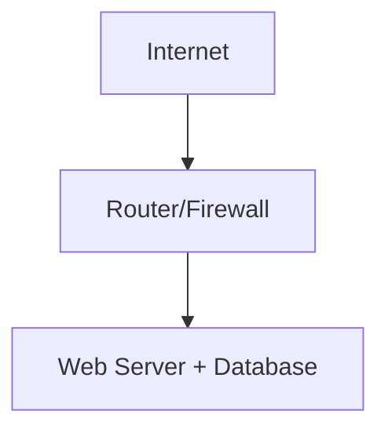
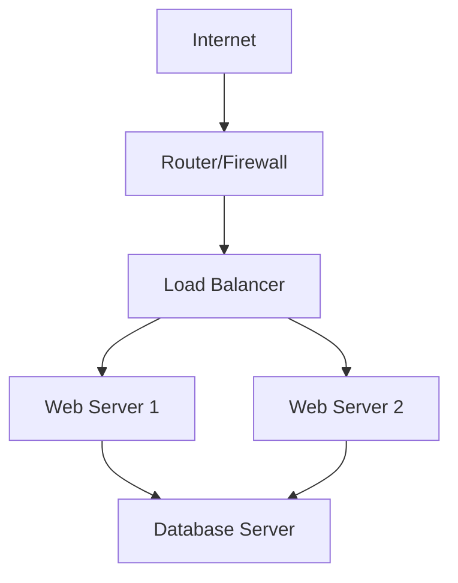
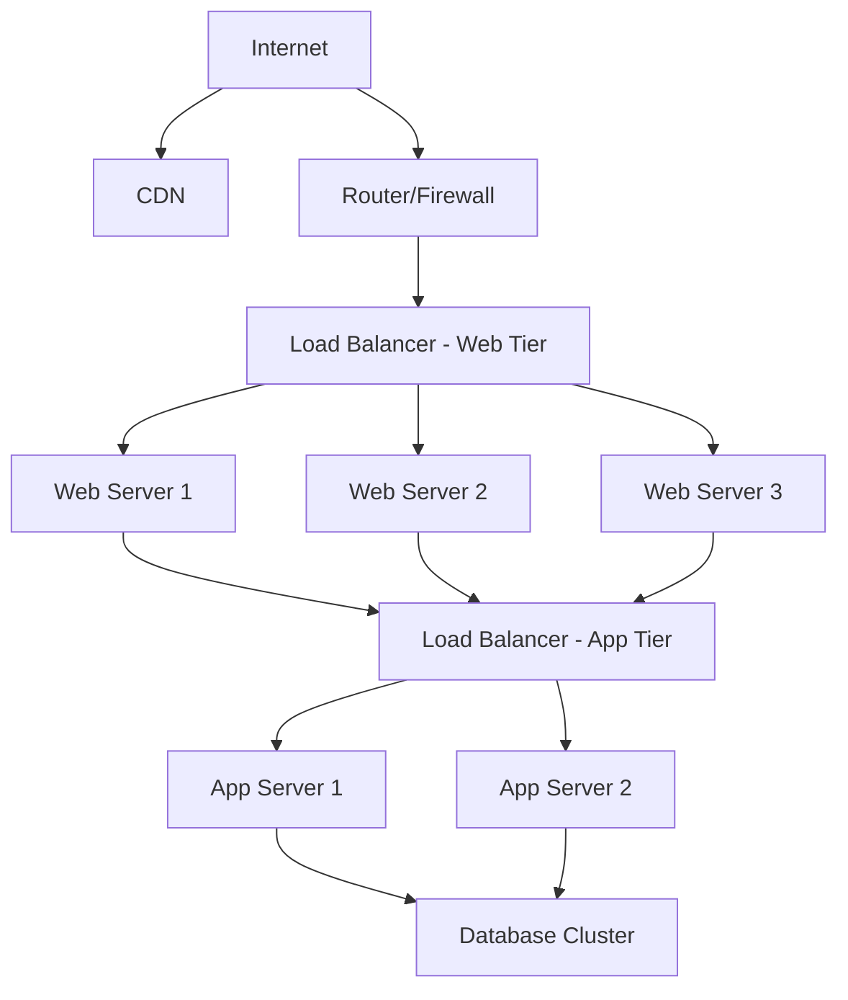

# Networks Scalability

## Introduction

Network scalability refers to a network's ability to handle growing amounts of work or its potential to accommodate growth. In simpler terms, a scalable network can maintain or improve performance when more users, resources, or traffic are added. For beginners entering the world of network design, understanding scalability is crucial as it forms the foundation of robust, future-proof network architectures.

Imagine building a small bridge for a few pedestrians. As the population grows, that bridge needs to accommodate more people, bicycles, and perhaps even vehicles. Similarly, networks need to scale as demands increase.

## Why is Network Scalability Important?

- **Growth Management**: Organizations grow, and their network needs expand.
- **Performance Maintenance**: A scalable network maintains its performance even as demands increase.
- **Cost Efficiency**: Planning for scalability avoids costly redesigns and replacements.
- **Future-Proofing**: Anticipating future needs prevents network obsolescence.

## Types of Network Scalability

### 1. Vertical Scalability (Scaling Up)

Vertical scalability involves adding more resources to existing network components, such as:
- Upgrading routers and switches to more powerful models
- Adding more memory to network devices
- Increasing processing power of network servers

#### Example:

```javascript
// Before scaling up - Simple server configuration
const server = {
  cpu: "4 cores",
  memory: "16GB RAM",
  networkCards: 2,
  maxConnections: 1000
};

// After scaling up
const upgradedServer = {
  cpu: "16 cores",
  memory: "64GB RAM",
  networkCards: 4,
  maxConnections: 5000
};
```

Vertical scaling has limitations - there's a ceiling to how much you can upgrade a single device.

### 2. Horizontal Scalability (Scaling Out)

Horizontal scalability involves adding more devices or nodes to distribute the load:
- Adding more servers
- Implementing load balancers
- Creating server clusters
- Distributing data across multiple machines

#### Example: Load Balancing

```javascript
// Simple load balancer logic
function distributeRequest(request, servers) {
  const serverCount = servers.length;
  const serverIndex = request.id % serverCount;
  return servers[serverIndex].handleRequest(request);
}

const servers = [
  { id: 1, load: 30, handleRequest: (req) => { /* process request */ } },
  { id: 2, load: 45, handleRequest: (req) => { /* process request */ } },
  { id: 3, load: 25, handleRequest: (req) => { /* process request */ } }
];

// When load increases, add more servers
servers.push({ id: 4, load: 0, handleRequest: (req) => { /* process request */ } });
```

## Key Network Scalability Techniques

### 1. Load Balancing

Load balancing distributes network traffic across multiple servers to ensure no single server is overwhelmed, improving both reliability and performance.



#### Load Balancing Algorithms:

- **Round Robin**: Cycles through servers sequentially
- **Least Connection**: Directs traffic to the server with the fewest active connections
- **IP Hash**: Uses the client's IP address to determine which server receives the request

### 2. Network Segmentation

Dividing a network into subnetworks (subnets) can improve performance and security.

```javascript
// Example of network segmentation with subnets
const networkDesign = {
  mainNetwork: "192.168.0.0/16",
  subnets: [
    {
      name: "Development",
      range: "192.168.1.0/24",
      maxDevices: 254
    },
    {
      name: "Production",
      range: "192.168.2.0/24",
      maxDevices: 254
    },
    {
      name: "Management",
      range: "192.168.3.0/24",
      maxDevices: 254
    }
  ]
};
```

### 3. Content Delivery Networks (CDNs)

CDNs distribute service spatially relative to end-users to provide high availability and performance.



### 4. Distributed Computing

Distributing processing tasks across multiple computers or servers:

```javascript
// Simplified MapReduce concept
function mapReduceExample(data) {
  // Map phase - distribute data across workers
  const mappedData = data.map(item => {
    return processDataItem(item);
  });
  
  // Reduce phase - combine results
  const result = mappedData.reduce((accumulator, current) => {
    return combineResults(accumulator, current);
  }, initialValue);
  
  return result;
}

// Distributing the work across multiple nodes
function distributeWork(dataChunks, availableNodes) {
  return dataChunks.map((chunk, index) => {
    const nodeIndex = index % availableNodes.length;
    return availableNodes[nodeIndex].process(chunk);
  });
}
```

## Practical Implementation: Designing a Scalable Web Application Network

Let's design a scalable network for a growing web application:

### Initial Design (Small Scale)



### Medium Scale Design



### Large Scale Design



## Best Practices for Network Scalability

1. **Plan for Growth**: Design with future expansion in mind.
2. **Modular Design**: Use modular components that can be replaced or upgraded individually.
3. **Standardization**: Standardize hardware and software where possible.
4. **Automation**: Implement network automation for configuration and management.
5. **Monitoring**: Use comprehensive monitoring to identify bottlenecks before they become problems.

### Automation Example

```python
# Network configuration automation example using Python
def configure_new_switch(switch_ip, template, parameters):
    # Connect to the switch
    session = connect_to_device(switch_ip, username, password)
    
    # Load configuration template
    with open(template, 'r') as file:
        config_template = file.read()
    
    # Apply parameters to template
    for key, value in parameters.items():
        config_template = config_template.replace(f"{{{{ {key} }}}}", value)
    
    # Apply configuration
    result = session.send_config(config_template)
    
    # Verify configuration
    verification = session.send_command("show running-config")
    
    return {
        "success": "Error" not in result,
        "result": result,
        "verification": verification
    }

# Example usage
new_switch_params = {
    "hostname": "SWITCH-FLOOR3-01",
    "management_ip": "192.168.10.15",
    "vlan_config": "vlan 10,20,30",
    "uplink_port": "GigabitEthernet0/1"
}

result = configure_new_switch("192.168.1.100", "switch_template.txt", new_switch_params)
```

## Challenges in Network Scalability

1. **Complexity**: As networks grow, they become more complex to manage.
2. **Security**: Larger attack surface requires more sophisticated security measures.
3. **Cost**: Balancing scalability with budget constraints.
4. **Legacy Systems**: Integrating older systems with new scalable infrastructure.

## Real-World Case Study: Social Media Platform Growth

Consider a social media platform growing from 1,000 to 1 million users:

1. **Initial Stage** (1,000 users):
   - Single server handling web, application, and database
   - Basic firewall and router

2. **Growth Stage** (100,000 users):
   - Separate web and database servers
   - Introduction of load balancing
   - Content delivery network for static assets
   - Improved monitoring and security

3. **Large Scale** (1,000,000+ users):
   - Multiple data centers
   - Sharded databases
   - Microservices architecture
   - Global load balancing
   - Advanced caching strategies
   - Automated scaling based on demand

## Implementing Scalability in Your Projects

For beginners working on their projects, consider these steps:

1. **Start Simple**: Begin with a straightforward design.
2. **Identify Potential Bottlenecks**: Understand where your network might face challenges as it grows.
3. **Use Cloud Services**: Cloud platforms offer built-in scalability features.
4. **Containerization**: Technologies like Docker facilitate scaling.

```javascript
// Docker Compose example for a scalable web application
// docker-compose.yml
`
version: '3'

services:
  web:
    image: my-web-app
    deploy:
      replicas: 5
      resources:
        limits:
          cpus: '0.5'
          memory: 512M
      restart_policy:
        condition: on-failure
    ports:
      - "80:80"
    networks:
      - webnet

  redis:
    image: redis
    networks:
      - webnet

networks:
  webnet:
`
```

## Summary

Network scalability is essential for designing systems that can grow with increasing demands. By understanding vertical and horizontal scaling techniques, implementing proper load balancing, utilizing CDNs, and following best practices, you can create networks that maintain performance and reliability as they expand.

Remember that scalability is not just about handling current needs but anticipating future requirements. A well-designed scalable network saves time, money, and resources in the long run.

## Practice Exercises

1. **Design Exercise**: Sketch a network architecture for a small e-commerce site that could scale to handle holiday shopping traffic spikes.

2. **Implementation Exercise**: Set up a simple load balancer using nginx to distribute traffic between two web servers.

3. **Analysis Exercise**: Identify potential bottlenecks in a given network diagram and suggest scalability improvements.

4. **Coding Exercise**: Write a script that simulates increasing network load and demonstrates how different scaling strategies perform.

## Further Resources

- Books on network design and scalability
- Online courses on distributed systems
- Open-source tools for network monitoring and automation
- Community forums for network engineers