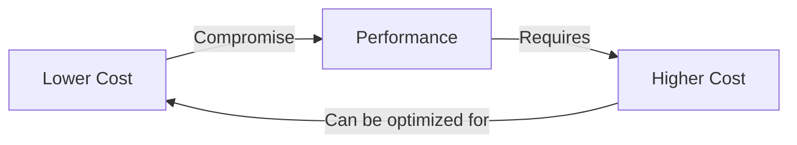
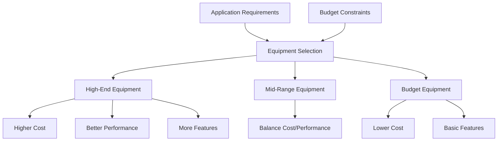
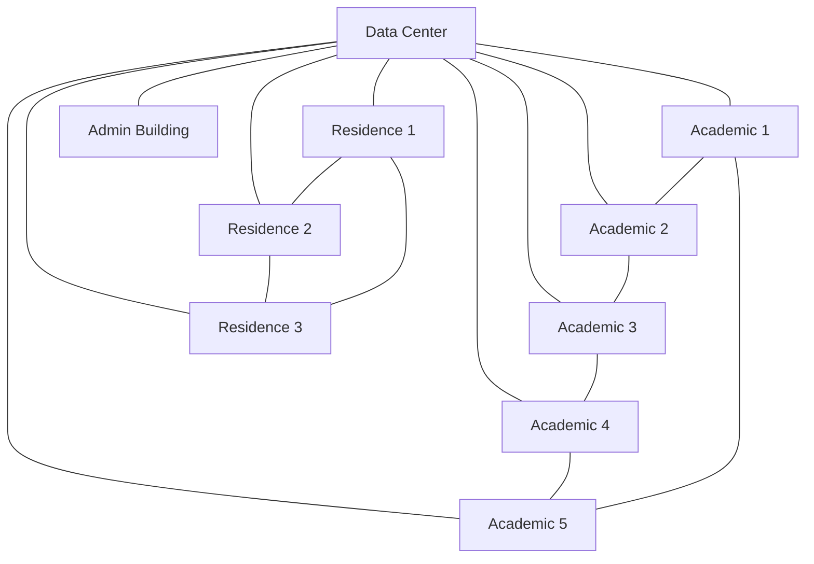

# Networks Cost Optimization

## Introduction

Network cost optimization is a critical aspect of network design that focuses on minimizing expenses while ensuring the network meets all performance requirements. For beginners in programming and network design, understanding how to build cost-efficient networks is essential as it allows you to create practical solutions that are both effective and economically viable.

In this guide, we'll explore various techniques and algorithms used to optimize network costs, from basic principles to practical implementations. We'll examine how to balance performance needs with budget constraints, and how different design choices affect the overall cost structure of a network.

## Why Network Cost Optimization Matters

Before diving into the technical details, let's understand why cost optimization is important:

1. **Budget Constraints**: Most real-world projects have limited budgets
2. **Operational Efficiency**: Lower-cost networks often require less power and maintenance
3. **Scalability**: Optimized designs can grow more economically
4. **Competitive Advantage**: Cost-efficient solutions are more attractive to clients and stakeholders

## Basic Principles of Network Cost Optimization

### Components of Network Costs

Network costs typically fall into several categories:

1. **Infrastructure Costs**
   - Hardware (routers, switches, cables)
   - Facilities (data centers, cooling systems)
   - Software licenses

2. **Operational Costs**
   - Power consumption
   - Maintenance and support
   - Personnel

3. **Bandwidth Costs**
   - Data transfer fees
   - Connection charges

### The Cost-Performance Tradeoff

Network design involves balancing costs against performance requirements:



## Optimization Techniques

### 1. Topology Optimization

The physical or logical arrangement of your network has a significant impact on costs.

#### Minimum Spanning Tree (MST)

One of the most fundamental algorithms for cost optimization in networks is the Minimum Spanning Tree algorithm, which finds the cheapest way to connect all nodes in a network.

Here's a simple implementation of Kruskal's algorithm for finding an MST:

```python
# Kruskal's algorithm for Minimum Spanning Tree
def kruskal_mst(graph, vertices):
    result = []  # This will store the resulting MST
    i, e = 0, 0  # Index variables for sorted edges and result
    
    # Sort edges by weight
    graph = sorted(graph, key=lambda item: item[2])
    
    # Create a disjoint set
    parent = []
    rank = []
    
    # Create V subsets with single elements
    for node in range(vertices):
        parent.append(node)
        rank.append(0)
    
    # Function to find set of an element
    def find(parent, i):
        if parent[i] != i:
            parent[i] = find(parent, parent[i])
        return parent[i]
    
    # Function to perform union of two sets
    def union(parent, rank, x, y):
        root_x = find(parent, x)
        root_y = find(parent, y)
        
        if root_x != root_y:
            if rank[root_x] < rank[root_y]:
                parent[root_x] = root_y
            elif rank[root_x] > rank[root_y]:
                parent[root_y] = root_x
            else:
                parent[root_y] = root_x
                rank[root_x] += 1
    
    # Process edges in ascending order of weight
    while e < vertices - 1 and i < len(graph):
        u, v, w = graph[i]
        i += 1
        x = find(parent, u)
        y = find(parent, v)
        
        if x != y:
            e += 1
            result.append([u, v, w])
            union(parent, rank, x, y)
    
    total_cost = sum(edge[2] for edge in result)
    return result, total_cost
```

#### Example Usage:

```python
# Example graph representation: [u, v, weight]
graph = [
    [0, 1, 10],
    [0, 2, 6],
    [0, 3, 5],
    [1, 3, 15],
    [2, 3, 4]
]

mst, cost = kruskal_mst(graph, 4)
print(f"Minimum Spanning Tree Edges: {mst}")
print(f"Total Cost: {cost}")
```

**Output:**
```
Minimum Spanning Tree Edges: [[2, 3, 4], [0, 3, 5], [0, 2, 6]]
Total Cost: 15
```

### 2. Capacity Planning and Bandwidth Optimization

Optimizing bandwidth allocation is crucial for cost management. Over-provisioning leads to wasted resources, while under-provisioning can degrade performance.

#### Bandwidth Allocation Algorithm

```python
def optimize_bandwidth(links, demands, capacities, costs):
    """
    Optimize bandwidth allocation to minimize costs
    
    Args:
        links: List of network links
        demands: Dictionary of bandwidth demands between nodes
        capacities: Dictionary of maximum capacity for each link
        costs: Dictionary of cost per unit of bandwidth for each link
        
    Returns:
        Dictionary of optimal bandwidth allocation for each link
    """
    allocation = {}
    total_cost = 0
    
    # Sort links by cost (cheapest first)
    sorted_links = sorted(links, key=lambda link: costs[link])
    
    # Allocate bandwidth to cheapest links first
    for link in sorted_links:
        source, target = link
        
        # Find all demands that could use this link
        relevant_demands = {(s, t): d for (s, t), d in demands.items() 
                           if can_route_through(s, t, source, target)}
        
        # Allocate capacity based on demands
        needed_capacity = sum(relevant_demands.values())
        allocated = min(needed_capacity, capacities[link])
        
        allocation[link] = allocated
        total_cost += allocated * costs[link]
    
    return allocation, total_cost

def can_route_through(source, target, link_source, link_target):
    # Simplified routing check - in real scenarios, this would use
    # actual routing algorithms and topological information
    return (source == link_source and target == link_target) or \
           (source == link_target and target == link_source)
```

### 3. Network Equipment Selection

Choosing the right equipment is a balancing act between performance needs and costs.



### 4. Traffic Engineering

Optimize how traffic flows through your network to maximize utilization and reduce bottlenecks.

```python
def traffic_engineering(graph, traffic_matrix):
    """
    Simple traffic engineering function to distribute traffic efficiently
    
    Args:
        graph: Network topology representation
        traffic_matrix: Matrix of traffic demands between node pairs
        
    Returns:
        Dictionary of paths for each source-destination pair
    """
    paths = {}
    
    for source in range(len(traffic_matrix)):
        for destination in range(len(traffic_matrix[0])):
            if source != destination and traffic_matrix[source][destination] > 0:
                # Find shortest path using Dijkstra's algorithm
                path = dijkstra_shortest_path(graph, source, destination)
                paths[(source, destination)] = path
    
    # Balance load across links
    link_loads = calculate_link_loads(paths, traffic_matrix, graph)
    
    # Re-route traffic from highly loaded links
    threshold = 0.8  # 80% utilization threshold
    for link, load in link_loads.items():
        if load > threshold:
            # Find alternative paths for traffic using this link
            reroute_traffic(paths, link, graph, traffic_matrix)
    
    return paths
```

## Real-World Applications

### Case Study 1: Campus Network Optimization

Consider a university campus network design that needs to connect:
- 5 academic buildings
- 3 residence halls
- 1 administrative building
- 1 data center

**Initial approach:**
- Fully meshed network (every building connects to every other)
- High bandwidth links everywhere
- Redundant equipment in each building

**Cost-optimized approach:**
- Hub-and-spoke topology with the data center as the hub
- Bandwidth allocated based on actual usage patterns
- Equipment scaled according to building needs



**Cost savings:** ~40% compared to the fully meshed approach, with minimal performance impact.

### Case Study 2: ISP Backbone Optimization

An Internet Service Provider needs to optimize its backbone network to reduce costs while maintaining service quality.

**Optimization strategy:**
1. Use traffic volume data to identify peak times and routes
2. Implement dynamic routing to balance loads
3. Selectively upgrade only the most congested links
4. Negotiate better peering arrangements to reduce transit costs

**Implementation example:**

```python
# Simplified backbone traffic optimization
def optimize_isp_backbone(traffic_data, topology, cost_matrix):
    # Identify peak traffic patterns
    peak_patterns = analyze_traffic_patterns(traffic_data)
    
    # Find bottlenecks
    bottlenecks = identify_bottlenecks(topology, peak_patterns)
    
    # Optimize routing
    optimized_routes = calculate_optimal_routes(topology, peak_patterns, bottlenecks)
    
    # Calculate capacity upgrades needed
    capacity_plan = determine_capacity_upgrades(bottlenecks, peak_patterns)
    
    # Calculate cost savings
    baseline_cost = calculate_current_costs(topology, cost_matrix)
    optimized_cost = calculate_optimized_costs(optimized_routes, capacity_plan, cost_matrix)
    
    savings = baseline_cost - optimized_cost
    
    return {
        'optimized_routes': optimized_routes,
        'capacity_plan': capacity_plan,
        'cost_savings': savings,
        'roi': savings / baseline_cost * 100  # Return on investment as percentage
    }
```

## Common Optimization Algorithms

### 1. Shortest Path Algorithms
For finding the most efficient routes in a network.

```python
import heapq

def dijkstra(graph, start):
    """
    Implementation of Dijkstra's algorithm for finding shortest paths
    
    Args:
        graph: Dictionary representation of graph {node: {neighbor: cost}}
        start: Starting node
        
    Returns:
        Dictionary of shortest distances to all nodes
    """
    # Initialize distances with infinity for all nodes except start
    distances = {node: float('infinity') for node in graph}
    distances[start] = 0
    
    # Priority queue to store nodes to visit
    priority_queue = [(0, start)]
    
    # Track visited nodes
    visited = set()
    
    while priority_queue:
        current_distance, current_node = heapq.heappop(priority_queue)
        
        # If we've already processed this node, skip it
        if current_node in visited:
            continue
            
        visited.add(current_node)
        
        # Check all neighbors
        for neighbor, weight in graph[current_node].items():
            distance = current_distance + weight
            
            # If we found a better path, update it
            if distance < distances[neighbor]:
                distances[neighbor] = distance
                heapq.heappush(priority_queue, (distance, neighbor))
    
    return distances
```

### 2. Flow Optimization
For maximizing throughput while minimizing costs.

```python
def max_flow_min_cost(graph, source, sink, costs):
    """
    Simplified implementation of maximum flow with minimum cost
    
    Args:
        graph: Network with capacities {node: {neighbor: capacity}}
        source: Source node
        sink: Sink node
        costs: Cost of flow through each edge {(u,v): cost}
        
    Returns:
        Flow allocation that maximizes flow while minimizing cost
    """
    # Start with zero flow
    flow = {node: {neighbor: 0 for neighbor in neighbors} 
            for node, neighbors in graph.items()}
    
    total_flow = 0
    total_cost = 0
    
    # Find augmenting paths until no more exist
    while True:
        # Find the shortest (cheapest) augmenting path
        path, path_capacity, path_cost = find_cheapest_augmenting_path(
            graph, flow, source, sink, costs
        )
        
        if not path:
            break  # No more augmenting paths
            
        # Augment flow along the path
        total_flow += path_capacity
        total_cost += path_capacity * path_cost
        
        # Update flow values
        for i in range(len(path) - 1):
            u, v = path[i], path[i + 1]
            flow[u][v] += path_capacity
            flow[v][u] -= path_capacity  # Reverse edge for residual graph
    
    return flow, total_flow, total_cost
```

## Best Practices for Network Cost Optimization

1. **Plan for future growth**: Design networks that can scale without complete overhauls
2. **Standardize equipment**: Reduce maintenance complexity and spare parts inventory
3. **Prioritize critical applications**: Allocate more resources to business-critical functions
4. **Consider operational costs**: Factor in power, cooling, and maintenance, not just purchase price
5. **Virtualize where possible**: Use network function virtualization to reduce hardware costs
6. **Benchmark regularly**: Compare your network costs to industry standards
7. **Monitor utilization**: Track usage patterns to identify optimization opportunities

## Optimization Steps for Beginners

If you're just starting with network design, here's a simple process to follow:

1. **Define requirements clearly**: Understand what the network needs to accomplish
2. **Map current state**: Document existing infrastructure (if applicable)
3. **Identify cost drivers**: Determine what contributes most to network expenses
4. **Develop alternatives**: Create multiple design options at different price points
5. **Compare performance vs. cost**: Analyze which solution offers the best value
6. **Implement incrementally**: Start with high-impact, low-cost optimizations
7. **Measure results**: Track savings and performance impacts

## Summary

Network cost optimization is an essential skill for any network designer or programmer. By applying the principles and algorithms discussed in this guide, you can create networks that balance performance requirements with budget constraints effectively.

Remember that optimization is an ongoing process, not a one-time activity. Networks should be continuously monitored and improved to maintain cost efficiency as requirements evolve.

## Further Learning

To deepen your understanding of network cost optimization, consider exploring:

1. Advanced routing algorithms like OSPF and BGP
2. Quality of Service (QoS) implementation techniques
3. Software-Defined Networking (SDN) approaches to cost optimization
4. Cloud networking cost models and optimization strategies

## Exercises

1. Design a minimum spanning tree for a network with 10 nodes.
2. Calculate the total cost of a network using different topology options.
3. Implement a simple bandwidth allocation algorithm that prioritizes critical applications.
4. Compare the cost-effectiveness of different equipment options for a small office network.
5. Optimize a given network topology to reduce costs by at least 20% without reducing connectivity.