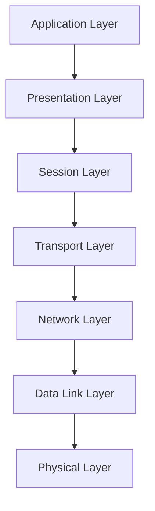

# Networks Documentation

## Introduction

Computer networks form the backbone of modern digital communication, allowing devices to share information regardless of their physical location. This documentation introduces fundamental networking concepts, protocols, and practical applications to help beginners understand how data travels across networks.

A network, at its core, is a collection of connected devices that can communicate with each other. These connections can span from a few devices in your home to billions of devices worldwide through the internet.

## Network Types

Networks are classified based on their scale and scope:

- **LAN (Local Area Network)**: Limited to a small geographic area like a home, office, or campus.
- **WAN (Wide Area Network)**: Spans a large geographic area, often connecting multiple LANs.
- **MAN (Metropolitan Area Network)**: Larger than a LAN but smaller than a WAN, typically covering a city.
- **PAN (Personal Area Network)**: Very small network for personal devices like smartphones connecting to headphones.

## The OSI Model

The Open Systems Interconnection (OSI) model provides a conceptual framework for understanding network communications. It divides networking functions into seven layers:

1. **Physical Layer**: Transmits raw bit streams over physical medium
2. **Data Link Layer**: Establishes node-to-node connections
3. **Network Layer**: Determines path for data to travel across networks
4. **Transport Layer**: Ensures complete data transfer
5. **Session Layer**: Establishes, manages, and terminates connections
6. **Presentation Layer**: Translates data between application and network formats
7. **Application Layer**: Interfaces directly with end-user applications



## TCP/IP Protocol Suite

While the OSI model is conceptual, TCP/IP is the practical implementation used in real-world networks:

### IP (Internet Protocol)

IP handles addressing and routing of packets:

```javascript
// Example IPv4 address
const ipv4Address = '192.168.1.1';

// Example IPv6 address
const ipv6Address = '2001:0db8:85a3:0000:0000:8a2e:0370:7334';
```

### TCP (Transmission Control Protocol)

TCP ensures reliable data delivery with features like:
- Connection-oriented communication
- Acknowledgments for received packets
- Retransmission of lost packets
- Flow control and congestion control

Here's a simplified example of a TCP connection:

```javascript
// Pseudo-code for TCP socket communication
const socket = new TCPSocket();

// Establish connection to server
socket.connect('server.example.com', 80);

// Send data
socket.send('Hello, server!');

// Receive response
const response = socket.receive();
console.log(response); // "Hello, client!"

// Close connection
socket.close();
```

### UDP (User Datagram Protocol)

UDP offers connectionless, faster communication with no guarantees of delivery:

```javascript
// Pseudo-code for UDP socket communication
const socket = new UDPSocket();

// No connection needed
socket.send('server.example.com', 53, 'DNS query');

// Receive response (may or may not arrive)
const response = socket.receive();
```

## Network Addressing

### MAC Addresses

MAC (Media Access Control) addresses uniquely identify network interfaces at the data link layer:

```javascript
// Example MAC address
const macAddress = '00:1A:2B:3C:4D:5E';
```

### IP Addressing

IP addresses identify devices on IP networks:

```javascript
// Basic subnet calculation
function isInSameSubnet(ip1, ip2, subnetMask) {
  const ip1Octets = ip1.split('.').map(Number);
  const ip2Octets = ip2.split('.').map(Number);
  const maskOctets = subnetMask.split('.').map(Number);
  
  for (let i = 0; i < 4; i++) {
    if ((ip1Octets[i] & maskOctets[i]) !== (ip2Octets[i] & maskOctets[i])) {
      return false;
    }
  }
  return true;
}

// Example usage
const result = isInSameSubnet('192.168.1.5', '192.168.1.10', '255.255.255.0');
console.log(result); // true - both IPs are in the same subnet
```

## Common Network Protocols

### HTTP/HTTPS

HTTP (Hypertext Transfer Protocol) facilitates web browsing:

```javascript
// Basic HTTP request in Node.js
const https = require('https');

https.get('https://api.example.com/data', (response) => {
  let data = '';
  
  response.on('data', (chunk) => {
    data += chunk;
  });
  
  response.on('end', () => {
    console.log(JSON.parse(data));
  });
}).on('error', (error) => {
  console.error(`Error: ${error.message}`);
});
```

### DNS

DNS (Domain Name System) translates human-readable domain names to IP addresses:

```javascript
// DNS lookup example in Node.js
const dns = require('dns');

dns.lookup('example.com', (error, address, family) => {
  console.log(`Address: ${address}, IP version: IPv${family}`);
});
```

## Network Programming Basics

### Socket Programming

Sockets provide a programming interface for network communications:

```javascript
// Basic TCP server in Node.js
const net = require('net');

const server = net.createServer((socket) => {
  console.log('Client connected');
  
  socket.on('data', (data) => {
    console.log(`Received: ${data}`);
    socket.write('Server acknowledges your message');
  });
  
  socket.on('end', () => {
    console.log('Client disconnected');
  });
});

server.listen(3000, () => {
  console.log('Server listening on port 3000');
});
```

## Network Security Fundamentals

Security is critical in networked systems:

### Firewalls

Firewalls control traffic based on predetermined security rules:

```javascript
// Simplified firewall rule implementation
const firewallRules = [
  { source: '192.168.1.0/24', destination: 'ANY', port: 80, allow: true },
  { source: 'ANY', destination: '10.0.0.1', port: 22, allow: false }
];

function checkPacket(sourceIP, destIP, destPort) {
  for (const rule of firewallRules) {
    // This is highly simplified - real implementations would check IP ranges properly
    const sourceMatch = rule.source === 'ANY' || sourceIP.startsWith(rule.source.split('/')[0]);
    const destMatch = rule.destination === 'ANY' || destIP === rule.destination;
    const portMatch = destPort === rule.port;
    
    if (sourceMatch && destMatch && portMatch) {
      return rule.allow;
    }
  }
  return false; // Default deny
}

// Example usage
console.log(checkPacket('192.168.1.5', '203.0.113.10', 80)); // true - allowed
console.log(checkPacket('203.0.113.10', '10.0.0.1', 22)); // false - blocked
```

### Encryption

Transport Layer Security (TLS) provides encryption for network communications:

```javascript
// Basic HTTPS server with TLS in Node.js
const https = require('https');
const fs = require('fs');

const options = {
  key: fs.readFileSync('private-key.pem'),
  cert: fs.readFileSync('certificate.pem')
};

https.createServer(options, (req, res) => {
  res.writeHead(200);
  res.end('Secure hello world!
');
}).listen(443, () => {
  console.log('Server running on https://localhost:443/');
});
```

## Practical Network Troubleshooting

When networks fail, these tools help diagnose issues:

```bash
# Check if a host is reachable
ping example.com

# Trace the route to a host
traceroute example.com

# Display network interface information
ifconfig # on Unix/Linux
ipconfig # on Windows

# Check DNS resolution
nslookup example.com
```

## Real-World Application: Building a Chat Server

Let's build a simple WebSocket-based chat server:

```javascript
// Simple WebSocket chat server
const WebSocket = require('ws');

const server = new WebSocket.Server({ port: 8080 });
const clients = new Set();

server.on('connection', (socket) => {
  // Add new client to our set
  clients.add(socket);
  
  // Broadcast message to all connected clients
  socket.on('message', (message) => {
    for (const client of clients) {
      if (client.readyState === WebSocket.OPEN) {
        client.send(message);
      }
    }
  });
  
  // Remove disconnected clients
  socket.on('close', () => {
    clients.delete(socket);
  });
});

console.log('Chat server running on ws://localhost:8080');
```

Client-side JavaScript to connect to the chat server:

```javascript
// WebSocket chat client
const socket = new WebSocket('ws://localhost:8080');

// Handle incoming messages
socket.addEventListener('message', (event) => {
  const messageElement = document.createElement('div');
  messageElement.textContent = event.data;
  document.getElementById('chat-messages').appendChild(messageElement);
});

// Send message when form is submitted
document.getElementById('chat-form').addEventListener('submit', (event) => {
  event.preventDefault();
  const input = document.getElementById('message-input');
  socket.send(input.value);
  input.value = '';
});
```

## Summary

Networks enable modern computing by allowing seamless communication between devices across vast distances. We've covered:

- Network types and the OSI model
- TCP/IP and core networking protocols
- Addressing schemes with IP and MAC addresses
- Socket programming for network applications
- Security considerations and troubleshooting techniques
- A practical example of a real-time chat application

## Additional Resources

To continue your learning journey:

- Practice implementing the examples in this documentation
- Experiment with different network protocols and tools
- Try building a more sophisticated chat application with features like private messaging and user authentication
- Explore network simulation tools to observe how packets travel across networks
- Learn about software-defined networking (SDN) and network virtualization

Understanding networks is fundamental to becoming a proficient programmer in today's connected world. The concepts you've learned here will serve as a foundation for more advanced network programming and system design.