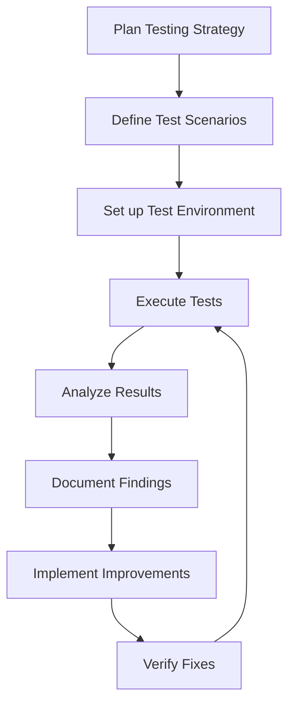
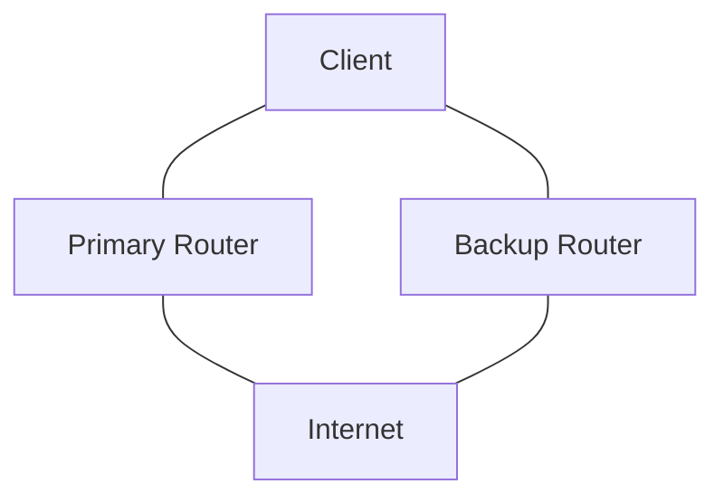

# Networks Testing

## Introduction

Network testing is a critical phase in the network design lifecycle. It involves verifying that a network infrastructure meets its design requirements, performs reliably, and can handle expected traffic loads before being deployed in a production environment. For beginners entering the world of network design, understanding how to properly test networks is essential for building robust, reliable systems.

In this guide, we'll explore the fundamentals of networks testing, common methodologies, essential tools, and practical examples that you can apply to your own network designs.

## Why Network Testing Matters

Before diving into the specifics, let's understand why network testing is critical:

- **Prevent Costly Downtime**: Identifying issues before deployment saves time, resources, and reputation
- **Validate Design Decisions**: Confirm that your network architecture works as expected
- **Optimize Performance**: Discover bottlenecks and inefficiencies before they impact users
- **Enhance Security**: Identify vulnerabilities that could compromise your network
- **Support Scalability**: Ensure your network can handle growth and increased demand

## Network Testing Fundamentals

### Testing Types

Network testing can be categorized into several types:

#### 1. Connectivity Testing

This basic form of testing verifies that devices can communicate with each other across the network.

```bash
# Example: Using ping to test basic connectivity
$ ping 192.168.1.1
PING 192.168.1.1 (192.168.1.1) 56(84) bytes of data.
64 bytes from 192.168.1.1: icmp_seq=1 ttl=64 time=0.435 ms
64 bytes from 192.168.1.1: icmp_seq=2 ttl=64 time=0.507 ms
64 bytes from 192.168.1.1: icmp_seq=3 ttl=64 time=0.572 ms
```

#### 2. Bandwidth Testing

Measures the maximum data transfer rate your network can sustain.

```bash
# Example: Using iperf3 to test bandwidth
$ iperf3 -c server.example.com
Connecting to host server.example.com, port 5201
[  5] local 192.168.1.10 port 54321 connected to 203.0.113.5 port 5201
[ ID] Interval           Transfer     Bitrate
[  5]   0.00-10.00  sec   112 MBytes   94.1 Mbits/sec
```

#### 3. Latency Testing

Measures the time delay for data to travel across the network.

```bash
# Example: Using traceroute to measure latency
$ traceroute google.com
traceroute to google.com (142.250.190.78), 30 hops max, 60 byte packets
 1  router.local (192.168.1.1)  0.517 ms  0.490 ms  0.599 ms
 2  isp-gateway (203.0.113.1)  12.181 ms  12.212 ms  12.860 ms
 3  isp-backbone (198.51.100.1)  15.171 ms  15.723 ms  15.625 ms
```

#### 4. Load Testing

Determines how the network performs under heavy traffic or stress conditions.

#### 5. Security Testing

Identifies vulnerabilities and ensures security measures are effective.

## Network Testing Methodology

A structured approach to network testing typically follows these steps:



### 1. Planning Your Tests

Before testing, define:

- **Test Objectives**: What are you trying to verify?
- **Test Scope**: Which parts of the network to test?
- **Success Criteria**: What constitutes a passed test?

### 2. Creating a Test Environment

For reliable results, establish a controlled test environment that simulates your production network without affecting live systems.

```jsx
// Example: Network test environment configuration
const testConfig = {
  vlans: [
    { id: 10, name: "Management", subnet: "192.168.10.0/24" },
    { id: 20, name: "Users", subnet: "192.168.20.0/24" },
    { id: 30, name: "Servers", subnet: "192.168.30.0/24" }
  ],
  routers: [
    { name: "CoreRouter", interfaces: ["eth0", "eth1", "eth2"] }
  ],
  switches: [
    { name: "AccessSwitch1", ports: 24, uplinks: ["port24"] },
    { name: "AccessSwitch2", ports: 24, uplinks: ["port24"] }
  ]
};
```

## Essential Network Testing Tools

### Command-Line Tools

Basic tools that every network tester should know:

1. **ping**: Tests connectivity between hosts
2. **traceroute/tracert**: Displays path and latency to destination
3. **ipconfig/ifconfig**: Shows network interface configurations
4. **nslookup/dig**: Tests DNS resolution
5. **netstat**: Displays network statistics and connections

### Example: Basic Network Troubleshooting Script

Here's a simple Python script to perform basic network tests:

```python
import subprocess
import platform

def check_connectivity(host):
    """Test if a host is reachable"""
    param = '-n' if platform.system().lower() == 'windows' else '-c'
    command = ['ping', param, '4', host]
    
    print(f"Testing connectivity to {host}...")
    
    try:
        output = subprocess.check_output(command).decode()
        if '0% packet loss' in output or '0.0% packet loss' in output:
            print(f"✅ Successfully connected to {host}")
            return True
        else:
            print(f"❌ Packet loss detected while connecting to {host}")
            return False
    except subprocess.CalledProcessError:
        print(f"❌ Failed to connect to {host}")
        return False

def test_dns_resolution(domain):
    """Test if a domain resolves to an IP address"""
    command = ['nslookup', domain]
    
    print(f"Testing DNS resolution for {domain}...")
    
    try:
        output = subprocess.check_output(command).decode()
        if 'Non-existent domain' in output or 'NXDOMAIN' in output:
            print(f"❌ Failed to resolve {domain}")
            return False
        else:
            print(f"✅ Successfully resolved {domain}")
            return True
    except subprocess.CalledProcessError:
        print(f"❌ Error resolving {domain}")
        return False

# Example usage
if __name__ == "__main__":
    hosts_to_check = ["192.168.1.1", "google.com", "8.8.8.8"]
    domains_to_check = ["google.com", "example.com"]
    
    for host in hosts_to_check:
        check_connectivity(host)
        print()
    
    for domain in domains_to_check:
        test_dns_resolution(domain)
        print()
```

### Specialized Network Testing Tools

For more advanced testing:

1. **Wireshark**: Packet analyzer for detailed traffic inspection
2. **iperf/iperf3**: Tests network bandwidth performance
3. **Nmap**: Network discovery and security auditing
4. **Netcat**: Versatile networking utility for reading/writing across connections
5. **Selenium/Puppeteer**: For testing web applications over the network

## Network Performance Testing

### Bandwidth Testing

Testing throughput is essential for validating that your network can handle expected traffic.

#### Iperf Example:

Set up an iperf server on one machine:

```bash
# On server
$ iperf3 -s
Server listening on port 5201
```

Run a client on another machine:

```bash
# On client
$ iperf3 -c server-ip -t 30
Connecting to host server-ip, port 5201
[ ID] Interval           Transfer     Bitrate
[  5]   0.00-30.00  sec   3.38 GBytes   968 Mbits/sec
```

### Latency Testing

Low latency is critical for real-time applications. Here's how to test it:

```bash
# Using ping to measure latency
$ ping -c 100 target-ip | grep avg
rtt min/avg/max/mdev = 0.035/0.145/0.432/0.101 ms
```

## Network Topology Testing

Verifying that your network topology functions as designed is crucial. This can involve:

1. **Path validation**: Ensuring traffic follows expected routes
2. **Failover testing**: Verifying redundancy works when primary paths fail
3. **Routing protocol testing**: Confirming proper route propagation

### Example: Testing Router Failover



To test this failover:

1. Establish baseline connectivity through the primary path
2. Simulate failure of the primary router
3. Verify traffic successfully flows through backup router
4. Measure failover time
5. Restore primary path and verify return to normal routing

## Security Testing for Networks

Security testing should be an integral part of network testing. Key areas include:

1. **Firewall testing**: Verify rules are correctly enforcing access policies
2. **Intrusion detection/prevention**: Test if systems detect and block attacks
3. **Authentication testing**: Validate access control mechanisms
4. **Encryption testing**: Ensure sensitive data is properly protected

### Example: Simple Firewall Rule Testing Script

```python
import socket
import sys
import time

def test_port(host, port, expected_open):
    """Test if a port is open or closed"""
    s = socket.socket(socket.AF_INET, socket.SOCK_STREAM)
    s.settimeout(2)
    
    result = None
    try:
        result = s.connect_ex((host, port))
        if result == 0:  # Port is open
            status = "OPEN"
            test_passed = expected_open
        else:  # Port is closed
            status = "CLOSED"
            test_passed = not expected_open
            
        icon = "✅" if test_passed else "❌"
        print(f"{icon} Port {port} on {host} is {status} (Expected: {'OPEN' if expected_open else 'CLOSED'})")
        
    except socket.error as e:
        print(f"❌ Error testing {host}:{port} - {e}")
        
    finally:
        s.close()
    
    return test_passed

def test_firewall_rules(rules):
    """Test multiple firewall rules"""
    passed = 0
    total = len(rules)
    
    print("Beginning firewall rule tests...
")
    
    for rule in rules:
        if test_port(rule["host"], rule["port"], rule["should_be_open"]):
            passed += 1
        time.sleep(0.5)  # Avoid triggering IPS/IDS
        
    print(f"
Test Results: {passed}/{total} passed")
    print(f"Success Rate: {(passed/total)*100:.1f}%")

# Example usage
if __name__ == "__main__":
    # Define test cases: host, port, and whether it should be open
    firewall_tests = [
        {"host": "192.168.1.10", "port": 80, "should_be_open": True},  # Web server
        {"host": "192.168.1.10", "port": 22, "should_be_open": True},  # SSH
        {"host": "192.168.1.10", "port": 3389, "should_be_open": False},  # RDP should be blocked
        {"host": "192.168.1.20", "port": 1433, "should_be_open": False}   # SQL Server should be blocked
    ]
    
    test_firewall_rules(firewall_tests)
```

## Real-world Example: Testing a Small Office Network

Let's walk through testing a typical small office network setup:

### Scenario

A small business has set up a network with:
- 1 router connecting to the internet
- 2 switches
- 1 Wi-Fi access point
- 25 client devices (15 wired, 10 wireless)
- 1 file server
- 1 print server

### Test Plan

1. **Connectivity Testing**
   - Verify all devices can reach the internet
   - Confirm internal devices can communicate with each other

2. **Performance Testing**
   - Measure bandwidth between key points in the network
   - Test file transfer speeds to/from the file server

3. **Wi-Fi Testing**
   - Test signal strength in all areas of the office
   - Verify seamless roaming between access points

4. **Security Testing**
   - Ensure guest Wi-Fi is isolated from internal network
   - Verify firewall is blocking unauthorized access

5. **Availability Testing**
   - Simulate power failure to network devices
   - Test backup internet connection if available

### Example Test Results Documentation

```markdown
# Network Test Results: Small Office Network

## Test Environment
- Date: March 15, 2025
- Tester: Network Engineer
- Network: Small Office (25 clients, 2 servers)

## Connectivity Tests
| Test Case | Expected Result | Actual Result | Status |
|-----------|-----------------|---------------|--------|
| Internet access from wired clients | All clients can reach internet | 15/15 successful | PASS |
| Internet access from wireless clients | All clients can reach internet | 9/10 successful | FAIL |
| Internal connectivity | All devices can reach each other | All connections successful | PASS |

## Performance Tests
| Link | Expected Bandwidth | Measured Bandwidth | Status |
|------|-------------------|-------------------|--------|
| Client to Internet | >50 Mbps | 58.7 Mbps | PASS |
| Client to File Server | >800 Mbps | 912.4 Mbps | PASS |
| Wireless Client to File Server | >200 Mbps | 187.3 Mbps | FAIL |

## Issues Found
1. One wireless client unable to connect to internet (MAC address: 00:11:22:33:44:55)
2. Wireless bandwidth below target threshold by 6.35%

## Recommendations
1. Update firmware on wireless access point
2. Relocate AP to central location for better coverage
3. Implement QoS for critical applications
```

## Best Practices for Network Testing

1. **Test Incrementally**: Test components individually before testing the entire network
2. **Automate Where Possible**: Create scripts for repetitive tests
3. **Document Everything**: Keep detailed records of test configurations and results
4. **Test Regularly**: Network testing should be ongoing, not a one-time event
5. **Test in Isolation**: When possible, test network segments independently
6. **Simulate Real Traffic**: Use tools that generate realistic user traffic patterns
7. **Test Edge Cases**: Don't just test the happy path; try unexpected scenarios

## Troubleshooting Common Network Issues

When tests reveal problems, use these troubleshooting techniques:

### The OSI Model Approach

Work through each layer systematically:

1. **Physical Layer**: Check cables, ports, power
2. **Data Link Layer**: Verify MAC addresses, switch operation
3. **Network Layer**: Check IP addresses, routing
4. **Transport Layer**: Verify ports, TCP/UDP operation
5. **Session/Presentation/Application Layers**: Check application configuration

### Common Network Problems and Solutions

| Problem | Possible Causes | Troubleshooting Steps |
|---------|----------------|----------------------|
| No connectivity | Cable issues, IP configuration | Check physical connections, verify IP settings, ping gateway |
| Intermittent connection | Interference, hardware issues | Check for EMI sources, test with different hardware |
| Slow performance | Bandwidth saturation, misconfiguration | Run bandwidth tests, check for broadcast storms |
| High latency | Route issues, congestion | Use traceroute to identify slow hops, check QoS settings |

## Summary

Network testing is a critical skill for anyone involved in network design. By systematically verifying connectivity, performance, security, and reliability, you can ensure your networks meet their intended requirements and provide a stable foundation for your applications and services.

Remember these key points:
- Test early and test often throughout the network design process
- Use both simple built-in tools and specialized testing software
- Document your test plans and results for future reference
- Follow a structured methodology to ensure comprehensive coverage
- Consider both normal operation and failure scenarios

## Practice Exercises

To reinforce your understanding of network testing:

1. Set up a small test network with 2-3 devices and practice using ping, traceroute, and iperf
2. Create a basic network testing script in Python or Bash
3. Use Wireshark to capture and analyze traffic on your network
4. Simulate a network failure and practice troubleshooting
5. Create a complete test plan for a home or small office network

## Additional Resources

To continue learning about network testing:

- Network+ certification materials
- Wireshark documentation and tutorials
- GitHub repositories with network testing scripts
- Online network simulators for practice

By incorporating proper testing into your network design process, you'll create more reliable, efficient, and secure networks that meet the needs of your users and applications.