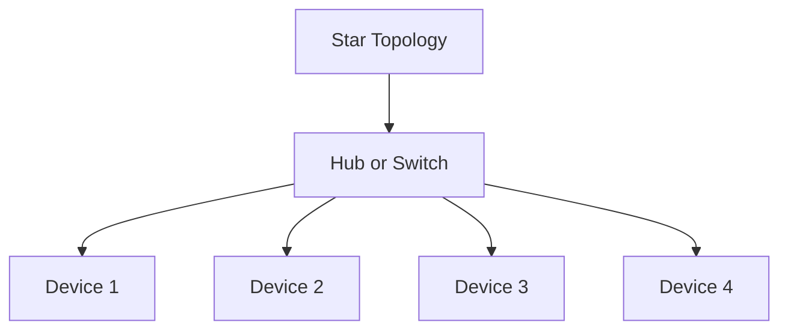
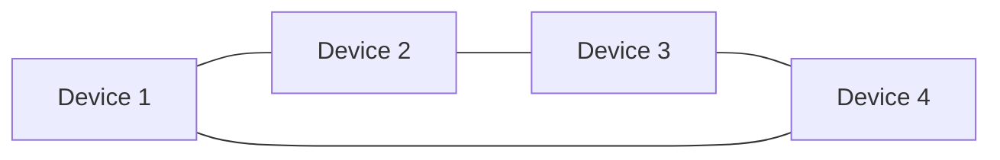
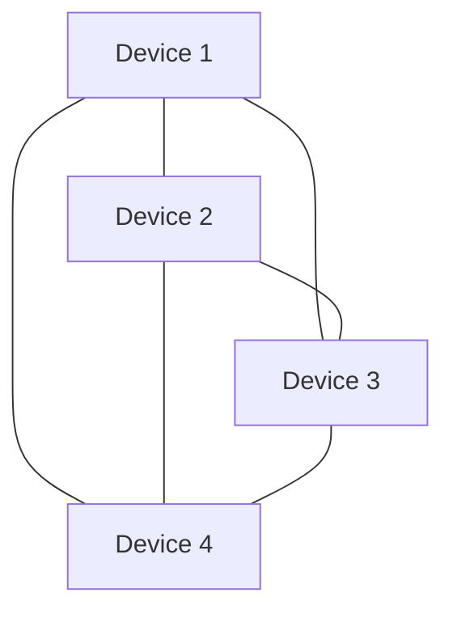
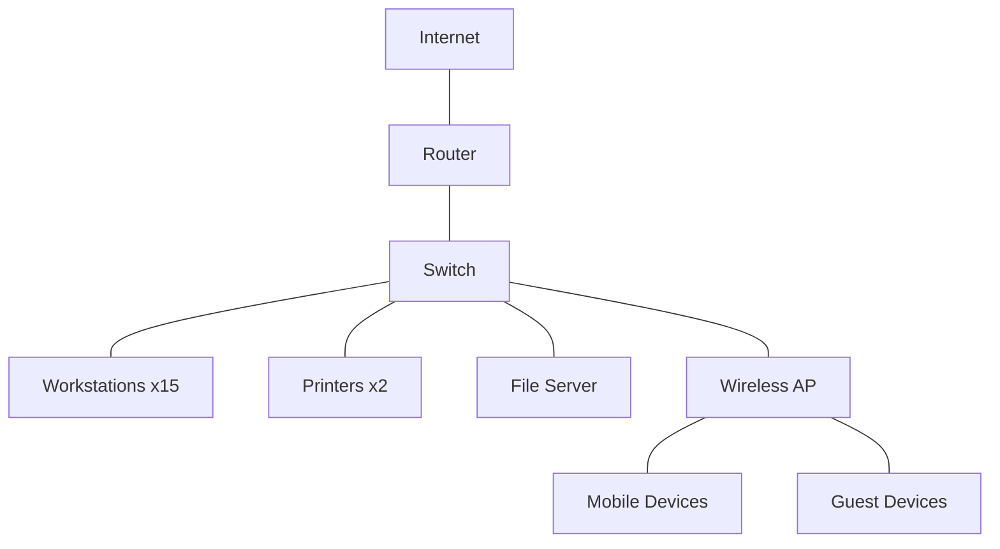

# Networks Implementation

## Introduction

Network implementation is the process of bringing a network design to life by installing and configuring the hardware and software components required for a functional computer network. It's where the theoretical network design transforms into a real-world working system that allows computers and devices to communicate with each other.

For beginners, understanding how to implement a network is crucial as it forms the foundation of most modern computing environments. Whether you're setting up a home network, a small business network, or learning about larger enterprise deployments, the core principles remain the same.

In this guide, we'll explore the essential components, steps, and best practices for implementing computer networks from scratch.

## Key Components of Network Implementation

Before diving into the implementation process, let's understand the basic components that make up a network:

### Hardware Components

1. **Network Interface Cards (NICs)** - Physical cards or built-in components that allow devices to connect to a network
2. **Switches** - Devices that connect multiple devices on the same network
3. **Routers** - Devices that connect different networks together and route traffic between them
4. **Access Points** - Devices that allow wireless devices to connect to a wired network
5. **Cables** - Physical medium for connecting devices (Ethernet, fiber optic)
6. **Modems** - Devices that connect your network to the internet service provider

### Software Components

1. **Network Operating Systems** - Specialized OS for network devices
2. **Protocols** - Rules that govern how data is transmitted (TCP/IP, HTTP, etc.)
3. **Network Services** - DNS, DHCP, etc.
4. **Security Software** - Firewalls, antivirus, intrusion detection systems

## Network Implementation Process

Let's break down the process of implementing a network into manageable steps:

### Step 1: Network Planning

Before any physical implementation, you need a solid plan based on requirements:

- Determine the network size (number of users/devices)
- Choose appropriate topology
- Plan IP addressing scheme
- Design physical layout
- Select hardware and software components

### Step 2: Selecting the Right Topology

The topology you choose affects performance, cost, and scalability. Common topologies include:



**Star Topology**: All devices connect to a central hub or switch. Most common in modern networks.



**Ring Topology**: Each device connects to exactly two other devices, forming a ring.



**Mesh Topology**: Devices are interconnected, providing redundancy but requiring more resources.

### Step 3: IP Addressing Implementation

IP addressing is crucial for identifying devices on your network:

```javascript
// Simple IP address allocation example in JavaScript
function allocateIPAddresses(subnetPrefix, numDevices) {
  const addresses = [];
  for (let i = 1; i <= numDevices; i++) {
    addresses.push(`${subnetPrefix}.${i}`);
  }
  return addresses;
}

// For a small office network with 192.168.1.0/24 subnet
const officeIPs = allocateIPAddresses('192.168.1', 10);
console.log(officeIPs);
```

Output:
```
[
  '192.168.1.1',
  '192.168.1.2',
  '192.168.1.3',
  '192.168.1.4',
  '192.168.1.5',
  '192.168.1.6',
  '192.168.1.7',
  '192.168.1.8',
  '192.168.1.9',
  '192.168.1.10'
]
```

### Step 4: Setting Up DHCP and DNS

Instead of manually configuring IP addresses, you can use DHCP to automate the process:

```python
# Python pseudocode for a simple DHCP server configuration
def configure_dhcp_server():
    dhcp_config = {
        'subnet': '192.168.1.0',
        'netmask': '255.255.255.0',
        'range_start': '192.168.1.100',
        'range_end': '192.168.1.200',
        'lease_time': '24h',
        'gateway': '192.168.1.1',
        'dns_servers': ['8.8.8.8', '8.8.4.4']
    }
    
    return dhcp_config

# Example usage
dhcp_settings = configure_dhcp_server()
print(f"DHCP will assign IPs from {dhcp_settings['range_start']} to {dhcp_settings['range_end']}")
```

Output:
```
DHCP will assign IPs from 192.168.1.100 to 192.168.1.200
```

### Step 5: Implementing Physical Connections

Once you have your plan, it's time to set up the physical connections:

1. Position your devices according to your planned layout
2. Connect devices using appropriate cables (Cat5e, Cat6, fiber optic)
3. Label cables and ports for easier maintenance
4. Power up the devices in the correct order (typically router first, then switches, then endpoints)

### Step 6: Configuring Network Devices

After physical setup, configure each device:

**Router Configuration Example**:

```bash
# Basic router configuration using command line interface
Router> enable
Router# configure terminal
Router(config)# hostname MainRouter
MainRouter(config)# interface GigabitEthernet0/0
MainRouter(config-if)# ip address 192.168.1.1 255.255.255.0
MainRouter(config-if)# no shutdown
MainRouter(config-if)# exit
MainRouter(config)# ip dhcp pool LAN
MainRouter(dhcp-config)# network 192.168.1.0 255.255.255.0
MainRouter(dhcp-config)# default-router 192.168.1.1
MainRouter(dhcp-config)# dns-server 8.8.8.8 8.8.4.4
MainRouter(dhcp-config)# exit
MainRouter(config)# exit
MainRouter# write memory
```

### Step 7: Implementing Security Measures

Security should be integrated from the start:

```bash
# Basic firewall rules for a router
Router> enable
Router# configure terminal
Router(config)# access-list 101 deny ip any any eq 23  # Block Telnet
Router(config)# access-list 101 permit tcp any any eq 80  # Allow HTTP
Router(config)# access-list 101 permit tcp any any eq 443  # Allow HTTPS
Router(config)# interface GigabitEthernet0/1
Router(config-if)# ip access-group 101 in
Router(config-if)# exit
Router(config)# exit
Router# write memory
```

### Step 8: Testing the Network

After implementation, thorough testing is essential:

```bash
# Basic network testing commands
# Check connectivity
ping 192.168.1.1

# Trace route to a destination
traceroute google.com

# Check DNS resolution
nslookup google.com

# View network interfaces and configurations
ipconfig /all  # Windows
ifconfig       # Linux/Mac
```

## Real-World Implementation Example: Small Office Network

Let's walk through a practical example of implementing a small office network for a business with 15 employees:

### Requirements
- Reliable internet access for all employees
- File sharing capabilities
- Print server
- Basic security
- Guest Wi-Fi access

### Implementation Steps

1. **Planning**:
   - Network size: 15 workstations, 2 printers, 1 file server
   - Topology: Star topology with a central switch
   - IP scheme: 192.168.1.0/24

2. **Hardware Selection**:
   - 1 router with firewall capabilities
   - 1 24-port gigabit switch
   - 1 wireless access point
   - Cat6 cabling

3. **Physical Layout**:



4. **IP Address Allocation**:
   - Router: 192.168.1.1
   - Switch: 192.168.1.2
   - Workstations: 192.168.1.10-192.168.1.30 (DHCP)
   - Printers: 192.168.1.31-192.168.1.32 (Static)
   - File Server: 192.168.1.5 (Static)
   - Wireless AP: 192.168.1.3 (Static)
   - DHCP range for employees: 192.168.1.50-192.168.1.150
   - DHCP range for guests: 192.168.2.50-192.168.2.150 (separate VLAN)

5. **Network Configuration**:

```javascript
// Pseudocode for network configuration
const networkConfig = {
  internetConnection: {
    type: 'Fiber',
    speed: '500Mbps',
    publicIP: 'Assigned by ISP'
  },
  
  router: {
    model: 'Business-grade Router',
    firmwareVersion: 'Latest',
    interfaces: {
      wan: {
        type: 'Dynamic IP',
        dns: ['ISP provided']
      },
      lan: {
        ip: '192.168.1.1',
        subnet: '255.255.255.0'
      }
    },
    firewall: {
      enabled: true,
      rules: [
        { action: 'allow', protocol: 'tcp', port: 80 },
        { action: 'allow', protocol: 'tcp', port: 443 },
        { action: 'block', protocol: 'tcp', port: 23 }
      ]
    }
  },
  
  switch: {
    model: '24-port Gigabit',
    vlan: {
      office: { id: 10, subnet: '192.168.1.0/24' },
      guest: { id: 20, subnet: '192.168.2.0/24' }
    }
  },
  
  wirelessAP: {
    ssid: {
      office: 'OFFICE-SECURE',
      guest: 'GUEST-WIFI'
    },
    security: {
      office: 'WPA3-Enterprise',
      guest: 'WPA2-Personal'
    }
  }
};
```

6. **Testing Process**:
   - Test internet connectivity from all workstations
   - Verify file server access and permissions
   - Test printing capabilities
   - Validate wireless connectivity for both office and guest networks
   - Run speed tests to ensure adequate bandwidth

7. **Documentation**:
   - Network diagram
   - IP address inventory
   - Device configurations
   - Login credentials (stored securely)
   - Vendor support information

## Common Implementation Challenges and Solutions

### Challenge 1: Signal Interference in Wireless Networks

**Solution**: Conduct a wireless site survey to identify optimal access point placement and channel selection.

```javascript
// Pseudocode for a basic wireless channel analysis
function analyzeWirelessChannels() {
  const channels = {};
  
  // Scan for nearby networks and their signal strength
  const nearbyNetworks = scanWifiNetworks();
  
  // Count networks per channel
  nearbyNetworks.forEach(network => {
    const channel = network.channel;
    channels[channel] = (channels[channel] || 0) + 1;
  });
  
  // Find least congested channels
  const sortedChannels = Object.entries(channels)
    .sort((a, b) => a[1] - b[1])
    .map(entry => entry[0]);
  
  return {
    recommended: sortedChannels.slice(0, 3),
    channelUsage: channels
  };
}

// Example output
// { recommended: ['6', '11', '1'], channelUsage: { '1': 3, '6': 1, '11': 2 } }
```

### Challenge 2: Network Bottlenecks

**Solution**: Implement Quality of Service (QoS) settings to prioritize critical traffic.

```bash
# QoS configuration example for a Cisco router
Router> enable
Router# configure terminal
Router(config)# class-map VOICE-TRAFFIC
Router(config-cmap)# match protocol rtp
Router(config-cmap)# exit
Router(config)# policy-map QOS-POLICY
Router(config-pmap)# class VOICE-TRAFFIC
Router(config-pmap-c)# priority 512
Router(config-pmap-c)# exit
Router(config-pmap)# class class-default
Router(config-pmap-c)# fair-queue
Router(config-pmap-c)# exit
Router(config-pmap)# exit
Router(config)# interface GigabitEthernet0/0
Router(config-if)# service-policy output QOS-POLICY
Router(config-if)# exit
```

### Challenge 3: IP Address Conflicts

**Solution**: Proper DHCP configuration with reserved addresses for static devices.

```python
# Python pseudocode for DHCP reservations
def configure_dhcp_reservations():
    reservations = [
        {
            'name': 'FileServer',
            'mac_address': '00:11:22:33:44:55',
            'ip_address': '192.168.1.5'
        },
        {
            'name': 'PrinterMain',
            'mac_address': 'AA:BB:CC:DD:EE:FF',
            'ip_address': '192.168.1.31'
        }
    ]
    
    # Apply reservations to DHCP server
    for reservation in reservations:
        print(f"Reserved {reservation['ip_address']} for {reservation['name']} ({reservation['mac_address']})")
    
    return reservations
```

## Monitoring and Maintenance

After implementation, ongoing monitoring and maintenance are crucial:

1. **Regular Backups**: Schedule backups of network device configurations
2. **Performance Monitoring**: Set up tools to monitor network performance

```bash
# Example of using SNMP for monitoring
# Install SNMP tools on Linux
apt-get install snmp snmpd

# Configure SNMP daemon
nano /etc/snmp/snmpd.conf

# Test SNMP
snmpwalk -v2c -c public 192.168.1.1
```

3. **Security Updates**: Regularly update firmware and software

```bash
# Check for router firmware updates
Router> enable
Router# show version
Router# copy tftp flash
Address or name of remote host? 192.168.1.100
Source filename? router-firmware-new.bin
Destination filename [router-firmware-new.bin]? 
```

4. **Documentation Updates**: Keep network documentation current

## Best Practices for Network Implementation

1. **Plan thoroughly before implementation**
2. **Label everything** (cables, ports, devices)
3. **Document all configurations**
4. **Implement security from the start**
5. **Test thoroughly before going live**
6. **Create a backup and recovery plan**
7. **Train users on network usage policies**
8. **Implement network monitoring**

## Summary

Network implementation is the practical application of network design principles to create a functional, efficient, and secure network. By following a structured approach—planning, selecting appropriate topology, implementing IP addressing, setting up physical connections, configuring devices, implementing security, and thorough testing—you can successfully implement a network that meets the requirements of its users.

Remember that a well-implemented network requires ongoing maintenance and monitoring to ensure it continues to function optimally. Regular updates, security checks, and documentation reviews are essential parts of network management.

## Exercises

1. Design and implement a home network with separate VLANs for personal devices and IoT devices.
2. Configure a router to implement basic QoS settings that prioritize video conferencing traffic.
3. Set up a small network with a file server and implement proper security measures.
4. Create a network monitoring solution for a small office network.
5. Design an IP addressing scheme for a network with 50 devices and 3 departments.

## Additional Resources

- Cisco Networking Academy courses
- CompTIA Network+ certification materials
- "Computer Networking: A Top-Down Approach" by Kurose and Ross
- Online network simulators like Packet Tracer or GNS3
- Network implementation forums and communities