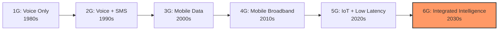
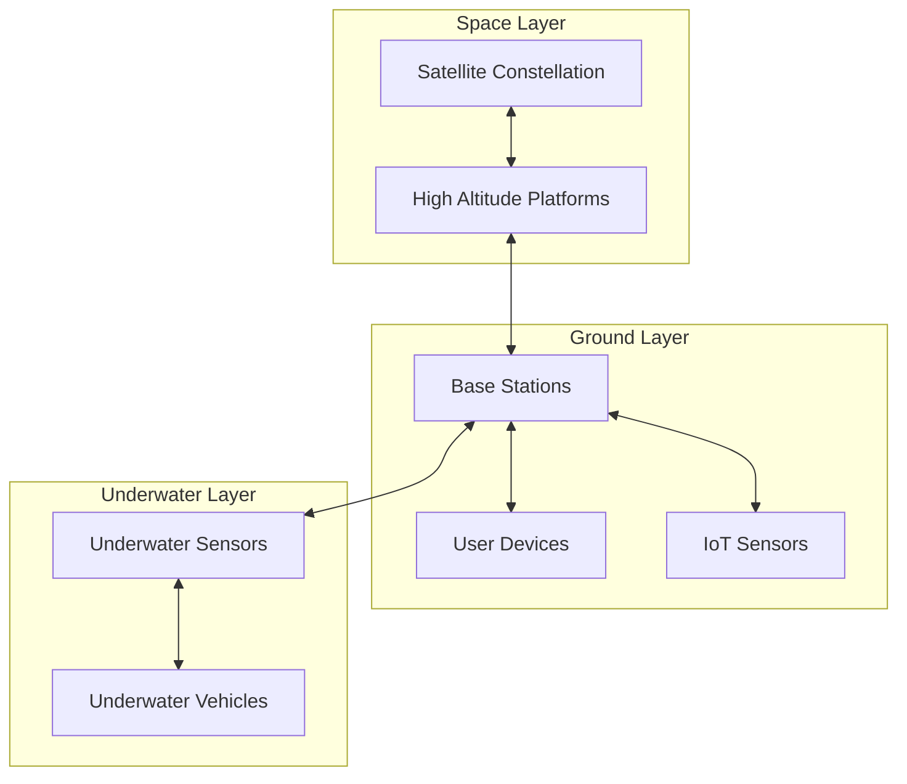
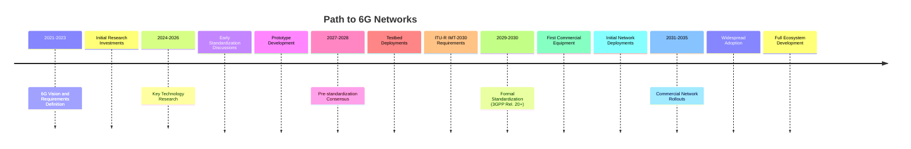

# Networks 6G

## Introduction

6G (sixth generation) represents the next frontier in wireless communication technology, expected to succeed the currently deploying 5G networks. While 5G is still being implemented worldwide, researchers, technology companies, and standardization bodies are already defining the vision for 6G, which is anticipated to become commercially available around 2030. 

6G networks will push beyond the capabilities of 5G to create an intelligent, fully connected digital world with unprecedented speeds, virtually zero latency, and massive device connectivity. For programmers and developers, 6G will enable entirely new classes of applications and revolutionize how we think about distributed computing.

## What Sets 6G Apart from Previous Generations?

Before diving into 6G specifics, let's contextualize how network generations have evolved:



Key distinguishing features of 6G:

- **Terabit-per-second speeds**: 100× faster than 5G
- **Sub-millisecond latency**: Nearly instantaneous response
- **Frequency spectrum utilization**: Expanding into terahertz (THz) bands
- **3D network coverage**: Integrating terrestrial, airborne, and satellite communications
- **AI-native architecture**: Intelligence built into every layer of the network
- **Quantum communication capabilities**: Leveraging quantum principles for security
- **Energy efficiency**: Dramatically reduced power consumption per bit

## Core Technical Concepts of 6G

### Terahertz Communication

6G will utilize the terahertz (THz) frequency band (0.1-10 THz), which offers significantly more bandwidth than the millimeter-wave bands used in 5G.

```javascript
// Example of calculating available bandwidth in different spectrum bands
function calculateAvailableBandwidth(frequencyLower, frequencyUpper) {
  // Frequencies in Hz
  return frequencyUpper - frequencyLower;
}

// 5G mmWave example (24-100 GHz)
const bandwidth5G = calculateAvailableBandwidth(24e9, 100e9);
console.log(`5G mmWave bandwidth: ${bandwidth5G / 1e9} GHz`);
// Output: 5G mmWave bandwidth: 76 GHz

// 6G THz example (0.1-10 THz)
const bandwidth6G = calculateAvailableBandwidth(0.1e12, 10e12);
console.log(`6G THz bandwidth: ${bandwidth6G / 1e12} THz`);
// Output: 6G THz bandwidth: 9.9 THz
```

The enormous bandwidth available in THz bands will enable data rates of up to 1 Tbps (terabit per second), but comes with significant challenges:

- High atmospheric absorption
- Limited propagation distance
- Required line-of-sight
- New hardware requirements for transceivers

### 3D Network Architecture

6G will implement a true three-dimensional network architecture integrating:

1. **Terrestrial networks**: Traditional ground-based infrastructure
2. **Non-terrestrial networks (NTN)**: Satellites, high-altitude platforms
3. **Underwater networks**: Submarine communications



This heterogeneous architecture requires complex programming models for network management and data routing.

### AI-Native Network Design

Unlike previous generations where AI was an add-on, 6G will be the first "AI-native" network. AI will be integrated at every layer:

```python
# Simplified example of AI-based network resource allocation in 6G
import numpy as np
from tensorflow import keras

class NetworkResourceAllocator:
    def __init__(self, num_resources, num_nodes):
        self.num_resources = num_resources
        self.num_nodes = num_nodes
        
        # Build a simple neural network for resource allocation
        self.model = keras.Sequential([
            keras.layers.Dense(64, activation='relu', input_shape=(num_nodes*3,)),
            keras.layers.Dense(128, activation='relu'),
            keras.layers.Dense(num_nodes * num_resources, activation='sigmoid')
        ])
        self.model.compile(optimizer='adam', loss='mse')
    
    def allocate_resources(self, network_state):
        """
        Allocate network resources based on current network state
        
        Parameters:
        - network_state: Array containing traffic load, latency requirements, 
                         and priority for each node
        
        Returns:
        - resource_allocation: Matrix of resource allocations per node
        """
        prediction = self.model.predict(network_state.reshape(1, -1))
        return prediction.reshape(self.num_nodes, self.num_resources)

# In 6G, this kind of algorithm would run continuously at different network layers
```

Key AI applications in 6G:
- Automated network management
- Predictive resource allocation
- Intelligent mobility management
- Self-optimizing networks
- Context-aware communications

### Digital Twin Network

6G will implement comprehensive digital twin technology, creating virtual replicas of the entire network for simulation, testing, and optimization.

```javascript
// Conceptual example of a digital twin network interface
class NetworkDigitalTwin {
  constructor(networkTopology) {
    this.physicalNetwork = networkTopology;
    this.virtualNetwork = this.createVirtualCopy(networkTopology);
    this.synchronizationInterval = 50; // ms
  }
  
  createVirtualCopy(topology) {
    // Create virtual representation with all nodes and connections
    return JSON.parse(JSON.stringify(topology));
  }
  
  simulateChange(change) {
    // Apply change to virtual network without affecting physical network
    let simulatedNetwork = JSON.parse(JSON.stringify(this.virtualNetwork));
    // Apply changes
    return this.predictNetworkMetrics(simulatedNetwork);
  }
  
  applyChangesToPhysical(changes) {
    // Apply approved changes to the physical network
    for (const change of changes) {
      // Apply change to physical network
      // Update corresponding virtual component
    }
  }
  
  synchronize() {
    // Regular synchronization between physical and virtual networks
    // Collect real-time metrics from physical network
    // Update virtual network state
  }
  
  predictNetworkMetrics(network) {
    // Calculate expected performance metrics
    return {
      latency: this.calculateLatency(network),
      throughput: this.calculateThroughput(network),
      reliability: this.calculateReliability(network),
      energyEfficiency: this.calculateEnergyEfficiency(network)
    };
  }
}
```

Digital twins enable:
- "What-if" analysis for network changes
- Predictive maintenance
- Continuous optimization
- Anomaly detection
- Service testing in virtual environments

### Quantum Communication

6G is expected to incorporate quantum communication principles for enhanced security:

```python
# Simplified conceptual example of quantum key distribution (QKD) in 6G
import qiskit
from qiskit import QuantumCircuit, Aer, execute

def generate_quantum_key(key_length):
    """Generate a quantum secure key using BB84 protocol concept"""
    # Create quantum circuit with key_length qubits
    qc = QuantumCircuit(key_length, key_length)
    
    # Create random bases and bit values
    import numpy as np
    sender_bases = np.random.randint(0, 2, key_length)  # 0: X basis, 1: Z basis
    sender_bits = np.random.randint(0, 2, key_length)   # 0 or 1
    
    # Prepare qubits according to bases and bits
    for i in range(key_length):
        # If bit is 1, flip the qubit
        if sender_bits[i]:
            qc.x(i)
        
        # If using X basis, apply Hadamard gate
        if sender_bases[i] == 0:
            qc.h(i)
    
    # Simulate measurement by receiver (with random basis choice)
    receiver_bases = np.random.randint(0, 2, key_length)
    
    # If receiver uses X basis, apply Hadamard before measurement
    for i in range(key_length):
        if receiver_bases[i] == 0:
            qc.h(i)
    
    # Measure all qubits
    qc.measure(range(key_length), range(key_length))
    
    # Execute the circuit on a simulator
    simulator = Aer.get_backend('qasm_simulator')
    result = execute(qc, simulator, shots=1).result()
    measured_bits = next(iter(result.get_counts()))
    
    # Keep only bits where bases match
    shared_key = ""
    for i in range(key_length):
        if sender_bases[i] == receiver_bases[i]:
            shared_key += measured_bits[key_length-i-1]
    
    return shared_key

# In 6G networks, quantum key distribution would be used
# to establish secure communication channels
```

While fully quantum networks may not be realized in the 6G timeframe, quantum key distribution (QKD) and post-quantum cryptography will likely be integrated to safeguard against future quantum computing threats.

## Programming Paradigms for 6G

The unique characteristics of 6G will drive new programming approaches:

### Intent-Based Programming

```javascript
// Conceptual example of intent-based networking in 6G
class IntentBasedNetworkRequest {
  constructor(applicationName, requirements) {
    this.applicationName = applicationName;
    this.requirements = requirements;
    this.status = "pending";
  }
}

// Example of programming with intents in 6G
async function requestNetworkSlice() {
  const videoStreamingIntent = new IntentBasedNetworkRequest(
    "Emergency Medical Video Streaming",
    {
      bandwidth: "50Mbps",
      latency: "5ms",
      reliability: "99.9999%",
      priority: "critical",
      security: "end-to-end-encrypted",
      duration: "60minutes",
      location: {
        startPoint: "Hospital A",
        endPoint: "Ambulance 42"
      }
    }
  );
  
  // Submit intent to 6G network
  const response = await network6G.submitIntent(videoStreamingIntent);
  
  if (response.status === "granted") {
    // Network has automatically configured itself to meet requirements
    return response.sliceIdentifier;
  } else {
    // Handle rejection or negotiation
    console.error("Network resources unavailable:", response.reason);
    return null;
  }
}
```

In this paradigm, developers specify what they need rather than how to achieve it, and the intelligent network handles the implementation details.

### Distributed Intelligence Programming

6G will distribute computing across the network:

```python
# Example of distributed intelligence in 6G
class DistributedTask:
    def __init__(self, task_id, computation, data_sources, requirements):
        self.task_id = task_id
        self.computation = computation
        self.data_sources = data_sources
        self.requirements = requirements
        
    def execute(self, network_context):
        """
        Execute task with optimal distribution across network
        
        The 6G network automatically:
        1. Determines optimal processing locations
        2. Securely moves necessary data
        3. Schedules computation respecting requirements
        4. Returns aggregated results
        """
        placement_strategy = network_context.optimize_placement(self)
        execution_plan = network_context.create_execution_plan(placement_strategy)
        return network_context.execute_distributed(execution_plan)

# Usage example for AR/VR application
def process_immersive_environment():
    # Define distributed environment processing for AR application
    environment_task = DistributedTask(
        task_id="environment_mapping_12345",
        computation="spatial_recognition_algorithm_v3",
        data_sources=["user_camera_feed", "lidar_sensors", "geospatial_database"],
        requirements={
            "max_latency": 10,  # ms
            "min_accuracy": 0.95,
            "energy_constraint": "minimize",
            "privacy_level": "high"
        }
    )
    
    # The 6G network handles distribution automatically
    environment_map = environment_task.execute(network_context)
    
    # Use results in application
    render_augmented_reality(environment_map)
```

This approach allows computation to be dynamically placed where it makes the most sense—at the device edge, network edge, or cloud—based on current conditions.

### Semantic Communication

Instead of transmitting raw data, 6G will enable semantic communication that only sends the meaning:

```javascript
// Conceptual example of semantic communication in 6G
class SemanticEncoder {
  constructor(domainKnowledge) {
    this.domainKnowledge = domainKnowledge;
    this.contextMemory = [];
  }
  
  encode(message, context) {
    // Instead of encoding raw message, extract only the semantic meaning
    // that isn't already known by the receiver based on shared context
    
    const semanticElements = this.extractSemanticElements(message);
    const receiverKnowledge = this.estimateReceiverKnowledge(context);
    
    // Only transmit what receiver doesn't already know
    const deltaKnowledge = this.computeKnowledgeDelta(
      semanticElements, 
      receiverKnowledge
    );
    
    // Highly compressed semantic representation
    return {
      semanticDelta: deltaKnowledge,
      contextReference: this.updateAndReferenceContext(semanticElements)
    };
  }
  
  decode(semanticPacket, context) {
    // Receiver reconstructs full meaning from minimal transmission
    const referencedContext = this.retrieveContext(semanticPacket.contextReference);
    
    // Reconstruct full semantic meaning
    return this.reconstructMessage(
      semanticPacket.semanticDelta,
      referencedContext,
      context
    );
  }
}

// Example usage in a virtual reality application
function transmitVirtualEnvironment(environment, userContext) {
  const semanticEncoder = new SemanticEncoder(domainKnowledge);
  
  // Instead of sending gigabytes of 3D environment data
  // semantically encode only what's relevant and new
  const encodedEnvironment = semanticEncoder.encode(
    environment,
    userContext
  );
  
  // Dramatic bandwidth reduction
  network.transmit(encodedEnvironment);
}
```

Semantic communication could reduce bandwidth needs by orders of magnitude for many applications by transmitting only essential meaning rather than raw data.

## Real-World Applications Enabled by 6G

### Extended Reality (XR) Without Boundaries

```javascript
// Conceptual code for seamless XR application in 6G
class ImmersiveEnvironment {
  constructor(environment6G) {
    this.network = environment6G;
    this.virtualObjects = new Map();
    this.physicalObjects = new Map();
    
    // Register for holographic telepresence
    this.holoGrid = this.network.requestHolographicGrid({
      resolution: "volumetric-8K",
      refreshRate: 120,
      interactionLatency: 1 // ms
    });
  }
  
  addRemoteParticipant(participantId) {
    // Request full holographic telepresence of remote person
    const remotePerson = this.network.requestHolographicStream({
      participantId: participantId,
      qualityLevel: "indistinguishable-from-reality",
      semanticTrackingLevel: "full-emotional"
    });
    
    // Add to environment with perfect synchronization
    this.virtualObjects.set(participantId, remotePerson);
    
    // Setup bidirectional haptic feedback
    const hapticsChannel = this.network.createHapticChannel({
      resolution: "nerve-level",
      latency: 0.5, // ms
      force: "full-spectrum"
    });
    
    // Link haptics to participant interactions
    remotePerson.linkHapticChannel(hapticsChannel);
  }
  
  // Other environment management functions...
}
```

6G will enable XR experiences with holographic telepresence, tactile internet capabilities, and seamless physical-digital integration that feels completely natural.

### Autonomous Systems Coordination

```python
# Example of autonomous vehicle coordination in 6G
class AutonomousSystemsNetwork:
    def __init__(self, geographical_area):
        self.area = geographical_area
        self.connected_entities = {}
        self.shared_intelligence = SharedIntelligencePool()
        
    def register_vehicle(self, vehicle_id, capabilities):
        """Register a new autonomous vehicle to the network"""
        self.connected_entities[vehicle_id] = {
            "type": "vehicle",
            "capabilities": capabilities,
            "status": "active",
            "position": None,
            "trajectory": None
        }
    
    def update_vehicle_status(self, vehicle_id, position, trajectory, sensor_data):
        """Update vehicle status and contribute to shared intelligence"""
        # Update local record
        self.connected_entities[vehicle_id]["position"] = position
        self.connected_entities[vehicle_id]["trajectory"] = trajectory
        
        # Process and contribute sensor data to shared intelligence
        processed_data = self.process_sensor_data(sensor_data)
        self.shared_intelligence.contribute(vehicle_id, processed_data)
        
        # Get enhanced situational awareness with <1ms latency
        return self.get_enhanced_awareness(vehicle_id, position)
    
    def get_enhanced_awareness(self, vehicle_id, position):
        """
        Provide enhanced situational awareness beyond vehicle's own sensors
        """
        # Gather relevant data from all nearby entities
        radius = 500  # meters
        nearby_entities = self.find_nearby_entities(position, radius)
        
        # Collect and fuse all relevant sensor data
        collective_perception = self.shared_intelligence.get_area_perception(
            position, radius
        )
        
        # Add predicted trajectories and intentions
        trajectories = {
            entity_id: self.connected_entities[entity_id]["trajectory"]
            for entity_id in nearby_entities
            if entity_id != vehicle_id
        }
        
        # Add city infrastructure data
        infrastructure_data = self.get_infrastructure_data(position, radius)
        
        return {
            "collective_perception": collective_perception,
            "entity_trajectories": trajectories,
            "infrastructure_data": infrastructure_data,
            "recommended_actions": self.generate_recommendations(vehicle_id)
        }
```

This example illustrates how 6G networks will enable the coordination of autonomous systems through collective perception, distributed intelligence, and ultra-low latency communications.

### Precision Healthcare

```javascript
// 6G-enabled precision healthcare monitoring
class HealthMonitoringSystem {
  constructor(patientId, networkSlice) {
    this.patientId = patientId;
    this.networkSlice = networkSlice;
    this.sensors = new Map();
    this.digitalTwin = new PatientDigitalTwin(patientId);
    this.alertThresholds = new Map();
  }
  
  registerImplantableSensor(sensorId, type, location) {
    // Register nano-scale or implantable sensor
    this.sensors.set(sensorId, {
      type,
      location,
      status: "active",
      lastReading: null,
      battery: 100
    });
    
    // Subscribe to continuous data with extreme reliability
    this.networkSlice.subscribeSensorData(sensorId, {
      sampleRate: type === "cardiac" ? 1000 : 100, // Hz
      reliability: 99.9999, // Six nines reliability
      latency: 1, // ms
      priority: "critical"
    }, this.processSensorReading.bind(this));
  }
  
  processSensorReading(sensorId, reading) {
    const sensor = this.sensors.get(sensorId);
    sensor.lastReading = reading;
    
    // Update patient digital twin
    this.digitalTwin.updateParameter(sensor.type, reading);
    
    // Check for anomalies against personalized baseline
    const anomaly = this.digitalTwin.detectAnomaly(sensor.type, reading);
    if (anomaly) {
      this.raiseAlert(sensorId, anomaly);
    }
    
    // Contribute to edge AI for improved population health
    if (reading.shareConsent) {
      this.networkSlice.contributeAnonymizedData({
        sensorType: sensor.type,
        reading: this.anonymize(reading),
        demographics: this.anonymize(this.digitalTwin.demographics)
      });
    }
  }
  
  raiseAlert(sensorId, anomaly) {
    const sensor = this.sensors.get(sensorId);
    
    // Critical alerts use network slice with highest priority
    if (anomaly.severity === "critical") {
      this.networkSlice.sendCriticalAlert({
        patientId: this.patientId,
        sensor: sensor.type,
        location: sensor.location,
        anomaly: anomaly,
        vitalSigns: this.digitalTwin.getCurrentVitals(),
        medicalHistory: this.digitalTwin.getRelevantHistory(anomaly)
      });
    } else {
      // Regular alerts
      this.networkSlice.sendAlert({/*...*/});
    }
  }
}
```

6G will revolutionize healthcare through continuous health monitoring with implantable/ingestible sensors, real-time health digital twins, and AI-powered predictive analytics—all while maintaining stringent privacy and security.

## Challenges and Considerations

### Technical Challenges

- **Terahertz hardware limitations**: Current semiconductor technology has significant challenges operating at THz frequencies
- **Energy consumption**: High frequencies typically require more power
- **Complex network orchestration**: Coordinating the various layers and components of 6G architecture
- **Security across distributed intelligence**: Protecting a highly distributed and autonomous system

### Programming Challenges

```python
# Example illustrating 6G reliability programming challenge
def deploy_critical_service(service_definition, reliability_requirement=0.99999):
    """
    Deploy a service with extremely high reliability requirements
    
    Parameters:
    - service_definition: Service specifications
    - reliability_requirement: Required reliability (five nines = 99.999%)
    
    Returns:
    - Deployment status and service endpoints
    """
    # Calculate redundancy requirements to meet reliability
    required_redundancy = calculate_required_redundancy(reliability_requirement)
    
    # Problem: How to verify this mathematically?
    # Problem: How to test this in development?
    # Problem: How to handle split-second failover at THz frequencies?
    
    # Check resource availability across network
    available_resources = check_resource_availability(required_redundancy)
    if not available_resources:
        return {"status": "failed", "reason": "insufficient_resources"}
    
    # Deploy with distributed redundancy
    deployment = create_distributed_deployment(service_definition, required_redundancy)
    
    # Verify reliability guarantees
    actual_reliability = verify_reliability(deployment)
    if actual_reliability < reliability_requirement:
        return {"status": "failed", "reason": "reliability_not_met"}
    
    return {
        "status": "deployed",
        "service_endpoints": deployment.endpoints,
        "guaranteed_reliability": actual_reliability
    }
```

Key programming challenges:
- Developing with extreme performance requirements
- Testing and simulating THz and quantum communications
- Building for extreme reliability and security
- Energy-aware programming
- Semantic and intent-based communication
- Privacy-preserving distributed applications

### Ethical Considerations

```python
# Example of how 6G might implement ethical controls
class SurveillanceCapabilityRequest:
    def __init__(self, requester_id, capability_type, justification, duration):
        self.requester_id = requester_id
        self.capability_type = capability_type
        self.justification = justification
        self.duration = duration
        self.status = "pending_ethical_review"
        
    def ethical_review(self):
        """
        Automated ethical review of surveillance capability request
        with human oversight for borderline cases
        """
        # Check against legal frameworks
        legal_status = check_legal_compliance(self.capability_type, self.justification)
        
        # Check proportionality
        proportionality_score = evaluate_proportionality(
            self.capability_type, 
            self.justification
        )
        
        # Check privacy impact
        privacy_impact = assess_privacy_impact(self.capability_type)
        
        # Trigger human review for borderline cases
        if (legal_status == "borderline" or 
            0.4 < proportionality_score < 0.7 or 
            privacy_impact > 0.8):
            return self.request_human_review()
        
        # Clear approval or rejection
        if (legal_status == "compliant" and 
            proportionality_score >= 0.7 and 
            privacy_impact < 0.7):
            self.status = "approved"
            return self.generate_limited_capability_token()
        else:
            self.status = "rejected"
            return {
                "status": "rejected",
                "reason": "ethical_constraints_not_met",
                "appeal_process": get_appeal_process()
            }
```

Important ethical considerations include:
- Surveillance capabilities and privacy
- Digital divide and equitable access
- Energy consumption and environmental impact
- Dependence on technical infrastructure
- Autonomy and human oversight
- Data ownership and sovereignty

## The Path to 6G

The timeline to 6G deployment will likely follow this pattern:



## Preparing for 6G as a Developer

To prepare for the 6G era, developers should:

1. **Strengthen distributed systems knowledge**: Understand edge computing, multi-agent systems, and distributed algorithms.

2. **Build AI/ML expertise**: Develop skills in federated learning, reinforcement learning, and neural network optimization.

3. **Learn quantum computing basics**: Familiarize yourself with quantum principles, especially in cryptography and communications.

4. **Adopt intent-based programming**: Practice developing systems that operate based on what rather than how.

5. **Focus on semantic data processing**: Work with technologies that process meaning rather than just raw data.

```python
# Example of a modern skill that will be valuable for 6G
def train_federated_model(model_architecture, initial_weights):
    """
    Train a model across distributed devices without centralizing data,
    a key pattern for privacy-preserving 6G applications
    """
    federated_model = create_federated_model(model_architecture, initial_weights)
    
    # Distribute training across edge devices
    device_results = []
    for device_id in get_participating_devices():
        # Each device trains on local data only
        local_update = train_on_device(device_id, federated_model)
        device_results.append(local_update)
    
    # Aggregate updates without sharing raw data
    updated_model = secure_federated_averaging(device_results)
    
    # Evaluate global model improvement
    improvement = evaluate_model(updated_model)
    
    return updated_model, improvement
```

## Summary

6G represents a paradigm shift in wireless communications, moving beyond simply connecting people and things to creating an intelligent fabric that seamlessly integrates the physical, digital, and biological worlds. Key features include:

- THz frequencies enabling terabit-per-second speeds
- 3D network architecture connecting terrestrial, aerial, and space systems
- AI-native design with intelligence throughout the network
- Distributed computing across the entire system
- Semantic and intent-based communication
- Quantum communication principles for security

For developers, 6G will create opportunities for entirely new classes of applications while requiring new programming paradigms and technical skills. While commercial 6G deployments are still years away, the foundations for this technology are being laid today, making it an exciting area for forward-looking developers to explore.

## Additional Resources

### Books and Papers
- "6G: The Next Frontier" by Theodore Rappaport
- "Toward 6G Networks: Use Cases and Technologies" (IEEE Communications Magazine)
- "Quantum Communications for 6G Wireless Networks" (Nature Electronics)

### Online Learning
- "Advanced Wireless Communications: Beyond 5G" (Coursera)
- "Distributed Computing Systems" (edX)
- "Quantum Information Science" (MIT OpenCourseWare)

### Practical Exercises

1. **Edge Computing Simulation**: Create a distributed application that dynamically allocates computing between edge devices and cloud based on latency requirements.

2. **Semantic Communication**: Develop a prototype that compresses communication by transmitting only semantic differences rather than raw data.

3. **Intent-Based API**: Design an API that operates based on declarative intents rather than imperative commands.

4. **Digital Twin**: Create a simple digital twin of a physical system that can simulate changes before applying them.

5. **Federated Learning**: Implement a basic federated learning system that trains a model across multiple devices without centralizing data.