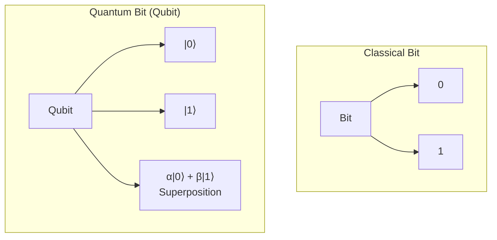
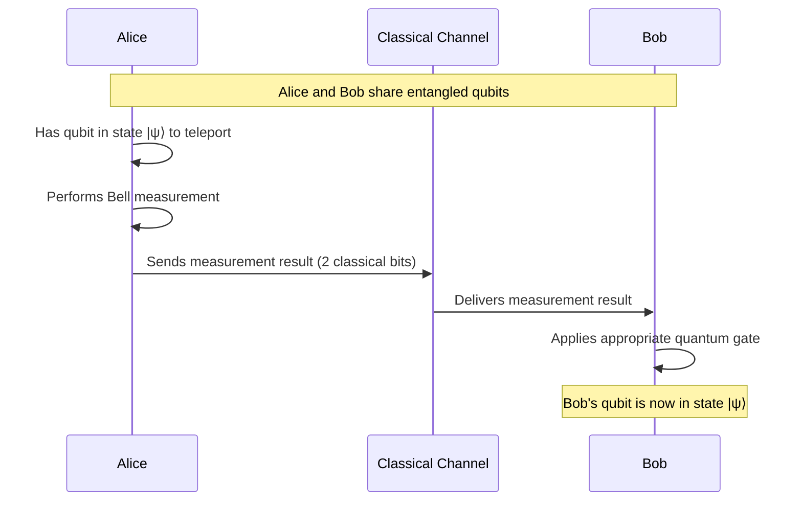
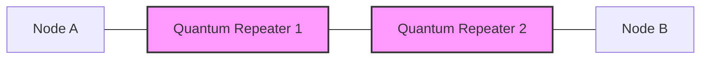

# Quantum Networking

## Introduction

Quantum networking represents one of the most exciting frontiers in computer networking technology. It combines principles from quantum physics with traditional networking concepts to create communication systems that operate according to quantum mechanical laws. Unlike classical networks that use bits (0s and 1s), quantum networks leverage quantum bits or "qubits" which can exist in multiple states simultaneously thanks to the principle of superposition.

In this guide, we'll explore the fundamental concepts of quantum networking, understand its potential applications, and learn how it might reshape our digital infrastructure in the coming decades.

## Fundamental Concepts

### Qubits vs Classical Bits

Classical networks transmit information using bits, which can be either 0 or 1. Quantum networks, however, use qubits which have several unique properties:

- **Superposition**: Qubits can exist in both 0 and 1 states simultaneously
- **Entanglement**: Qubits can be "entangled" so that the state of one instantly affects another, regardless of distance
- **No-cloning theorem**: Quantum information cannot be copied perfectly

Let's visualize the difference between classical bits and qubits:



### Quantum Entanglement

Entanglement is perhaps the most powerful resource in quantum networking. When two qubits become entangled, their states become correlated in such a way that measuring one instantly determines the state of the other, regardless of the distance separating them.

Einstein famously referred to this as "spooky action at a distance" because it seems to violate the principle that information cannot travel faster than light. However, entanglement doesn't actually transmit information faster than light—it creates correlations that can be used within quantum protocols.

### Quantum Teleportation

Quantum teleportation is a protocol that allows quantum states to be transmitted from one location to another. Despite its name, it doesn't involve the physical movement of particles but rather the transfer of quantum information.

Here's a simplified explanation of how quantum teleportation works:

1. Alice and Bob share an entangled pair of qubits
2. Alice has a third qubit in some quantum state that she wants to send to Bob
3. Alice performs a joint measurement on her entangled qubit and the state she wants to send
4. Alice sends the classical result of her measurement to Bob
5. Based on Alice's message, Bob applies specific operations to his entangled qubit
6. Bob's qubit is now in the state of the original qubit Alice wanted to send



## Quantum Network Infrastructure

### Quantum Repeaters

In classical networks, signals can be amplified to travel long distances. However, due to the no-cloning theorem, quantum information cannot simply be copied or amplified. This presents a significant challenge for building quantum networks over long distances.

Quantum repeaters address this issue by:

1. Breaking the long distance into shorter segments
2. Creating entanglement between adjacent nodes
3. Using entanglement swapping to establish end-to-end entanglement



### Quantum Memory

Quantum memory allows for the storage of quantum states for later use, which is crucial for complex quantum network protocols. Current research focuses on various physical implementations including:

- Trapped ions
- Superconducting circuits
- Nitrogen-vacancy centers in diamond
- Atomic ensembles

## Building Blocks of Quantum Networks

To understand how quantum networks operate, let's examine a simplified quantum network node implementation using Python's Qiskit library:

```python
# This is a simulation of quantum network principles
# Import necessary libraries
from qiskit import QuantumCircuit, Aer, execute
from qiskit.visualization import plot_histogram
import numpy as np

# Create a function to prepare an entangled pair (Bell state)
def create_entangled_pair():
    # Create a quantum circuit with 2 qubits
    qc = QuantumCircuit(2, 2)
    
    # Create entanglement between qubits
    qc.h(0)  # Apply Hadamard gate to qubit 0
    qc.cx(0, 1)  # Apply CNOT gate with control qubit 0 and target qubit 1
    
    return qc

# Simulate the creation of an entangled pair
entanglement_circuit = create_entangled_pair()
print("Circuit for creating entangled qubits:")
print(entanglement_circuit.draw())

# Simulate measurement
entanglement_circuit.measure([0, 1], [0, 1])

# Execute the circuit
simulator = Aer.get_backend('qasm_simulator')
job = execute(entanglement_circuit, simulator, shots=1000)
result = job.result()
counts = result.get_counts(entanglement_circuit)
print("
Measurement results:", counts)
```

The output would look something like:

```
Circuit for creating entangled qubits:
     ┌───┐     
q_0: ┤ H ├──■──
     └───┘┌─┴─┐
q_1: ─────┤ X ├
          └───┘
c: 2/══════════

Measurement results: {'00': 498, '11': 502}
```

This shows us that when we measure the entangled qubits, we'll get either both 0s or both 1s, demonstrating the perfect correlation of entangled states.

## Quantum Key Distribution (QKD)

One of the most developed applications of quantum networking is Quantum Key Distribution, which allows two parties to produce a shared random secret key that can be used for encrypting and decrypting messages.

### BB84 Protocol

The BB84 protocol, named after its inventors Charles Bennett and Gilles Brassard in 1984, is the first and most well-known QKD protocol:

1. Alice prepares qubits in random states (using two different bases)
2. Alice sends these qubits to Bob
3. Bob measures each qubit in a randomly chosen basis
4. Alice and Bob publicly compare which bases they used (but not the results)
5. They keep only the results where they used the same basis
6. This shared information becomes their secret key

Let's implement a simplified version of the BB84 protocol:

```python
import random
import numpy as np

def bb84_simulation(n_bits=100, error_rate=0, eavesdropping=False):
    # Alice generates random bits and random bases
    alice_bits = [random.randint(0, 1) for _ in range(n_bits)]
    alice_bases = [random.randint(0, 1) for _ in range(n_bits)]  # 0 for X basis, 1 for Z basis
    
    # Alice prepares qubits according to her bits and bases
    # In X basis: 0 -> |+⟩, 1 -> |-⟩
    # In Z basis: 0 -> |0⟩, 1 -> |1⟩
    
    # Simulate quantum channel with potential eavesdropper
    if eavesdropping:
        # Eve measures in random bases
        eve_bases = [random.randint(0, 1) for _ in range(n_bits)]
        channel_bases = eve_bases
    else:
        channel_bases = alice_bases
    
    # Bob measures in random bases
    bob_bases = [random.randint(0, 1) for _ in range(n_bits)]
    
    # Bob's measurement results
    bob_results = []
    for i in range(n_bits):
        if bob_bases[i] == channel_bases[i]:
            # If Bob uses the same basis as the channel, he gets the correct result
            # (unless there's a transmission error)
            if random.random() < error_rate:
                bob_results.append(1 - alice_bits[i])  # bit flip error
            else:
                bob_results.append(alice_bits[i])
        else:
            # If Bob uses a different basis, he gets a random result
            bob_results.append(random.randint(0, 1))
    
    # Alice and Bob reveal their bases and keep only matching ones
    key_positions = [i for i in range(n_bits) if alice_bases[i] == bob_bases[i]]
    
    # Extract the sifted key
    alice_key = [alice_bits[i] for i in key_positions]
    bob_key = [bob_results[i] for i in key_positions]
    
    # Calculate quantum bit error rate (QBER)
    errors = sum(a != b for a, b in zip(alice_key, bob_key))
    qber = errors / len(alice_key) if alice_key else 0
    
    return {
        'alice_key': alice_key,
        'bob_key': bob_key,
        'key_length': len(alice_key),
        'qber': qber
    }

# Run the simulation
result = bb84_simulation(n_bits=1000)
print(f"Sifted key length: {result['key_length']} bits")
print(f"First 10 bits of Alice's key: {result['alice_key'][:10]}")
print(f"First 10 bits of Bob's key: {result['bob_key'][:10]}")
print(f"QBER: {result['qber']*100:.2f}%")

# Run with an eavesdropper
eve_result = bb84_simulation(n_bits=1000, eavesdropping=True)
print("
With eavesdropper:")
print(f"Sifted key length: {eve_result['key_length']} bits")
print(f"QBER: {eve_result['qber']*100:.2f}%")
```

Sample output:

```
Sifted key length: 502 bits
First 10 bits of Alice's key: [0, 1, 0, 0, 1, 1, 0, 1, 0, 0]
First 10 bits of Bob's key: [0, 1, 0, 0, 1, 1, 0, 1, 0, 0]
QBER: 0.00%

With eavesdropper:
Sifted key length: 496 bits
QBER: 25.81%
```

Notice how the presence of an eavesdropper increases the error rate (QBER), which allows Alice and Bob to detect the intrusion.

## Quantum Internet Applications

### Distributed Quantum Computing

Quantum networks could connect smaller quantum computers to create a more powerful distributed quantum computing system. This would allow users to access quantum computing resources remotely, similar to cloud computing.

### Secure Multi-Party Computation

Quantum networks enable secure computation between multiple parties where none of the parties learn anything about the inputs of others except what can be inferred from the output.

### Clock Synchronization

Quantum entanglement can be used to synchronize clocks with unprecedented precision, which is crucial for many applications including financial trading and GPS systems.

## Current State and Challenges

While quantum networking is progressing rapidly, several challenges remain:

1. **Decoherence**: Quantum states are extremely fragile and can be disrupted by interaction with the environment
2. **Distance limitations**: Current quantum links are limited to relatively short distances
3. **Repeater technology**: Practical quantum repeaters are still under development
4. **Interfacing with classical networks**: Creating hybrid classical-quantum networks

## Real-World Implementation Progress

Several quantum networks have been deployed around the world:

- China's 2,000+ km quantum network between Beijing and Shanghai
- The European Quantum Internet Alliance's test networks
- The U.S. Department of Energy's quantum network at Argonne National Laboratory

These test networks primarily focus on QKD applications but are laying the groundwork for more advanced quantum internet capabilities.

## Programming for Quantum Networks

While full-scale quantum networks are still emerging, developers can start experimenting with quantum network principles using quantum computing frameworks:

### Qiskit Network

IBM's Qiskit provides tools for simulating quantum network principles:

```python
from qiskit import QuantumCircuit, transpile
from qiskit.providers.aer import QasmSimulator
from qiskit.visualization import plot_histogram

# Create a quantum teleportation circuit
def quantum_teleportation():
    # Create circuit with 3 qubits and 2 classical bits
    circuit = QuantumCircuit(3, 2)
    
    # Prepare the state to teleport (qubit 0)
    circuit.x(0)  # Put qubit 0 in state |1⟩
    
    # Create entanglement between qubits 1 and 2
    circuit.h(1)
    circuit.cx(1, 2)
    
    # Bell measurement between qubits 0 and 1
    circuit.cx(0, 1)
    circuit.h(0)
    circuit.measure([0, 1], [0, 1])
    
    # Apply corrections on qubit 2 depending on measurement results
    circuit.cx(1, 2).c_if(1, 1)  # Apply X gate if qubit 1 measurement is 1
    circuit.cz(0, 2).c_if(0, 1)  # Apply Z gate if qubit 0 measurement is 1
    
    return circuit

# Create and simulate the teleportation circuit
teleportation_circuit = quantum_teleportation()
print(teleportation_circuit.draw())

# Simulate the circuit
simulator = QasmSimulator()
compiled_circuit = transpile(teleportation_circuit, simulator)
result = simulator.run(compiled_circuit, shots=1024).result()
counts = result.get_counts()
print("
Measurement results:", counts)
```

Output:

```
      ┌───┐      ┌───┐     ┌─┐   
q_0: ──┤ X ├──────┤ H ├─────┤M├───────────────────
      └───┘┌───┐ └───┘     └╥┘┌─┐               
q_1: ─────┤ H ├─────■───────╫─┤M├───────■────────
           └───┘     │       ║ └╥┘┌─┐   │        
q_2: ──────────────■─┼───────╫──╫─┤M├───┼────────
                    │ │       ║  ║ └╥┘┌─┴─┐┌───┐ 
c: 2/══════════════╩═╩═══════╩══╩══╩══╡ X ╞╡ Z ╞═
                                0  1    └───┘└───┘ 

Measurement results: {'00': 505, '01': 0, '10': 0, '11': 519}
```

### StrawberryFields

StrawberryFields is a Python library for simulating continuous-variable quantum computing, which is relevant for certain quantum networking approaches:

```python
import strawberryfields as sf
from strawberryfields import ops

# Define the StrawberryFields program for CV teleportation
prog = sf.Program(3)

with prog.context as q:
    # Prepare the input state to be teleported
    ops.Displacement(0.5, 0) | q[0]
    
    # Prepare the EPR pair (qumodes 1 and 2)
    ops.S2gate(1) | (q[1], q[2])
    
    # Perform the joint measurement (Bell measurement)
    ops.BSgate(np.pi/4, 0) | (q[0], q[1])
    ops.MeasureX | q[0]
    ops.MeasureP | q[1]
    
    # Displacement operations for corrections
    ops.Xgate(q[0].par) | q[2]
    ops.Zgate(-q[1].par) | q[2]

# Run the simulation
eng = sf.Engine("gaussian")
results = eng.run(prog)

# The teleported state is now in q[2]
print("Teleported state:", results.state.reduced_dm(2))
```

## Summary

Quantum networking represents a paradigm shift in how we approach communication and data security. By leveraging the unique properties of quantum mechanics—superposition, entanglement, and the no-cloning theorem—quantum networks promise:

- Unprecedented levels of security through quantum key distribution
- New capabilities for distributed quantum computing
- Ultra-precise timing and synchronization
- Novel applications in secure multi-party computation

While still in its early stages, quantum networking is progressing rapidly with research labs, tech companies, and governments investing heavily in this technology.

## Exercises

1. Implement a simulation of the BB84 protocol with additional error correction steps
2. Modify the quantum teleportation example to teleport a superposition state
3. Research and describe three potential applications of quantum networks beyond those covered in this guide
4. Design a simple protocol that uses entanglement swapping to extend quantum connections beyond direct links
5. Compare and contrast the security properties of classical encryption versus quantum key distribution

## Additional Resources

- Online quantum computing platforms:
  - IBM Quantum Experience
  - Amazon Braket
  - Microsoft Quantum Development Kit

- Books:
  - "Quantum Computing: A Gentle Introduction" by Eleanor Rieffel and Wolfgang Polak
  - "Quantum Networking" by Rodney Van Meter

- Academic courses:
  - MIT's Quantum Information Science course
  - Caltech's Quantum Computation course

- Research papers:
  - "The Quantum Internet" by Kimble, H. J. (2008)
  - "Quantum internet: A vision for the road ahead" by Wehner, S., Elkouss, D., & Hanson, R. (2018)

Remember that quantum networking is an active research area, and new developments are happening rapidly. Keep exploring this exciting field as it continues to evolve!